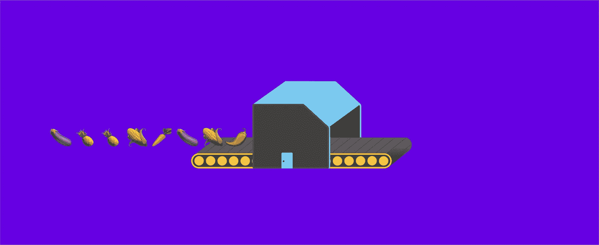
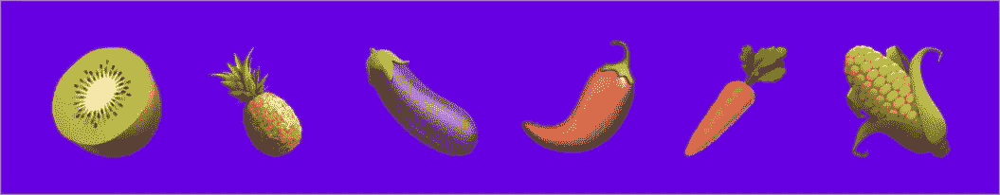
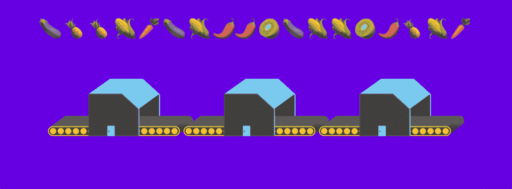

# 用表情符号解释哈希函数

> 原文：<https://medium.com/swlh/this-simple-yet-powerful-invention-is-changing-the-world-d04688c25f13>

区块链的故事本质上是技术专家和哈希函数之间长达十年的爱情故事。

事实上，如果你理解哈希函数，那么理解区块链上的**挖掘和不变性就是小菜一碟！(更多信息请见最后)**

**Git** ，一个版本控制代码库系统，实现了开源革命，几乎被所有开发者使用，非常依赖哈希函数。

电子签名软件 Docusign 基于哈希函数。

每当你在网站中输入你的**密码时，都会用到哈希函数。**

哈希函数的目的非常简单，但是它的属性非常强大，以至于它在所有软件中无处不在，与版本控制、安全性和真实性有关。

# 什么是哈希函数？

散列函数对最近的技术进步非常重要。我觉得我们都应该至少对它们是什么以及它们如何工作有一个基本的了解。

哈希函数可能不适合你，所以我在这里的目的是解释为什么它们如此强大，而不需要太多的细节…所以请继续关注我！

网上有很多对散列函数的解释，用一种就事论事的方式来描述它们，这些解释要么令人生畏，要么令人厌烦……或者两者兼而有之。所以在这里，我用**表情符号**来解释它们，给习惯性的非黑即白的密码学世界带来一些色彩和生命。(这样解释可能会更混乱，但是嘿！)

# 哈希函数

我们可以把哈希函数想象成一个表情工厂，接收一系列表情符号，但它只接受猕猴桃、菠萝、茄子、胡椒、胡萝卜和玉米。

The 6 emojis accepted and output by the factory

该工厂也仅在处理输入后输出上述表情符号的行。

这个表情工厂很特别，原因有很多:

# 1.这个工厂返回的输出表情符号比它接受的输入表情符号要少

在任何一次操作中，工厂从上述 6 个选项中选择 8 个表情符号(每种表情符号可以选择多个)。它处理这些表情，并返回一行 3 个表情符号，也是从上述 6 个选项中选取的。

重要的是，它输出的表情符号比接收的少(8 变成了 3)。

Emoji hash factory

# 2.工厂总是为相同的输入返回相同的输出

如果你把同样的 8 个表情符号以同样的顺序放入工厂两次，那么它会返回同样的 3 个表情符号，以同样的顺序，两次都是。

即工厂是*确定性的。*

在上面的 gif 中，你可以看到工厂每次对相同的输入返回相同的输出。

# 3.这个表情工厂是一条单行道

如果你把 8 个表情符号排成一行放入工厂，工厂会立刻给你一个输出。简单！

然而，如果我从工厂给你一个 3-表情符号输出，但我没有告诉你输入是什么，你就无法通过分析工厂和输出来解决它。事实上，反复试验是找出输入内容的最快方法。

换句话说，对于某些输出，找出输入是什么的最快方法是盲目地尝试不同行的表情符号作为输入，直到你找到正确的一个。

更重要的是，你甚至可以在工厂里走一走，看看它到底是如何工作的，但你仍然不能从它的输出中算出或“逆向工程”出一个输入！这是一个严格的 ***单向*工厂**。

我知道这听起来有点奇怪，所以这里有一个可能有帮助的类比。

## 就像烤蛋糕一样！

如果我给你做一个蛋糕的配料的确切数量和确切的食谱，你按照这些配料的确切食谱做，那么蛋糕马上就做好了。

如果我让你用同样的原料和同样的配方再做一次，你马上就会做出一个一模一样的蛋糕。**烘焙是*确定性*** (理论上！).

但是…如果我给你蛋糕和食谱(这里的食谱不包括配料的数量，只包括混合和烹饪步骤)，那么就很难计算出制作蛋糕的配料的确切数量。

也许用不同的配料试错烘焙蛋糕是你最好的方法。(专业厨师可能不同意我这一点！)

回到表情工厂的属性。

# 4.即使只改变一个表情符号，也会产生完全不同的结果

在上面的烘焙类比中，随着时间的推移，你可能会越来越接近正确的配料数量。但是在表情符号工厂中，对输入的最小改变(哪怕是改变一个表情符号)都会导致一个**完全不相关的输出**！

例如，将上面 gif 输入中的第一个茄子换成一个胡萝卜，会产生完全不同的 3 表情符号输出。

这意味着对于给定的输出，您无法“更接近”找到正确的输入。你只需要不断盲目地尝试不同的表情符号，直到你偶然发现正确的一个。

*区块链上的挖掘本质上是计算机使用试错法来寻找表情工厂的输入，表情工厂返回具有特定属性的输出，例如，以两个茄子开头的输出。*

# 5.找到输出相同的两个输入的最快方法是试错法

现在我相信你已经在想…

> **“等等，如果输出比输入短，那么每个输出肯定有多个输入？”**

…你是对的。如果你把 8 个表情符号放入工厂，你只得到 3 个表情符号，那么一个以上的输入必须导致相同的输出。

然而，这个表情工厂设计得非常好，即使你知道一个给定输出的一个输入，不幸的是，反复试验仍然是找出任何其他输入的最快方法，给出相同的输出。

换句话说，找到给出相同输出的两个输入的最快方法是再次使用试错法，直到找到一个“**冲突**”。

现在是时候回顾一下这个表情工厂的惊人特性了！

# 概述

1.  工厂接受 8 个表情符号，返回 3 个表情符号。(*缩短*
2.  给定的输入将总是返回相同的输出。(*决定论*)
3.  稍微改变输入就会产生完全不同的输出。(*扩散*)
4.  给定一个输出，试错法是计算出任何相应输入的最快方法。(*单向*)
5.  试错法是找到输出相同的两个输入的最快方法。(*防撞*)

# 这些特性都很有趣，但为什么它们如此重要呢？

好了，现在让我们看看这个工厂如何在实践中使用。

想象你的密码是由一行 8 个表情符号给出的。而且每次你把密码输入一个网站，网站都不会存储你的密码。相反，它存储了您的密码的“哈希”(您的密码经过表情工厂后的 3 个表情输出)。

这样，如果出现数据泄露，有人获得了网站的个人数据，那么他们只有一堆散列，但没有实际的密码！

由于工厂是单向的，罪犯从散列值中计算出你实际密码的唯一方法就是试错法。

现在，当你的密码由 8 个表情符号(仅从 6 个不同的表情符号中选择)组成时，这对罪犯来说可能不会花很长时间。

但是在现实生活中，你从一个更大的可能字符集中选择你的密码，因此不同的可能输入的数量要大得多。另外，现实生活中散列工厂/函数的输出比只有 3 行的输出要长得多。

因此，在现实中，罪犯要花很多很多年才能从它的*散列*中算出你的密码！

与此同时，尽管数据泄露，当你想再次登录网站时，因为你知道你的密码，你可以简单地输入它。

在这一点上，它立即得到通过哈希工厂给你的密码哈希。网站可以立即检查它是否与他们根据你的名字存储的散列相匹配，因为散列工厂总是返回相同的输出(*确定性*)，并且他们相应地让你登录。

# 但是密码并不总是 8 个表情符号长，如果我想散列更长的一行表情符号呢？

你可以的！令人惊讶的是，使用两位密码学家 Ralph Merkle 和 Ivan Damgå rd 的一项非常简单的技术，我们可以将任意长度的表情符号行“散列”成 3 个表情符号的散列。

Merkle-Damgård construction

## 我们如何做到这一点？

嗯，给定一个更长的表情符号系列，我们实际上创建了一个工厂系列来处理它。我们是这样做的。

1.  我们将较长的表情符号分割成最初的 8 个表情符号，然后是 5 个表情符号。(如果最后一块不完全是 5 个表情符号，那么我们可以用一些额外的表情符号来填充它，但这个额外的步骤更具技术性。所以让我们假设我们有很多表情符号在排队！)
2.  我们将 8 个表情符号放入第一个工厂。
3.  我们将输出的 3 个表情符号与第一组 5 个表情符号排成一行，然后通过第二个工厂将它们放在一起。
4.  我们重复这个过程，直到我们已经把整个表情线通过工厂。
5.  我们返回上一个工厂的输出。

所以现在我们可以把更长的表情符号串成 3 个表情符号！

# 坚持住…

**既然输入可以更长，我们肯定能更容易地找到两条产生相同输出(冲突)的线吗？**

直觉上，你可能会这么想。但令人惊讶的是，这就像在一个工厂里找到一个“*碰撞*一样困难，原因如下。

## 论证

假设你能够使用除试错法之外的一些方法找到两行更长的表情符号，它们产生了相同的输出(一次*碰撞*)。

然后，在 Merkle-damg rd 流程中的某个工厂，您将输入两行不同的表情符号，该特定工厂将返回两行相同的输出。

但是这意味着你在一个工厂用某种方法而不是试错法发现了碰撞，这是一个矛盾，因为我们假设每个工厂都是抗碰撞的！

# 所以…

…通过一些额外的工厂和一些数学推理，我们创造了一种方法，可以将任意长度的表情符号散列成三个表情符号。

更重要的是，任何能接触到三个表情符号输出的人都无法以比试错更快的速度做出任何长度的相应输入。由于现实生活中散列法使用的不同组合的数量，反复试验可能需要很多年！

有了这个简单的技巧，你的表情符号密码现在可以是任何长度，并且仍然是安全的，假设单个表情符号工厂是抗碰撞的。

# 区块链呢？

想象一下，你有一个文档(充满表情符号)，也许这个文档正在描述一个金融交易。你想向人们证明这个文档在某个特定的时刻处于特定的状态(直到最后一个表情符号)。

然后你可以使用 Merkle-damg rd 结构将整个文档放入哈希工厂，然后通过电子邮件将输出发送给 100 个人。

由于工厂是单向的，这些人无法理解文件最初说的是什么。如果将来有人试图声称你的文件是伪造的，或者你已经修改了它，那么你可以毫无疑问地证明，当你把它发送给分散的网络时，文件处于准确的状态，直到页面上的最后一个表情符号(或字母)。

由于哈希工厂是抗碰撞的，他们会相信你不是一个骗子！

# 概括起来

散列函数的单向和抗冲突特性如此强大，以至于它们正在改变技术和科学的面貌。

# 但是表情工厂/哈希函数内部究竟发生了什么呢？

这一切都变得非常技术性，实际上，如果你确信上述属性成立，那么工厂的内部工作就无关紧要了。哈希函数的属性比它们的内部工作方式有趣得多(除非你是数学家/密码学家！).

实际的哈希函数接受**十六进制字符串**(不是六进制字符串)。十六进制字符串是仅由字符“0，1，2，3，4，5，6，7，8，9，a，b，c，d，e，f”组成的字符串。它们接受任意长度的输入，并返回 64 个十六进制字符(或 128 个字符以确保安全)。

一种常用的散列函数是 SHA-256。如果你对这个博客有任何想法，请给我发电子邮件，如果你能从它的散列中找出我的电子邮件地址的话！(提示:在这种情况下，可能有比试错更聪明的方法！)

我的邮箱地址哈希:8d 935 def 1 f 9 e 0353 b 0 f 19 f 3c 765 bdeec 151862 a 199084 AE 4 f 4b 417 ca 42608914

*如果你喜欢这个故事，请鼓掌👏请查看我最新的博客* [*国王的难题:今天的问题如何可能成为明天的成功*](/swlh/the-kings-conundrum-a-reminder-that-there-s-always-a-smarter-way-to-face-our-problems-f73479be5140) *。*

*另外，请到*[*www.pilcro.com*](https://www.pilcro.com/?utm_source=medium&utm_medium=Hash&utm_campaign=awareness)*查看我的公司。我们为 G-Suite 用户提供品牌身份资产管理。*

## 这篇文章发表在 [The Startup](https://medium.com/swlh) 上，这是 Medium 最大的创业刊物，拥有 298，432+人关注。

## 在这里订阅接收[我们的头条新闻](http://growthsupply.com/the-startup-newsletter/)。

