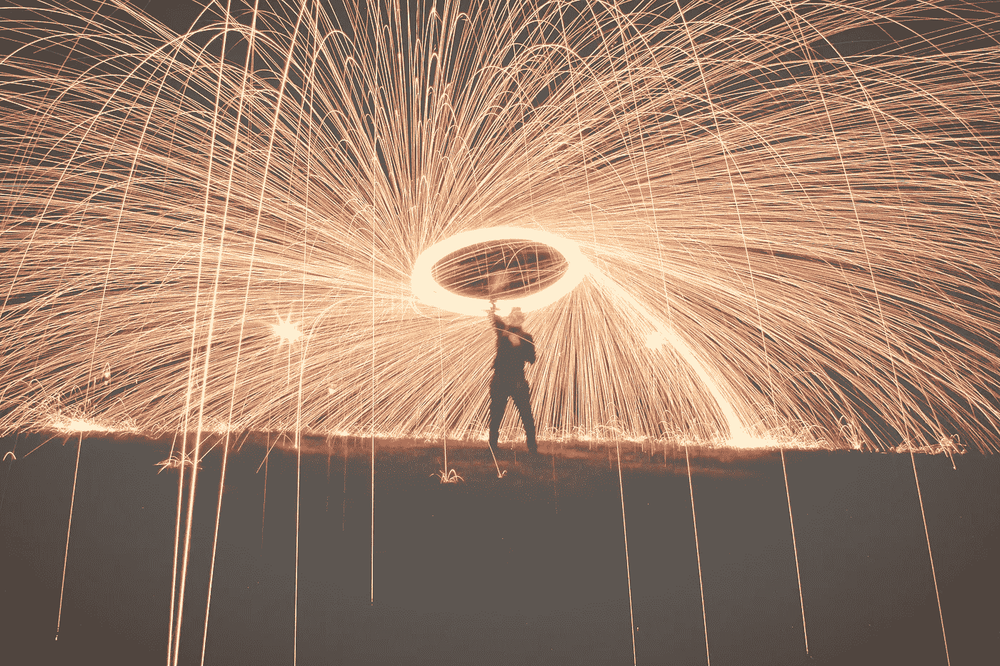

# 这个小小的行为改变会让你成为更好的企业家

> 原文：<https://medium.com/swlh/this-small-behavior-change-will-make-you-a-better-entrepreneur-e70a47424ee7>

不久前，我决定每周至少做一次新的和/或我讨厌的事情。

最近，这种方式变成了早上 5:30 起床，绕着我的房子跑 2-5 英里。

我住在太平洋西北部，那里一年的大部分时间都是黑暗、寒冷、潮湿和多风的，所以你只能猜测我对这一切有多热情。

无论如何，我现在就要告诉你这篇文章的目的。准备好了吗？

很好。

真的很简单。

> 有目的地做你不喜欢的，让你害怕的，或者让你感觉不舒服的事情，是面对你开始和发展自己的生意时出现的各种挑战的直接反映。

因此，为什么你必须把这些融入你的生活，并首先把它们放在心上。

**在我的职业生涯中，几乎每一次成功都是在克服了一个极其困难或具有挑战性的局面之后取得的。**

我也不是随便说说。

当一个大问题出现时，你有两个选择…

1.  逃跑。不要承担，保持舒适。
2.  面对它，学习，和它一起成长，找到成功的方法。您现在已经创建了一个新的限制。

第二个选择是普通开始慢慢变成非凡。这是你经历真正成长的地方，也是你把自己变成比以前更有经验、更有价值的人的地方。

**逆境是一座熔炉，它能坚定你的决心，在旧技能的基础上培养新技能，让你以新的视角体验世界。**

当你太舒适的时候，你就不能成长。想想吧。如果一切都很顺利，感觉很好，你还有什么动力去寻找自己的上限或者升级自己的处境？

那是一个棘手的问题。你不知道。

这就是自满如此危险的原因。

> 作为一个企业主，舒适并不意味着你保持一致。这意味着你会被落下。世界、市场和你的竞争对手都在变化和发展。你没有放松的权利。

这不是一个关于发展业务的 10 步指南，也不是一个成功创业的终极指南。这是一个血腥的行动号召。

向创业生态系统大声疾呼，恳求你拥抱未知。尽可能快地奔向陌生和新奇。

当你这样做时，你会以你从未想过的方式成长。

当然会很糟糕。这条路将会比另一条路带来更多的痛苦和焦虑。总有一天你会想要放弃，或者你会被恐惧麻痹。

这才是重点。那些是你转变的时刻。为了长期收益和宏观胜利，要熟悉短期亏损。

我会让我的人塞思·戈丁为你送行:

> 用恐惧作为指南针，推动你将最好的创造性作品带入生活。

# 如果你喜欢这个，一定要给它 40 次左右的掌声，帮助别人变得更好，获取我的[免费生活改变生产力指南](http://eepurl.com/cxxt7D)，和[关注我的 medium](/@Ken_Marshall) 以获得更多的宝石。

## 这个故事发表在 [The Startup](https://medium.com/swlh) 上，这是 Medium 最大的创业刊物，有 300，118+人关注。

## 订阅接收[我们的头条新闻](http://growthsupply.com/the-startup-newsletter/)。

