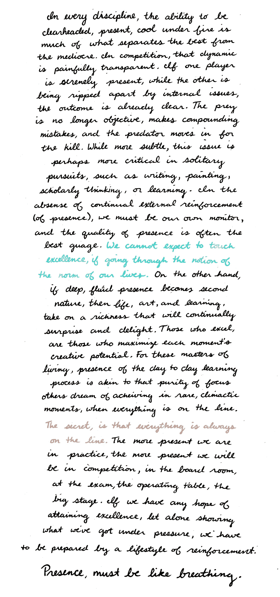
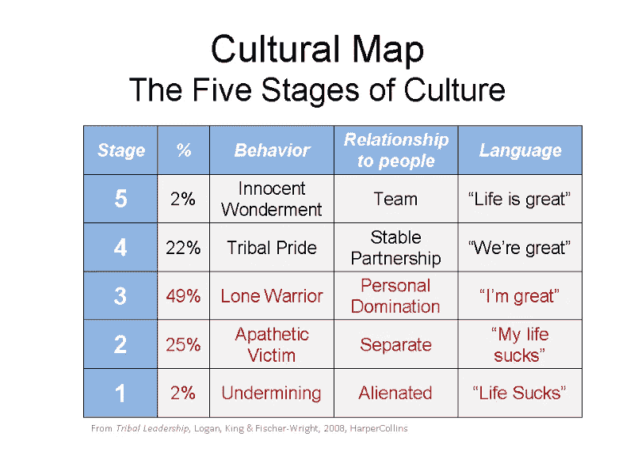

# 这一令人惊讶的特质会让你在工作中(和你的公司)遭遇竞争

> 原文：<https://medium.com/swlh/this-surprising-trait-will-blow-you-by-your-competition-at-work-and-your-company-ef6a04e6bcca>

“two men running on field with people on side cheering for them” by [Victoire Joncheray](https://unsplash.com/@victoire_jonch?utm_source=medium&utm_medium=referral) on [Unsplash](https://unsplash.com?utm_source=medium&utm_medium=referral)

拥有“非武力权力”是成为高绩效员工并受雇于高绩效组织的关键文化特征。

它会带来满足感、满足感和满足感，从而在同事之间创造强大的沟通和协作。

这对你的公司至关重要。

无力量的力量不是由自我驱动的，最重要的是，它不会产生反力量，而反力量会在工作中破坏文化。

反击力量是甘地以一种持续的方式为一个十亿人口的国家赢得独立与希特勒的过度武力之间的差异，希特勒的过度武力产生了如此多的反击力量，以至于全世界都团结起来反对它。

我用这些夸张的例子来说明这个原则适用于大量的人一起工作，所以在你的组织中应该更容易实现！

在 Bisnow Media，我是第二名员工，也是第一名销售人员，六年来，我亲身经历了销售组织的建设。

随着时间的推移，我们发展到了 80 人，我和一位 CEO 一起工作，他将无力量原则体现得淋漓尽致。

尽管人们会攻击他(包括我自己！)日常用力，我从未见他有过有力的回击。

他是如此的 T2，如此的泰然自若，赢得了极大的尊重。

大多数时候，人们无法指出这是什么，但我们知道他很特别，因此跟随他——包括我自己。

现在我明白了，他是无力量的。他总是给予，你不能从他那里拿走任何东西。

在政治组织中，这是一个强有力的职位，它对公司的日常文化产生了巨大的影响。

为这样的人工作会让你的日常行为完全不同。

无私、谦逊和关心是我想到的词。这不是钱的问题，而是任务的问题——你可以*感觉到这一点。*

超越媒体和出售公司的使命。

我们进入了一个枯燥乏味的行业，大胆地创造出有趣好玩的新闻。

我们受到了很多批评、嘲笑和反对。

在没有获得任何外部资本的情况下，该公司以 5000 万美元的价格出售，这是一个非常强有力的退出。它改变了人们的生活，员工也因此致富。

他们中的许多人逗留了很长时间。4-8 年，其中一些人至今仍在经营公司。

请注意，我们开始在创始人的家里发布一个小小的电子邮件简讯，在竞争激烈的媒体行业，如商业房地产、技术和法律。

我们每天都吃竞赛午餐，因为我们工作得更快、更努力，一年出版了 30 份电子邮件简讯和 300 次会议。

正如我们最初的创始人和那位首席执行官都教导我的那样，要超越一个行业，把竞争对手甩在身后，你需要那些拥有关键特质的人，让组织尽可能经常地达到卓越的巅峰。

# 你的创业

创业初期的第一批员工绝对重要。

一个人可以改变整个团队的文化，让公司的进步慢下来。

无论你是从 5 人到 10 人，还是 30-50 人，在这些阶段招聘是至关重要的，并且为组织的文化定下了基调——这应该从第一天就开始关注。

当你变大的时候，做一个文化转变就变得更加困难，尽管文化在那个阶段变得更加重要，这需要尽早强调它。

即。谢家华刚到捷步达康时，对文化有着不懈的追求。大约十年后，捷步达康以 10 亿美元的价格售出，并在他的监管下继续成长。

他将这一切归因于文化——他是对的。

作为一名企业家，当试图创造一个运动来实现一个愿景时，需要承诺成为你所在领域的第一名，并致力于保持竞争力。

随着你变得越来越大，竞争变得更加激烈。

我相信雇佣非武力力量是赢得长期胜利的关键。

强有力的人创造内部沟通和团队凝聚力，从而形成一个高绩效的组织。

所有认为“力量”是“有力的”的人的问题是，无论何时你施加“力”，你都在创造一个相等或更大的“反作用力”。

这还没有考虑到与人类打交道时增加的复杂性。

即。如果你对我施加 x 倍的力，我可以施加 x 倍或 100 倍的力，这会导致局势失控，在政治上浪费时间。

所以你要强大，*而不使用武力*。

这是科学，不是哲学。对于每一个力，都有一个相等或更大的反作用力。

武力不能持续很长时间，但权力可以。

在工作环境中的个人层面，它始于那个人的意识，在这种环境中被定义为某人的正念、情绪健康和一般情绪智力和弹性。

对无私的理解，以造福于部落、团队或组织，所以*个人和组织都可以长期获胜。*

在全公司范围内，无力量的权力很难实现，但作为一个组织，这是一个值得努力的伟大标准。

它不能输，因为没有什么可以拿走。

强势的人是索取者，强大的人给予和接受都很轻松。

他们不记分，他们只是行动，随波逐流。

如果你在招聘过程中加入非武力的人性特征，久而久之，你就能创造出一种高绩效的文化。

即使是菲尔·杰克逊，他领导的团队使用了我将要描述的 1-5 框架，也会推动他的团队从“阶段 3”(60%到 70%的效率)开始工作，并说他们需要达到“阶段 4”(80%到 90%的效率)。

稍后你会明白这些数字，但是现在假设 100%的有效性是第五阶段的最终目标。

请注意，这是一个在高度竞争的联盟中带领高度竞争的人赢得 11 次世界冠军的人，并且被认为是有史以来最好的 NBA 教练。

我喜欢下面这段话，关于我将要进入的领域，作者是哲学家、地质学家、古生物学家和牧师皮埃尔·泰利哈德·德·夏丹。

它囊括了团队动力、个人卓越、愿景、协作、团队合作和意识的融合。

*“几乎有一种感官上的渴望，渴望与那些有着广阔视野的人交流。那些致力于促进意识进化的人之间的友谊的巨大满足具有一种无法描述的品质。”*

你的组织应该被认为是一个集体意识，这种意识越高，它的潜力就越大，组织的结果就越好。

这始于文化，始于你们人民的个人特征。

高意识的人们在他们的工作和生活中流动，作为一个走向掌握的旅程，不仅仅是对他们的手艺，而是对他们每时每刻存在的掌握。

每时每刻都与顶级演员在一起，目的是保持存在感。

以下是国际象棋神童和世界武术冠军乔希·怀茨金关于比赛中[存在的力量](/human-output/part-2-hire-for-a-high-performance-organization-presence-as-a-skill-a87c72cefa71):

Art by Emily May Rose

这种追求卓越的承诺本身就是创造你想要的最佳表现文化的副产品。

就像在，目标不是靠意志直接取胜，而是取胜是质量行动的副产品。

为了创造最高质量的作品，无力量把个人的生存质量放在第一位。

这就是维克多·弗兰克尔所说的:“不要以成功为目标。你越是瞄准它，让它成为目标，你就越是会错过它。因为成功和幸福一样，是不可追求的；它必须随之而来，而且它只是作为一个人献身于比自己更伟大的事业的意外副作用，或者作为一个人向一个不是自己的人投降的副产品

拥有非武力权力的个人能够无私地关心他们同事的生存质量，在这个过程中创造团队凝聚力，并且知道如果他们的团队赢了，他们就赢了。

这是学者和传奇著作《部落领导》作者的成果。

Zappos 的谢家华和芝加哥公牛队的菲尔杰克逊曾经使用的框架达到了他们的组织所能达到的最高境界。

众所周知，杰克逊信奉佛教，这是他购买以下文化地图的基础。

文化地图是框架,“天真的惊奇”是存在的特征，它是绝对的顶峰,“部落骄傲”是高绩效部落或组织的核心可达到状态。

# 雇佣无力量员工的 5 种方式

# 1.雇佣那些相信自己的信仰并理解信仰本身的人

大多数人眼见为实。

有权力的人理解并相信，信念创造了他们所看到的现实，这是一种需要学习的技能。

“当我意识到我可以通过改变我的信念来改变我生活的特点时，我感到很兴奋。我立刻充满了活力，因为我意识到有一条基于科学的道路可以把我从一个常年的“受害者”的工作带到一个新的位置，成为我命运的“共同创造者” —布鲁斯·利普顿博士

# 2.雇佣那些每天都在思考的人，他们是一天的主人

在初创企业，你只能做好你能做的事情。

拥有比坏日子更多的好日子是至关重要的。

为你的一天做好准备需要完全掌控自己的一天。

每天我都在沉思我将要拥有的一天和我将要创造的[现实。](/experiential/humanity-is-at-a-crossroads-the-one-belief-we-must-all-believe-to-create-the-world-we-wish-to-see-668ec7411a62)

相信可视化的力量是至关重要的，拥有这种技能是关键。

# 3.雇用专注于超额完成任务的人

专注于成就的人和相信“成功”是因为用心生活的人致力于在不同的波长上追求卓越，并具有领导特质。

这些人能够看到全局，缩小视野，在高度的意识状态下运作，提升他们周围的每个人。

通过竞争努力实现目标的人是在中层竞争的大众。奶油升到那个水平以上。

# 4.雇佣那些虔诚冥想或散发出冥想状态的人

一个有规律的冥想习惯只能由那些致力于专注生活的人来培养。

*“人类所有的问题都源于人类无法独自安静地坐在房间里。”—布莱士·帕斯卡*

如果你有一个满是 100 名冥想者的房间，无论你的公司在做什么，他们都会合作得很好。

# 5.雇佣充满好奇心的人

爱因斯坦说他不是天才，只是因为他有强烈的好奇心，这种好奇心使他终生如饥似渴地学习。

有史以来最伟大的生活老师说“没有动机的激情”是赢得生活的关键。

贪婪的学习和发现学习和创造是人类活动的最高形式，因此总是值得花时间的人是充满好奇心的人。

# 结论

无力量的力量有能力超越你的组织。通过提高标准和改变文化。

考虑将它应用到你的招聘过滤器中，观察你的组织文化的变化

[点击接收一篇大胆的每周文章，我将想法联系起来，带给你一个大胆概念背后的细微差别——你还会收到一份 36 条原则的终极清单，让你在自己的工作中做到最好](https://betreatedhowyouwanttobetreated.com/optin-main)

## 这篇文章发表在[《创业](https://medium.com/swlh)》上，这是 Medium 最大的创业刊物，有+ 375，367 人关注。

## 在这里订阅接收[我们的头条新闻](http://growthsupply.com/the-startup-newsletter/)。

