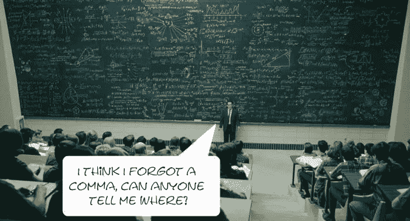
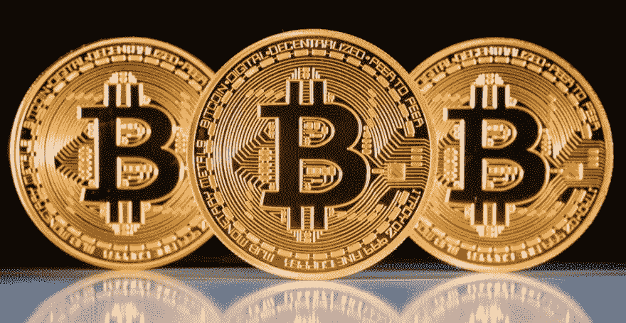

# 这一次不同

> 原文：<https://medium.com/swlh/this-time-is-different-9a5feeb6975b>

我多次被要求写一些关于比特币热潮、区块链和市场的东西，最终我坐下来开始写作。我会尽量保持简单，不使用太多的技术术语，这样每个人都可以理解，因为事实是每个人都在进入加密，即使没有理解它，所以我觉得让它可以理解是公平的。

首先我想说的是，我是在 2014 年初知道比特币的。我读了中本聪的白皮书，我理解它，我相信它。然后我做了一些研究，我认为每个人都需要了解它，因为它不仅仅是一个像 Paypal 一样的支付系统。

**但是，比特币是什么？**

这是一个文件。就像一个**笔记本**。比如:*比特币. doc* 。在这份文件上你写上“我把这份文件转给约翰”。那一行是交易。许多交易形成一个区块。如果你通过电子邮件将文件发送给约翰，你发送它**并抄送给玛丽和迈克，他们同意邮件已经发送**。然后，约翰将文件发送给他的父亲，并写道“我将此文件转交给爸爸”。并且再次进行验证过程。而且有趣的事实是… **这些交易，一旦被验证并添加到区块链，就无法更改了！**

**这是从哪里开始的？**

比特币是一种**加密货币**，我来介绍一下“ *crypto* 前缀代表什么。因为这是最重要的部分。

艾伦·图灵是密码学的先驱之一，密码学就是要找到代码将信息从一端发送到另一端，并且不让中间人知道如何读取信息。那时的密码学家是一群“疯狂的数学家”，人们并不太关心他们。

然后回到 1988 年中期，一些密码学家带着一个想法进入团体:改变现状，统治密码世界。密码朋克们一直在思考这个问题，在**“Crypto-88”**会议上，一个叫 **Timothy May 的人读了《秘密无政府主义者宣言》**，他的开场白是“一个幽灵正在困扰着现代世界，一个秘密无政府主义的幽灵”(1988)。

所以现在你知道最纯粹的密码的目标是击败当前的现状，而不是合作。

这种感觉在网络中心、会议、邮件列表(如加密邮件列表)和封闭的论坛中增长。世界继续忽视他们，但这些密码学家开始考虑建立一个货币系统，他们从 B-Money (1998)和协议开始:[http://www.weidai.com/bmoney.txt](http://www.weidai.com/bmoney.txt)和越来越多的主题，调查和每一次无政府主义的感觉变得更加强大，他们改变世界的意愿比以往任何时候都更强烈:[http://www.metzdowd.com/pipermail/cryptography/](http://www.metzdowd.com/pipermail/cryptography/)。

直到有一天，在密码学邮件列表上，一个名为**中本聪的家伙(或团体)发表了“我一直在研究一种完全点对点的新的电子现金系统，没有可信的第三方”(2008)** 。而且第一批 50 个比特币都是做出来的！[http://www . Metz Dowd . com/piper mail/cryptography/2008-10 月/014810.html](http://www.metzdowd.com/pipermail/cryptography/2008-October/014810.html)

Bitcoin was born!!

然后有几个极客用了，他们只是好奇，中本聪的论文讲了交易，时间戳服务器，引入了工作证明的概念，暗示了区块链的产生。Nakamoto 做了一些计算，发现随着节点的增加，比特币被攻击的**概率呈指数下降，因此这是一种真正安全的交易方式。**

**区块链**是比特币背后的底层技术，它真正有趣的地方是什么。

因此，比特币以革命的目的开始，但它带来了令人难以置信的进步，我们可以信任一个点对点社区的金融系统。这在当时是残酷的。比特币网络开始成长，Satoshi 消失了，比特币开始“自己”成长。

然后，Vitalik Buterin 认为在“笔记本”上增加一些空间是个好主意，你可以在那里写些东西，也许是一些代码。因此，当你将文件发送给约翰时，你可以写“我将此文件发送给约翰”，并可以添加“约翰，你欠我 5 美元的比萨饼”，并创建所谓的**智能合同**。而**以太坊**诞生了！

聪明的合同简直是疯了！例如，你可以雇用某人并让他们签署一份智能合同，这样它就不可更改，你可以对它进行编码，这样它就可以自动支付给你的员工，或者你可以集成物联网。可能性是无穷的！

但是现在发生了什么？

现在我将介绍一些可能会引起一些人争议的想法，因为尽管比特币的想法很棒，但比特币这一产品一文不值。为什么？

诚然，比特币开创了一件大事，但比特币每秒可以处理 3-4 笔交易。我不认为这能支撑住世界金融体系。签证流程 17.000，只是一些数据要基准。

还有，比特币是基于**挖矿，**那是什么？还记得工作证明吗？给迈克和玛丽的那份电子邮件？他们的工作是验证交易，他们的工作会得到一点钱的回报。在真实的比特币中，矿工解决数学问题，加密交易，并通过这项工作获得一些比特币。**所以矿工开采比特币。**

你必须知道比特币的**限量供应 2100 万比特币**，在经济学家看来，这与一个有趣的词有关:**通货紧缩**。这听起来很棒，因为如果你持有一枚这样的硬币，它的价值将会不断增加(我不会谈论通货紧缩对商业的影响)，但作为一种投资，这是一种梦想中的投资！

但是再一头扎进去，你会想…“如果供应量有限…如果不能多开采，矿工们会怎么样？”这是硬币的反面。

因为**比特币的诞生是为了杀死银行**，但是你需要挖矿来操作，需要一个“钱包”，你可以在你的电脑上有自己的钱包，但是大多数人都是通过比特币基地或其他交易所进入的，这是最接近银行的定义(一个物理/虚拟的地方，你在那里保存你的钱，你必须向谁支付费用)。

因此，他们生存的唯一方式将是申请费用，而我们又回到了传统银行业。当我上网看到一个广告"**新 ICO！3 个月 150%的回报！立即投资！！**”这让我想起了“拍 3 部 iPhones，赢一部！”广告。“非理性繁荣”——罗伯特·希勒

**我对此有何感想？**

我感到不安，我相信密码，但金融市场的非理性繁荣再次杀死了它。我希望有一天这能回到它最初的想法，**我希望这个世界至少使用区块链技术来赋予人们权力和推动变革，我希望没有人再说“这次不同了”，因为这四个词扼杀了伟大的想法，伟大的项目，而且似乎会对密码和区块链造成很大的伤害**。确实有令人印象深刻的项目，我已经投资了其中的一些，但是请不要猜测，做你的尽职调查，阅读白皮书，不要寻找快钱，推动发展。

## 这个故事发表在 [The Startup](https://medium.com/swlh) 上，这是 Medium 最大的企业家出版物，拥有 277，994+人。

## 在这里订阅接收[我们的头条新闻](http://growthsupply.com/the-startup-newsletter/)。

