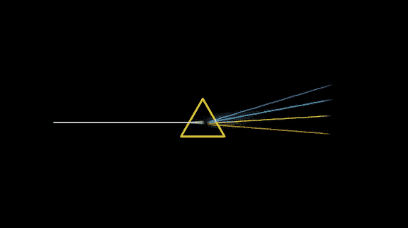
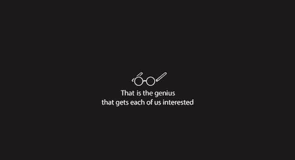
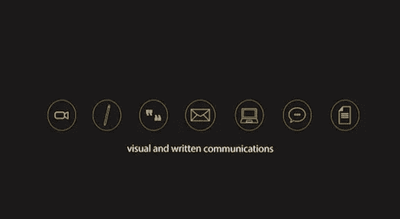
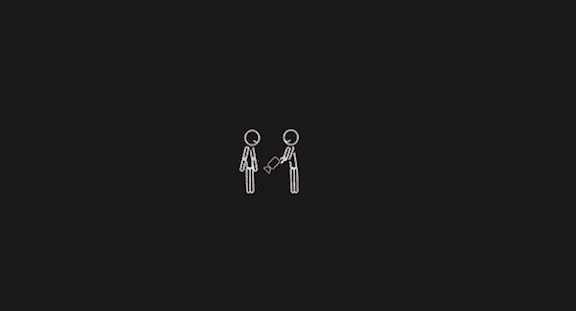

# 这个视频在 2 分钟内揭示了品牌的魔力

> 原文：<https://medium.com/swlh/this-video-reveals-the-magic-of-branding-in-2-minutes-cf2e6bb5d21e>

对于像*品牌*这样的主题，我没想到会这样。

我当然没有看到它像病毒一样传播开来(尽管我私下里希望它会，就像有人买彩票希望自己的票是中奖的那张一样)。

然而，在上传到 YouTube 的 23 天后，这个视频达到了一个惊人的里程碑…

# 23 天内超过 130，000 次浏览

呦喂。平均每天超过 5600 次浏览，每小时超过 230 次浏览。

除此之外，世界各地的人们对这一简单的信息和极简的图形赞不绝口，反应非常热烈:

> “你可以花一千年的时间读一百万本关于这个主题的书。或者，您可以观看下面的两分钟视频…。”
> 
> "很棒的关于品牌的视频，以及一个伟大的品牌需要什么样的核心要素."
> 
> “这在很多层面上都是不可思议的。谢谢大家。”
> 
> “很棒的视频，很棒的解释。简单又有创意。爱死了。”
> 
> “精彩的视频，哇！细节，简单，从一个元素到另一个的连接。一个字:妙极了！”
> 
> “大卫，让世界看到你的才华是理所应当的。恭喜你！”
> 
> “有没有想过品牌是什么？萨尔奥兹(Saar Oz)的极简运动图形有助于以最基本的形式解释品牌，以及如何创建像野火一样传播的伟大品牌。”

# 化繁为简

更重要的是灵感:我最近去了 Amazon.com 寻找关于“品牌”的书籍结果呢？6400 多本书！

这告诉我有些事情是非常非常错误的，因为对于一个主题来说，写了那么多书，有一些非常基本的东西没有被理解。我能理解几百个。甚至可能是 1000。但是六千多？号码

我的解决方案是:编写、叙述并委托一位出色的动画师萨尔·奥兹来帮助我从视觉上捕捉品牌的基本概念。

以下是供您观看的视频:

我最真诚地感谢萨尔奥兹，他出色地将概念和叙述带入生活。*(如果你喜欢这样，我邀请你到* [*订阅*](http://www.risingabovethenoise.com/free-ebook/) *到我的博客，在那里可以很容易找到更多这样的宝石。)*

以下是一些剧照:

感谢所有激励我走到这一步并帮助激励他人的人。

标签为:[品牌](http://www.risingabovethenoise.com/tag/branding/)，[视频](http://www.risingabovethenoise.com/tag/video/)，[病毒](http://www.risingabovethenoise.com/tag/viral/)， [youtube](http://www.risingabovethenoise.com/tag/youtube/)

*原载于 2015 年 2 月 25 日*[*【www.risingabovethenoise.com】*](http://www.risingabovethenoise.com/new-video-teaches-magic-branding-2-minutes/)*。*

## 这篇文章发表在 [The Startup](https://medium.com/swlh) 上，这是 Medium 最大的创业刊物，有 312，043+人关注。

## 在这里订阅接收[我们的头条新闻](http://growthsupply.com/the-startup-newsletter/)。

