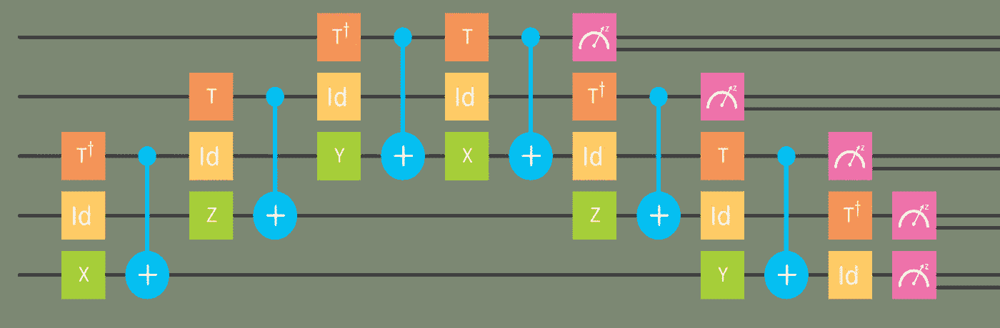

# 今年我告诉人们关于量子的事情，不管他们喜不喜欢

> 原文：<https://medium.com/swlh/this-year-i-did-a-bunch-of-physics-outreach-2b00c93db594>

## 所有的数量，但只有一小部分的数学

我是从事量子计算的物理学家。今年，我还有一项任务，去做一些拓展工作。我必须掌握数学，停止用希腊字母说话，但我想我成功地告诉了公众他们不知道的事情。有时候，他们甚至想了解他们。

我也应该做我正常的研究，设计让量子技术不受噪音干扰的最佳方法。所以我开始告诉每个人这一切。我从熟悉的原则开始，比如我们如何在嘈杂时重复自己，以确保我们的信息被传递。然后，我缓慢而坚定地转向了 IBM 和谷歌目前正在制造的量子纠错设备。

但是这些设备只是告诉你什么时候有量子混乱，它在哪里。他们给你一个难题，你需要解决它来清理东西。为了解释这是如何做到的，我转到了 YouTube。我召集了一群同事，让他们帮我制作视频。这些同事中有些人也非常聪明。

就是在这个时代，我做了一个实验。一个真实的实验，有了 [IBM 量子体验](https://www-03.ibm.com/press/us/en/pressrelease/49661.wss)。任何人都可以用它来玩真正的量子处理器。甚至是你！甚至像我这样的理论家！所以我也做了一个关于这个的视频。

最后，我们迎来了现代。媒介时代。我最近的文章范围更广。它们是关于量子计算机的。也是关于获得今年 T2 诺贝尔奖的任意子和准粒子。还有 Mariokart。还有古姆巴。

在这个过程中，还发生了其他事情。Reddit 上有三个 ama，回答公众的问题。不仅仅是我，还有我设法拉拢的更多同事。我还欠他们一些人一品脱。

所以你走吧。今年我敲了很多键盘。我学到了很多。我希望你能。

现在，在简短的图片之后，列表开始…

Here’s a picture of a rainbow made out of a quantum computer. We’ll need a few more years of development before we can make unicorns too.

# 媒介时代

*   [圣诞老人:圣诞准粒子:](https://bullshit.ist/santa-claus-as-a-quasiparticle-13467644f00a#.28675tuvb)准粒子季节性指南。
*   用任意子制造量子计算机:一篇关于为什么量子计算机可能由不可能的粒子制造，以及你如何能提供帮助的文章。
*   [量子奶酪小精灵，以及爱因斯坦为什么不喜欢他们:](https://bullshit.ist/some-quantum-weirdness-with-the-simplest-maths-possible-446d33046cf7#.wltvl18gk)量子非定域性，以我父母几乎能理解的程度呈现。
*   [80 年代的一款不起眼的电子游戏如何获得诺贝尔奖:](https://hackernoon.com/how-an-obscure-80s-video-game-won-the-nobel-prize-41529c7a4718#.sjhf9rwf3)一个解释任意子的寓言，以及今年的诺贝尔物理学奖。
*   [Goombas 作为蘑菇的反粒子:新物理的新游戏:](https://bullshit.ist/goombas-as-the-antiparticles-of-mushrooms-new-games-for-new-physics-c49091a7db25#.59eouoalw)这个寓言的延续，也是让游戏设计者将这种新物理用于游戏机制的尝试。
*   [什么是量子计算机，它们能跑马里奥赛车吗？介绍什么是量子计算机，以及它们与普通计算机有何不同。](/byspells-of-worldken/what-is-a-quantum-computer-and-can-they-play-mario-kart-92ff6954b622#.tk1kch3l1)
*   [量子计算机的硬盘:听起来很复杂:](/byspells-of-worldken/hard-drives-for-quantum-computers-as-complicated-as-the-sound-5531ce935e#.5meejjbab)自我修正量子存储器的可能性介绍。基本上是我们最近版本的流行总结。物理论文。
*   [在量子计算机上戳洞偷工减料:](/byspells-of-worldken/poking-holes-and-cutting-corners-in-a-quantum-computer-4c5947b96ed8#.8y4jnvrtd)我们最近一篇论文的总结。
*   [用一堆磁铁构建新的宇宙:](/byspells-of-worldken/building-new-universes-from-a-bunch-of-magnets-9fa1c3b5f806#.gvjci2b3n)蜂巢晶格模型指南，以及如何哄它给我们一些任意子。我们的一个视频也是这个实验背后的基础(见 YouTube 部分)。

# **博主时代**

## *相对数学自由的文章*

*   [量子纠错介绍:](http://decodoku.blogspot.ch/2016/02/5-story-so-far_57.html)一系列文章，从你在嘈杂的电话线上说话时应该如何重复自己开始，一直到谷歌和 IBM 目前正在构建的量子纠错码。
*   地球是什么形状的？了解并让我知道地球的形状在 2016 年初是一个有争议的问题。尼尔·德格拉斯·泰森甚至对此进行了抨击！这是我的贡献，没有说唱。
*   [任意子简介:](http://decodoku.blogspot.ch/2016/06/anyons.html)任意子很好玩。它们是获得今年诺贝尔奖的领域的一部分。这篇文章告诉你一些关于他们的事情。
*   [用 IBM quantum experience 做一个实验:](http://decodoku.blogspot.ch/2016/09/doing-experiment-with-quantum-experience.html)一个视频的简短介绍(见 YouTube 部分)，我在其中做了一个实验。

## *一点数学知识*

*   [最简单数学的量子位:](http://decodoku.blogspot.ch/2016/02/the-maths-of-qubits.html)量子位指南，最简单的量子系统，使用数学。但是不要担心:只有高中数学会用到，而且只是在绝对必要的时候。
*   [用最简单的数学方法纠缠:](http://decodoku.blogspot.ch/2016/04/entanglement-with-simplest-maths.html)从上面开始，第二个量子位加入了。然后是第三个。然后瞬间移动就发生了。
*   [用最简单的数学方法测量两个量子位:](http://decodoku.blogspot.ch/2016/04/fun-measurements-for-pairs-of-qubits.html)上面的文章有点长，所以删掉了一些，做了一篇新文章。
*   用最简单的数学方法进行量子计算:我用一些数学方法展示了量子计算机与普通计算机的不同之处。但只会一点点。

# **YouTube 时代**

*   [量子纠错的方法](https://www.youtube.com/playlist?list=PLaU1vYImkPDyc02laekPRpgvxt_1-TJ2v)这里有一些视频可以用来纠正量子错误。有些是我一个人做的。有些是其他科学家的。有些是我和其他人合作完成的。
*   [用 IBM quantum experience 做实验:](https://www.youtube.com/watch?v=_xFOPmdjwCI)在这个视频中，我告诉你一个证明任意子的存在和力量的实验。我现场表演！你也能做到！
*   [一些基于量子力学的游戏:](https://www.youtube.com/playlist?list=PLaU1vYImkPDxhpnvTdHjwLh4Kv9aqLkXW)某个傻逼玩的。

# **红迪网上的 AMAs**

*   [/r/科学 AMA 关于量子技术:](https://www.reddit.com/r/science/comments/4tev0n/science_ama_series_we_are_quantum_technology/)由巴塞尔大学、瑞士联邦理工学院和日内瓦大学的教授和博士后完成。
*   量子计算机上的 AMA:由容错量子技术会议的参与者完成。
*   量子计算机上的 AMA:这次只有我。

# **量子计算讲座**

我上传了我教授的量子计算课程的幻灯片。

*   [第一讲:](http://pdfsr.com/pdf/1-computation.pdf)经典和量子计算简介
*   [第二讲:](https://twitter.com/decodoku/status/798469639579860992)量子比特
*   [第三讲:](https://www.reddit.com/r/quantum/comments/5fiolt/quantum_computing_course_lecture_3_playing_with/)量子门
*   [第四讲:](http://pdfsr.com/pdf/4-circuit-model.pdf)更多量子门
*   第五讲:电路模型
*   [第六讲](http://pdfsr.com/pdf/6-more-quantum-algorithms.pdf) *:* 更多量子算法

今年到此为止。明年我不会拿报酬做这种事情，但我肯定我会做的。如果你对我应该写什么有想法，或者如果你只是想让我闭嘴，让我知道。