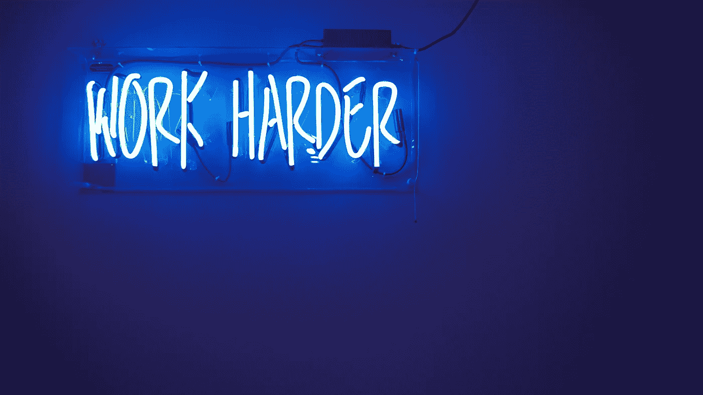

# 今年一切都是为了工作

> 原文：<https://medium.com/swlh/this-year-is-all-about-the-work-c68b35d6170a>

## 我计划如何通过一砖一瓦的工作获得成功

Photo by Jordan Whitfield on Unsplash

去年，我开始用章节来思考我的生活。

今年，是第三章。

# C 第三章=工作

我通常在做非写作工作时听 YouTube 视频或播客。我的在线工作相当简单，我喜欢播放一些背景音乐来打发时间。

昨天，我在听加里·维最近在 YouTube 上的一个视频，听到他说，

> “大多数人需要坐下来，计算出他们的雄心壮志的成本。”

让我们回到几年前。那是我第一次意识到我想要一些不同的东西，但直到去年才真正实现转变。

## 为什么？什么花了这么长时间？

我不会说我之前没有尝试过改变我的生活，因为我尝试过……但是有些事情总是阻碍我发挥我的全部潜力。

一次是因为我的关系，另一次是因为我繁忙的日程安排，其他时候我太累了。

但归根结底，我允许所有这些借口来运行我的个人叙事。

唯一阻碍我发挥全部潜力的是我自己。

# 我已经知道什么是理想的:

*在家陪我的孩子*

*建立有利可图的业务*

*旅行*

尽管知道所有这些，我还是没能坚持我早期开始的博客，我让进展顺利的一面之词付之东流，我从一个想法跳到另一个想法，却没有坚持到底。

我开创的许多事情本可以成功，但却没有。我没有意识到我的雄心壮志的代价。

成功需要我付出什么代价？

我需要投入多少时间？

我需要牺牲什么？

年复一年，我会考虑我需要完成的事情来达到我的目标，但是到了年底，什么实质性的事情都没有做。

然后，我会把假想的利润加起来，希望我刚刚投入了工作。

# 成本

今天是培养基的第 40 天。有些日子我不是特别想写作，但我仍然确信我会写。

一年前，见鬼，去年八月，如果我不想写，我通常不会写。

当我错过了一天，我会说，

> "明天我会发两个帖子来弥补."

但是如果你回头看，你会发现没有化妆贴。

现在，我计划开始在自己的网站上写博客，并制作一本电子书。

有时，对所有事情的想法都是压倒性的，但我记得将焦点带回到这一天。

这整个过程让我想起了几年前我看过的一次采访。那是在威尔·史密斯和查理·西恩之间。史密斯讲述了他的父亲如何拆除他商店前的一整面墙，并让威尔和他的兄弟重建它的故事。

威尔说他记得自己站在后面，看着墙说，

> *“这里会永远有一个洞。”*

但是他和他的兄弟挖了一个 6 英尺的洞作为地基，手工搅拌水泥，填满它，然后开始一砖一瓦地建造墙。

## 一年半后，他们砌好了最后一块砖。

完工后，他们的父亲和他们一起站在后面，看着墙说:

> "别告诉我你做不到。"

上升直到去年，我*才*看着这个豁开的大洞。现在，我专注于每天做些什么来填补空白。

我写的每一篇文章，我完成的每一本电子书，我的每一次社交，都在帮助建立更伟大的东西。

# **部队转业…** *日常*。

如果我每天都没有朝着我的目标努力，那么当年底没有回报时，我不会感到惊讶。不管我喜欢与否，我都有责任付出努力。

总有一天，我可以高枕无忧，但我知道，如果生命中没有这一章，我就无法进入下一章。

所以在那之前，还是为第三章干杯=)。

感谢您的阅读！❤

如果你喜欢这篇文章，请随意**拍拍**你的心满意足——这将有助于其他人找到这篇文章。

## 如果你想看得更多，请在 Medium 上跟随我。

## 这个故事发表在 [The Startup](https://medium.com/swlh) 上，这是 Medium 最大的创业刊物，拥有 297，332+人关注。

## 在这里订阅接收[我们的头条新闻](http://growthsupply.com/the-startup-newsletter/)。

