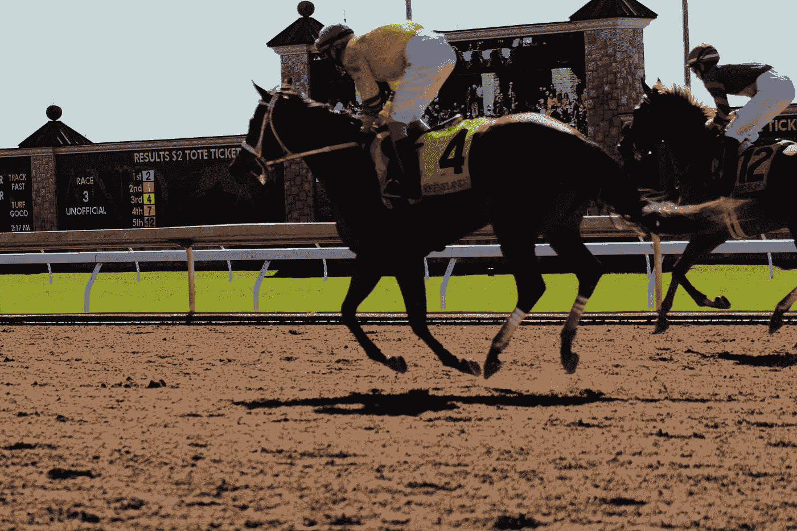
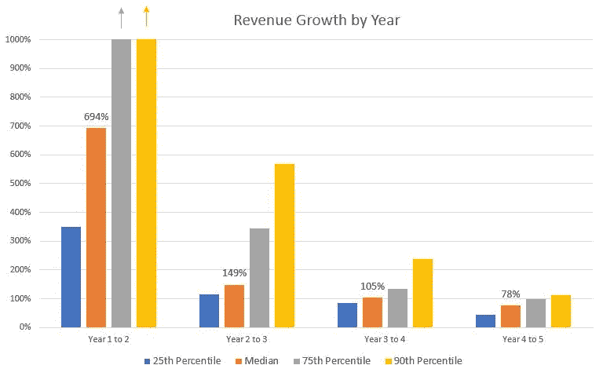
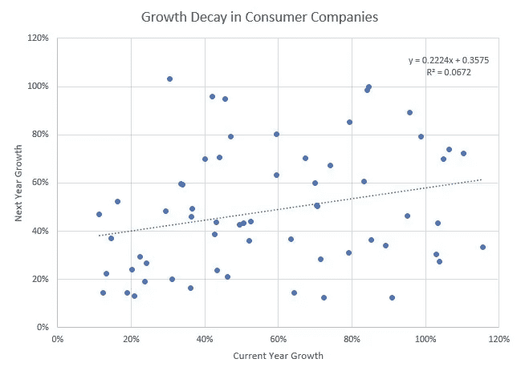
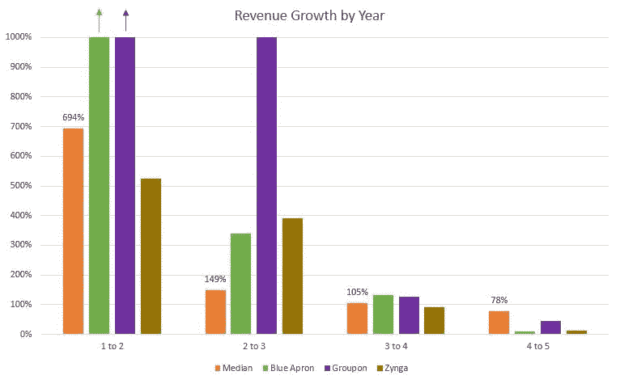
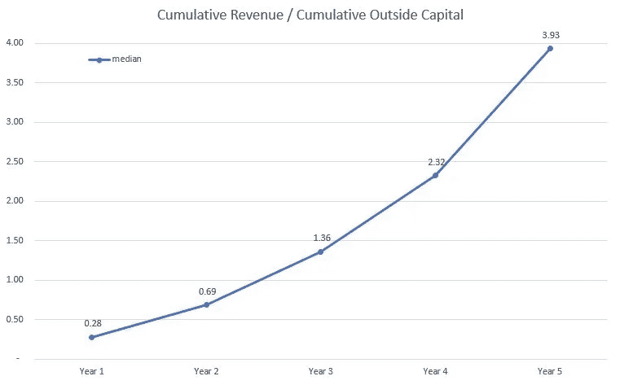

# 纯种马和过山车:风险投资如何看待消费者创业增长率

> 原文：<https://medium.com/swlh/thoroughbreds-and-roller-coasters-how-a-vc-looks-at-consumer-startup-growth-rates-8cb7e0d89bea>

Photo by [Whitney Combs](https://unsplash.com/photos/BxWBSVjmZ48?utm_source=unsplash&utm_medium=referral&utm_content=creditCopyText) on [Unsplash](https://unsplash.com/search/photos/horse-racing?utm_source=unsplash&utm_medium=referral&utm_content=creditCopyText)

> “与其他公司相比，我的增长率如何？”

这是我在风投公司担任成长顾问的过程中经常被问到的问题，到目前为止，我还没有具体的基准来客观地回答这个问题。很多时候，我不得不求助于轶事反馈。作为一个喜欢数据驱动的答案的人，我的目标是做得更好，并且很高兴分享最近一个项目的结果。

我有两个目标:

*   确定相对于公司成立时的年同比收入增长率
*   将这种增长与实现这种增长所用的资本进行比较，从而正确看待这种增长

我收集的数据跨越了 28 家公司，它们都向消费者销售产品，并接受了风险投资。一些公司已经上市或被收购，而其他公司仍然是私有的。有些是 Madrona Venture Group 投资组合的一部分，而许多不是。

我从这个数据集中得出了 5 个观察结果:

# **#1:期待出门摇摆**

数据显示，第 1 年到第 2 年的平均收入增长率接近 700%！

这个数字被夸大了，因为许多第一年的公司并没有全年销售，但在接下来的几年里增长仍然令人印象深刻:

Source: internal study of 28 venture-backed consumer startups

想在第三年进入前四分之一吗？那你就需要增长 300%以上。去工作吧！

# **#2:收入增长率可能会像坐过山车一样**

消费品公司的收入增长每年都不稳定。如这张图表所示，在绘制一年的增长与下一年的增长时，没有一个清晰的模式:

Source: internal study of 28 venture-backed consumer startups

Scale Venture Partners 的 Rory O'Driscoll 对 SaaS 公司进行了类似的分析，并发现了不同的模式。与消费品公司的波动性增长不同，SaaS 公司的增长率以一种相当可预测的方式下降。在他对“最佳 SaaS 公司”的研究中，任何一年的增长率都在同一家公司前一年增长率的 80%到 85%之间(R 为 0.51，而这里为 0.07)。

尽管整体数据集显示出波动性，但我们的数据集中有一些公司的收入增长更可预测。当这种情况发生时，通常是在那些像亚马逊一样痴迷于客户的公司。群体是有分寸的，比竞争对手强。NPS 很高，品牌在顾客眼中是有意义和一致的。然而，即使这些因素存在，增长也可能比许多其他行业更加不稳定。投资者和经营者们，请系好安全带，你们可能会坐过山车！

# **#3:收入增长加速是可能的(也是常见的！)**

在我们的数据集中，75%的公司至少有一年的收入增长率*比上一年*加快。这些也不是一次性的异常，因为在我们的数据集中，超过一半的公司有两年的收入增长加速。Scale 关于 SaaS 的报告显示，再次加速远没有那么普遍。在这份报告中，不到 35%的公司至少有一年收入增长加速。两年的再加速甚至更少，为 10%。

随着销售周期的缩短，决策者的减少，以及消费者业务中的数字交易，相对于 SaaS 等其他行业，增长率加速要现实得多。希望这种情况发生在你的创业中吗？这就是我每天所想的——给我发个短信，我们来谈谈吧！

# **#4:第五年是挑战经常出现的时候**

蓝色围裙、Groupon 和 Zynga 都在成立后的 5 年内上市。每家公司在最初几年都经历了极快的增长，但在第 5 年难以为继:

Source: internal study of 28 venture-backed consumer startups

原因因公司而异。蓝色停机坪的增长放缓被[有时归因于](https://www.linkedin.com/pulse/detailed-look-blue-aprons-challenging-unit-economics-daniel-mccarthy/)CAC 的上升，而同时队列正在减弱。Groupon 的困境包括国际疲软和消费者对其每日交易模式的疲劳，而 Zynga 在一些领域面临逆风，包括从依赖脸书转向多元化的挑战。

*增长率下降的事实表明，在向消费者销售时，保持最佳增长是多么困难。*

再说一次，我所知道的避免这种命运的最好的解决办法是对顾客着迷。Redfin(来自我们的投资组合)和网飞是两个能够在 5 年后更好地维持中值以上增长的公司。它们有什么共同之处(除了红色)？行业领先的 NPS，如这里所说的[和这里所说的](/@greylockvc/seven-signs-of-a-customer-focused-ceo-55c7a5091377)和。

# **#5:注意资本效率:收入超过资本需要多长时间**

我用每年的累计收入除以累计外部资本来衡量资本效率。单个公司在这一指标上不稳定，因为大量的资本注入通常会导致数字下降。不过，总体模式是一致的，中位数显示到第 3 年累计收入超过资本(由大于 1 的比率证明)。

Source: internal study of 28 venture-backed consumer startups

更早实现这一里程碑会为成功铺平道路，我们有几个这样的例子。在我们的数据集中，有三家著名的公司更早达到了这个里程碑:Dollar Shave Club、Stich Fix 和 zulily(我曾经工作过的地方)。每一家公司都有不同的走向市场的方法，促成了这一令人印象深刻的成就。

Dollar Shave Club 推出了一个非常成功的视频,一开始就获得了大量的关注。他们将此与有针对性和有效的公共关系结合起来，开始了比赛。Stitch Fix [很少进行付费营销](https://digiday.com/marketing/stitch-fix-ceo-katrina-lake-current-shift-customer-behavior-permanent/)，而是依靠口碑传播，而这种传播往往被博客作者放大。Zulily 很可能在早期利用了更多的付费营销，但它成立的时间要早几年，那时广告库存更便宜。消费者对每日交易模式感到兴奋，电子邮件可以在几个大的渠道中以可承受的价格获得。然后，该公司可以有效地将“会员”转化为长期有价值的客户。

除了获得客户，所有这三个被提及的异常者也展示了相对于他们的行业的令人印象深刻的重复率。这使他们能够通过新客户和现有客户增加收入，而不需要资金，如果他们更依赖于客户获取的话。

*我在成功的公司中看到了一种行业领先的重复率模式，我认为这是一家公司能够快速增长、保持增长并在没有巨额资本的情况下实现增长的关键指标之一。*

你会沿着这条路走下去吗？

## 这篇文章发表在 [The Startup](https://medium.com/swlh) 上，这是 Medium 最大的创业刊物，有 326，962+人关注。

## 订阅接收[我们的头条新闻](http://growthsupply.com/the-startup-newsletter/)。

