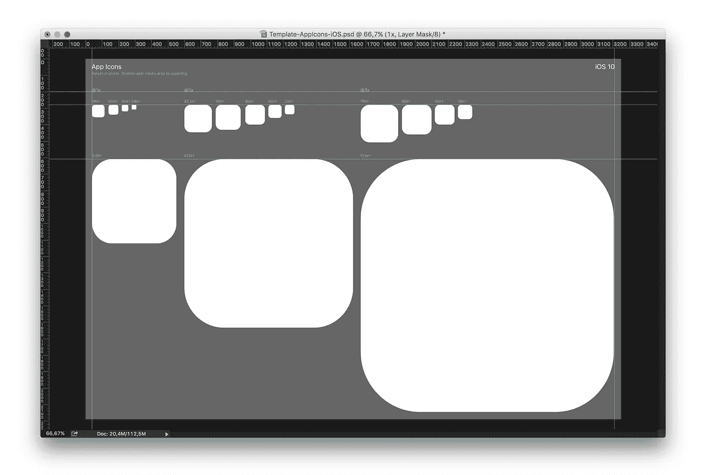
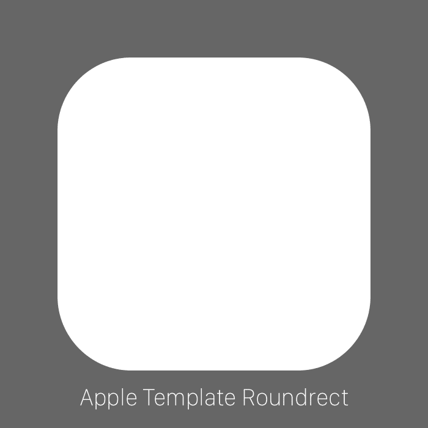
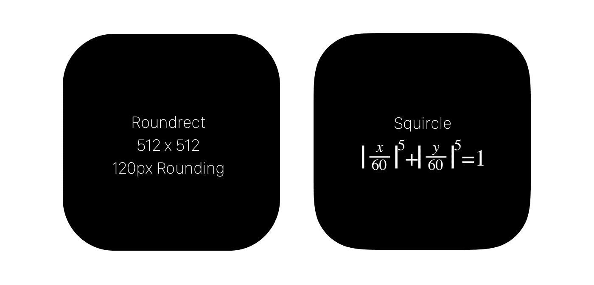
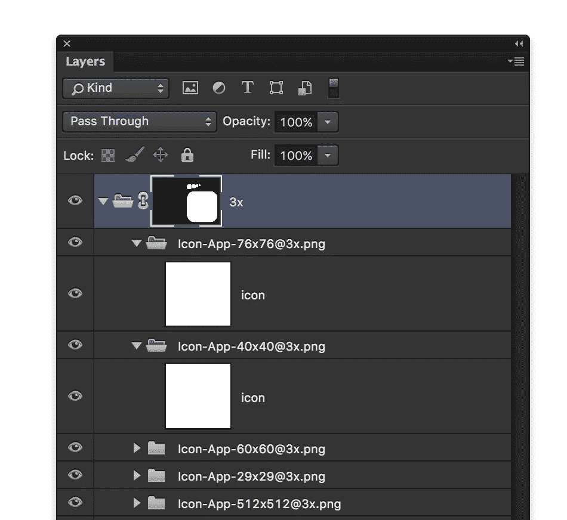
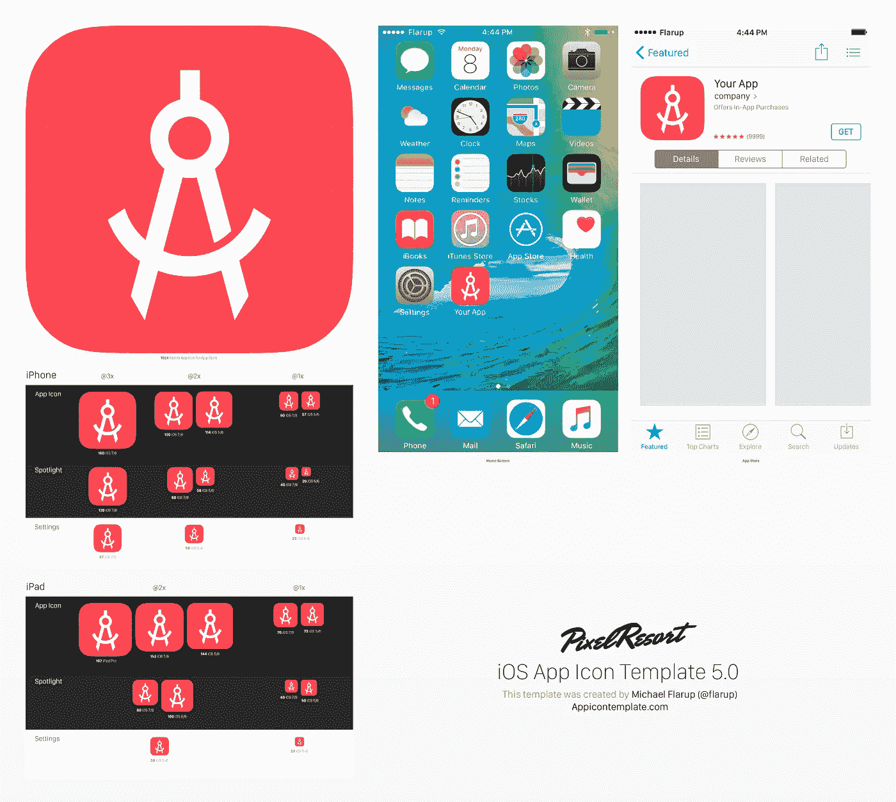

# 关于新的苹果官方应用图标模板的想法

> 原文：<https://medium.com/swlh/thoughts-on-the-new-official-apple-app-icon-template-3cc096206082>

上周，苹果发布了一系列新模板,作为为 iOS 准备图像的起点。太好了！我们一直在等待苹果[的优秀、精确的设计工具，已经等了很久了](https://appicontemplate.com/the-hunt-for-the-squircle/)。不幸的是，这些不是真的。

人们很快指出[矿](http://appicontemplate.com)和其他人的资源是如何被这一举动淘汰的:

简而言之:**远非如此。**

不要误解我，我希望苹果能为我们设计师使用的各种工具提供很好的设计资源。我和其他人最初参与制作资源的原因是为了改进我们可以使用的工具。如果苹果或更多的人想帮助这一努力，每个人都应该感到高兴！这是不可能的，所以我不喜欢记录他们的官方图标模板不会取代我现在使用的工具。但原因如下。

# 这不是松鼠，这是圆的！

**等什么！？这应该是你现在的反应。苹果为开发人员制作 iOS 应用图标提供的全新官方图标模板使用了圆形遮罩。不是松鼠。*喘息*。**

这是来自官方模板的 512px 形状，上面覆盖了一层 squircle。

The official Apple Icon Template uses a roundrect, not the squircle.

如果你在想，那又怎样？那我就不太确定你在读这个干什么了。但事实是，在官方模板中包含圆角矩形而不是 squircle 是令人困惑的。关于平台上的 squircle 已经说了很多，也做了很多——它是 iOS 体验中如此微妙但重要的一部分。以至于它现在也作为 iOS 10 中的标准 UI 容器形状被引入。所以在你提供给开发者的官方设计资源中不关心它是很奇怪的。仔细观察，你会发现 512x512px 版本使用了简单的 120px 圆角，而不是备受称赞的超椭圆形。

我认为细节很重要，使用错误的画布会影响你的设计。苹果*将*把你的图标裁剪成松鼠形状，所以你最好不要试图在他们提供的模板中做任何精确的事情。

# 没有矢量图形，都是位图。

他们模板中的所有内容都是栅格数据。没有矢量轮廓。显然，矢量并不是严格需要的，因为导出的是特定的栅格大小，但不至少给人们提供最好的可用且可适度扩展的工具是一个奇怪的选择。

# 所有你得不到的东西

除了上面奇怪的选择，还有很多其他的东西是官方图标模板所没有的。在[appicontemplate.com](http://appicontemplate.com)上找到的模板，你可以从[比扬戈](https://bjango.com/designresources/)那里得到的模板，或者由[马克斯·里德堡](http://www.iosicontemplate.com)制作的模板，都包含一些自动化元素。这些第三方资源已经走了很长的路，他们做得更好，帮助门外汉第一次进入图标创造的世界。我在[appicontemplate.com](http://appicontemplate.com)得到的模板使用 smartobjects 来呈现所有的大小，并具有一键导出操作的功能。有一些标准的颜色和渐变让你开始，你可以在原生环境中预览你的图标。你必须问自己，为什么我们首先要有模板？对我来说，这是让人们能够更容易地创建资产，理解并跳过技术需求，并以更大的信心提出他们的想法。

我认为苹果公司希望为他们要求开发者提供的设计资源提供模板是很好的，但他们提供的模板不仅比第三方资源实用得多，而且事实上也是错误的——使用位图 roundrects 而不是平台标准 squircle。除非苹果愿意投入更多的时间来帮助开发者交付更好的资产，否则看起来我们仍然有很多理由使用第三方资源。

___

*更新:自从我发表这篇文章后，苹果发布了他们应用程序图标模板的更新版本。他们听了！我写在这里:*

 [## 苹果倾听:更新他们新的官方应用图标模板，有两个重要的变化

### 几天前，我写下了一些关于苹果新发布的应用图标资源的想法:

medium.com](/@flarup/apple-listens-updates-their-new-official-app-icon-template-with-2-crucial-changes-27725606b9a0) 

___

[*迈克尔*](http://twitter.com/flarup) *是丹麦设计师、企业家&的主题演讲人。他喜欢制作东西、冒险和讲故事。*

