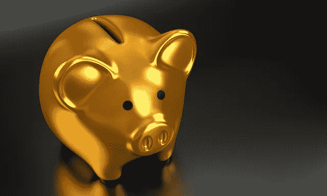

# 媒体的三个替代收入来源

> 原文：<https://medium.com/swlh/three-alternative-revenue-sources-for-medium-f2a4d45d085f>

[QuinceMedia/pixabay](https://pixabay.com/en/piggy-bank-money-finance-business-2889046/)

在 [**昨天的**](https://ideavisionaction.com/business/is-mediums-business-model-sustainable/) 帖子里，我解释了为什么 Medium 的订阅业务不可持续。本质上，它既不满足读者，也不满足作者。

我是 Medium 的忠实粉丝，我希望它成功。这就是为什么我要在这篇文章中分享媒体的替代收入来源。

**当前模式对用户有益，但不可持续**

在批评当前模式和提出替代方案时，我不是受我的兴趣所驱使。目前的模式比我建议的模式对我更有利。

目前的模式给了我一个优秀的、无广告的平台来发布我的帖子，并接触到大量的受众。这恐怕维持不了多久。

我提出了一个短期内对我不太有利的模式，但它将让 Medium 维持更长时间。这样，从长远来看，它将有益于我们，作家和读者。

让我们回顾一下 Medium 的三个替代收入来源。

**向在媒体上发表文章的作者收费**

> 在媒体上发表是一种特权，它应该被如此对待。

如果你对在媒体上发表文章的机会收费，作者会更加尊重这个平台。

类似于目前的系统，一个作家可以在一个月内免费发表三篇文章。这给了每个人在平台上发表的机会。超过这个数字的话，作者就要支付中等的报酬。

作家会为他们获得的曝光率和他们接触到的观众支付媒介。这种曝光率和观众在其他任何地方都不是免费的。它具有可以货币化的价值。

**评论呢？**

在这个系统中，评论是免费的。如果有人想发表 45 分钟的帖子作为评论，那没问题。

如果我的观察是正确的，评论不会像独立的帖子那样广泛传播。因此，将帖子作为评论发布的作者不会获得与支付订阅费的作者一样多的分发。

**对增加发布的文章向作者收费**

> **媒介是一种事后分配机制。**

作家受益于把他们的文章分发给相关的读者。他们可以通过将帖子分发给更多人来增加他们的收益。他们可以支付额外的发行费用。

我假设 Medium 在向受众发布帖子时会考虑几个标准。这些标准可能包括读者的参与度、帖子的标签、作者的追随者等等。

每个标准在计算帖子对读者的相关性分数时都有权重。具有较高分数的帖子被显示在读者面前的较高位置。

> 我们可以在这个总分上增加一个标准:作者支付的现金数量。

我建议在一个帖子的整体评分中，保持 10%-20%的发行费权重。如果这个权重低于 10%，编剧就不会觉得付发行费有意思了。如果在 20%以上，平台整体质量就会受损。

**出售隐私保护套餐**

如今， [**数据是金矿**](https://ideavisionaction.com/marketing/data-is-the-gold-if-you-know-how-to-use-it/) ， [**隐私是问题**](https://ideavisionaction.com/privacy/a-solution-to-the-privacy-puzzle/) 。Medium 的首席执行官 Ev Williams 在他的最后一篇文章中声明，Medium 不会向第三方出售数据。这在网络上并不常见。

几乎所有的数字产品和服务都会收集用户数据并出售给第三方。这种做法是许多网站的收入来源。

> 通过不向第三方出售数据，Medium 使其用户受益。对媒体来说，收取这样的费用才公平。

正如我在 [**关于隐私的帖子**](https://ideavisionaction.com/privacy/a-solution-to-the-privacy-puzzle/) 中解释的那样，我建议在线企业向用户提供两种类型的会员资格。

第一种是免费会员。免费会员通过向第三方出售用户数据获得补贴。这是目前网上的标准。你日常使用的大多数网站、产品和服务都是由这个系统资助的。

**隐私保护高级会员资格**

第二种是隐私保护的高级会员。在这一层，用户数据不会出售给第三方，而是由用户付费。

Medium 没有收集数据并出售给第三方，因此留下了大量资金。仅此一项就可以击败他们目前付费会员模式的收入。

**无论如何保护数据是不可能的**

你可能会反对这种模式，但第三方可能会收集你输入的数据，并进一步出售。

如果你使用谷歌的 Chrome 浏览器或 Android 操作系统，谷歌无论如何都会收集你的数据并将其商业化，即使你使用的是 Medium。

即使你不使用谷歌产品，数据也会找到第三方。这是我最近的一次经历。

**我的媒体评论泄露给了 YouTube**

我只能通过 Windows PC 上的 Firefox 和 Medium 的 iOS 应用程序访问 Medium。最近，我在一个媒体帖子上添加了一条关于宜家的评论。几个小时后，YouTube 开始在另一台设备上向我展示宜家的广告。

我不知道这些数据是如何泄露给谷歌的，但它还是泄露了。数据会流向第三方。为什么不自己卖，向想保护隐私的人收费？

**结论**

从长远来看，Medium 目前基于订阅的商业模式似乎不可持续。Medium 有三个替代收入来源。

*   向在媒体上发表文章的作者收费
*   向作家收费以增加他们在媒体上的发行
*   将免费用户的数据商业化，并向高级用户出售隐私保护包。

这些收入来源似乎在短期内使读者和作者处于不利地位，但从长期来看，它们比目前的模式更具可持续性。

如果目前的模式失败，我们将完全失去媒介。支付发布帖子、增加发行和隐私保护的费用是维持 Medium 运营的一个小代价。

**轮到你了**

*   你对这篇文章中提出的收入来源有什么看法？
*   你有其他收入来源吗？

***报名参加我的*** [***每周邮件简讯***](https://ideavisionaction.com/email-newsletter/) ***关于创业、创业、博客、营销、人生的课程。***

## 这篇文章发表在 [The Startup](https://medium.com/swlh) 上，这是 Medium 最大的创业刊物，有 321，672+人关注。

## 在这里订阅接收[我们的头条新闻](http://growthsupply.com/the-startup-newsletter/)。

