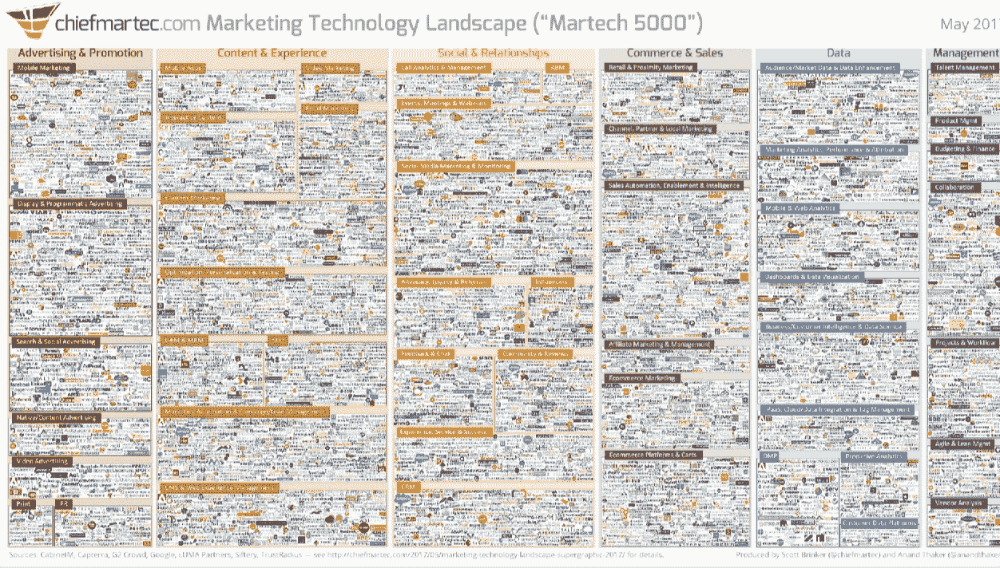
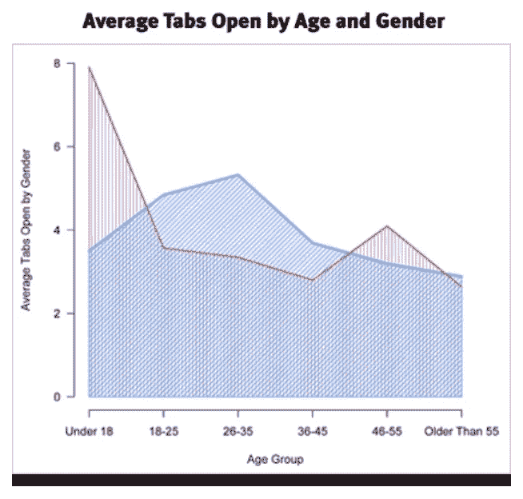

# 数字讲故事的三个常见障碍

> 原文：<https://medium.com/swlh/three-common-obstacles-to-digital-storytelling-b9a67a77f8dd>

许多企业都意识到在网上讲述一个引人注目的品牌故事是多么重要，但现实也带来了一些挑战。

对注意力持续时间的竞争从未如此激烈，同时公司继续适应消费者行为的不断变化。此外，56%的营销人员报告说，孤立的技术平台阻碍了他们提供连贯的营销战略。

显然，人与技术之间的关系为品牌带来了大量新的机遇，但也阻碍了发展。

# 拥挤、孤立的 MarTech 景观

毫无疑问，技术可以帮助营销人员为他们的受众提供更好的体验。

然而，我们应该记住，仅仅投资于一系列工具并不能保证成功。

下图展示了当前的营销技术格局，几乎无法清晰地浏览。

当然，这是在我们深入研究选择并整合合适的技术来讲述品牌故事的复杂性之前。

The modern MarTech landscape

在评估了这种情况后，我们也许不应该惊讶于 56%的营销人员报告说非集成的技术平台是凝聚营销努力的最大障碍。

企业选择各种工具来帮助他们实现战略的组成部分，但是这些独立的技术通常不容易共享数据。

消费者不会以这样一种支离破碎的方式浏览，他们也不希望品牌传递重复或脱节的信息。

一个在不同内容平台上脱节的品牌故事可能会损害一个品牌的声誉，并且肯定会在吸引注意力的竞争中失败。

最好的叙事包含线性的信息流，无论是印刷的，电视的，剧院的，还是网上的。讲好故事的规则依然存在；我们必须吸引观众的注意力，并通过提供新的有趣的细节来保持这种重要的流通性，从而将故事推向一个令人满意的结局。

当消费者不仅跨平台移动，而且跨媒体格式移动时，这是一个很难实现的任务。尽管如此，这不再是一个成功的数字战略的谈判方面。

在这个日益拥挤的环境中，那些在综合技术栈中发展起来的品牌，正正确地做到这一点，并获得回报。

# 流程瘫痪阻碍了内容流动

决定合适的技术合作伙伴是定义和讲述品牌故事的重要一步。

然而，有效讲故事的障碍不仅仅局限于技术层面。许多企业的内部结构根本不利于传递数字品牌故事所需的流畅、敏捷的方法。

事实上，40%的品牌认为组织结构是持续整合营销活动的重大障碍。

我们的许多工作方式都不太适合现代的新闻内容制作方式。

Process paralysis

我们还有在线即时受众反馈的优势，因为我们可以实时看到谁选择了参与我们的信息传递。然而，即时反馈也会导致我们过快地尝试和纠正路线。

要讲述一个有效的故事，需要一系列利益相关者一致认同的连贯的长期愿景。技术可以帮助实现这些过程，但是人们需要首先对它们进行定义并达成一致。一旦明确了角色，正确的工具可以帮助我们分配任务，并消除流程中的一些阻碍内容制作的问题。

事实上，合适的技术可以将发布时间从 20 分钟减少到 5 分钟，因此值得努力寻找最合适的平台来促进您的新内容流程。

# 释放创造力的挑战

创造力这个空灵的概念一直以来都无法定义。从古希腊人到浪漫主义诗人，再到我们现代由人工智能驱动的产生叙事的尝试，我们总是被创造力所束缚，却从未能够提炼出创造力。

然而，我们的现代内容营销格局要求随时发挥创造力。

即使我们拥有合适的技术组合，并采用了新的流程来帮助我们利用其潜力，我们仍然需要想法——而且是大量的想法。

此外，仅仅提供好的内容是不够的。现代消费者已经有足够多的分心，没有看到另一个半生不熟的品牌活动。

平均每个人在任何时候都有五个标签在他们的网络浏览器上打开，这个数字在年轻一代中不断增加。

[*Source*](http://www.slate.com/articles/life/the_hive/2010/12/open_this_story_in_a_new_tab.html)*: Mozilla data. Men highlighted in blue; women in red.*

挑战在于，每个品牌都想讲述自己的故事，因此，当你的观众总是可能专注于一件以上的事情时，找到竞争优势至关重要。

这从一些更普通的方面开始，比如开发编辑日历的结构，研究在每个平台上引起共鸣的内容类型。接下来，品牌必须了解他们的受众何时最容易接受某些内容格式。

这使生产计划和目标战略有了一些眉目，但是当然这个计划的成功取决于计划中的想法。

当我们接近数字故事时，我们的灵感应该是机械的。

技术可以帮助确定人们正在讨论的热门话题，也可以激发头脑风暴。创造力仍然有一些无形和不可预测的东西，但技术正在减少猜测的数量。

## 这篇文章发表在《初创企业》杂志上，这是 Medium 最大的创业刊物，有 308，471 人关注。

## 订阅接收[我们的头条新闻](http://growthsupply.com/the-startup-newsletter/)。

