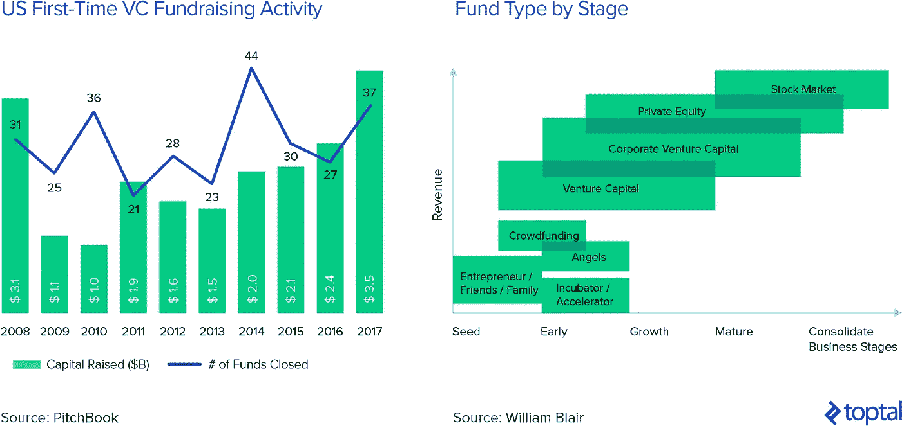
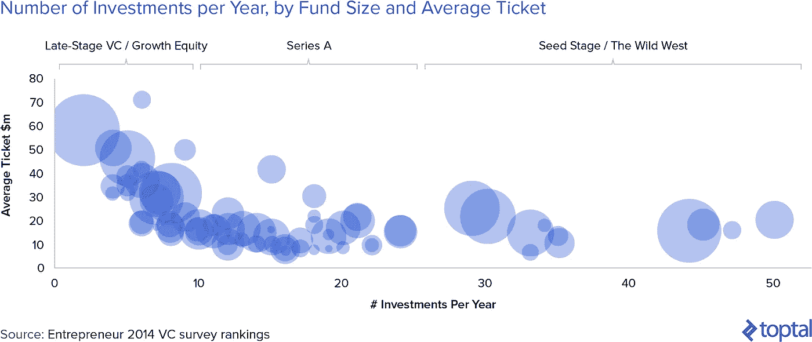
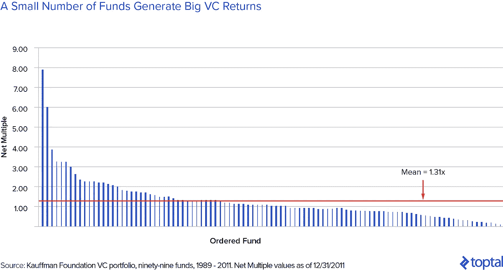

# 风险投资组合策略的三个核心原则

> 原文：<https://medium.com/swlh/three-core-principles-of-venture-capital-portfolio-strategy-1420fdc53914>

全都是关于击球、本垒打和双杀

# 风险投资是流行的资产类别

从[卑微的出身](https://www.forbes.com/sites/wilschroter/2014/06/11/4-things-every-entrepreneur-should-know-about-venture-capital/#66aa0cb5790b)，风险投资(VC)行业已经发展成为私募股权领域最重要的，当然也是最知名的资产类别之一。风险投资支持的初创公司已经重新定义了整个行业的概念，一些[开拓者](https://www.bloomberg.com/view/articles/2017-08-24/america-s-most-winner-take-all-industry-visualized)超越传统的石油和银行业巨头，成为地球上最有价值的公司。支持他们的风险投资家们也占据了他们在聚光灯下的位置，像马克·安德森、弗雷德·威尔逊和比尔·格利这样的人获得的认可远远超出了沙丘路的范围。你可以将这种个人崇拜与 20 世纪 80 年代的“企业掠夺者”时代相比较，当时迈克尔·米尔肯等人催化了杠杆收购和垃圾债券热潮的开始。

部分由于这一点，风险资本领域已经见证了参与者和专业人士的涌入。首次担任基金经理的人继续以健康的速度筹集新的风险投资基金，风险资本与私募股权、成长型股票和其他私人资产类别之间曾经清晰的界限已经开始模糊。企业也已经转移到这个领域，创建风险部门，参与越来越多的启动资金。也许是这个时代最大的标志，越来越多的名人开始投身创业投资圈。正如约翰·麦克杜林所说，

> “风险投资已成为金融领域最迷人、最激动人心的领域之一。富有的继承人过去常常开唱片公司或尝试制作电影，现在他们投资初创企业。

## 风险投资回报:闪光的不都是金子

在风险投资中取得成功并不容易。事实上，尽管评估该资产类别整体的数据很少(单个基金表现的数据更难获得)，但有一点是清楚的，即该资产类别并不总是符合预期。正如考夫曼基金会[指出的](https://papers.ssrn.com/sol3/papers.cfm?abstract_id=2053258)，

> “自 20 世纪 90 年代末以来，风险投资的回报一直没有明显超过公开市场，而且自 1997 年以来，返还给投资者的现金少于投资于风险投资的现金。”

即使是最知名的风险基金也因其业绩受到了审查:2016 年底，泄露的数据显示，安德森·霍洛维茨基金的前三只基金的业绩[不如壮观的](https://www.wsj.com/articles/andreessen-horowitzs-returns-trail-venture-capital-elite-1472722381)。

这种平淡无奇的表现的原因当然是多种多样和复杂的。[一些人继续相信](https://www.inc.com/zoe-henry/steve-blank-tech-bubble-burst-ponzi-scheme.html)我们可能处于泡沫中，如果这是真的，可以解释许多基金不尽人意的结果(膨胀的价值减缓了退出的速度，抑制了 IRR)。其他人认为，目前的基金结构没有合理地建立起来，以激励良好的业绩。Scott Kupor 对 Andreesen Horowitz 泄露的结果的叙述是，缺乏对风险投资资产类别表现的更广泛理解导致了负面言论。

尽管所有这些可能是真的，也可能不是真的，但许多基金表现不佳的另一个潜在原因是，它们没有遵循风险投资的一些基本原则。随着前银行家和顾问将自己重塑为风险资本家，他们未能吸收一些关键差异，这些差异将更成熟的金融和投资活动与更独特的风险投资形式区分开来。

要明确的是，我坚定地站在这个阵营里。作为一个从更传统的金融领域进入风险投资领域的人，我亲眼目睹了这些活动之间的差异。我并不是以任何方式宣称自己是风险投资的圣人，但通过不断的学习，我承认并尊重风险投资区别于其他投资活动的一些重要的细微差别。因此，本文的目的是强调我认为最重要的风险投资组合策略中的三个，这三个策略是这个领域的许多参与者未能理解的。

# 1.风险投资是一场全垒打比赛，而不是平均水平

首先，也可以说是最重要的，我们必须理解的概念是，风险投资是一场全垒打比赛，而不是平均水平。我们的意思是，当考虑组建一个风险投资组合时，**理解基金的绝大部分回报将由投资组合中的极少数公司产生是绝对关键的**。这对风险投资者的日常活动有两个非常重要的影响:

1.  失败的投资无关紧要。
2.  你做的每一项投资都需要有可能成为全垒打。

对许多人来说，尤其是那些有传统金融背景的人来说，这种思维方式令人困惑，而且违反直觉。传统的金融投资组合策略[假设资产回报遵循](https://www.pimco.com/handlers/displaydocument.ashx?id=Y8Xa4IMzIEbGicJGFdwHSKwLqB2QrIpdOGOJ6Gd7ZqCCw74JEBbx4c3p%2FtQ5cP2PnApBY6LCBBRPvdzzJZqVPFtLdZcf7k0I0jGD%2FJemtxXk1yISVNw%2BujImssGEYH%2Fq21JB3dKl4lxrBAiKxMuB0w%2BxSTPaDRMaHiIvdmurTjDAyE8wSnxekLM3bQAlqx7LcuQHshD6HIfGbUauXsmgqKSjs18v5tRRGNuBcLduTFQp8bOdR4h6Xg%2F1yteUShXKuaGNAR49yUX4gu3uO49lIjPg6D35t5%2F6e1HhOUxXmocbCvsDPLgnFImelmYDYk6KZ1OJfnvnYBaR7rOlH%2BgNLF2EVD%2FKTIaUXtKeB0RXrWI%3D)[有效市场假说](http://www.investopedia.com/terms/e/efficientmarkethypothesis.asp)正态分布，正因为如此，投资组合的大部分产生的回报是均衡的。对标准普尔 500 指数 1 天收益的 66 年样本[分析事实上符合这种钟形曲线效应，其中投资组合的模式或多或少是其均值。](https://sixfigureinvesting.com/2016/03/modeling-stock-market-returns-with-laplace-distribution-instead-of-normal/)

远离流动性更强的公开市场，私人市场的投资策略也非常强调谨慎平衡投资组合和管理下行风险的必要性。在接受《彭博》采访时，传奇私募股权投资人亨利·克拉维斯[这样说道](https://www.bloomberg.com/features/2016-henry-kravis-interview/):

> “当我 30 出头在贝尔斯登的时候，我会在下班后和我父亲的一个朋友一起喝酒，他是一名企业家，拥有很多公司。”“永远不要担心你将来会赚多少，”他说。总是担心你可能会失去什么。“这对我是一个很大的教训，因为我还年轻。我所担心的只是为了我的投资者，希望也是为了我自己，努力达成一笔交易。但是你知道，当你年轻的时候，你通常不会担心会出什么问题。我想，随着年龄的增长，你会担心这一点，因为你经历过很多不顺心的事情。”

抛开我们从金融理论中学到的东西不谈，风险投资人克里斯·迪克森[提到](http://cdixon.org/2015/06/07/the-babe-ruth-effect-in-venture-capital/)亏损的逆境可能是一种内在的人类机制:

> “行为经济学家著名地证明，人们对一定规模损失的感觉比对相同规模收益的感觉要糟糕得多。亏损的感觉很糟糕，即使这是总体上成功的投资策略的一部分。”

但风险投资的关键在于，上述思维方式是完全错误的，而且会适得其反。让我们来看看这是为什么。

## 三振出局在风投界无关紧要

大多数新公司都消亡了。不管我们喜不喜欢，这种事情经常发生。不幸的是，有足够的数据支持这一点。例如，美国劳工部[估计](https://www.bls.gov/bdm/entrepreneurship/entrepreneurship.htm)所有小企业五年后的存活率大约为 50%，随着时间的推移，存活率急剧下降到 20%。当涉及到风险资本基金的创业投资时，数据更加暗淡。Correlation Ventures 对 2004 年至 2013 年间的 21，640 笔融资的研究表明，65%的风险投资交易的回报低于投入其中的资本，这一发现得到了霍斯利桥类似数据的证实，该公司是几家美国风险投资基金的重要有限合伙人，在 1975 年至 2014 年期间对其 7000 笔投资进行了调查。

当然，细心的读者可能会指出，创业投资的失败率可能只是被一些投资不善的坏基金向上扭曲了。他们这样想也情有可原。但是霍斯利桥数据的有趣结果是，这实际上是不正确的。恰恰相反，最好的基金比一般的基金有更多的出局数。即使以每笔交易的投资额来衡量，情况也没有改变。

换句话说，数据显示风投失败的投资数量似乎并没有降低基金的整体回报。这实际上表明两者可能是负相关的。但如果是这样的话，那么是什么推动了风险基金的表现呢？

## 重要的是本垒打

重要的是硬币的另一面:本垒打。压倒性地如此。回到霍斯利桥的数据，值得注意的是，其表现最佳的基金的回报大多来自少数最终产生巨大回报的精选投资。对于回报率超过 5 倍的基金来说，不到 20%的交易产生了大约 90%的基金回报。这提供了一个 VC 中存在的[帕累托法则](https://en.wikipedia.org/wiki/Pareto_principle) 80/20 定律的具体例子。

但它比这更进一步:不仅更好的基金有更多的本垒打(正如我们在上面看到的，更多的三振出局)，而且他们有*甚至更大的*本垒打。正如 Chris Dixon [所说](http://cdixon.org/2015/06/07/the-babe-ruth-effect-in-venture-capital/)，“伟大的基金不仅有更多的本垒打，它们还有更大的本垒打，”或者正如 Ben Evans [所说](http://ben-evans.com/benedictevans/2016/4/28/winning-and-losing)，“最好的风险投资基金不仅仅有更多的失败和更多的大赢——他们有更大的大赢。”

无论你选择用哪种方式来表达，要点是很清楚的。基金层面的风险资本回报极度偏向于投资组合中少数杰出成功投资的回报。这些投资最终占据了该基金整体业绩的大部分。**这是一种达尔文式的存在**，没有时间用止损和止盈指令来修剪投资组合，就像在传统资产管理领域看到的那样。

也许总结这一切的最佳方式来自比尔·格利，他是当今最成功的风险投资家之一。他[说](https://25iq.com/2013/09/09/a-dozen-things-ive-learned-from-bill-gurley-about-investing-and-business/)“风险投资甚至不是一个家庭经营的生意。这是一项大满贯业务。”

## 创业投资中的贝比·鲁斯效应

上述情况导致了风险投资领域通常所说的初创企业投资的“贝比鲁斯效应”。对于那些不熟悉贝比·鲁斯的人来说，他被广泛认为是有史以来最伟大的棒球运动员之一。特别是，使他如此出名，如此吸引人的是他的击球能力。贝比·鲁斯创下了多项击球记录，包括“职业生涯全垒打(714)，击球跑垒(2213)，球上垒(2062)，击球率(. 6897)，以及垒上加击球(1.164)”。

但令人惊讶的是，不太为人所知的是，贝比鲁斯也是一个多产的失误球。换句话说，他出局了。很多。他的[多年来的绰号](https://howtheyplay.com/team-sports/strikeouts-have-skyrocketed-since-Babe-Ruth)是三振王。但是这两件事怎么能调和呢？答案在于露丝的击球风格。用[自己的话说](http://www.baberuth.com/quotes/):

> “如何击出全垒打:我尽全力挥棒，尽量挥棒穿过球[……]你握球棒越用力，你就越能挥棒穿过球，球就会飞得越远。我全力以赴。我要么成功，要么失败。我喜欢活得越大越好。”

贝比·鲁斯与风险投资组合战略有这种抽象联系的原因是，鲁斯击球风格背后的相同原则可以而且应该适用于创业投资。如果三振出局(失败的投资)不重要，如果大多数风险投资回报是由几个本垒打(产生巨大成果的成功投资)驱动的，那么**一个成功的风险投资家应该投资那些展示出真正巨大成果潜力的公司，而不要担心他们会失败**。与亨利·克拉维斯对私募股权投资的想法相反，在风险投资中，人们不应该担心不利的一面，而应该只关注有利的一面。

杰夫·贝索斯[将这一类比进一步发展](http://www.marketwatch.com/story/5-key-lines-from-jeff-bezoss-latest-letter-to-amazon-shareholders-2016-04-06)，将 4 回合棒球大满贯的上限与成功金融交易的无限可能性进行了对比:

> “然而，棒球和商业的区别在于，棒球有一个截断的结果分布。当你挥杆的时候，不管你和球的衔接有多好，你最多只能得四分。在生意上，每隔一段时间，当你站上垒板时，你就能得 1000 分。”

# 2.如何最大化你打出全垒打的机会

鉴于以上所述，合乎逻辑的后续问题应该是，风险投资家如何最大化他们找到全垒打投资的机会？这是一个需要回答的有争议的话题，我将从两个值得探讨的方面来阐述这个话题。

1.  如何评估每个投资机会，以确定其成为全垒打的潜力。
2.  一般投资组合策略:为了最大化风险投资组合中的全垒打机会，需要多少投资。

我将分别讨论这些问题，从后者开始:

## a)更多的击球=更多的本垒打？

如果我们遵循上面列出的关于击中本垒打的概率，我们会注意到无论选择什么数据集，概率都非常低。Correlation Ventures 的数据显示，不到 5%的投资回报超过 10 倍，其中只有极小一部分属于 50 倍以上的类别。同样，霍斯利桥的数据显示，只有 6%的交易回报超过 10 倍。

按照这种逻辑，一个合理的结论可能是这样的:**为了最大化你打出全垒打的机会，你需要有更多的击球次数**。

一些风投已经走上了这条路。这种投资策略最著名、最直言不讳的支持者是《500 Startups》的正式成员戴夫·麦克卢尔。在一篇被广泛阅读的[博客文章](https://500hats.com/99-vc-problems-but-a-batch-ain-t-one-why-portfolio-size-matters-for-returns-16cf556d4af0)中，麦克卢尔清晰地概述了他的论点:

> “大多数风险投资基金都过于集中在少数人身上(<20–40) of companies. The industry would be better served by doubling or tripling the average [number] of investments in a portfolio, particularly for early-stage investors where startup attrition is even greater. If unicorns happen only 1–2% of the time, it logically follows that portfolio size should include a minimum of 50–100+ companies in order to have a reasonable shot at capturing these elusive and mythical creatures.”

His thesis is backed by a few illustrative portfolio examples, which he uses to display the importance of portfolio size, and which we’ve reproduced below.

His numbers rely heavily on an arguably overlooked concept when it comes to portfolio strategy: **四舍五入法则**)。他当然是对的，因为你不可能拥有一个小的创业公司。这意味着，假设他使用的概率是正确的(与其他观察结果相比，它偏高，范围从 [0.07%](https://techcrunch.com/2013/11/02/welcome-to-the-unicorn-club/) 到 [1.28%](https://www.cbinsights.com/research/unicorn-conversion-rate/) )，如果你真的想“确定”登陆独角兽，你需要投资至少 50 家初创公司才能实现这一点(考虑到他 2%的独角兽命中率)。

麦克卢尔的总体观点很有趣。这类似于“钱球式”投资策略，这种策略已经成功地从体育领域进入了金融的各个领域。如前所述，其他几个基金也采取了类似的方法。从某种意义上说，这是所有加速器项目背后的基本理念。

然而，大多数风险资本基金并不遵循这一策略。虽然很难找到关于基金规模的信息，但我从 [Entrepreneur.com 的 2014 年风险投资排名](https://www.entrepreneur.com/article/242702)中绘制了数据图表，显示了交易数量(x)与平均交易规模(y)与管理的基金资产(z)的三方交叉参考，一个有趣的市场细分出现了。

我们可以从上面的图表中看到，大部分基金倾向于每年进行 1-20 项投资，较大的基金(除了少数异常值)专注于该范围的低端。在 4-5 年投资期的背景下，这导致隐含的投资组合规模小于麦克卢尔建议的数字。从上文可以清楚地看出，投资于许多公司而不是更少公司的策略并不常见。但如果麦克卢尔的分析是正确的，那么为什么大多数风险投资基金没有遵循这种方法呢？他是这样说的:

> “我的猜测是，这是由于传统风投的错误观念，认为他们需要直接在董事会任职，而不是简单地获得必要的投票权和控制权，他们想要的通常是董事会席位。或者，也许他们认为他们只是比我们这些不高、不是白人、不是男性或者没有上对学校的人更好。或者不穿卡其裤的人。或者可能是因为那些开球时间，我不太确定。”

这是一个丰富多彩的论点，从他的经历来看是可信的，但这当然是主观的，很难评估。不幸的是，用数据驱动的方法来评估风投给初创公司带来的非资本“附加值”几乎是不可能的。**风险投资的增值将来自知识转移、治理、关系、平台津贴和积极信号特性的结合**。

然而，有一些数据似乎与麦克卢尔的论点相矛盾。如果我们看看 at-bat 投资的堡垒，加速器计划，CB Insights 的数据显示，加速器资助的公司获得后续融资的成功率明显低于市场平均水平。如果《福布斯》专栏作家布莱恩·所罗门(Brian Solomon)说的“前 20 大加速器中只有 2%的公司成功退出”是正确的，那么这将再次意味着低于平均水平的结果。

综上所述，投资组合规模和质量之间可能存在权衡。虽然近年来创业活动大幅增加(这意味着可供选择的样本增加了很多)，但很难相信在一个投资组合中拍摄 100 多家公司可以保持质量标准。但随着数据变得更加公开，以及对最近基金年份的时间要求，真相最终会在适当的时候浮出水面。

## b)有效挑选获胜者

因此，如果我们拒绝金钱球式的方法，而是接受更传统的理论，即风险投资公司应该选择更少的公司，并“培养”它们取得成功，那么问题就变成了:**你如何明智地选择投资，以最大限度地提高全垒打的几率？**

这当然是一个潘多拉盒子的问题，也是成功的风险投资者与其他人的区别。毕竟，如果这么容易，那么风险资本的回报将远远高于实际水平。选择投资哪些初创企业的实践更像是一门艺术，而不是一门科学，因此没有明确的剧本可以展示。然而，通过浏览最佳投资者的著作，我们可以发现一些普遍的观点。

## 组

在一项投资决策中，有两个因素需要评估:想法和背后的人。应该更加重视对团队的评估。可以说，是支持骑师，而不是马。用苹果和英特尔早期投资者亚瑟·洛克的话说:

> “我投资于人，而不是想法……如果你能找到优秀的人，如果他们对产品的看法是错误的，他们会做出改变，那么理解他们正在制造的产品有什么好处呢？”

思想比人更有可塑性。改变一个人的个性远比改变一个产品支点更难。创始人的愿景和才华是公司一切的驱动力，在名人创始人盛行的今天，这也是一种品牌推广活动。

支持这一理论的实证数据正在发布。Shai Bernstein 和 Arthur Korteweg 教授与 AngelList 的 Kevin Laws 一起进行的一项研究发现，在后者的平台上，关于新天使交易的挑逗性电子邮件更突出了创始团队[的信息，点击率增加了 14%](https://hbr.org/2015/08/what-angel-investors-value-most-when-choosing-what-to-fund) 。

## 目标市场规模

如果每一项投资都需要有超额回报的潜力，那么这些公司的一个明显特征就是它们有一个巨大的潜在市场规模。总可寻址市场幻灯片现在是推介平台的支柱(同样，当它们都包含现在看似强制性的 1 万亿美元市场机会时，也是[的嘲笑来源](https://twitter.com/jasonlk/status/748973711751979008))。

为了理解*如何真正*定位这个市场，有必要更深入地了解正在应对的市场动态。这个来自 Lee Howler 的例子很好地总结了这个谬误:

> “在美国，每年花在机票、酒店和租车上的钱超过 1000 亿美元[……]，但如果你是一家新兴的在线旅游服务公司，除非你真的拥有一批飞机、租车和一系列酒店，否则你不会去争夺这些钱”

投资者希望看到对他们所应对的市场的价值链和竞争动态有深刻理解的企业家。此外，一家初创公司需要展示一个清晰的路线图和 USP，说明他们如何在这一领域开拓最初的利基市场并实现增长，或者进入横向垂直市场。

## 可扩展性/高运营杠杆

优秀的风险投资者会寻找边际成本递减的指数级增长的创业公司，在这种情况下，生产额外单位的成本会持续下降。这种经营杠杆效应使公司能够更快地扩大规模，在很少或没有经营变化的情况下就可以接纳更多的客户，增加的现金流可以用于投资，以实现更大的增长。投资者在第 0 天会如何评估这一点？ [Steve Blank](https://steveblank.com/2010/01/14/a-startup-is-not-a-smaller-version-of-a-large-company/) 为可扩展的创业公司提供了一个强有力的定义:

> “一家可扩展的初创公司从第一天起就被设计成一家大公司。创始人认为他们有一个伟大的想法——一个年收入可以增长到 1 亿美元或更多的想法——要么破坏现有市场，从现有公司抢走客户，要么创造一个新市场。可扩展的初创企业旨在利用一切可用的外部资源，为其创始人和投资者提供丰厚的回报

想想特斯拉[开源其专利](https://www.tesla.com/blog/all-our-patent-are-belong-you)。这并不仅仅是埃隆·马斯克的善意姿态；相反，这是他试图通过鼓励外部各方在他的领域创新来加速电动汽车领域的创新。更多的努力来生产更好的技术(即更长寿命的电池)最终将有助于特斯拉更快地降低其边际成本。

经营杠杆的重要性是风险资本家通常关注科技公司的主要原因之一。与不依赖技术的公司相比，这些公司往往更快、更容易扩大规模。

## “不公平”的优势

初创公司面对资金更雄厚、经验更丰富的现有公司，目标是取代它们。在这种大卫对抗歌利亚的情况下，要想赢，初创公司必须采用非常规的策略，这些策略不容易被现有公司复制。投资者必须关注初创公司在应对更大的竞争对手时采用了哪些创新策略。[Box 的 Aaron Levie 将其总结为三种形式的不公平优势](https://www.linkedin.com/pulse/20121116164046-3855351-creating-unfair-advantages):通过产品、商业模式和文化。让我们考虑三个例子。

**一个不公平的产品:** Waze 通过部署其实际用户来免费生成地图，彻底颠覆了地理测绘。以指数级的速度增长，使得像 TomTom 这样的在职者承担的沉没成本成为笑柄。

**一个不公平的商业模式:** Dollar Shave Club 意识到大多数剃须者并不在乎罗杰·费德勒使用吉列，并创建了一个精简的病毒式营销活动，以极低的价格提供优质剃须刀。在职者不可能在不拆现有产品线的情况下应对这一问题。

**不公平的文化:**前两点将由创业公司的文化驱动，这种文化比现任者更关注激光。[以 Dashlane](https://www.fastcompany.com/3020731/most-creative-people/see-the-lamest-startup-office-in-america) 为例，该公司避开传统的初创公司津贴，利用创新的视频技术将法国和美国的办公室融合在一起，建立了一种统一的文化。

## 时机

Idealab 的比尔·格罗斯(Bill Gross)通过观察一系列初创企业成功的原因，得出结论:时机占成功与失败之间差异的 42%。这是他的研究中最关键的元素，也包括团队、想法、商业模式和资金。

为了举例说明他是如何定义的，他在 TED 演讲中提到了 Airbnb:

> “(Airbnb)被许多聪明的投资者广为传颂，因为人们认为，“没有人会把自己家里的一个空间租给一个陌生人。“当然，事实证明人们错了。但它成功的原因之一，除了好的商业模式、好的想法、出色的执行力之外，就是时机。”

用 2009 年的经济衰退来描述这一点:

> “(当时)人们确实需要额外的钱，这可能有助于人们克服将自己的房子出租给陌生人的反对意见。”

风险资本投资者会将创业时机作为投资过程的一部分。这笔交易是在最佳时机达成的吗？这种商业模式是在顺应宏观经济还是文化潮流？Airbnb 的投资者会有远见，将这项投资与当时的普遍偏见区分开来，并将其视为一个在完美时刻到来的独特机会。那些放弃 Airbnb 的人可能一直在现有的“住宿”范式内思考，一心想要找到另一个 Expedia。

# 3.后续策略:对赢家加倍下注

我想强调的最后一个风险投资组合策略，也是许多风险投资新手没有考虑到的，与后续策略有关。我所说的后续投资，是指对投资组合中已有公司的未来融资进行进一步投资的能力和意愿。

彼得·泰尔在他的书《零对一》中阐述了跟进的重要性。在书中，他举了以下例子:

> “安德森·霍洛维茨投资了 10 亿英镑，安德森净赚了 15 亿英镑:如果他们只开 25 万美元的支票，他们需要找到 19 个 Instagrams 才能达到收支平衡。这就是为什么投资者通常会向任何值得投资的公司投入更多资金。(平心而论，如果没有之前的投资，安德森会在 Instagram 的后几轮投资中投入更多)。风投必须找到少数几家能够成功从 0 到 1 的公司，然后用一切资源支持它们。”

上面的例子生动地展示了跟进的重要性。如果只有少数投资最终是全垒打，那么一个成功的基金会发现这一点，并加倍押注于赢家，以最大化基金的回报。

然而，何时双倍下注的实际决定并不像看起来那么简单。在高层次上，下面的图表显示了风险投资者应该如何选择他们的后续目标，使用的类比是在“肘部”加倍下注正如这张图表后面的幻灯片所解释的那样:“1)在价格低的时候投资‘公寓’，2)如果/当你发现‘肘部’(如果估值不是疯狂的话)就双倍下注，以及 3)除非资本是无限的，否则不要投资‘墙’——如果估值开始失控，你通常不能购买任何相对于现有资产有意义的所有权。”"

然而，在现实生活中，区分启动 W、启动 K 和启动 L 并不容易。马克·苏斯特[写了一个有用的帖子](https://bothsidesofthetable.com/understanding-a-vc-s-seed-funding-policy-is-critical-936fde3dc80)，概述了他对这个问题的思考方式，但事实仍然是，决定并不总是明确的。当然，这也是最好的风投公司区别于失败者的地方。成功的跟进是对风险投资经理能力的一次严峻考验，他们面临着[沉没成本谬误](http://avc.com/2015/02/mba-mondays-reblog-sunk-costs/)的决策，是向输家投入更多资金，希望它会好转，还是让投资夭折。

然而，尽管存在这些风险，跟进实际上为投资者提供了适时的信息优势。不像新来的投资者，他们只有一个原始的十张幻灯片，现有的投资者已经知道所有的商业缺陷；董事会会议记录、下行预算和文化动态。就像玩 21 点一样，当你因为庄家坐在一张 3 上而加倍下注时，你处于一个潜在优势的短暂位置，应该谨慎利用。

从公开数据中可以看出，跟进对基金整体回报的重要性。Union Square Ventures 的 2010 Opportunity Fund 的 IRR 为 60.59% (Pitchbook)，是一只非常成功的风投基金。如果我们看看这段时期后 USV 的后续趋势( [CB Insights](https://www.cbinsights.com/blog/union-square-ventures-teardown/) )，大多数投资选择都是获胜者的后续。他们双倍下注，基金结果显示这确实是一个有利可图的策略。

这篇文章强调了某些经常被忽视的风险投资组合策略，这些策略有助于最大化表现。关于后续行动的最后一点不应该被认为是最不重要的。USV 的弗雷德·威尔森总结道:

> “我看到新的‘新兴风险投资经理’最常犯的一个错误是，他们没有为后续投资做好足够的准备。直到他们投资了第一笔资金的 70%至 80%，然后资金告罄，无法参与后续融资，他们才会重新投资新的基金。他们把太多的公司放入一个投资组合，他们无法支持所有的公司。这伤害了他们，因为他们被那些他们不能参与的回合冲淡了。但这也伤害了他们投资的公司，因为创始人和/或首席执行官必须解释为什么他们的一些风险投资者没有参与融资。
> 
> 大多数人认为风险投资就是最初的投资组合构建，选择要投资的公司。但事实是，这只是一半。在你选择了投资组合之后，另一半会发生什么。这包括积极管理投资组合(董事会工作、增值等。)还包括在后续轮次中向投资组合分配资本，还包括努力获得退出机会。这是第二部分，也是最难学习的部分。最好的风险投资公司在这方面做得非常好，他们从中受益匪浅。"

在这一节的开始，我说过跟进是 VC 中被忽视的部分。这是因为最初的投资及其相关的甲板和咖啡会议的魅力只是冰山一角。**本垒打随后出局** [**66%的资金资本**](https://www.quora.com/How-much-do-top-VC-firms-allocate-to-follow-on-investments/answer/Jason-M.-Lemkin?srid=TsYE) **留作后续**。对于风险投资的新投资者来说，当他们迅速耗尽他们的干粉，并意识到没有流动性二级市场来补充和跟进时，他们会突然醒悟。

# 幂律最优化

在文章的开头，我提到了风险投资行业作为一个资产类别，回报普遍不尽人意。考夫曼基金会的一份引人入胜的报告用一些突出的数据点进一步阐明了这个问题。在这份名为*我们遇到了敌人，他就是我们*的报告中，该基金会发现，在考察一批风险投资基金时，只有少数几只基金负责该资产类别整体的大部分回报。

在许多方面，风险投资基金作为一个行业的表现类似于风险交易的表现:一些本垒打和许多三振出局。基金级回报的形态与 Correlation Ventures 研究中单一交易回报的分布模式相似，其中 50 倍交易构成样本的一小部分，但绝对回报的幅度很大。

上面的暗示是非常重要的。读者会记得，上市股票的回报似乎遵循正态分布。我们希望在这篇文章中传达的是，无论是在交易层面还是在基金层面，风险资本的回报都不遵循正态分布。相反，他们似乎遵循一种[幂律分布](https://en.wikipedia.org/wiki/Power_law)，一种长尾曲线，其中大部分回报集中在少数基金中。下图说明了幂律分布和更常见的正态分布之间的区别。

符合幂律分布的风险投资行业的概念是由彼得·泰尔在《从零到一》一书中提出的。他在信中说:

> “当你追踪资金时，权力法则就变得显而易见了:在风险投资中，投资者试图从早期公司的指数增长中获利，少数公司获得的价值比所有其他公司都高。[……]我们不是生活在一个正常的世界，我们生活在一个权力法则之下。”

在经验层面上，越来越多的证据支持这种说法。欧洲投资基金(European Investment Fund)的达里奥·普林西普(Dario Prencipe)对该基金从风投那里获得的回报进行了详细的[统计分析](http://www.eif.org/news_centre/publications/eif_wp_41.pdf)，分析显示了支持这一幂律原理的**初步证据。投资者杰里·诺伊曼也对风险投资中存在的幂律概念进行了深入研究。**

所有这些都意味着，希望在风险资本领域取得成功的投资者必须将幂律的概念和含义内在化。风险资本回报按照幂律分布在经验上和数学上是否正确，也许仍然是一个问题，但从概念上讲，风险资本领域在很大程度上是一个“离群值驱动”的行业，这一点非常清楚。

不仅如此，一旦我们理解了幂律的基本概念，我们就需要思考如何在战术上利用它。**上面概述的关于打数和跟进重要性的概念是抓住这一点的一些更重要的方法。**

## 更多地了解风险投资组合策略可以帮助创业公司

创业“文化”和风险资本投资在全球范围内的扩散对世界来说可以说是一个积极的现象。转述 Peter Relan 的话:

> “[这个世界]需要新的想法，公民不能指望政府扶植明天的颠覆[……][创业公司]已经成为实现这一方法的途径；他们给人们一个实现梦想的机会。即使这些想法大部分失败，它们仍然会创造出创新，这些创新可以在其他空间的产品技术中得到体现。”

因此，新专业人士涌入风险投资领域是一件好事。但是，为了让这一切继续下去并取得成功，有限合伙人需要看到他们的投资取得积极的成果。如果只有少数风险资本基金真正知道他们在做什么，并为该资产类别带来大部分回报，那么解决办法可能是减少风险资本基金。但是根据以上所述，这可能对社会有害。相反，我们认为解决方案应该反过来:更多的风险投资基金应该知道他们在做什么。

希望这篇文章能在这方面有所帮助，哪怕是很小的帮助。

*最初发表于*[*【www.toptal.com】*](https://www.toptal.com/finance/venture-capital-consultants/venture-capital-portfolio-strategy)*。*

## 这篇文章发表在 [The Startup](https://medium.com/swlh) 上，这是 Medium 最大的创业刊物，拥有 277，994+读者。

## 在这里订阅接收[我们的头条新闻](http://growthsupply.com/the-startup-newsletter/)。

