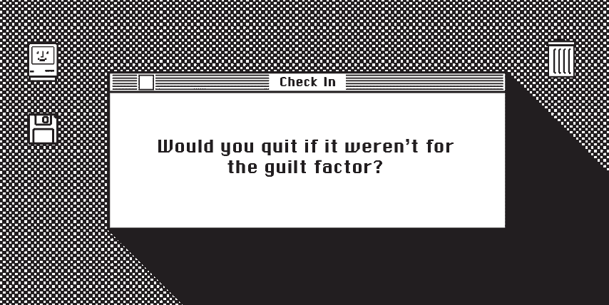
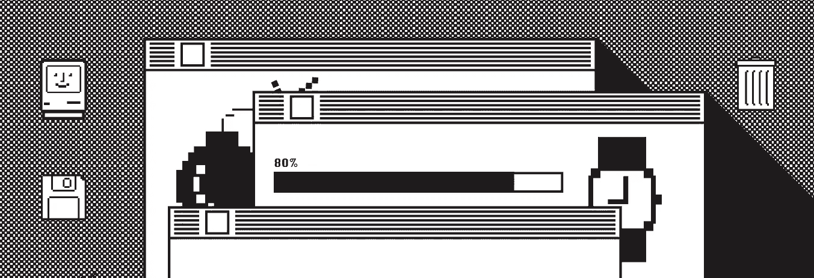
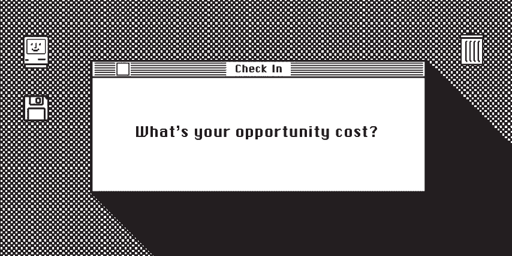

# 叫停

> 原文：<https://medium.com/swlh/three-founders-on-calling-it-quits-362169d7285a>

## 三位创始人分享了他们决定关闭公司的原因

在过去的一个月左右的时间里，两家客户公司决定停止他们年轻企业的工作。他们*决定*在积极解决这些公司正在关注的问题的同时进行这项工作。

这似乎没什么大不了的。但我已经开了几家公司。[有些仍然愉快地运行着](http://weareinhouse.com)。其他的因为各种各样的原因已经正式关闭。但是也有一些介于两者之间的。僵尸。一个想法变成了一个项目，注册成了一个公司，然后失去了动力，所以它躺在那里，休眠，直到它变得不那么困难。

这两家公司的关闭是可悲的，就像任何结局都是可悲的一样。但事实是，他们已经做到了，而直视它的脸，承认这是没有实际意义和情感成熟的工作…嗯，这让我充满钦佩。

[支持](http://bolsteredllc.com)是人力资源部礼宾部的理念，也是第一家关店的公司。联合创始人尼基给我发了条信息。我们一起努力[定义品牌声音、外观和感觉](https://www.weareinhouse.com/portfolio/branding/bolstered-branding-and-identity)——所以她想让我知道他们的决定。这是不同寻常的坦率和个人。

不久之后，奥斯汀文化出版公司[利益冲突(Conflict)](http://conflictofinteresttx.com/) ，另一个我们[命名为](https://www.instagram.com/p/Bn9Lqgchzf6/?taken-by=weareinhouse)的项目，发出了参加他们印刷杂志第三期*和最后一期*发布活动的邀请。

这两次关闭让我想到了我们(是的，皇家我们)与辞职之间的复杂关系。或者就像我妹妹说的那样:“这只是灌输给你的，放弃会让你成为一个放弃者，一个放弃者。”

我们有一些关于放弃的荒谬的道德主义比喻。开办一家公司或一个项目有无数的理由。但似乎只有两个有效的理由让你停下来:你已经成功了，或者你不由自主地被迫停下来。要么越过终点线，要么游戏结束。

Sign up for the [IH Design Edit](http://weareinhouse.com) for a monthly roundup of what’s good in design etc.

对于企业家来说，有一个不言而喻的“准则”:在最终结果敲定之前主动停止很少被视为成熟的标志。这几乎被认为是道德上的失败。即使当继续尝试阻碍了更好的机会，或者当你在明显的事情不奏效的情况下消耗资源。

我带着满脑子的问题回到这两家公司的创始人那里，令我惊讶的是，他们都同意在结束运营时谈谈自己的经历。受支持的创始人尼基·梅奥-金接受了以下采访，随后是利益冲突创始人[陶·沃唐](http://twitter.com/votang)和[丽贝卡·马里诺](https://twitter.com/rebeccamarino)的联合采访。

# 鼓励在截止日期前做出决定

当评估一个当前项目是否仍然值得时，时间和金钱不是唯一要考虑的资源。当一个酝酿已久的潜在客户拒绝他们时，尼基·米欧·金觉得自己再也没有斗志了。因此，联合创始人没有等待自我强加的 2018 年底重新评估，而是召集会议，发现他们都准备放手。

## **你为什么决定不再从事支撑的工作？**

Nikki Meo-King: 经过一年多的努力，我们并没有取得我们想要的进展。除此之外。我发现自己完成任务是为了不让我的伴侣失望，而不是真的想在这方面努力。我知道我对这个想法的动力已经减弱，我对这个项目没有足够的热情来消耗我所有的时间。

## 你是如何决定关闭它的？做出那个决定的因素是什么？

**NMK:** 当我们被一家已经推介了一段时间的公司拒绝后，这给了我们思考前进的时间。我们只是在美国没有另一轮的网络/拓展。向前推进的想法很累。

## **这是你最后一次讨论或考虑支持成交吗？如果不是，那时候和现在有什么不同？**

**NMK:** 在我们正式决定结束它的几个月前，我们把 2018 年底定为真正取得一些进展的最后期限。随着秋天越来越近，我意识到我不想继续工作了。对我来说，向我的伴侣坦白我的感受是很重要的。幸运的是，她也在想同样的事情，所以这让我们的决定更容易。

## 结束这个项目有什么困难？什么是容易的？有什么意想不到的？

NMK:一旦我们做出了决定，事情就变得简单了——甚至是一种解脱！我开始期待有更多一点的空闲时间，现在对我的下一次创业有一些想法是令人兴奋的。我还惊讶地发现，我非但没有对失败感到沮丧，反而觉得自己学到了很多东西，并对下次如何做得不同有了一些想法。拥有第一次失败的冒险几乎是一种通行的权利。

> 令我惊讶的是，我非但没有对失败感到沮丧，反而觉得自己学到了很多东西，并对下次如何做得不同有了一些想法。拥有第一次失败的冒险经历几乎是一种成人礼。

## 对两位创始人来说，支撑并不是全职工作。从情感的角度来看，你觉得这影响了关闭的决定吗？从实用的角度来看呢？如果有，如何实现？

**NMK:** 是的，我想是的。我知道，如果我停止工作，那么我仍然会有一份薪水，也不需要考虑任何其他家庭财务问题。也就是说，下次我创办公司时，我可能会全职做这件事，因为要做好两件事实在太难了。

# 关于机会成本*是一个移动目标的利益冲突。

利益冲突联合创始人 Thao Votang 和 Rebecca Marino 分享了利益、环境和利益的变化是如何影响这个项目工作的“机会成本”的，以及他们是如何决定逐步结束这个项目的。

**机会成本是“当选择一个替代方案时，从其他替代方案中潜在收益的损失。”*

## **你为什么关闭利益冲突？**

我一直试图用一种能帮助我从各方面写作的方式来组织我的生活。《利益冲突》(Conflict)开始的时候，我想在奥斯汀认识更多的作家，在书评方面一试身手。冲突真的为我打开了一个支持我的作家社区，现在我真正想做的就是阅读和写作！我们在冲突问题上工作了三年，我认为这是相当长的时间。第三年是真正思考一个项目的未来的时候，对我来说，我看不到一个不占用我写作项目时间的未来。

**丽贝卡·马里诺**:是的，实际上我们已经为此投入了三年多的时间，这实际上只是个人时间限制的问题。我们快没力气了，半途而废不是我们的风格。这是一种非常艰难的感觉，既因为在某件事情上投入了太多时间而疲惫不堪，又因为不能投入更多时间而感到内疚。与我们开始冲突时相比，陶和我的日常工作都有所不同，我也是一名视觉艺术家，她也是一名小说作家，这刚刚开始打破工作和生活质量的平衡。我也不知道我是否会说“关闭”本身。该网站将继续运行，我真的希望人们仍然把它作为一个有用的资源和档案。

## 你是如何决定关闭它的？做出那个决定的因素是什么？

**电视:**时间与内疚。在最近一两年(我的意思是，看看[我们的推特账号](https://twitter.com/coi_tx)！)，我真的没有致力于为在线出版物制作必要的内容。由于诸多因素，我无法坐上社交媒体调度岗位。它似乎与这个世界及其所有的沉闷脱节，同时又太过紧密。我们还实现了对我们个人来说很重要的目标，比如召集我们的顾问委员会成员。能够培养友谊真的很好，这将(希望)在社区中产生一些有趣的合作和交叉授粉。

**RM:** 时间和内疚是肯定的。基本上承认之前彼此提到的所有事情，并就这些事情达成一致。

> “我不想下半辈子都和学生贷款打交道，所以我更希望我写的任何东西都能得到报酬。所以，是的，有很多要考虑的。”—电视

## 结束这个项目有什么困难？什么是容易的？有什么意想不到的？

电视:难:用一种不是火与硫磺的方式告诉人们。对于艺术界来说，奥斯汀的事情似乎特别艰难，所以每一次关闭都像是一次打击。我们不想增加不安，所以我们决定不做新闻发布或任何形式的硬宣布。简单:不要担心你在冲突中不能但可以做什么。能够花一个晚上或两三个晚上只是阅读，而不担心最后期限、图像或校对。意想不到的:我已经有了开始新项目的想法，这些项目对我的小说没有作用，这显示了我的大脑是如何工作的。但我真的需要坐下来写那本小说。

**RM:** 我同意，最困难的肯定是告诉人们并解释原因，但没关系，我们很好，一切都很好，最容易的部分是工作量的显著减少。我不认为我这边有什么意外。这一切都是苦乐参半。

> “不再继续下去的决定对我来说主要是一个现实的决定——这是关于知道什么时候停下来继续前进。”— RM

## 在事情结束之前，还有一些事情要做。你处理剩余任务和事件的方式有什么变化吗？感觉不一样吗？

**电视:**清单很小，感觉真的很棒。我对这件事已经有了很多结论，这要归功于我和丽贝卡的坦诚交谈，以及我们顾问委员会的全力支持。他们真是了不起的人。

**RM:** 是的，这并不过分，我们对最后几件事的态度并没有什么不同，只是在接近的同时也看到了隧道尽头的亮光。我想这种感觉很好，就像你要完成一件事，结束一个美好的篇章。我想我们都对我们所取得的成就感到非常满意。我们有 3 本漂亮的大书和一个社区，我们觉得他们非常支持我们——我们别无所求。

> “感觉自己即将完成一件事情，结束一个美好的篇章，这种感觉真好。我想我们都对我们所取得的成就感到非常满意。”-RM

**利益冲突对你们俩来说都不是全职的。从情感的角度来看，你觉得这影响了关闭的决定吗？从实用的角度来看呢？如果有，如何实现？**

**电视:**两个都是，因为我不会从一个而不是另一个来看待我生活中的任何事情。我开始有负罪感，因为我没有 150%投入到这个项目中，因为我的日常工作变得更加情绪化和体力化。我也很想写作，我想享受生活(毕竟我们只有一次机会)。我花了一年的前四个月写了 40K 字，我真的没有产生太多的冲突(对不起，丽贝卡！).我开始每周打两次网球，在某个时候，我做了这个电子表格来分配我所有的时间。那以一种真实/奇怪的方式勾勒出了我的生活。我睡得很多，也许如果我不总是睡觉，我就能做所有的事情。但是那不是很健康，如果我一直生病，那会减少我的写作时间。我也三十多岁了，我强迫自己真正审视自己的助学贷款和财务状况。我不想下半辈子都和学生贷款打交道，所以我更喜欢我写的任何东西都能得到报酬。所以，是的，有很多要考虑的。

哈哈，好吧，也许不是一个全职的承诺，但肯定是一个全职的承诺。即使像我们这样的小刊物也花费了大量的时间和精力，所以我一直觉得在 CoI 上有相当强烈的情感投入。持续不断地把你的作品发布到世界上，并试图培养一个人们会关心的平台(你只能希望)，这是一件非常脆弱的事情。不再继续的决定对我来说主要是一个实际的决定——这是关于知道什么时候停下来继续前进。

*嘶…喜欢你读的吗？注册* [*我们的时事通讯*](http://bit.ly/YayLetsBeFriends) *，获得每月发送的设计和创意好东西的明细！❤*

## 这篇文章发表在 [The Startup](https://medium.com/swlh) 上，这是 Medium 最大的创业刊物，有+ 381，862 人关注。

## 在这里订阅接收[我们的头条新闻](http://growthsupply.com/the-startup-newsletter/)。

