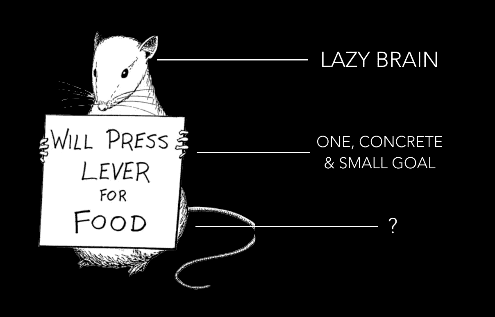

# 建立持久习惯的三大支柱

> 原文：<https://medium.com/swlh/three-pillars-to-build-a-habit-that-lasts-86897bec767d>

## 想一想:你如何吃掉一头大象？


[Image Source](https://www.maxpixel.net/Courage-Wildlife-Animal-Mammal-Nature-Elephant-3144920)

> “一次一口。”不管大象有多大，追逐梦想都是一样的

所有的人生愿望，无论是创业还是变得健康，都有一个共同的特点:它们不可能一步到位。

如果一个愿望可以通过一个简单的步骤实现，那它就已经实现了。更确切地说，一个愿望仍然是一个愿望，因为它需要个人生活中许多小的、习惯性的改变。如果一个人的日常生活中没有锻炼，他就不会健康。

但是这个远大的抱负毕竟就像一头大象——需要一步一步来实现。基于我的个人经验和心理学理论，我将分享如何建立一个小习惯，持续并有助于实现更大的生活目标。

## 1.制定一个具体的小目标

愿望和目标是有区别的。像“有知识”这样的渴望让我们兴奋，但我们对如何实现它只有模糊的方向感，头脑中缺乏一套实际的行动。

然而，目标是遵循愿望方向的可行行动。当养成一个习惯时，目标是一次做一个具体的小行动。

例如:“只要我在火车上，我就会读书。”，或者“我会每天锻炼 30 分钟。”

定义明确的目标非常有效，原因有几个。它们可能听起来微不足道，但这些小目标所需的适度努力设置了一个较低的心理障碍——因此即使它们被大肆宣传，人们也会愿意去做。只要有意志力，它们是可以立即实现的。一旦你完成了它们，你就知道了——我将在下一节展示为什么这非常重要。

许多人，包括我在内，会因为一时兴起而发誓在短时间内彻底改变他们的生活方式。“从明天开始——我将阅读、锻炼、参加更多的活动，并启动我的梦想项目。”通常，这些话是在一个美妙的夜晚说的，伴随着好的陪伴和几品脱啤酒。不用说，大多数人第二天早上就放弃了目标，除非他们有非凡的毅力。

与此同时，设定一个小而坚定的目标会让更多的人获得成功。

现在你有了明确的目标——如何在短暂的热情中坚持下去？人类遵循简单的软硬兼施原则，因此，**重要的是让自己在途中感觉良好。**

## 2.奖励自己



操作性条件反射的理论表明，实验室老鼠会把脚放在杠杆上，如果这个动作需要食物的话。

按压杠杆很像我们明确的目标，是一个具体而微小的动作。如果是这样的话，什么样的“食物”会让我们继续按下“杠杆”？我们不能每次完成目标后都吃自助午餐。

然而，与老鼠不同的是，人类拥有我们可以随时给予自己的强大礼物:思想。

关键是每当你达到你的小目标时，给自己一点赞美 : *“干得好。这很难，但我做到了“*，只要在心里说一句充满活力的*“是”*就可以了。或者试着想象这些小步骤是如何促成你的人生抱负的。在快乐和实现目标之间建立联系——这会让你保持动力。

这种方法的艺术在于自我强化的滚雪球势头。实现与幸福相关的小目标的经历可以激励一个人追求更大的成功，这反过来需要更大的勇气和承诺。

## 3.原谅你自己


无论目标定义得多好，我们如何激励自己。有时我们会因为自己是人类而错过一次日常生活。

通常，这会导致整个计划的彻底失败。“唉，我已经失败了，那么继续下去还有什么意义呢？”

这听起来像是碎玻璃理论的激励版本:假设一座有 100 扇窗户的新校舍被竖立起来，在最初的 10 年里，这些窗户一直保持完好，直到一名淘气的学生向一扇窗户扔了一块石头。

打破所有的窗户需要多长时间？是 10000 年吗？结果几天之内所有的窗户都被打破了，第一扇被打破了。

碎玻璃理论指出，我们倾向于关注整个画面的“破碎部分”，并将其视为对进一步破坏的认可。

这是将失败的实例视为失败的计划整体的常见反应。但是，嘿，从逻辑上来说，错过一天阅读会如何严重损害成为知识分子的长期目标呢？

如果你想中途放弃或者因为一个失败的目标，试着这样重新定义它——目标是日复一日的。也许昨天你失败了——但这绝对与你今天能否达到目标无关。原谅过去的失败，不要让它们成为阻碍你追求现在目标的幽灵。

说到习惯——我猜如果你错过了一天，你不会完全放弃刷牙吧？同样适用于其他习惯— **错过目标真的没关系。**

我用一段简洁的文字概括了这个故事:

> 我的最终目标是 __________，实现这个目标的日常小而具体的目标可以是 _______________(第 1 点)，我将从(明天)开始。
> 
> 每当我完成我的小目标时，我都要对自己说 _____________________(第二点)。如果我因为偶尔错过目标而感到气馁，我会提醒自己 ____________________(第三点)。

你可以把这个打印出来，然后在空白处填上你自己的单词。毕竟，让目标个人化会让它更有效。

中国哲学家老子说过“千里之行，始于足下”。这话确实很对。希望这三个养成习惯的支柱可以帮助我们更稳步地迈出这些步伐。

找一些小目标的候选人？看看我的个人推荐:

沉思

[](/swlh/the-missing-map-for-beginners-of-meditation-be0be91aaf47) [## 冥想初学者的缺失地图

### 系统练习比教程更重要

medium.com](/swlh/the-missing-map-for-beginners-of-meditation-be0be91aaf47) 

“阅读”有声读物

[](/swlh/how-to-learn-something-new-everyday-on-the-train-f0b9fe13f12c) [## 如何在火车上每天学习新东西

### 说真的，有声读物被低估了

medium.com](/swlh/how-to-learn-something-new-everyday-on-the-train-f0b9fe13f12c) 

```
Hey there! If you like this story - please give me some support by meshing the **[Clap]** button hard! and **[Follow]** me so I can keep writing for you :)I want to try a little experiment on Clapping - **I want YOU**, the reader, to voice out your opinion with your Claps- If you feel this is a good read, give it 1 - 9 claps- If you like stories about **Self Improvement**, clap 10 times or more! The more you clap, I will write more stories like this :D- If you think this story is worth sharing to your friends, go stright up to 50 claps! and of course please share it**Comment** or leave a **private note** if you have anything want to tell me - I will try my best to address any of your concerns!
```

[](https://medium.com/swlh)

## 这个故事发表在[的创业](https://medium.com/swlh)上，这是 Medium 最大的创业刊物，有 317，238+人关注。

## 订阅接收[我们的头条新闻](http://growthsupply.com/the-startup-newsletter/)。

[](https://medium.com/swlh)