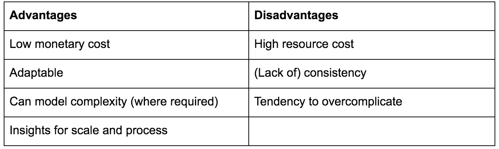
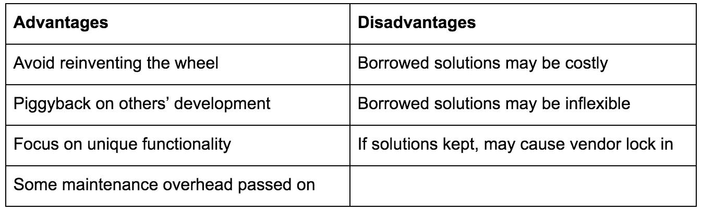
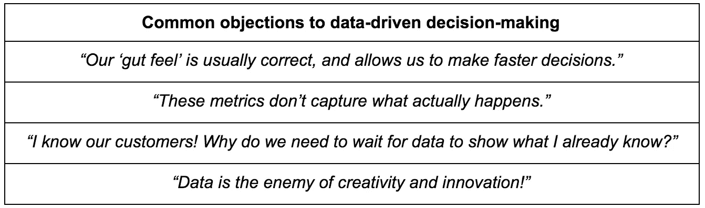
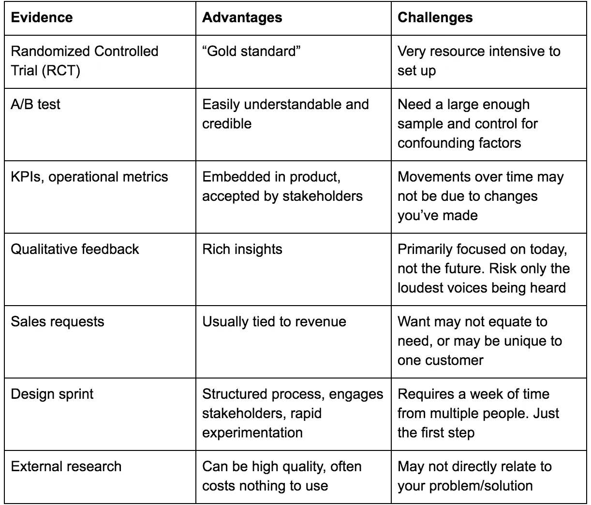

# 以人为中心的创业公司的三个产品开发经验

> 原文：<https://medium.com/swlh/three-product-development-lessons-from-a-human-centered-startup-3b9cadfe92e9>

Photo by [Priscilla Du Preez](https://unsplash.com/@priscilladupreez?utm_source=medium&utm_medium=referral) on [Unsplash](https://unsplash.com?utm_source=medium&utm_medium=referral)

开发一个既不是应用也不是 SAAS 的产品是很困难的。大多数关于产品开发的建议，即使可以广泛应用，也是从假设你正在构建一个软件产品开始的。通过采用这些工具和技术，我开始意识到将直接用户交互作为我们产品核心部分的优势。在这篇文章中，我将分享我从在 [Pack Health](https://packhealth.com/) 管理一个以技术为基础、以人为中心的产品的经历中学到的三个教训。

# *把 MVP 当成工具箱，而不是工具*

大多数产品经理会说，尽早从用户那里获得反馈是一件好事，获得反馈的最好方法是让用户与真实的产品互动。但是那看起来像什么？一种常见的方法是构建最小可行产品(MVP)。

关于[到底什么是 MVP](https://blog.leanstack.com/minimum-viable-product-mvp-7e280b0b9418)，或者它是否是使用的正确术语[，有很多争论。我更愿意把 MVP 看作一个工具箱，而不是一个工具。为了实际实现一个 MVP，你需要考虑什么类型的 MVP 最适合你的情况。在 Pack Health，我们通常使用几种我们认为最适合我们的 MVP。](/the-happy-startup-school/beyond-mvp-10-steps-to-make-your-product-minimum-loveable-51800164ae0c)

## 礼宾 MVP

我们的首选模式是“礼宾”MVP。在礼宾 MVP 中，您手动执行针对客户问题的建议解决方案的步骤。作为一个健康教练平台，我们有大量的员工每天和我们的用户互动。因此，在他们的工作流程中添加一个设计良好的礼宾 MVP 成本相对较低。

Some advantages and disadvantages of a Concierge MVP

使用门房 MVP 使我们能够测试众多的想法，并迭代出最佳方案。我们使用这一概念来测试与支撑我们计划的行为改变模式、信息传递的频率和内容、庆祝会员进步的方式和时间相关的假设，以及探索全新的服务来增加我们的会员。

除了验证我们的想法，我们还经常从我们的教练那里获得如何大规模解决问题的见解。他们可以告诉我们 MVP 的哪些部分最难交付，与成员的摩擦点在哪里，以及哪些元素是最重复的。这些问题可以突出自动化的潜在候选对象。最后，我们用这种方式测试的一些想法很复杂。人类非常擅长管理这种复杂性，并从中找到捷径。

## 零碎 MVP

我们使用的第二个最常见的 MVP 是“零碎的”MVP。这是您拼凑现有工具来创建您的产品的地方。事实上，这是第一个 MVP 包健康使用，虽然我们当时没有这个词。当我们第一次开始开发我们的教练用来管理他们的成员的平台时，我们的想法是雇佣一些开发人员来从头开始构建软件。我们很快意识到这将非常昂贵。与此同时，我们发现我们需要的核心功能与呼叫中心非常相似:跟踪用户及其问题、共享解决方案的能力，等等。因此，我们转向并在定制版本的 [Salesforce 的服务云](https://www.salesforce.com/products/service-cloud/overview/)上构建我们的平台。

Some advantages and disadvantages of a Piecemeal MVP

在开发新产品或新功能时利用现有的工具应该是显而易见的。为什么要重新发明轮子？我认为这通常可以归结为骄傲:“我们的产品是独一无二的”或者“我们可以做得更好。”嗯，也许吧。但是，为什么不用最少的努力完成大部分工作，然后投入资源解决现有工具的缺点呢？我们不再在产品的每个部分都使用 Salesforce，但它仍然是我们平台的支柱。我们之所以开发出自己的功能，是因为我们遇到了真正的限制，而不仅仅是内部偏好。我们通过一个小型开发团队做到了这一点，因为我们使他们能够专注于一组精选的功能。

我们也试验了其他形式的 MVP，这取决于我们要测试的产品或特性。决定哪种 MVP 最适合你的情况有助于确保你是在建立学习，而不是建立半成品。

# *创造性实验*

其核心是，我们的产品是关于我们的教练和他们的成员之间发展的关系和融洽。我们的教练与每个成员一起工作，每个人都有自己的动机、挑战和环境。这是一个密集的、长达数月的接触过程。因此，我们在相对较少的成员身上投入了大量时间。

这种对个人的关注有可能与数据驱动的决策风气相冲突。在没有大量数据的情况下，应该如何决策？就像选择 MVP 的类型一样，你需要为你所做的决定寻找合适的证据。在 Pack Health 的早期，我们试图对过于多样化和太小的人群进行 A/B 测试，以显示可信的效果。这导致了挫败感，我们不是使用更合适的方法来收集证据，而是经常凭直觉做出决定。

## 重新定义你对数据的定义

应对这一挑战的方法是将我们对数据的定义扩展到每个人都能接受的范围。例如，我曾经对我们销售团队对客户要求的下意识反应感到沮丧。断然拒绝这些要求是没有帮助的。相反，我们围绕以下原则达成了共识:

1)这些请求是数据的早期形式。它们本身并不是充分的验证。
3)我们将致力于验证这些想法(和/或它们的替代方案)。

事实上，这些请求是我们的销售团队自己的实验形式，以回答哪些想法吸引了我们的客户的问题。通过将它们重新定义为实验假设，我们已经能够避免全面的特性开发，而支持 MVP。这是一个双赢的局面:销售人员可以更快地为我们的客户提供一些东西，同时我们也避免了将资源投入到一个客户可能独有的请求中。

Assorted examples of evidence

我们发现[设计冲刺](http://www.gv.com/sprint/)对发展这种共识特别有帮助。每个人都有适合自己的东西。对于善于分析的人来说，有一个清晰的结构和过程。对于有创造力的人来说，有“疯狂 8”练习和故事板。参与设计冲刺帮助我们提升了其他学习驱动方法的价值，比如 A/B 测试。

最重要的是，我了解到确认不需要统计上的保证。你需要足够的证据才能对一个决定感到满意。

# *你是一家数据公司*

数据对于现代公司的成功至关重要。它是软件产品固有的，不管用不用。但是像我们这样的健康指导服务和数据收集之间的联系并不那么明确。尽管如此，数据很快在三个方面成为我们商业模式的核心:影响、创新和收入。

我们发现数据的第一个用途是需要显示我们计划的影响。随着[基于价值的支付](https://www.cms.gov/Medicare/Quality-Initiatives-Patient-Assessment-Instruments/Value-Based-Programs/Value-Based-Programs.html)的兴起，清晰的成果展示可以成为一种独特的竞争优势。证明这些结果需要数据。

我们的许多竞争对手都有他们成果的证据。大多数人在学术期刊上发表了证明这些结果的研究(就像我们一样)。然而，早些时候我们决定走得更远。我们通过要求会员告诉我们他们的目标、习惯和挑战，并随着时间的推移进行跟踪，将结果数据收集嵌入到参与过程本身。这使我们能够展示我们对特定人群、客户和地理位置的影响。

此外，这些[患者报告的结果](https://amp.medpagetoday.com/publichealthpolicy/clinicaltrials/69846)对我们的教练以及我们的产品和项目团队非常有用。利用这些数据，我们能够找到创新的方法来帮助我们的成员解决他们在个人层面或更广泛层面上面临的障碍。随着时间的推移，我们也可以验证这些方法。随着我们规模的扩大，这些数据正在为我们用人工智能增强平台的首次尝试提供信息。

最后，我们收集的数据已被证明对我们的合作伙伴和客户很有价值。许多医疗保健组织希望更好地了解他们的患者，以便更好地为他们服务。我们的数据集为患者在医生办公室之外面临的挑战提供了新的见解。如果没有我们与会员的关系，这些数据很难收集。

## 不要等待规模

你如何弄清楚数据在你的公司中扮演什么角色？花点时间搞清楚这一点，因为在开始时将数据收集嵌入到您的产品中要比以后这样做容易得多。不要等到你有了“足够的数据”因为数据收集从早期就已经嵌入到我们的产品中，并且因为这些数据与我们公司的使命紧密相关，所以我们的员工有责任确保我们可靠、完整地收集我们的数据。

我们花了很多迭代来找出我们需要跟踪的度量标准，以及我们需要问的问题。用少量的数据做这个迭代过程可以让我们在获得牵引力的同时立即进入状态。你不需要有一个技术产品来收集数据。当我们开始时，我们的教练通过电话向我们的成员提问(需要时仍然会这样做)。事实上，正如我上面提到的，弄清楚如何收集这些耗时、以人为中心的数据已经帮助我们找到了一条盈利的道路。

# *结论*

在这篇文章中，我总结了一些我从将产品开发方法应用于技术支持的、以人为中心的创业公司中学到的经验:

1)为您的业务和您试图解决的问题选择正确的 MVP 类型；
2)用实用主义设计和运行实验；以及
3)尽早制定数据策略。

我给出的具体例子并不意味着是规定性的。它们是你可以利用科技创业世界中的通用原则来适应你自己的商业挑战的方法的例子。这就是这些原则的意义所在。

在将产品开发理念应用到你的项目或企业中，你学到了什么？你采纳了哪些模式，又摒弃了哪些模式？我渴望听到你们的故事，听到你们对我的想法！

## 这篇文章发表在 [The Startup](https://medium.com/swlh) 上，这是 Medium 最大的创业刊物，有 327，829+人关注。

## 在这里订阅接收[我们的头条新闻](http://growthsupply.com/the-startup-newsletter/)。

