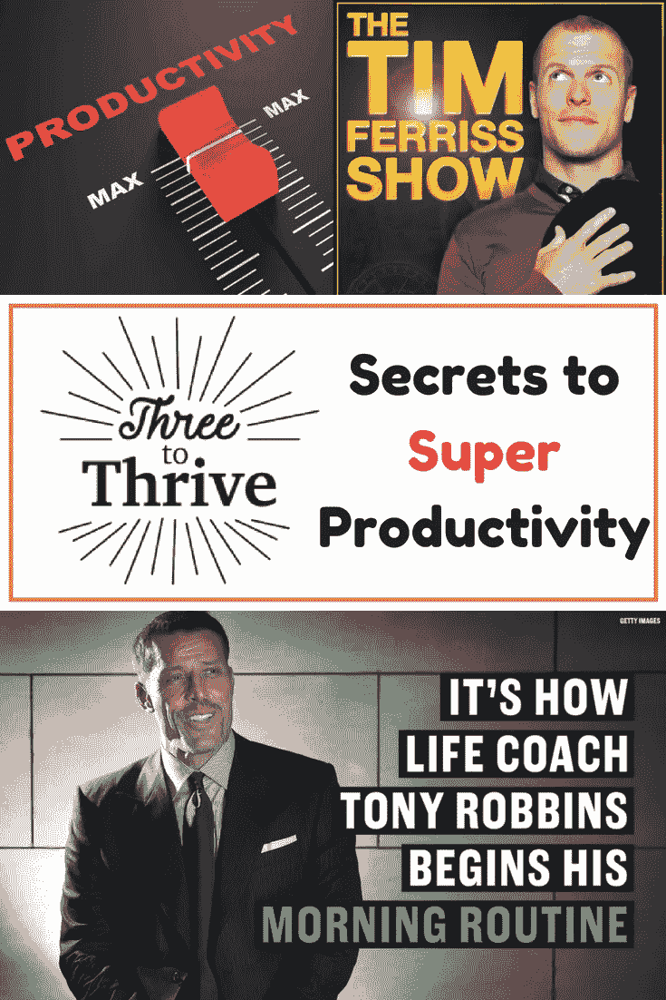

# 托尼·罗宾斯和蒂姆·费里斯的三大成功秘诀

> 原文：<https://medium.com/swlh/three-to-thrive-super-productivity-tips-from-tony-robbins-and-tim-ferriss-3cdd0190f286>

Share This Pin Friendly Image

# 三个茁壮成长——通过您的待办事项列表获得动力！

在不断寻求提高生产力和充分利用我们在这个世界上拥有的宝贵时间的过程中，我向你提出了“[三个兴旺发达](https://thathelpfuldad.com/three-to-thrive-super-productivity-tips-from-tony-robbins-and-tim-ferris/)的概念使用这个简单的工具，你会发现你的工作效率提高了 300%甚至更多。

# 茁壮成长的三个因素——起源

我第一次听说“三个茁壮成长”的概念是在我读蒂姆·费里斯的《 [*【泰坦的工具】*](https://thathelpfuldad.com/product/tim-ferris-tools-of-titans-book-review/) 的书的时候——他和托尼·罗宾斯谈论着[早晨的日常事务](https://thathelpfuldad.com/smart-morning-routine-built-working-men-women/),在讨论过程中，托尼谈到了一种叫做“三个茁壮成长”的东西——他用这种技巧来提高他对每天重要事情的关注。托尼的三大成功清单由“他每天要做的三件事”组成。

正如托尼向蒂姆解释的那样…

> *“重要的是想象你的三个茁壮成长清单，并把它视为已经完成的***。”**

*Tim Ferriss 进一步扩展了“三个兴旺”概念的强大之处…*

**

> *“如果你赢得了早晨，你就赢得了一天。”*

# *如何创建你的三个茁壮成长清单*

*我们不要把事情搞得太复杂了。如果你想使用“三个茁壮成长”技巧，很简单——看看你的待办事项清单，找出 3 个投资回报率高的项目，然后集中精力在今天完成这 3 项任务。每天都这样做，观察你的生产力(和结果！)暴涨。*

## *关于茁壮成长的三个小贴士:*

1.  ***什么是“高 ROI”项目？有很多方法可以回答这个问题。我喜欢问自己，“如果我花时间去做这件事，它会给我带来好的回报吗？”或者，著名的时间管理书籍[《时间陷阱》](https://thathelpfuldad.com/product/book-the-time-trap-review-time-management-tips/)建议你考虑一项任务的相对重要性和紧迫性来决定它的优先级。Tim Ferriss 更进一步，建议你问自己这样一个问题:“如果我做了这个任务，会不会让我待办事项列表上的其他任务变得不重要或不再必要？”***

*白天尽可能快地完成你的三项任务。*

*   *这不是火箭科学——类似于“[吃掉那只青蛙](https://www.amazon.com/Eat-That-Frog-Great-Procrastinating/dp/162656941X/ref=as_sl_pc_tf_til?tag=thathelpfulda-20&linkCode=w00&linkId=8b5969bb48d2c37072768f337002abf5&creativeASIN=162656941X)”的概念。如果你能专注于在一天中尽早完成你的三项任务，你将增加你赢得这一天的几率。*

***随手做清单小抄。***

*   *如果你想看我用来区分任务优先级的时间管理小抄，看看我写的另一篇文章——你可以收集小抄，作为我在博客上给所有读者的超酷赠品之一。*

* [## 使用这个简单得可笑的时间管理备忘单，完成你的任务清单！-那……

### 如果时间管理很简单，我们都会非常有效率，我们也不需要那些我们喜欢列的清单…

thathelpfuldad.com](https://thathelpfuldad.com/use-your-time-wisely/)* 

# *更多关于托尼·罗宾斯的早晨惯例*

*如果你喜欢这三个茁壮成长的概念，并想进一步扩展它，请查看更多关于[托尼·罗宾斯的早晨惯例](https://www.cnbc.com/2017/01/26/tony-robbins-shares-the-10-minute-routine-that-sets-him-up-for-success.html)。*

*托尼的上午仪式包括三个部分——三个茁壮成长的概念是其中之一。*

*他的全部日常工作包括感恩、上帝和三个成长清单。基本上，他会花大约三分钟的时间来思考这些事情。*

*托尼还建议将启动练习作为他早晨例行活动的一部分。这是他网站上讨论的链接:[https://www.tonyrobbins.com/priming-exercise/](https://www.tonyrobbins.com/priming-exercise/)*

# *更多关于蒂姆·费里斯的早晨惯例*

*蒂姆的晨练时间比托尼的稍长。基本要点如下:*

1.  *整理床铺*
2.  *沉思*
3.  *喝能量茶*
4.  *杂志*
5.  *用心吃饭*
6.  *锻炼身体。*

*你可以在这里了解这背后的细节:[蒂姆·费里斯解释他的晨间常规](http://www.businessinsider.com/tim-ferriss-morning-routine-2017-1#he-exercises-for-20-90-minutes-6)。*

*你也可以听听蒂姆的播客第 253 集，他讲述了他的晨间活动和他朋友们的其他活动(包括乔科·威尔科克斯、杰米·福克斯、塞思·戈丁和其他人)。*

# *我的早间作息*

*我根据托尼·罗宾斯(Tony Robbins)和蒂姆·费里斯(Tim Ferriss)的理念创建了一个晨间惯例，它不仅包含了三个茁壮成长的秘诀，还特别专注于帮助像我这样的“工蜂”类型的人能够将晨间惯例融入我们的日常活动，但只需 30 分钟。点击此处阅读:*

* [## “聪明”的早晨惯例——为工作的男人和女人建立的——乐于助人的父亲

### 它快速、灵活，会让你的生活充满活力——这是聪明的早晨惯例！问题是:大多数人…

thathelpfuldad.com](https://thathelpfuldad.com/smart-morning-routine-built-working-men-women/)* 

# *三个茁壮成长——今天就试试吧*

*如果你正在寻找一个简单的工具，它很容易应用到你的日常生活中，并能给你的工作效率带来显著的提高，那么开始将这三个工具融入到你的日常生活中。*

*试试看，如果对你有帮助，请告诉我。*

*如果你有其他想法，请与我们分享，这样我们可以一起学习。*

# *接下来读什么？*

*如果你喜欢这篇文章，这里还有一些我为你策划的…*

* [## 克服生活挑战的 5 个有力工具——好爸爸

### 公开演讲...减肥...结束销售...打曲线球...不胜枚举...我们所有人都面临…

thathelpfuldad.com](https://thathelpfuldad.com/5-power-ful-tools-overcome-lifes-challenges/)  [## 急躁破坏目标达成-如何处理急躁-那个有帮助的爸爸

### 不耐烦、焦虑、恐惧和其他负面情绪是强大的杠杆，常常驱使我们“推动关闭”…

thathelpfuldad.com](https://thathelpfuldad.com/impatience-destroys-goal-achievement/)  [## 花更多时间在你的传统生活目标上的 4 个建议——乐于助人的父亲

### 你如何度过你的时间表明了你的优先事项。今天的课很容易理解，但有时很难理解…

thathelpfuldad.com](https://thathelpfuldad.com/spend-time-legacy-goals/) 

## 本文引用的书籍

 [## 蒂姆·费里斯《泰坦巨人的工具》书评——那个有帮助的爸爸

### 蒂姆·费里斯《泰坦工具》这本书——我说我已经收集了不少于 100+条可行的建议，这可不是开玩笑的

thathelpfuldad.com](https://thathelpfuldad.com/product/tim-ferris-tools-of-titans-book-review/)  [## 图书-时间陷阱回顾-时间管理技巧-那个有用的爸爸

### 时间陷阱——如果你正在寻找提高时间管理技巧和明智使用时间的建议…

thathelpfuldad.com](https://thathelpfuldad.com/product/book-the-time-trap-review-time-management-tips/) 

# 让我们连接

ThatHelpfulDad.com

Join our Facebook Group

*原载于 2018 年 6 月 23 日*[*【thathelpfuldad.com】*](https://thathelpfuldad.com/three-to-thrive-super-productivity-tips-from-tony-robbins-and-tim-ferris/)*。*

## 这篇文章发表在 [The Startup](https://medium.com/swlh) 上，这是 Medium 最大的创业刊物，拥有 338，320 多名读者。

## 在这里订阅接收[我们的头条新闻](http://growthsupply.com/the-startup-newsletter/)。

*