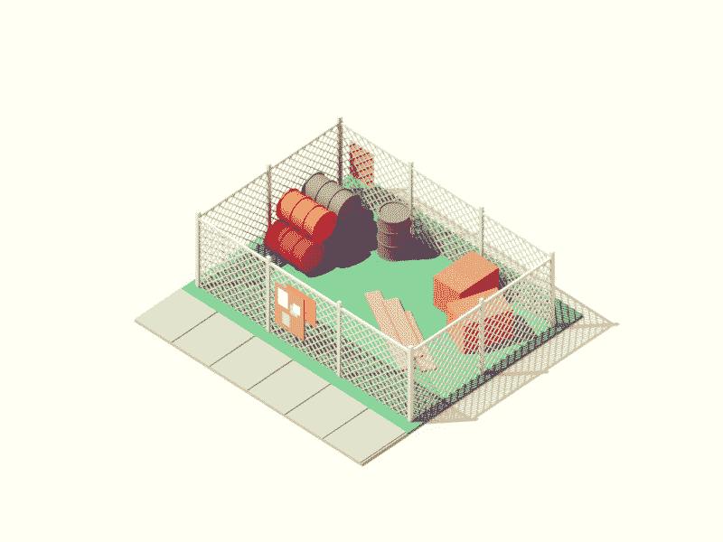
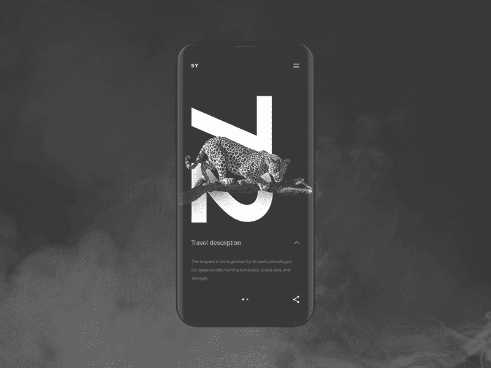

# 什么时候把你的创业想法扔出窗外

> 原文：<https://medium.com/swlh/throw-your-startup-idea-out-of-the-window-if-9600347ec8d8>

Image credit: [Miguel Camacho](https://dribbble.com/shots/3517208-False-Alarm)

每个创业公司的核心都是一个想法。无论是长期承诺的结果还是天意，想法都是让你前进的第一步。

> “一旦一个想法占据了大脑，就几乎不可能根除。一个已经完全形成——完全被理解——并坚持下来的想法；就在那里的某个地方。”
> 
> —盗梦空间

然而，那些没有付诸实施并在你脑海中保持珍贵的想法只不过是空中楼阁。所有的创业战略都强调执行是唯一真正的成功之路，但是你到底是如何执行的呢？我相信没有普遍的指导方针，但是有成千上万的例子告诉我们不要做什么，我们可以从中学习。

也许是因为我们周围有太多的废话，我们已经变得热衷于识别什么是糟糕的，这样做的话，我们经常会错过机会。但是一旦你真的找到了，你会让你的想法面临最严峻的现实考验。所以，让我们来看看创业公司走向错误道路的一些危险信号。

# 目的很模糊

如果你不能用一句话来阐述创业的目的，或者用一条推特来描述你的愿景，你很可能患有“为自己建造”综合症，这种冲动的欲望足以证明投资是合理的。

这不会满足你所需要的人。你可以用你的热情激励他们，但是为了让他们在困难的时候为项目做出贡献，每个参与的人都必须被一个目标所说服。即使是最松散的反建制创业公司也有其存在的理由，值得为之奋斗的东西。

> “制造人们想要的东西”包括制造人们想要为之工作的公司。"
> 
> Gumroad 的创始人 Sahil Lavingia。

所以，如果你认为这是召集一队你喜欢的人去做你能做的事情，你最终会一事无成。这同样适用于钱的部分。现金不能成为目标，原因只有一个:人们不喜欢把钱拿出来。但是他们会心甘情愿地在他们相信的东西上花费过高的金额。让他们相信的唯一方法就是相信你自己。

*Image credit:* [*Dmitry Zelinsky*](https://dribbble.com/shots/2095329-Ocean-animation)

有时候，你做这件事的原因比你做什么和怎么做更有价值。这使得公司能够在旧产品过时时重新推出新产品。目的不需要随着时间的推移而改变，事实上，随着年龄的增长，它获得了更多的价值。

> 如果你不能令人信服地相信你的创业想法的目的，就把它扔出窗外。

# 该产品对任何人都没有帮助

对产品有一个目标有助于让创业公司忠实于它的目标。但是为了维持生存能力，产品必须是有价值的。人们倾向于坚持一时的时尚和泡沫。但是，有助于解决用户问题的东西，成为值得信赖的品牌和文化现象。

这是初创公司早期面临的最被低估的挑战之一。创业公司的老板经常以自己是公众的一部分的假象来为自己的决定辩护，而事实上，他们偏向于自己的产品。

> “产品的作用与产品对我的作用。差别很大。”
> 
> —《精益创业的 UX》一书的作者劳拉·克莱因

这是我们可以从学术界学到很多东西的地方。学者们经常将他们的一生奉献给那些被证明已经过时的理论。当真相被揭露时，许多人相信了这些理论，导致了痛苦的幻灭。

这是你作为一个创业企业家最起码想要的。在大多数情况下，以下步骤有助于避免不相关的陷阱:

*   **测试你的猜测**，探索并发现你试图解决的问题。
*   **研究你的受众**，他们的需求，以及他们前进的方向。
*   在你的产品实现之前，先把它做成枢轴。

*Image credit:* [*Gabrielle*](https://dribbble.com/shots/3203849-Paper-First-for-Shootroom)

> 如果没人对你的创业想法感兴趣，就把它扔出窗外。

# “功能蔓延”是一种功能

自己创业有什么酷的地方？你可以创建它的架构，找到杠杆点，记得保持相关性，添加性感的东西，像飞行员一样驾驶它，而不是乘客。但从商业角度来看，这一切真的健康吗？事实证明，几乎没有。

> “在理想主义者和幻想家当中，不缺乏良好的意图，但往往缺乏纪律”
> 
> –斯科特·贝尔斯基，Behance 的创始人。

试图迎合每一个用户，取悦每一个投资者，遵从任何技术约束都意味着淡化最初的结构。我最近写了一篇关于所谓的[功能蔓延](https://shakuro.com/blog/how-to-control-website-development-process/)的文章，基本上，它意味着给你的初创公司配备越来越多的功能，直到它失去了它的面子，成为一堆具有奇怪关系的功能。

*Image credit:* [*Guillaume Kurkdjian*](https://dribbble.com/shots/3431979-Vacant-lot)

作为一个负责执行科技初创公司的团队，我们在 [Shakuro](https://shakuro.com/) 已经经历了太多次功能蔓延的不利一面。正因为如此，我们重视专注，就像我们重视目标一样。通常，这意味着直接与团队成员、投资者和客户争论，但在实际工作中，这会节省你的时间和精力。

> 如果你让你的创业想法摇摆不定，让它自己获得特性，那就把它扔出窗外。

# 设计是一种附属品

许多创业公司中一个不幸但非常流行的趋势是对 MVP 的错误解释，即所有者希望最大限度地展示项目的技术和商业价值，而忽略情感部分。具有讽刺意味的是，经常被忽视的部分却是最受赞赏和重视的部分——设计。

这是有充分理由的，因为目前对设计的完全误解。如果你在盖房子，你会想在装修之前先把墙和屋顶弄好。这不适用于数字创业公司。用一个没有设计的数字产品吸引人，就像卖掉一栋没有内部装饰的房子。你当然能做到，但这是你希望你的品牌与之相关联的吗？

> "对用户来说，界面就是产品."
> 
> –阿萨·拉斯金，大众健康的联合创始人

我们接近 MVP 更多的是以一种简单的方式展示整个系列的能力，而不是一个方面的完整展示而看不到另一个方面。

没有合适的视觉部分就展示功能是没有意义的:用户不会给你机会抓住他们的注意力，除非你给他们看一些很酷的东西。

与此同时，你可以用漂亮的用户界面和令人愉快的 UX 设计吸引更多的用户，然后让他们想要你的产品，而不是卖你的解决方案给他们看起来不像的问题。

*Image credit:* [*Anton Skvortsov*](https://dribbble.com/shots/3787326-SY-Expedition-travel-animation)

我们鼓励我们的每一个客户致力于设计，而不是作为一个配件，而是项目开发过程中不可或缺的一部分。有些事情只有设计才能解决，但更重要的是，今天的设计是一种语言，你必须说出来，才能与现实相关。

> *如果你不相信设计非常重要，就把你的创业想法扔出窗外。*

# 没有紧迫性

创业通常意味着投入你一生的积蓄。这自然会让你想稳扎稳打，在发射前做好充分准备。然而，科技创业公司容易受到一系列不稳定因素的影响，比如文化炒作、波动、季节性热潮等等。如果你把你的想法藏起来的时间比你应该藏起来的时间长一点，你可能在介入之前就已经输了。

> “如果你对自己产品的第一个版本不感到尴尬，那么你推出的太晚了。”
> 
> –LinkedIn 创始人雷德·霍夫曼

太早呢？也不好。苹果从不早于竞争对手推出其关键产品是有原因的。这就是产品的关键所在。在苹果公司发表声明之前，这几乎是不完整的。但退一步说，离那还有很长的路要走。

最终，产品只有在发布后才开始它的道路。因此，您在提供的性能和发布的完美时间框架之间找到的平衡越好，您收到的反馈就越有价值。这种回应不是抨击产品的问题，而是赞赏它的创新，或者不把它贴上“老一套”的标签，而是利用它的生产。

Image credit: [Brandon Wall](https://dribbble.com/shots/827372-Time-and-Money)

# 你认为项目比产品更畅销

我的一个朋友在 11 年前创办了一家公司，目标简单而明确——把它卖给一个主要的竞争对手。他没有做到这一点，我认为他永远不会。不是他的生意不行，而是因为他的视角发生了剧烈的变化。你可能只是出于有利可图的目的而创业，但过一段时间后，你会和你的创业公司结合在一起，这让你更难告别。

这意味着我的朋友浪费了 X 的时间，把他的努力放在了本不该发生的目标上。他本可以将精力投入到产品开发上。他本可以雇佣更好的员工。具有讽刺意味的是，他本可以更快地吸引这些投资者。

> “人们不购买商品和服务。他们购买关系、故事和魔法。”
> 
> 赛斯·戈丁

*Image credit:* [*Motion Authors*](https://dribbble.com/shots/1844524-Happy-Friday-Let-s-Have-a-BYOB-Log-Party)

投资人不会买你的主意。但是他们会买下你的车间。一家自我可持续的健康企业，其目标不仅仅是获得资金、被收购或被收购，比那些疯狂上市的企业更容易上市。你获得的客户和产品用户越多，你成功进入下一个创业的机会就越大。

> 如果你梦想着在 MVP 出来的那一天推销你的创业公司，把你的创业想法扔出窗外。

# 你还没准备好粉碎你的梦想

创业世界的残酷现实是你永远不知道🤷🏻‍病毒现象的魔力让我们保持警觉。你可以根据经验、研究、假设或纯粹的信念和直觉做出判断，但数码和科技产品行业总是会给你带来冲击。

> “不要担心失败；你只需要对一次。”
> 
> Dropbox 的联合创始人德鲁·休斯顿

经受打击、恢复元气并在适当的时候东山再起的能力，是经验丰富的企业家的标志。如果你得到的结果令人沮丧，不要急于自责。这并不一定意味着产品不好。很多时候，它只是需要更多的宣传，更好的营销，或者更多有才华的人来销售它。

*Image credit:* [*Weltenwaldner Design*](https://dribbble.com/shots/3330030-Bike-crash)

> 如果你不打算有 B 计划、C 计划或 d 计划，就把你的创业想法扔出窗外

没有成功创业的秘诀，否则，我们都会蒸蒸日上。然而，这是一条充满起伏的危险道路，没有任何成功的保证。与此同时，几乎每个人都梦想着自己的事业。这种对终极自由的追求是科技如此激动人心的原因。越多的人成功地用他们的想法启发了这个世界，我们就能为我们的孩子希望一个更好的地方。

让我们提防错误的想法，把时间花在真正重要的事情上。

## 这个故事发表在 [The Startup](https://medium.com/swlh) 上，这里有 263，100 多人聚集在一起阅读 Medium 关于创业的主要故事。

## 订阅接收[我们的头条](http://growthsupply.com/the-startup-newsletter/)。

