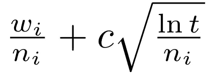
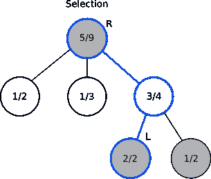
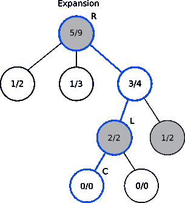
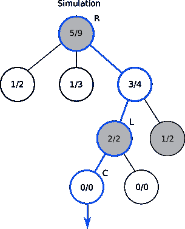
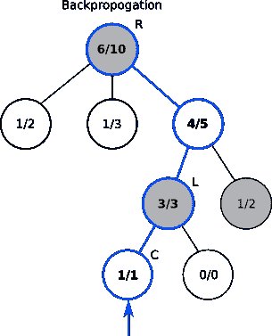
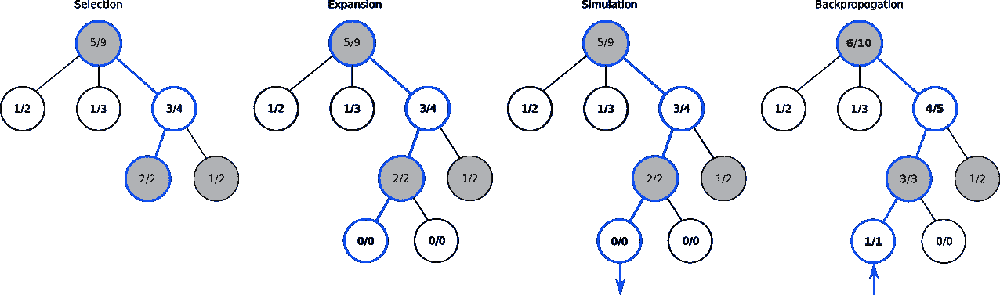

# 蒙特卡洛的井字游戏

> 原文：<https://medium.com/swlh/tic-tac-toe-at-the-monte-carlo-a5e0394c7bc2>

## 创建一个使用蒙特卡罗树搜索算法的井字游戏人工智能。


Picture from Alex Knight

井字游戏，像其他回合制游戏一样，信息不被隐藏，游戏机制不依赖于运气，是一个完美的信息游戏。这种类型的游戏允许每个玩家预测某人行动的所有可能结果。由于该游戏是完全确定的，因此可以用该游戏的所有可能结果来构建一棵树，该树的每个节点被赋予一个值，该值确定每个玩家的胜率或损失率。

然后，人工智能可以遍历这棵树，选择它认为最有可能导致胜利的节点。如果人工智能选择节点的策略是挑选丢失可能性最小的节点，那么它将利用极大极小策略。虽然在理论上这听起来像一个可行的游戏计划，但在实践中，渲染一个完整的游戏树，然后遍历它的时间可能是不现实的，特别是对于像围棋这样有大量可能的移动(高分支因子)的游戏。这就是蒙特卡罗树搜索算法的用武之地。

蒙特卡罗树搜索(MCTS)是一种启发式搜索算法，用于大量的游戏人工智能。其中最引人注目的是围棋人工智能，阿尔法围棋。MCTS 在具有高分支因子的游戏中大放异彩，因为与需要完整博弈树的极大极小不同，MCTS 可以被配置为在期望的时间量后停止，并可以基于部分构建的博弈树选择足够最优的解决方案。虽然纯粹的蒙特卡罗过程会运行大量随机模拟的游戏状态，但 MCTS 保留每个节点的统计数据，然后将置信上限(UCB)算法应用于节点的统计数据。

UCB 函数确定每个节点胜率的置信区间，并返回置信区间中的最高值。该函数也给予具有更多模拟的节点更窄的置信区间，同时扩大具有更少模拟的节点的置信区间。MCTS 算法选择具有最高 UCB 值的节点来运行其模拟，结果，尽管具有高置信区间上限的节点最初可能被选择多次，但是具有较少模拟的其他节点将具有越来越宽的置信区间。随着置信区间的增长，它们的上界可能会高于最初有希望的节点的上界。通俗地说，随着我们测试一个节点的次数越来越多，我们对其支出的信心就变得越来越确定。我们对它的收益变得更加确定，并且可以缩小我们对它的置信区间。我们对较少模拟的节点变得不太有信心，并扩大它们的置信区间以反映我们的不确定性。

UCB 公式通过确保没有潜在节点会缺乏模拟播放，但同时确保有利的分支比它们的对应分支播放得更频繁，来平衡探索/利用问题。我们将使用的 UCB 公式如下所示。



*   **w** 代表第 I 步后该节点的模拟获胜次数。
*   **n** 代表在第 I 次移动后该节点已经发生的模拟次数。
*   **c** 代表勘探参数。我们将使用√2。
*   **t** 代表 I 移动后发生的模拟总数。

**等式的第一部分对应于剥削**。赢的次数越多=赢的比率越高=等式第一部分的数字越大。**等式的第二部分对应于探索**。大量的总仿真和少量的该节点的仿真将导致等式的第二部分的更大数量。UCB 函数的两个部分一起在优先考虑有希望的节点和探索未访问的节点之间建立了平衡。

MCTS 有四个基本阶段:*选择*、*扩展*、*模拟*和*反向传播*。



在**选择**中，我们从根节点 **R** 开始，选择具有最高 UCB 值的连续子节点，直到我们到达没有更多子节点的节点 **L** 。



除非 **L** 节点导致结束游戏的游戏状态，否则我们将进入**扩展**阶段，从该游戏状态创建所有可能的结果，并随机选择 **L** 的子节点 **C** 中的一个。



在下一阶段，**模拟**，我们从节点 **C** 到游戏结束状态(赢、输、平)生成随机播放。



我们使用在**反向传播**期间产生的游戏状态来更新从 **C** 到 **R** 的节点内的信息，以确定新的播出是赢、输还是平。

总的来说，它看起来像:



该算法将循环通过所有 4 个阶段，直到分配的时间已经过去。之后，它将选择具有最高访问量的根的子节点，因为更多的访问等于更多的选择，这仅在它具有最高 UCB 值时发生。然后在游戏的每一回合重复这一过程。

我现在将展示一个用 Javascript 构建的 MCTS 的例子。这只是一个通用的游戏玩法，可以为任何回合制游戏量身定制。特别是在这种情况下，该算法将用于井字游戏人工智能。虽然井字游戏比围棋小得多，分支因素也小得多，但它们使用的是相同的原理。

MCTS 的主要目标是在你当前的状态下找到最好的可能的移动。为了达到这个目标，我们应该创建一个名为 findNextMove 的函数。稍后我将解释下面函数的每一部分。

```
findNextMove(board, playerNo) {
  let opponent = 3 - playerNo;
  let tree = new Tree();
  let rootNode = tree.root;
  rootNode.state.board = new Board(board);
  rootNode.state.playerNo = opponent; let startTime = Date.now();
  while ((Date.now() - startTime) < 1000) {
    let promisingNode = selectPromisingNode(rootNode);

    if (promisingNode.state.board.checkStatus() === IN_PROGRESS) {
      expandNode(promisingNode);
    } let nodeToExplore = promisingNode;
    if (nodeToExplore.childArray.length > 0) {
      nodeToExplore = promisingNode.getRandomChild();
    } let playoutResult = simRanPlayout(nodeToExplore, opponent)
    backpropagation(nodeToExplore, playoutResult);
  } let winnerNode = rootNode.getChildWithMaxScore();
  return winnerNode.state.board;
}
```

让我们首先定义什么是节点、状态和板。棋盘是一个对象，它记录棋盘的大小、已经玩过的棋子以及游戏的位置和价值。节点对象跟踪状态，状态是跟踪棋盘、当前玩家、节点被访问的次数和节点的获胜分数的对象。

我们寻找最优移动所需要的基本信息是棋盘的状态以及轮到谁了，这两个信息都是通过函数的参数提供给函数的。然后，该函数创建它将要遍历的树。该树的根节点将具有电路板的当前状态。

然后，该函数进入 while 循环，运行一段设定的时间。我们允许它运行的时间越长，我们对人工智能的下一步行动就越有信心。你可以在 while 循环中看到 MCTS 的四个阶段。

*   选择阶段= selectPromisingNode()
*   扩展阶段= expandNode()
*   模拟阶段= simRanPlayout()
*   反向传播相位=反向传播()

让我们扩展 selectPromisingNode 函数。

```
selectPromisingNode(rootNode) {
  let node = rootNode;
  while (node.childArray.length !== 0) {
    node = UCB.findBestNodeWithUCB(node);
  }
  return node;
}
```

在这个函数中，我们从根节点开始遍历树，并找到它下面最有希望的叶节点。这通过查看每个子节点的 UCB 值并选择具有最高值的节点来实现。重复该过程，直到一个节点不再有子节点。计算 UCB 值的函数如下。

```
UCB = { findBestNodeWithUCB: (node) => {
    let parentVisitCt = node.state.visitCount;
    let childUCB = [];
    node.childArray.forEach(child => {
      childUCB.push(UCB.ucbValue(parentVisitCt, child.state.winScore, child.state.visitCount));
    } let max = Math.max(...childUCB);
    let idx = childUCB.indexOf(max);
    return node.childArray[idx]; };ucbValue: (totalVisit, nodeWinScore, nodeVisit) => { if (nodeVisit === 0) {
      return Number.MAX_SAFE_INTEGER;
    }
    return (nodeWinScore / nodeVisit) + 1.41 * Math.sqrt ( Math.log (totalVisit) / nodeVisit);
  }}
```

对应于上面的 UCB 公式，我们使用来自其父节点的总访问次数 **t** ，当前节点已经生成的模拟获胜次数 **w** ，以及该节点已经被选择的次数 **n** ，来找到 UCB 值。如果这个节点以前从未被访问过，我们给它取一个最大的整数来增加它被选中的机会。这确保了每个节点至少被模拟一次。findBestNodeWithUCB 函数为每个子节点生成一个 UCB 值，并返回具有最高值的子节点。

一旦我们选择了将要使用的节点，我们就检查游戏板的状态。如果游戏仍在进行，checkStatus 函数返回-1，如果结果是平局，返回 0，或者根据哪个玩家赢了游戏，返回 1 和 2。如果游戏状态是非游戏结束状态，-1，那么我们将进入资料片阶段。我们来看看 expandNode 函数。

```
expandNode(node) { let possibleStates = node.state.getAllPossibleStates(); possibleStates.forEach(state => {
    let newNode = new Node(state);
    newNode.parent = node;
    newNode.state.playNo = node.state.getOpponent();
    node.childArray.push(newNode);
  });}
```

该函数首先从当前节点状态中找到所有可能的结果。然后，它用当前状态的每个可能的移动创建一个节点，并将其推入当前节点的子数组。虽然扩张看起来是一个非常浮夸的术语，但是这个阶段非常简单。它只是用可能的游戏状态填充 childArray，除非选择的节点是具有结束游戏状态的节点。算法中的下一行:

```
let nodeToExplore = promisingNode;
if (nodeToExplore.childArray.length > 0) {
  nodeToExplore = promisingNode.getRandomChild();
}
```

检查当前数组是否有任何可能的子节点，并随机选择一个节点来运行它的模拟游戏。模拟游戏是在 simulateRandomPlayout 函数中完成的。

```
simulateRandomPlayout(node, opponent) { let tempNode = new Node(null, node);
  let tempState = tempNode.state;
  let boardStatus = tempState.board.checkStatus(); if (boardStatus === opponent) {
    tempNode.parent.state.winScore = Number.MIN_SAFE_INTEGER;
    return boardStatus;
  } while(boardStatus === board.IN_PROGRESS) {
    tempState.togglePlayer();
    tempState.randomPlay();
    boardStatus = tempState.board.checkStatus();
  }
  return boardStatus;}
```

这里，该函数首先检查节点的电路板，以查看其状态。如果节点导致对手的胜利，这将意味着如果玩家进行了选定的移动，他的对手将有一个后续的移动，可以导致对手立即胜利。因为玩家选择的移动可能导致一定的损失，所以该函数将父节点的 winScore 降低到尽可能低的整数，以防止将来移动到该节点。否则，该算法在两个玩家之间交替随机移动，直到棋盘导致游戏结束状态。该函数然后返回最终的游戏状态。

MCTS 的最后一步是反向传播。

```
backpropagation(nodeToExplore, playoutResult) {
  let tempNode = nodeToExplore;
  while (tempNode !== undefined) {
    tempNode.state.visitCount++;
    if (tempNode.state.playNo === playoutResult) {
      tempNode.state.addScore(10);
    }
    tempNode = tempNode.parent;
  }
}
```

这里，我们从选择的叶节点的子节点返回到根节点。在这个过程中，我们增加了节点的 visitCount。如果我们从 simulateRandomPlayout 的返回中得到的 Playout 结果等于我们正在模拟的玩家数量，那么我们将增加每个节点的获胜分数。然后，在计算 UCBs 时，这些更新的统计用于选择阶段的下一次迭代。

这些步骤按照我们指定的时间运行，在本例中是 1000 毫秒或 1 秒。一旦时间用完，我们选择具有最多访问计数的根的子节点，因为只有当节点具有最高的 UCB 时它才会被访问，这在理论上意味着移动将导致最高的胜利机会。

我们可以用下面的函数来测试我们的算法，该函数模拟两个人工智能之间的井字游戏:

```
simulateAIPlay() {
  let board = new Board();
  let player = 1;
  let totalMove = 9;
  for (var i = 0; i < totalMove; i++) {
    board = findNextMove(board, player);
    if (board.checkStatus() !== -1) {
      break;
    }
    player = 3 - player;
  }
  let winStatus = board.checkStatus();
  return winStatus;
}
```

由于两个人工智能都在使用这个超级棒的算法，并且都将选择最佳的移动，每场比赛都将产生平局。

你可以在这里查看我的完整代码。

非常感谢这篇[文章](http://www.baeldung.com/java-monte-carlo-tree-search)帮我创建了 MCTS 函数。


## 这篇文章发表在[《创业](https://medium.com/swlh)》上，这是 Medium 最大的创业刊物，有 286，184+人关注。

## 订阅接收[我们的头条新闻](http://growthsupply.com/the-startup-newsletter/)。

