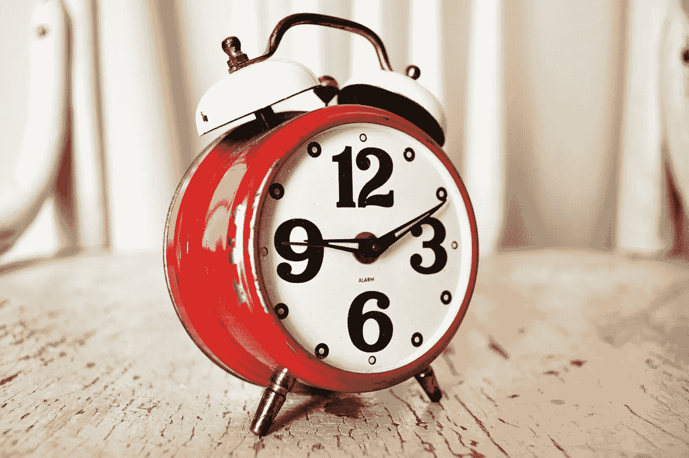

# 时间——急躁者的敌人，被赶者的朋友

> 原文：<https://medium.com/swlh/time-enemy-of-the-impatient-friend-of-the-driven-df3c2d340354>

Make the most of it… (Credit: pixabay.com)

时间是生命中唯一真正有限的资源。

我们不能制造更多，我们无法控制我们剩下的数量，它的供应量有限。如果有疑问，试着多了解一些。

从统计学上你可以算出你有多少，或者你可以接受当你的时间到了，它就到了。不管怎样，我们每个人都可以选择充分利用…