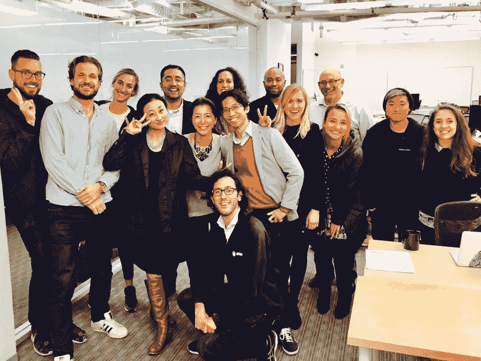

# 我第 501 次冒险的时间到了…

> 原文：<https://medium.com/swlh/time-for-my-501st-adventure-4f7c763cab45>

在经历了 500 家初创公司的不可思议的旅程后，我现在正准备开始下一次冒险。

在作为创始人花时间运营和建立公司后，我进入了 500 Startups，并非常兴奋地开始利用我的天使投资/咨询经验来“走向专业”我以 EIR 的身份加入，并有幸在马文·廖的奇妙团队(科幻加速器)中工作，从世界各地挑选并指导杰出的创始人。我特别喜欢专注于帮助他们筹集资金、领导、战略、营销和招聘。在世界各地演讲，会见有远见的创始人，然后能够在将他们的愿景变为现实的过程中发挥小小的作用，这真是太棒了。

在加速器工作了一段时间后，我成为了一名合伙人，领导我们在主要基金中的筹资和投资者关系工作，同时继续寻找创业公司并支持我们的投资组合公司。我带领我们努力筹集第四笔资金，我为我们的团队(Jon、Jonathan、Julia、Alfredo)感到非常自豪，他们即使在 2017 年夏天非常艰难的时期，也保持专注并完成了任务。

我感到非常幸运，能够在世界各地旅行，与创始人、有限合伙人、企业、政府和其他对通过技术、早期投资和企业家心态建设美好未来感到兴奋的人联系。有了这次经历后，我仍然乐观地认为我们正在走向更美好的未来。

我非常感谢 500 的执行管理团队给我机会投资和支持世界各地这么多不可思议的创始人，并与我们美好的全球 LP 基础建立和维护关系。

我将永远是 500 强和 500 家人。

至于下一步，我打算休息一段时间，然后开始想办法。我知道的一件事是，今后，我将继续投身于我热爱的技术、创业和投资生态系统。我期待支持和帮助充满激情、有远见、坚韧不拔、高情商和高智商的创业者。

## 这个故事发表在 [The Startup](https://medium.com/swlh) 上，这是 Medium 最大的创业刊物，有 290，182+人关注。

## 订阅接收[我们的头条新闻](http://growthsupply.com/the-startup-newsletter/)。

