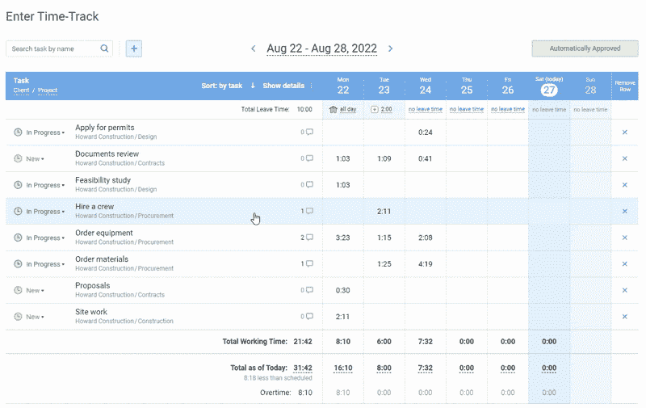

# 提高工作效率的最佳时间管理应用

> 原文：<https://medium.com/swlh/time-management-apps-for-boosting-efficiency-at-work-58cd1086a536>

我们每个人都在努力提高工作效率，因此，我们要学会如何更有效地管理时间。然而，在没有特殊工具的情况下，停止浪费时间并开始有效利用时间通常是非常具有挑战性的。

在这里，我们已经描述了一些当今市场上最好的时间管理应用程序。它们会帮助你提高注意力，在日常活动上花费更少，并洞察你的整体效率。

# 付费时间管理应用

## 1.时间追踪器: [actiTIME](https://www.actitime.com/)

*Online timesheet interface in* [*actiTIME*](https://www.actitime.com/) *where every user can select task parameters
they want to see in their timesheets*

当致力于时间管理技巧和习惯时，关键的一点是知道你的时间去了哪里。像 actiTIME 这样的时间跟踪和时间管理应用程序在这里可以有所帮助:有了它，很容易收集时间支出的信息，然后汇总数据。详细的报告和彩色图表提供了你如何度过时间的概览。

## 好处:

*   在内部和云中均可用
*   关于如何使用工作时间的确切数据
*   强大的报告模块，为普通用户、经理和企业所有者提供有价值的见解

## 平台:

*   基于云:通过网络浏览器从任何平台访问
*   内部部署:Windows、Unix
*   移动应用程序:iOS、Android

## 2.聚焦助推器:[聚焦@意志](https://www.focusatwill.com/)

这款应用利用神经科学来提高注意力。科学证明，特定类型的声音有助于集中注意力和提高工作效率。基于这些知识，开发了 Focus@Will app。它的作者创造了一种基于性格类型选择正确音乐的简短算法，并开发了 50 多个提高注意力的音乐频道。

## 好处:

*   指数生产率增长
*   从任何地方访问
*   无需在您的设备上存储音乐收藏

## 平台:

*   从任何平台访问基于云的应用
*   适用于 macOS、Windows 和 Linux 的原生应用

## 3.周计划:[周计划](https://weekplan.net/)

这个规划应用程序允许为团队创建每周计划，并根据他们的优先级来组织任务。工作负载优先化基于[柯维矩阵](https://www.actitime.com/time-management/time-management-covey-matrix)，这意味着区分重要任务和紧急任务，并确保重要任务不会被推迟一段不确定的时间。在 WeekPlan 中，你可以建立季度目标，并根据这些目标组织你的团队的任务。

WeekPlan 还提供了计划的和执行的工作的每周视图，具有始终可见的高影响任务(HITs ),并帮助您的团队跟踪 okr。

## 好处:

*   清晰直观的周历
*   智能优先排序
*   OKR 跟踪

## 平台:

*   ios
*   机器人
*   Windows 操作系统
*   铬延伸

## 4.优先规划 app:[135 列表](http://www.135list.com/)

规划每天的任务有时很有挑战性，尤其是当所有事情看起来都同样重要的时候。许多人欣赏 T2 1-3-5 技巧来完成有限数量的事情:每天计划一个大任务、三个中等任务和五个小任务有助于避免超负荷。

135List app 就是基于这种技术，简化了日常的优先级排序和计划。在其中，你可以创建并轻松管理你的日常待办事项。它的简单性，结合科学支持的方法，有助于回收生产力和发展重点。

## 好处:

*   简单易用的应用程序
*   鼓励完成工作的清晰结构

## 平台:

从任何平台访问基于云的应用

## 5.私人助理:[花式手](https://www.fancyhands.com/)

Fancy Hands 是一个虚拟助手应用程序，适用于那些需要额外双手的人。它适用于个人和商业目的:有了自动化助手，组织活动、计划商务旅行或准备度假变得更加容易。它可以节省花在组织、研究和购买上的时间和精力，并专注于更重要和/或更愉快的事情。

## 好处:

*   出于商业和个人目的委派选项
*   通过文本、电话、文本、电子邮件或本机应用程序发出的请求
*   重复请求选项

## 平台:

*   从任何平台访问基于云的应用
*   iOS 和 Android 的原生应用

## 6.待办事项:[清除](https://itunes.apple.com/ru/app/clear-todos/id493136154)

创建漂亮清晰的待办事项列表，避免忽略日常生活中的重要事情——这个应用程序是一个很好的工具。即使你有太多的小任务，该应用程序也能帮助你理清工作流程。通过它的多个列表，你可以按照不同的领域来分类你的任务:工作、家庭、购物等等。

通过选择不同的颜色主题来个性化您的列表。在今天的任务视图中检查哪些任务需要尽快完成——这样你就不会错过任何事情。另一个有用的功能是 iCloud sync:有了它，你可以从任何地方访问你的任务列表。

## 好处:

*   好看的待办事项列表
*   颜色代码
*   iCloud 同步

## 平台:

*   ios

## 7.思维导图 app: [MindMeister](https://www.mindmeister.com/)

思维导图是组织想法的有效方法。使用这个工具来创建你的思维导图，与朋友或同事分享，并一起工作。聊天、评论和投票等协作功能有助于在更短的时间内开发出伟大的创意。

该工具还允许您将您的想法可视化并准备演示。MindMeister 有一个内置的演示模块，可以在一秒钟内将你的思维导图转换为丰富多彩的演示。这样，你就可以用一种简单有效的方式向他人传达你的想法。

## 好处:

*   构建想法、工作流程和原始数据
*   与同事、朋友和家人协作
*   视觉和信息演示

## 平台:

从任何平台访问基于云的应用

## 8.数据组织者: [Evernote](https://medium.com/u/cc5554e706bb?source=post_page-----58cd1086a536--------------------------------)

Evernote 是一个不需要介绍的工具。如果你还没有使用它，考虑采用它。它提供了一种简单的方法来收集和组织所有必要的信息，帮助你避免浪费时间回忆你在哪里找到和保存了什么。

## 好处:

*   将所有重要信息保存在一个地方
*   从任何地方访问
*   轻松与他人分享

## 平台:

*   从任何平台访问基于云的应用
*   适用于 Windows、Android 和 iOS 的原生应用

## 9.邮件组织者: [Yesware](https://medium.com/u/629863c6f851?source=post_page-----58cd1086a536--------------------------------)

我们都知道什么是浪费时间的收件箱。垃圾邮件和不断的检查干扰似乎是注意力和生产力最大的敌人。一个有意识的时间管理方法包括优化这部分工作，Yesware 是解决收件箱问题的工具之一。

Yesware 是一个复杂的电子邮件管理应用程序，它可以帮助您安排您的通信，通过使用模板自动化您的电子邮件，并管理后续工作。如果您是 Salesforce 用户，您也会喜欢与它自动同步您的电子邮件、附件和会议。

## 好处:

*   自动化电子邮件通信
*   创建更好的电子邮件
*   提高电子邮件活动的效率

## 平台:

*   Windows 操作系统
*   马科斯

## 10.会议经理:[克拉拉](https://claralabs.com/)

手动计划、安排和组织活动和会议可能会令人沮丧，但自动化有所帮助。Clara app 是一款日程安排工具，专为 HR 和其他工作涉及组织和出席会议的员工设计。它帮助您安排、协调并向所有相关方发送邀请。该应用程序是一种很好的方式，可以停止浪费时间通过电子邮件和电话进行手动协调。

## 好处:

*   轻松调度和协调
*   无障碍自动重新计划
*   高效使用电子邮件和日历数据的能力

## 平台:

从任何平台访问基于云的应用

# 免费时间管理应用

## 1.邮件管理器:[打开我](https://medium.com/u/a67c2a7f094b?source=post_page-----58cd1086a536--------------------------------)

垃圾邮件会让你的收件箱变成一场灾难——因为垃圾邮件太多了。而且，不用说，大部分都是不需要的。当你淹没在时事通讯、订阅和社交媒体通知中时，自动邮件管理器将节省你的时间并帮助你保持冷静。

Unroll.me 是一项收件箱管理服务，它可以自动为您取消订阅垃圾邮件，并将您想要接收的订阅整理到每日摘要中。喝着咖啡，轻松地阅读它们，不要被另一份你不记得订阅过的时事通讯分心。

## 好处:

*   一键退订不想要的邮件列表
*   在一封每日电子邮件中组织有用的订阅
*   订阅的直观分类

## 平台:

Outlook，Gmail，Google Apps，Yahoo！邮件、AOL 邮件、iCloud 电子邮件客户端

## 2.做事 app: [团队涅槃](https://medium.com/u/9587ec4c313e?source=post_page-----58cd1086a536--------------------------------)

Nirvana 是一个任务管理器应用程序，可以帮助捕获、组织、优先处理事情，并完成它们。该应用程序允许创建列表，组织你的待办事项，优先排序，并设置截止日期。涅槃帮助你专注于接下来的行动，安排你的时间，为你需要和想做的每件事找到时间。这个简单优雅的待办事项应用程序可以帮助你在繁忙的环境中恢复平静。

## 好处:

*   清晰有序的列表
*   方便任何类型的活动
*   轻松完成工作的方法

## 平台:

*   从任何平台访问基于云的应用
*   iOS 和 Android 的原生应用

## 3.思维导图: [Mind42](https://mind42.com/)

Mind42 是一个免费的思维导图应用程序，可以帮助组织思想，学习新信息，集思广益，结构化数据等。应用程序中创建的思维导图可以是私人的，也可以是公开的——这取决于用户的偏好。协作功能包括与他人分享思维导图，并一起工作。

## 好处:

*   快速可靠的工具
*   从任何地方在线访问
*   想法、思想和收集的信息的简单可视化结构

## 平台:

从任何平台访问基于云的应用

## 4.习惯追踪器:[日常习惯](https://itunes.apple.com/us/app/loop-habit-tracker/id1375579440?mt=8)

DayDayHabit 是一个最简单的习惯追踪应用程序，它提供了基本的功能来创建你想要养成的习惯列表，设置提醒，并跟踪你的成功。详细的图表和统计图为您提供了一个清晰的概览，让您了解您的习惯是如何改善的，以及您在实现长期目标的道路上处于什么位置。

## 好处:

*   简单的功能和清晰的界面
*   详细的报告和图表
*   提醒和警报

## 平台:

*   ios

## 5.游戏化生产力 app: [森林](https://www.forestapp.cc/)

对于那些努力分散注意力的人来说，游戏化应用是重新获得注意力和集中力的最有效的方式之一。每当你想专注的时候，在 Forest app 里种一棵树，当你保持专注的时候，这棵树就会成长。建立一个每棵树都代表你专注时间的森林，并培养你专注的习惯。这款应用适用于办公室职员、自由职业者、学生和所有需要恢复注意力的人。

## 好处:

*   养成良好时间管理习惯的愉快方法
*   适合所有想要获得关注的人
*   允许与朋友分享您的结果

## 平台:

桌面平台上的 Android、iOS(付费)、Chrome 扩展

## 6.习惯养成 app: [不要断链](https://itunes.apple.com/us/app/dont-break-the-chain!/id313567772)

开始一项新活动很容易，但保持一致通常是一个挑战。而不是找借口不学习，不养成健康的习惯，不学吉他等等。，试着用一个养成习惯的 app，比如《不要断链！该应用程序跟踪你的日常进展，并激励你每天朝着目标采取行动。跨过那些你花时间学习新技能或新习惯的日子——不要打破这个链条！

## 好处:

*   高效激励技术
*   可视化进度跟踪
*   多重链条和目标

## 平台:

*   ios

## 7.智能应用启动器: [Launchy](http://www.launchy.net/)

你是否发现使用开始菜单和文件管理器既乏味又耗时？如果是，尝试使用智能启动器来启动应用程序和文件。Launchy 是一个跨平台的实用程序，可以帮助您快速启动应用程序，打开文件和文件夹，并在计算机上的文件夹层次结构中找到所需的文档。该应用程序索引程序在开始菜单，并帮助您找到并运行它们只需几个按键。

## 好处:

*   一种简单而高效的方式来加快您处理应用程序和文件的速度
*   可以在所有流行的桌面平台上使用

## 平台:

*   Windows 操作系统
*   马科斯
*   Linux 操作系统

## 8.任务管理器和焦点加速器: [30/30](http://3030.binaryhammer.com/)

仅仅有一个任务列表通常不足以完成任务——但是这里有一个任务管理器和一个聚焦加速器应用程序的组合可以帮助你！30/30 应用程序的想法很简单:你花 30 分钟完成一项任务，然后做一些不同的事情，或者只是放松 30 分钟。

时间限制让你的大脑集中注意力，完成任务——这就是这个概念的工作原理。在这个应用程序中，你可以使用默认的 30/30 时间表，或者设置你的自定义时间限制，从 1 分钟到 1 小时——但不要忘记定期休息对你的生产力和注意力的重要性。

## 好处:

*   注意力、专注力和工作效率显著提高
*   自定义工作/暂停间隔和任务列表
*   重新获得工作/生活平衡的有效方法

## 平台:

*   ios

## 9.书签 app: [口袋](https://medium.com/u/c70f51225816?source=post_page-----58cd1086a536--------------------------------)

你消耗大量信息吗？如果是的话，你肯定会喜欢 Pocket——书签应用。当你发现有用或有趣的内容时，就把它保存下来——以后有时间时再读。这样，你将避免分心，节省时间，并发现新的内容。Pocket 可用于移动设备、桌面和浏览器。

好处:

*   将所有有用的内容保存在一个地方
*   节省搜索和阅读的时间
*   结构化收集的信息

## 平台:

Windows 桌面和移动设备、macOS、iOS、Android、黑莓

## 这个故事发表在[的创业](https://medium.com/swlh)上，这是 Medium 最大的创业刊物，有 332，253+人关注。

## 订阅接收[我们的头条新闻](http://growthsupply.com/the-startup-newsletter/)。

