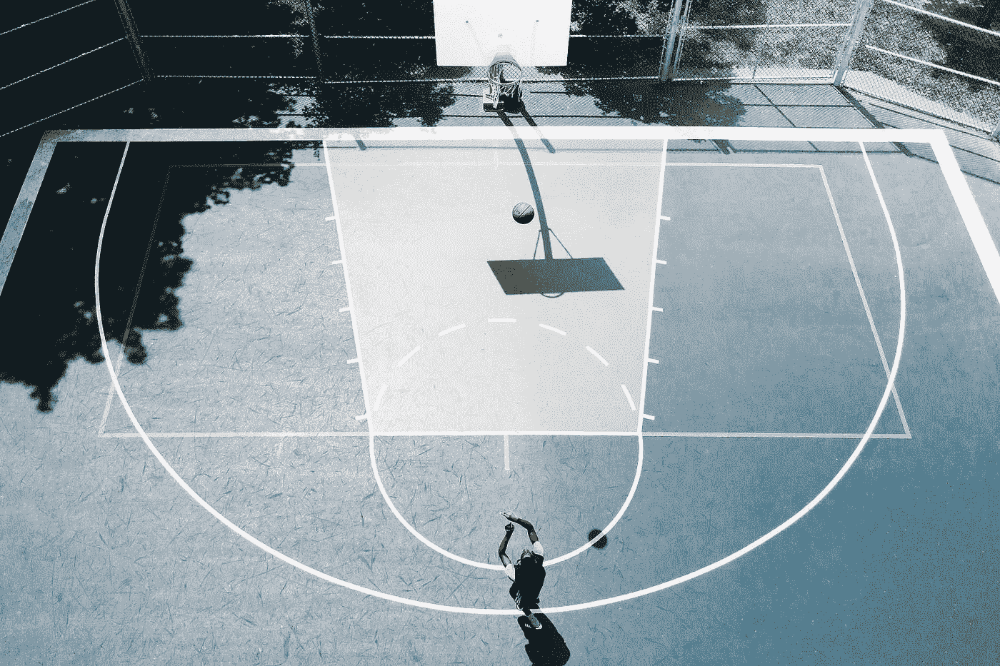

# 是时候加倍你的创业风险了

> 原文：<https://medium.com/swlh/time-to-double-down-your-entrepreneurial-venture-b40f0a53ea61>

“Drone view of person shooting basketball into hoop on a court outdoors” by [Semir Ahmed Douibi](https://unsplash.com/@smnpd?utm_source=medium&utm_medium=referral) on [Unsplash](https://unsplash.com?utm_source=medium&utm_medium=referral)

## 如果你不能全押，最好回家

几天前，我在一家卖二手书的书店里买到了菲尔·杰克逊和休·德莱汉蒂的书《十一枚戒指》。我在一堆准备捐赠的书里找到了它。这本书被压得皱巴巴的，几乎要被撕破了。价格标签很可笑——1.4 美元。

我不是篮球迷。我不能正确地*运球或投篮。回到高中，我讨厌打球，因为我看起来像个娘娘腔。我更喜欢足球，因为它对我来说更容易，而且古怪的人也在踢球。*

但是我通过在 PlayStation 上玩这个游戏理解了它。我有所有的 NBA 2K 比赛，我会在周末与我的兄弟姐妹或同学激烈竞争。这是令人振奋的，按下一个按钮，我可以玩游戏。这就是我被介绍给迈克尔·乔丹、科比·布莱恩特或经典的拉里·伯德的地方。

我的高中和大学都是关于湖人的狂热。所以我有看湖人冠军赛的记忆，和萨克拉门托国王队或者经典的圣安东尼奥马刺队比赛。别让我从昌西·比卢普斯的底特律活塞队经典冠军赛说起。

所以当我拿着这本书时，它勾起了我对过去的回忆。我读了几页，它迷住了我。

菲尔杰克逊是 NBA 名人堂成员之一，他是蔻驰作为教练获得最多总冠军戒指的人。他拥有拥有 11 枚戒指的头衔。我不知道菲尔是作为一名篮球运动员开始的，他为纽约尼克斯队效力，并在那里获得了两枚总冠军戒指。

在这本书的第四章，标题为《探索》,他分享了他篮球生涯中决定性的时刻。1972 年夏天，他和哥哥乔一起骑摩托车穿越西部。这次旅行改变了他的人生方向。

在这次旅行之前，他伤得很重，不得不休息一年。他最终回到了那里，但一切都变了。他恢复了他的敏捷，但他的腿的力量再也没有回来。

随着他的篮球生涯，他的婚姻生活也毫无进展。他当时的搭档玛克辛和他越来越疏远。菲尔和玛克辛已经非正式地分道扬镳了。

菲尔买了一辆宝马 750，在蒙大拿州的大瀑布城遇到了他的哥哥乔。他们出发穿越大分水岭去不列颠哥伦比亚。他们走得很慢，早上要骑六个小时的马，下午要扎营。这个夜晚是留给啤酒和诚实的谈话。

他的哥哥乔在谈话中直言不讳。

“当我看你比赛的时候，”他说，“我感觉你很害怕。看起来你害怕再次受伤，不再像以前那样全身心投入比赛了。”

他继续说道。“两年来，你没有把自己投入到婚姻、事业或其他任何事情中。你太害怕做出诚实的努力。这样，你就失去了你一直拥有的唯一的爱情——篮球。”

“你需要更积极地对待你的生活。”

当菲尔回到纽约时，他把所有的注意力和精力都放在了篮球上。这也让他决定和妻子正式分手。

"在接下来的三个赛季里，我打出了一生中最好的篮球."菲尔说。

这是成为世界级选手的必备条件。我们需要把注意力集中在一件事情上，让其他事情靠边站。我们需要清除那些不符合我们愿景的事情，放弃那些浪费时间的事情。

今年早些时候，我已经通过零项目做到了这一点。我清除了所有积压的工作，重新开始。我重新开始，为我生命中正确的事情让路。

有哪些事情让你无法成为最好的自己？你应该从生活中切断任何有害的关系吗？或者与你的事业不一致的时间承诺？

**对一千件事情说不离对你的一件事情说是更近了一步。**

回头见，我的朋友。

## 这篇文章发表在《T4》杂志《创业》(The Startup)上，这是 Medium 最大的创业刊物，拥有 329，974+读者。

## 在这里订阅接收[我们的头条新闻](http://growthsupply.com/the-startup-newsletter/)。

