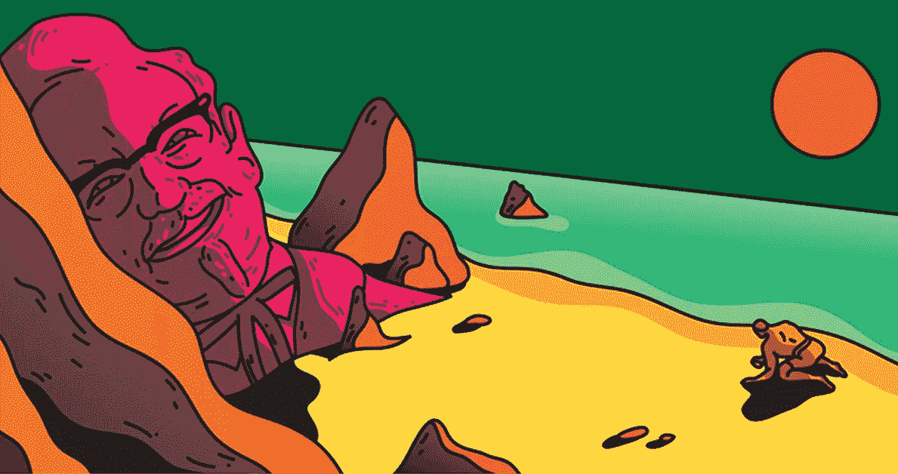
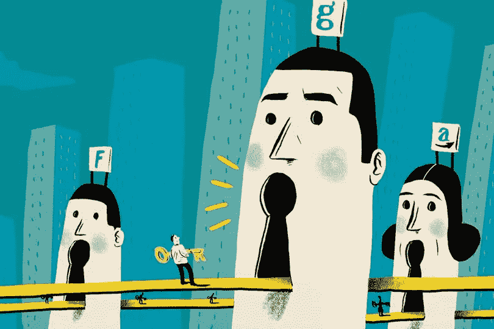
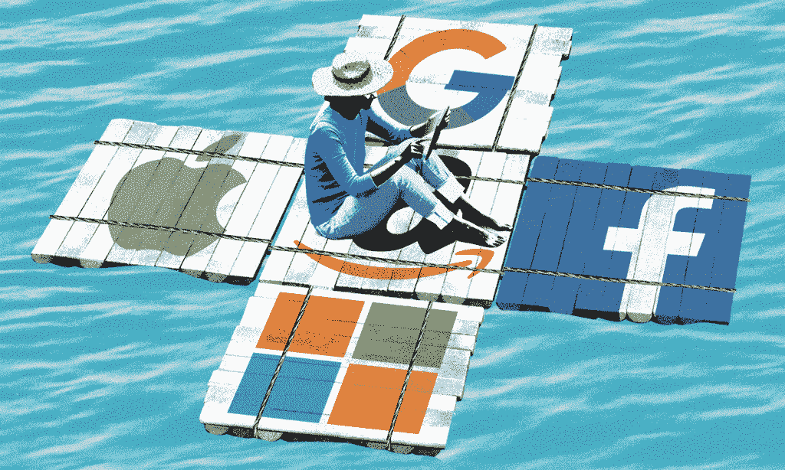

# 是时候停止网络广告了

> 原文：<https://medium.com/swlh/time-to-pull-the-plug-on-web-ads-4e8060f6a469>

Image credit: Scott Balmer

一九九四年十月二十七日。第一个网络横幅广告诞生了。HotWired 又名 Wired 将其放在其主页上，与“十几个肮脏组织”的其他 13 个横幅成员放在一起。但是这个传说把这个 AT & T 的旗帜视为改变互联网工作方式的先驱，也许会把它引向错误的方向，把我们引向 2018 年网络的[浑水](https://shakuro.com/blog/who-runs-the-web-and-why-change-is-life-saving/)。

吸引用户眼球的想法很简单，因为这个目标很容易实现。他们看到它——他们点击它。随着时间的推移，越来越多的广告开始出现，广告盲症开始出现，网页变得过于舒适，不适合横幅广告。这就是互联网的原罪诞生的时候，弹出窗口。谈到一个破碎的 UX，其实一开始并没有多少人关注 UX。

难怪弹出窗口没有很好地转化为点击，导致投资回报率低。除此之外，弹出窗口非常烦人，从 20 世纪 90 年代末开始，大多数浏览器都有阻止弹出窗口的功能。

随着 2000 年互联网的繁荣和前所未有的网民数量，在线广告业发生了变化。随着每个人都上网，营销人员意识到是时候瞄准他们的广告，而不是引诱和等待。突然间，搜索开始变得重要起来。如何到达搜索查询的第一个位置？很明显，你会和制作搜索引擎的人交谈。GoTo.com 是 Idealab 的副产品，也是第一个成功提供付费位置搜索优化的服务。营销人员有机会通过参考用户可能搜索的关键词来竞价排名靠前的搜索结果。

# 棘手的问题

发现广告可以有针对性是现代媒体的根本。一家公司凭借这一简单的发现建立了迄今为止最大的数字帝国。谷歌。这家非常普通的公司以搜索引擎服务起家，但很快意识到简单的搜索并不伟大。正是搜索范围之外的发现渗透了对数字交互中其他东西的永无止境的渴望。

> *最终，不是用户必须发起搜索。这是降临到他们头上的发现。*

当互联网成为知识和需要知识的人之间的桥梁时，谷歌蓬勃发展。通过 AdWords 和搜索广告算法，谷歌已经建立了其收入的主要来源。尽管与搜索引擎的任务驱动型互动并不能保证点击量，但当“谷歌搜索”时，广告成为了旅程中不可或缺的一部分。

搜索广告垄断给了谷歌一种神话般的力量，根据谁知道什么来塑造我们的认知。我希望是钱，但情况可能会更糟。然而，这必须改变。任务驱动的在线状态让位于另一种疯狂。

> *如果没有任务呢？你能不在搜索框里输入任何东西就上网吗？*

常春藤联盟宿舍的连接服务成为世界上最大的社交网络，其影响力增长到(几乎)失控的程度，导致国际政治纠纷，使数十亿人的隐私处于危险之中，并使地球上每个人之间的联系成为可能，这是一种奇怪而天才的方式。脸书。

当谷歌投身于操作系统、智能可穿戴设备、无人驾驶汽车和人工智能的生产时，脸书所做的是，通过将广告直接放入 feed，让人们毫无意义的在线存在变得有意义。

> *现在你不需要谷歌任何东西。广告会根据你自愿提供的信息找到你。*

除非三巨头中的第三股力量加入了咄咄逼人的网络广告社会，否则这幅画是不完整的。亚马逊是一个无情的竞争对手，也是美国乃至全球所有在线零售商的大眼中钉，它将在线广告变成了另一个战场。苹果希望从任何公司产品中的媒体广告产生的销售额中提成。亚马逊对不分享任何收入持肯定态度。这意味着苹果可以屏蔽亚马逊的广告。但是当亚马逊付钱给谷歌在 iOS 版 chrome 上显示广告时会发生什么？

> *一场利益竞争的巨大纠葛，一场为了一个一开始就被广告惹恼的用户而展开的狗仗。*

Image credit: Paul Blow

# 封锁

从 21 世纪初开始，广告拦截软件随着植入广告的网站和应用的密集程度成比例增长。Adblock Plus 是前三大浏览器最受欢迎的扩展[,然而，最终，由于广告商和广告拦截服务运营商之间的协议，一些广告开始通过 Adblock。](https://adguard.com/en/blog/adblocking_history_1/)

苹果对利用苹果平台推广其产品和服务的第三方采取的敌对立场导致了广告拦截的出现。最初由苹果公司在 2015 年推出，作为 iOS 9 更新的一部分，最初的 adblock 利用了 Safari 的自定义内容阻止扩展，但没有向浏览器添加任何第三方广告阻止程序的选项。

iOS 与安卓的碰撞出现了新的转折。苹果公司为自己的隐私策略感到自豪。正如蒂姆·库克在苹果隐私声明中所说:

> 我们的商业模式非常简单:我们销售优秀的产品。我们不会根据您的电子邮件内容或网络浏览习惯来建立个人资料，以便卖给广告商。我们不会将您存储在苹果手机或智能手机中的信息“货币化”。我们也不会通过阅读您的电子邮件或信息来获得营销信息。我们的软件和服务旨在改善我们的设备。简单明了。

苹果直接表达了对谷歌模式的抨击，称本地信息存储和独家硬件是保护自己不受不受不受欢迎的内容影响的手段。当使用安卓系统时，你会受到这些不受欢迎的内容的轰炸。安卓系统将谷歌在网络搜索方面的金矿嵌入了设备的主屏幕。

> *谷歌已经拥有了搜索引擎。问题是在这方面没有人试图挑战谷歌。*

相反，其他主要玩家赌的是垂直搜索和对特定领域的深度关注，而不是“无所不知”的方法。正是因为这个原因，在 T4 最新的谷歌 I/O 中，所有的一切都是关于机器学习和人工智能、自动驾驶汽车和数字助理，而没有任何关于谷歌的东西——搜索和定向广告。

也许由于脸书的争议，现在回到个人数据的叙述还为时过早，所以，为什么不通过人工智能模仿人类对话的方式来打动每个人呢？谷歌迫切希望将其用户进一步纳入其完全控制的生态系统。他们对医疗、交通、伦理和文化教养的显著离题之处可能是谷歌试图占领一个新的利基市场。

谁最终会从这场企业和技术博弈的“激动人心的游戏”中受益？是的。任何一天，只要有可行的想法、良好的执行力和商业远见，你就能找到一家数字初创公司，这一想法很有说服力，并已在多个场合得到证明。然而，独立独立数字初创公司的生存受到媒体巨头之间战争的影响。

> *网络上较小的企业家正在失去投资于他们的产品分销和广告的机会，因为他们所在市场的入口已经被企业巨头们肆意掠夺。*

Image credit: Doug Chayka

广告屏蔽运动的增长在 2016 年达到顶峰，在所有设备上屏蔽广告的用户数量翻了一番。传统广告受到的后续打击是，阻挡广告的大多数用户是大多数广告的目标人群。换句话说，互联网以最简单的形式打出了广告。广告因多次不合时宜而获得了更多的反营销特征。

# 结论

媒体是作家、独立记者和以最质朴的方式表达观点的人的地方——通过写作，享受成为其中的一部分。Medium 的运行是无广告的，这对于一个拥有其他优势的免费平台来说是很罕见的。成千上万的人有机会再一次感受到被足够尊重和被给予真正有价值的经历是什么感觉。

我们中的大多数人甚至愿意为这样的体验付费，而这不一定是你可以为此支付的钱。例如，YouTube 上的广告已经成为优质内容的一种税收。在最后一站，我们会坐着看 5 秒钟的广告，然后看 3 小时的纪录片。

广告的关注度和高质量内容之间的权衡不利于广告。事实上，一个太长/太大声/太烦人/太俗气的广告可能会扼杀你去看它后面是什么的意图。UI/UX 设计师投入了数小时的工作来创造一种不会被广告打断的有机体验。他们试图融入更好的广告的原则，想出一些技巧来制造横幅广告的盲目性，让广告尽可能低调，同时保持在客户的车道上。桌面网站的未来受到网站性能退化的威胁，这些网站对影响可用性的垃圾广告并不介意。

今天的网络广告是大公司之间多层次的拉锯战，小商家争夺一席之地，日常用户不断妥协。我们不能删除广告，因为有资金支持。我们无法通过设计来真正影响他们，现在我们甚至无法阻止所有人。这种情况的讽刺之处在于，没有人会对他们的广告政策的运作方式感到满意。

我们可能已经渴望改变了。像区块链这样的现代去中心化技术能帮助网络广告复苏吗？

## 这个故事发表在[的创业](https://medium.com/swlh)上，这是 Medium 最大的创业刊物，有 338，320 多人关注。

## 订阅接收[我们的头条新闻](http://growthsupply.com/the-startup-newsletter/)。

