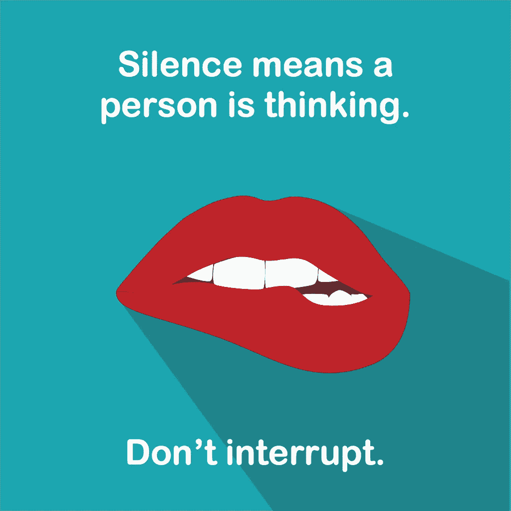

# 成为 UX 球员的永恒建议

> 原文：<https://medium.com/swlh/timeless-advice-for-becoming-a-player-in-the-field-of-ux-dd369764a4ad>

始终观察和记录。

**越来越多的人找到我，向我咨询如何与 UX 更多地合作。这是我希望能够给大家指出的帖子。**

但首先，让我告诉你我是如何来到这里的。

# 我的故事

**我没有研究过 UX。当我在学校或大学的时候，用户体验甚至还不是一个常用的术语。我四十岁了。我学的是传播学。事实证明这是我工作的一个很好的基础。主要不是指给我更好的工具，让我成为一个更好的 UX:呃，而是指给我术语，让我更好地描述我所做的事情的有用性，以及它如何融入组织的大局。**

事实证明，让你在组织中的角色得到认可往往是你面临的更大挑战之一。

不过，我真正想学的是新闻，因为我从十岁起就开始大量写作——我对如何为参与而写作有了透彻的理解，获得了如何用不同的信息接近不同的人的见解。当然，事实上，我在 1982 年 8 岁时拥有了我的第一台电脑，这也有利于我从事数字通信工作。

你需要明白的是，我没有接受过网络、交互设计或任何设计工作方面的正规教育。然而今天，我在学院和大学围绕这些主题领域演讲和教学。我碰巧经营着一家成功的赚钱的 UX 公司。

因此，你不会得到一份清单，上面列有你需要参加的课程、要接触的公司或要购买的软件。我坚信做你喜欢的事情，热爱你所做的事情，创造你自己的职业道路。

UX 的真正本质是我们所做的任何事情的一部分。

因为你。不可以。逃跑。你的大脑。

# 在 UX 寻求职业发展

当这么多专业人士仍在争论这到底意味着什么的时候，我在思考如何给今天在 UX 寻求职业的人提建议，我必须后退一步，看看是什么让我前进的大局。

让我试着概述一下许多 UX 人共有的行为模式。

显然，确定你想和 UX 一起工作是很棒的第一步。了解那些接近我的人的欲望是如何产生的，我可以看到最大的吸引力是用户部分。从更广泛的意义上来说:在与工具和服务交互时，帮助人类减少痛苦的愿望。也许甚至享受与他们互动(疯狂的想法！)

因此，要么你的动机是通过吸引更多的忠实用户来帮助组织赚更多的钱，要么帮助人们不要因为每天暴露在自我消耗系统中而筋疲力尽。只要你喜欢就行。

**总的趋势是，将 UX 的核心视为去除那些破坏用户感受和与服务互动的东西，并添加那些增强用户使用同一服务意愿的东西。**

理解了这一点，你已经在你的内在旅程中走了很长的路。现在，让我们开始帮助你使那次旅行成为你在地球上的目的的一部分。

# 我列出的与 UX 合作的坚实基石。

## 1.理解自我损耗。不。真正理解自我损耗。

在我的演讲中，我经常提到罗伊·鲍梅斯特进行的[小甜饼-萝卜实验](http://www.theatlantic.com/health/archive/2012/04/the-chocolate-and-radish-experiment-that-birthed-the-modern-conception-of-willpower/255544/)，这为术语[自我损耗](http://www.psychwiki.com/wiki/Ego_Depletion)提供了根源。

鲍梅斯特和他的同事进行的研究得出的普遍结论是，人类的认知能力是有限的。所有有意识的努力都需要能量，当能量越来越少时，人类在保持自我控制方面变得越来越差，在决策方面变得越来越差，并且越来越倾向于回避任何需要更多认知能量的事情。

自我损耗这个术语也与[决策疲劳](http://en.wikipedia.org/wiki/Decision_fatigue)的概念密切相关。

**这是什么意思？**这意味着导致经常性摩擦和挫折的产品和服务将导致人们摸索和犯错，对什么道路对他们最有利做出错误的决定，如果可能的话，完全避免服务。

这就是 UX 概念的优势所在，它能发现人们对产品和服务(在线或离线)有困难的所有接触点，并努力修复这些弱点。

其中一些补救措施可以是:

*   完全消除不良接触点，
*   让互动本身或与其他选择相比不那么复杂，
*   让互动变得有趣，给用户一些回馈，
*   让奖励或内容达到令人满意的质量，让艰难的互动变得值得，
*   并且记住在交互之间给用户留出休息和恢复的时间。

还有一种选择是通过设计来补充认知能量，从而产生积极的能量，本质上就是内啡肽。这通常是设计师转向游戏化概念以及试图用多媒体吸引更多感官的地方。

当然，如果你的产品很棒，那么它实际上应该已经在帮助人们实现他们生活中的积极变化。我称之为*赋予用户超能力*。

不过，你需要确定的是:**自我损耗**是你的主要对手。

## 2.请把你的自负留在门口。

可用性专家的概念伴随了我的整个职业生涯。去找山顶上的古鲁(或者在隔间 33A)，询问按钮应该放在哪里——甚至可能是什么颜色——然后照古鲁说的做。

**忘记古鲁。**

一个真正的 UX 倡导者会认识到，她的角色不是给出一般性的建议，而是深入挖掘用户的欲望、愿望、挑战和恐惧——观察模式——并将这些见解与关于试图与用户联系的组织的同类见解结合起来。

还有:开发人员、客户服务人员、接待员……他们都有很好的洞察力。是的，即使是中层管理人员也可能有一些很棒的！你的工作不是告诉人们做什么，你的工作实际上是让他们进入思考和理解最终用户挑战的心态。让他们对接收端的人感同身受。你不需要在那里挑剔每一个细节，如果每个人都了解挑战、目标和优先事项，并能将其融入日常工作中，那会好得多。

用户很重要，但用户也是更大拼图的一部分。

如果你不准备坐在一个会议上，让你的设计提案受到一个 javascript 开发新手的挑战——认识到她的想法是有效的，在许多情况下可能比你自己的更可行——那么你还没有到那一步。

深呼吸，意识到你并没有得到所有的答案。用户是。其他人是。

## 3.听着。

如果你没有对你学到的很多东西感到惊讶，你可能没有问正确的问题，或者没有注意到正确的事情。

例如:我采访和观察的许多用户在使用电脑时都有各种各样的麻烦。一些人对在便携式电脑上使用触控板的想法感到吃惊。有些不理解在两个不同的标签页打开同一个网站的概念。有些人不能使用键盘复制/粘贴内容。一些我知道会让他们生活更轻松的事情。

但是我不是在那里教他们如何使用电脑，我是在那里调整我的用户界面(如果那是我正在设计的)以适应他们实际使用电脑的方式。在他们生活的背景下，而不是我对用户应该有多完美的幻想。

你需要培养的最重要的能力之一可能是进行开放式采访的能力，在这种采访中，你可以真正倾听一个人在你所研究的特定服务领域之外的痛点，可以识别行为模式，并且不会觉得二十秒的沉默很尴尬。

沉默意味着一个人在思考。不要打断他们。正是这些想法会帮助你意识到要解决什么问题。

## 4.不是所有的事情都是容易的。

关于可用性和 UX 的一个最常见的误解是它让一切变得简单。发生的情况是，你可能被困在两个小时的会议中，讨论面包屑链接应该是什么字体大小。

但是 UX 是关于真实的人。为了简单起见，你的产品应该是展示一段带有喉音的单音节圣歌。但是我们不可能都成为 heeeeeeeey.com——任何超越这一点的事情都需要一定程度的努力。

**你能做的就是尽量减少任何必要的努力，同时也要创造更多愉快的经历。**要做到这一点，你通常需要对人们的生活产生深远的影响，不仅是在用户界面的背景下，而且是在日常习惯和惯例的背景下。

你需要意识到用户界面是一个推动者，但也是你真正想为用户做的事情的障碍:

*   减轻人们的恐惧、厌倦、不确定、痛苦、拒绝和不足的感觉。
*   提升他们的快乐感、掌控感、希望感和社会归属感。

再想想。人类不容易。它们很复杂。这就是为什么 UX 是一个东西。

## 5.你不能在一个僻静的房间里施展你的魔法。

你并不总是想出解决方案的创意者。但你是确保解决方案为用户服务的人。

UX 负责人通常被认为是一个相当孤独的角色。但是你需要到处交朋友。

*   你需要和客服人员交朋友，因为他们已经被真正的用户用真正的问题吼过了。
*   你需要和商业战略家交朋友，因为他们会告诉你是什么让某些功能在财务上可行或不可行。
*   你需要和产品维护人员交朋友，因为他们会告诉你哪些功能需要花钱来维护。
*   你需要在 Twitter 上与志同道合的人交朋友，因为他们可以给你所需的能量和建议，让你继续推动更多的 UX 工作。
*   不，我没有永远忘记你最好的朋友——用户——你需要和他们成为朋友，原因在本文中已经很明显了。

所以我的朋友，你需要擅长的是沟通。其他人需要确信你所说的是基于对业务、产品和双方人员的深刻理解。你需要说这样的话:“我已经做了这项研究，我很有信心……”“我已经将这些任务与业务目标结合起来……”以及“我们已经根据用户洞察对功能进行了优先排序，这也与相对投资回报、可负担性和紧迫性相结合。”

最终，无论你交付什么产品或服务，通常你自己都不会是使用它的人，你也不会是维护代码、支持它、销售它、为它写手册、半夜为它烦恼、负责为它提供资金的人。

你需要和所有这些人交朋友并理解他们，因为一个不能全面发挥作用并让所有人痛苦的服务最终会让用户痛苦，不管它有多闪亮和用户友好。这就是为什么我们痴迷于故事映射。

***专业提示:*** *制作截屏、简短的讲解视频，并录制你可能有的任何产品演示文稿(如果你在 sprints 工作，最好每三周做一次)。确保经常与关键利益相关者分享这些信息，帮助他们感受到参与，并给他们提供反馈的机会。*

## 6.让 UX 融入你的生活。

请记住这一点:如果你现在进入 UX，10 年后你很有可能不再是那个样子了。因为你越来越明白它是组织中每个人应该做的事情的一个组成部分。

如果你真的对 UX 充满热情，你很有可能已经在评论你生活中的任何事情，注意餐厅的物流如何可以更好，经理如何在发送简讯时使用错误的词语，停车付费系统如何出错，急诊室的等待时间如何可以更好地利用，甚至浴室门的内部如何不能向你发出信号，如果它们锁着或没有锁着。

不要停止那样做。

# 好吧，但是我现在能做什么？

所以我意识到，这些高高在上的人生课程可能不会帮助你迈出下一步。但我真的真的希望你在冒险之前考虑一下。那么你的下一步应该是什么？

实际上，这里还有六个建议(另一个列表！耶！)轻轻地把你推向正确的方向:

1.  在你的名片上写上 UX。说真的，我就是这么做的。这是一种心态，要么你有，要么你没有。我见过 UX 开发商、UX 建筑师、UX 战略家、UX 斑马。好吧，也许不是最后一个，但你明白了。
2.  **开始做 UX 的工作。**从实践中学习一直是我的座右铭。如果你今天有工作，那就太棒了。你需要做的是将研究、采访、故事映射等内容融入到你的工作中。如果你今天没有工作，那也很棒。开始在 Fiverr 上提供 UX 服务。做交互设计，学习如何与客户打交道，建立一个投资组合，在雇主或高薪客户面前展示你的简历。一定要记录你是如何做 UX 工作的，你为之奋斗和实现的改变是如何影响用户体验的。很可能你已经在做 UX 的工作了，甚至还没有称之为工作。诀窍是把它拿到前面来展示。
3.  **开始召集 UX 会议。**好吧，也许首先你可以在办公室里分享文章和见解，这些都与创造更好的用户体验有关。每个人都会异口同声:“那是谁？”。迟早人们会开始回应…“我想那是 UX 专家”。
4.  **制定一个研究计划，并把它贴在墙上。**确保人们看到它。事实上，把你制作的每一个视觉输出贴在墙上。它让你掌控一切，给你一个鸟瞰图，唤醒你的记忆，告诉每个人你对自己的数据足够自信，可以向世界展示你在做什么。你有没有看过一部犯罪惊悚片，里面侦探用照片、线索、剪报填满一面墙，然后在相关的事物之间放上红线？(你当然有。)你的墙就应该是这个样子。你知道，不要看起来像个精神病。
5.  参加会议和研讨会。在社交媒体上联系我，我可以把你推向正确的方向。此外，检查出[兰妮德](http://lanyrd.com/)。你所在的地区肯定会有一些聚会。你甚至可以考虑建立自己的 meetup 群；引领您所在地区正在进行的 UX 讨论！—如果在斯德哥尔摩，和我一起参加 UX 法警聚会。在 [UX 播客](http://uxpodcast.com/)中，我们谈论并参观了许多会议。
6.  收集和分享故事。还记得那次我告诉你要不断观察你的环境，寻找 UX 谬误吗？(提示，是七段之前)。这些故事以及你日常工作中的更多内容会吸引人们的注意力，让他们更愿意把招待 UX 作为他们运营的核心部分。当人们能够联想到日常生活中的故事(比如手机和停车计时器)，并在你的帮助下意识到这与其他人如何看待他们的服务密切相关时，你就知道他们会让你加入进来。

因为说真的，UX 多年来一直是我的游乐场。真正理解你的工作，实际上意味着大多数人的工作，在这个过程中的某个地方会影响真实的人皱眉或微笑是否足以提高他们的工作满意度。

我说工作了吗？我指的是激情。

*从 Sinclair ZX81 开始，佩尔·阿克斯布姆就涉足计算和设计领域。作为一名在瑞典斯德哥尔摩工作的自由职业者，他经常写作、辩论、演讲，并向客户提出令人痛苦的问题。在推特上关注* [*@axbom*](http://twitter.com/axbom) *。此外，如果你想获得更多的夸夸其谈和不请自来的网页设计建议，可以订阅* [*UX 播客*](http://uxpodcast.com) *，Per 是其中的一位主持人。*

*目前(2015 年秋季), Per 正在学习成为国际蔻驰联合会(ICF)认证的蔻驰(ACC)会员。*

*最早发表于*[【axbom.com】T21](http://axbom.com/timeless-ux-advice/)*。
你可能也想读:* [*为了人类的利益斩杀 5 个 UX 神话*](http://axbom.com/slaying-5-ux-myths-good-mankind/) *。*

*图片来源(精选图片):* [*玛丽娜阿拉姆*](https://www.flickr.com/photos/marinaalam/6038460274/)

*发表于* **创业、旅游癖和生活黑客**

-