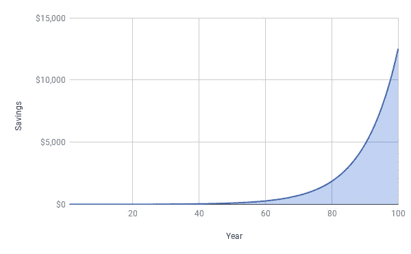

# 沃伦·巴菲特的永恒建议适用于你做的每一件事

> 原文：<https://medium.com/swlh/timeless-advice-from-warren-buffett-that-applies-to-everything-you-do-e400cce43fd3>

Photo by [Chris Liverani](https://unsplash.com/photos/dBI_My696Rk?utm_source=unsplash&utm_medium=referral&utm_content=creditCopyText) on [Unsplash](https://unsplash.com/search/photos/stocks?utm_source=unsplash&utm_medium=referral&utm_content=creditCopyText)

当沃伦·巴菲特被问及他是如何积累起 70 亿美元财富时，他是这样说的:

> “我的财富来自于在美国的生活、一些幸运基因和复利的结合。”

复利是一个如此强大的概念，以至于沃伦·巴菲特把他所有的成功都归功于复利，除了运气和他出生的地方。

但当沃伦·巴菲特谈到复利时，我不认为他只是在谈论复利对他的投资组合的影响。同样，不仅仅是你的个人财务，你可以把复利付诸实践。

> 事实上，我认为你可以把复利应用到几乎所有你做的事情上。

如果你这样做了，你会有更多的动力去实现你的目标，你会取得比你想象的更大的成功。

# 那么什么是复利呢？

复利的概念简单明了。

*   假设你今天有 1 美元。
*   你把这笔钱存入一个每年复利 10%的储蓄账户。
*   在第一年末，你的储蓄账户中会有 1.10 美元，这是从最初的 1 美元加上支付的 0.10 美元利息得到的。

> **现在重要的部分来了——在第二年末，你不仅会从最初的 1 美元中获得利息，还会从第一年获得的 0.10 美元利息中获得利息。**

*(这就是复利的“复合”部分的由来。这种利息被称为“复利”,因为它是根据你的原始金额加上过去的利息支付的金额支付的。)*

好吧，大不了，看起来很小对吧？一开始确实如此，但是看看这 1 美元在 100 年后变成了什么:

向右上方呈指数增长。

你可以看到复利的影响有多强大，但这里有一个问题:

> **复利需要时间。**

在本例中，我们看到的是原始 1 美元的 1，200 倍增长，但这需要 100 年。事实上，1 美元的原始投资翻一番需要 9 年时间，而在图表上你甚至看不到太大的影响需要大约 60 年时间。

这正是我们看到沃伦·巴菲特成功的关键所在:

> **他对自己的长期愿景充满信心，并且有耐心和自律来长期坚持这一愿景。**

当其他投资者在比赛看谁能在几天、几小时、几分钟和几毫秒的时间范围内越来越快地交易时，他选择了他想押注的可靠公司，并在几年或几十年的时间里坚持这些公司。

# 这对你来说意味着什么

现在回想一下你上一次试图做困难的事情或者朝着一个大目标努力的时候。想想你为实现这个目标付出了多少努力，什么时候你开始看到巨大的回报。

> 你一开始付出了很多努力，却没有看到多少结果，对吗？

现在再想想复利曲线。开始的时候，你几乎看不到任何动静。

这就是人们放弃的地方。他们认为他们投入了所有的工作，却没有得到任何结果。

但秘密是这样的:

> **如果你坚持下去，熬过这一关，事情会越来越容易，你会开始看到越来越大的回报。**

这可以应用于任何事情:

*   **改善你的健康状况:**去健身房很难，而且需要很长时间才能看到效果，只有当你已经有了很好的身材，你才能看到最显著的变化
*   **建立受众:**在 Medium 和 Twitter 这样的平台上，你认为哪一个更难获得:你的前 50 个粉丝，还是在你已经有 10，000 个粉丝的情况下再增加 50 个粉丝？
*   创业:还是那句话，最难的是什么:获得第一个客户和第一笔 1000 美元的收入，还是从 10 万美元增长到 10.1 万美元？
*   **学习新东西:**你将不得不提前做很多你不能马上使用的工作。建立你的专业知识和信心需要时间，直到你能获得任何类型的回报，但是一旦你达到了那个水平，你已经完成了艰苦的工作，可以收获收益了。

> 任何你想实现的事情都需要时间和持续的努力，而且你可能不会在一开始就看到任何结果。无论如何你都要坚持下去。

像沃伦·巴菲特一样，你必须相信你的愿景，相信你所做的事情会有长期价值。

一旦你确定了你的愿景是什么，无论是写作、学习编码还是其他，要明白如果你坚持下去，它会有回报的。

然后把这一愿景变成现实很简单:耐心等待，让复利发挥它的魔力。

## 这个故事发表在 [The Startup](https://medium.com/swlh) 上，这是 Medium 最大的创业刊物，拥有 314，551+人关注。

## 在这里订阅接收[我们的头条新闻](http://growthsupply.com/the-startup-newsletter/)。

