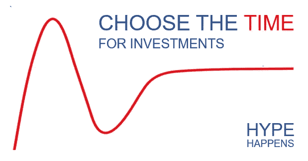
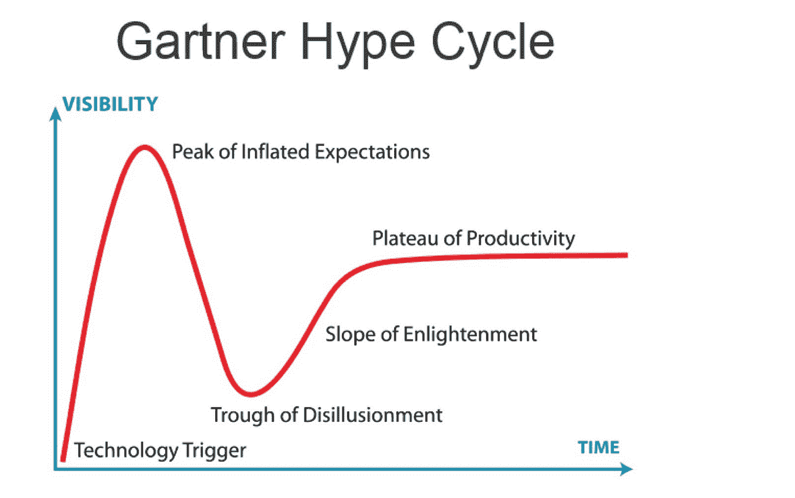
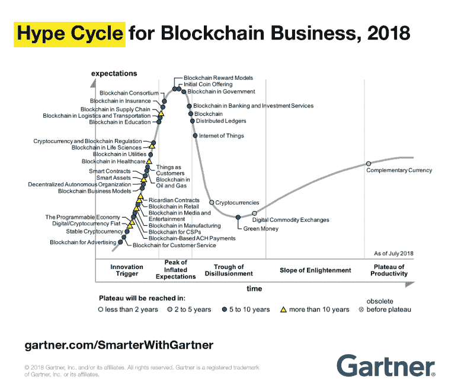
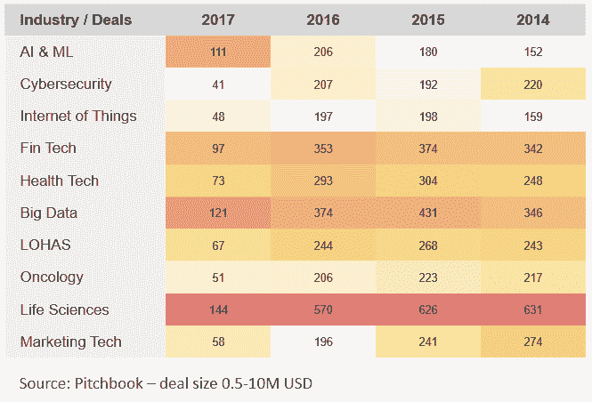

# 长期投资的时机:炒作分析很重要

> 原文：<https://medium.com/swlh/timing-in-long-term-investments-hype-analysis-matters-91492ef92075>

在最近的报告中，ICOSCORING 团队试图回顾区块链市场的当前事件和趋势。这种理解对于明智的投资非常有用，有时也有助于避免投资。

有些因素仍未讨论。其中之一就是**计时**。投资决策过程中的时机选择被认为是对当前时刻是否合适的一种评估。在某些情况下，这种评估有助于推迟潜在有益的投资想法。

我们可以展望时机在区块链投资领域的价值:

1)以投机为目的的短期投资

2)对技术的长期投资

第一个被广泛讨论，信息空间充满了有利可图的投资和退出的建议、愿景和信号。因此，我们认为在投资区块链技术的背景下评估市场上的这一时刻意义深远得多。

区块链似乎仍然只是被广泛讨论和分析的其他技术之一。出于这个原因，我们必须了解现在是否是采用区块链的好时机，潜在市场是否准备好采用区块链，以及需要多长时间才能收回对区块链背后的技术堆栈的相关投资。

这些问题对投资者来说具有挑战性，因为投资历史上有一长串投资技术时时机不佳的见证。这里必须提到两种糟糕的情况:

1.  市场上采用时间比预期长的技术——虚拟现实/增强现实、智能代理、真实性验证
2.  过时的技术—新兴计算、WiMAX、网状网络

更具体的例子是*苹果牛顿*——苹果在 1993-1998 年生产的设备。背后的技术过去还处于萌芽阶段，无法推动大规模的采用和渗透。

技术死亡的风险是显而易见的，上面已经讨论过了。但是延迟的技术采用可能会产生怎样的危害呢？在金融环境中，这种延迟非常明显——正现金流产生的时间越长，这些现金流对最初决策的价值就越低。较长的回收期使投资者没有现金进行替代投资，并降低了投资的现值。此外，更长的期限意味着初创公司的违约风险更高。

跟踪技术阶段的一个好模型是 Gartner Inc .每年发布的 Hype Cycle。

Pic. 1 — Garter Hype Cycle

根据该模型，新兴技术经历五个阶段。

1.**技术触发** —技术展示首次概念验证，媒体激活。这里的商业应用尚未得到证实。
2。**过高期望的顶峰**——充斥着大量成功和失败故事的炒作巅峰。
3。幻灭的低谷——实际实施的失败和大众的失望。研发仍在继续，但媒体报道越来越少，投资者的兴趣也越来越小。
4。**启迪的斜率** —技术实现实际实施，业务在考虑其他应用时变得更加灵活和开放。
5。**y-稳定的主流和广泛的采用。市场了解这项技术，其早期的怀疑已经消失。**

区块链显然是其他广泛使用的技术之一，因此它也无法避免 Gartner researches 的关注。

Pic. 2 — Gartner Hype Cycle with different blockchain use-cases

这个模型包含了我们之前在 ICOs 中看到的 95%的案例。ICOScoring 认同该模型背后的理念，并利用这一愿景评估 ICO 项目。

例如，在 2017 年和 2018 年期间，我们在*保险*中面对了多达 30 个项目。行业本身可能有区块链技术实施的有趣和成功的案例。但事实上，该部门还没有准备好优化与区块链的所有关系，我们预计它将在未来 10 年内准备好。同样的情况也可能发生在医疗保健应用上(根据 Gartner 的数据，生命科学)。

因此，对于投资者来说，评估一个项目和行业的区块链技术潜力是不够的。评估与时间相关的风险也很重要，以避免延长回收期并降低实际项目的估价。

尽管市场上充斥着不需要区块链的区块链项目，但这仍然是区块链被炒作的一个很好的证明。Gartner 炒作周期模型非常理论化，它再次保证炒作下跌是技术的正常状态，它只是未来市场变得更加务实的信号。

假设炒作是了解技术发展趋势的一个好方法，我们可能会找到其他方法来确定围绕行业的炒作。举个例子，如果我们发现一个融资较多、交易活跃的细分市场，这很可能是被炒作的信号，而不是最有吸引力的投资。

在这里，Pitchbook 作为一种代表性的工具出现。

在这里，我们可以看到，在逐年的基础上，医疗保健行业越来越多的资金，尽管其复杂性和相关专业知识的需要。

对于区块链行业，可以应用相同的方法，但是它们需要排除可用统计数据中的灰色噪声，并去除来自 ICO 汇总者的数据，因为 1)ICO 项目的总体人口似乎相当于半骗局 2) ICO 统计数据仅表明投资者可能分配的供应方，而不是分配资本的愿望。

如今，区块链接受的媒体报道越来越少，新闻话题也足够负面。但全球各地的团队仍在努力升级协议，并为区块链的实施寻找更有效的选择。

这给了人们希望，区块链真正的起义还没有出现，仍然即将到来。炒作衰退是技术的普遍现象。

> 未来的见解，请订阅 [ICOscoring Telegram](http://t.me/icoscoring) 频道，并访问我们的[网站](http://icoscoring.com)。

## 这篇文章发表在[《创业](https://medium.com/swlh)》上，这是 Medium 最大的创业刊物，有+402，714 人关注。

## 在这里订阅接收[我们的头条新闻](http://growthsupply.com/the-startup-newsletter/)。

