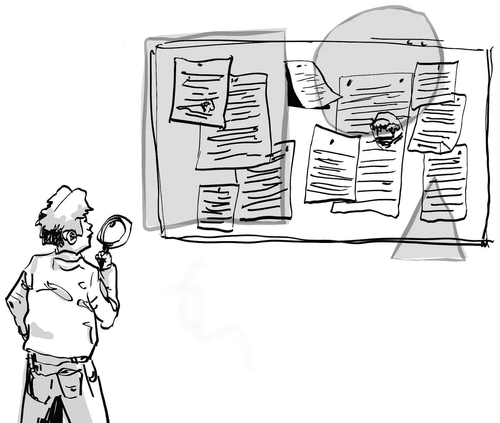
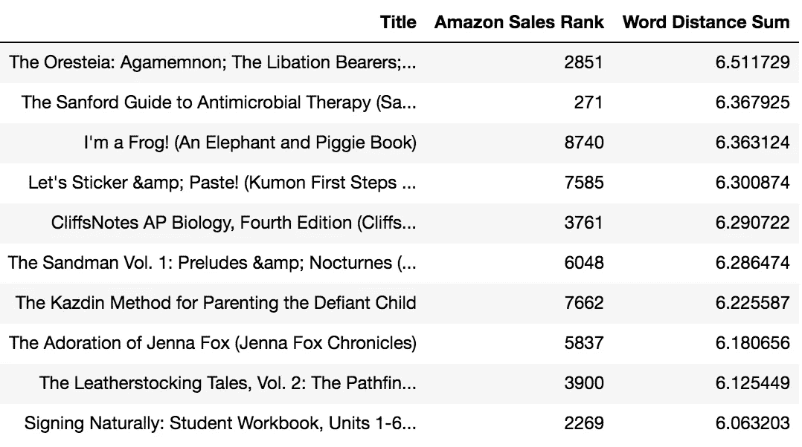
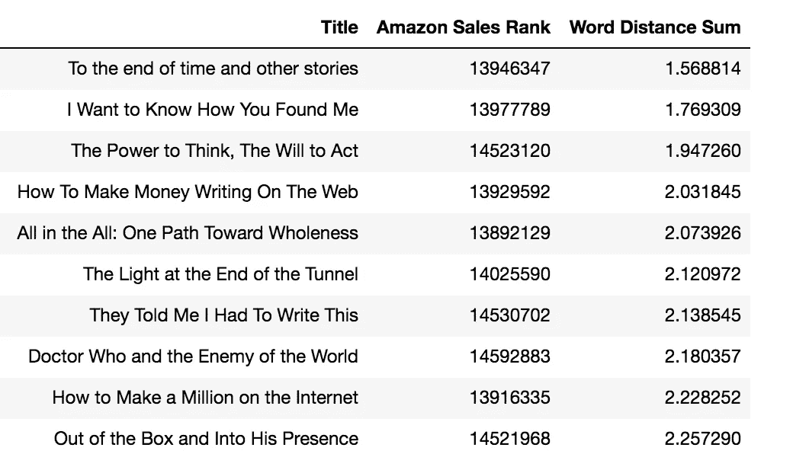
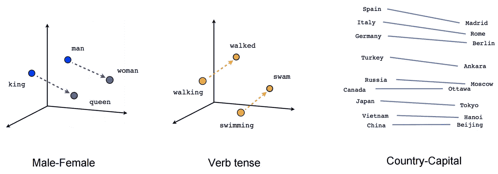

# 畅销书目与滞销书目的定量分析

> 原文：<https://medium.com/swlh/titles-that-sell-versus-those-that-dont-a-quantitative-analysis-1809c5e8a146>

> [当你]将每个单词与所有其他单词的关系模型化时，我们的语言中就会出现一种奇怪而奇妙的数学秩序。

Source: Lucas Amunategui

让我们看看，我们是否可以找到一些有趣的顶部和底部销售书名之间的差异；我们将使用"**亚马逊销售排名**"系统以及嵌入文字的向量来帮助我们实现这一目标。

看看下面两个表格中的“**标题**列。第一个表格显示了在亚马逊上卖得好的八个单词的书，第二个表格显示了卖得不好的书。看到什么模式了吗？

8-word titles that sold like hot cakes

8-word titles that didn’t fare so well

如果您没有发现任何明显的差异，不要担心，这有点微妙。但是在我们去那里之前，八个字的标题是什么？

# 八个字的标题，成功的终极标题长度

结果是，在对 10000 个排名靠前的标题进行抽样并平均字数后，我们得到: **8.53** 个单词。当我们对底部的单词做同样的处理时，我们得到了 6.07 个单词。因此，8 到 9 个单词的标题是成功的最佳长度。

# 使用余弦距离理解标题签名

现在有趣的部分来了。如果你平均每个嵌入单词向量之间的余弦距离(下面有更多关于这意味着什么)，你会得到顶部标题比底部标题更高的距离。

> **4.1** 顶级标题的平均余弦距离
> 
> **3.9** 底部标题的平均余弦距离

简单来说，这意味着由同义词较少的词组成的标题往往更好。当你考虑到最上面的标题平均有两个额外的单词时，你会发现人们更喜欢传达更多含义的标题(真的吗？).

# **亚马逊销售排名和单词嵌入向量距离关系**

我们知道，第一个表格列出了热门书籍，它们在第二列的亚马逊小销售排名证实了这一点。第二张表的情况正好相反，它们是落后者，这一点已经被它们在亚马逊的巨大销售排名所证实。

两个表格的最后一列都是'**单词距离和**'，是题目中每个单词嵌入向量的余弦距离和。好吧，什么是单词嵌入向量？

在过去十年中，单词嵌入向量是自然语言处理(NLP)领域最大的贡献之一。词向量距离是词向量空间的线性子结构。当你使用一个非常大的语料库(想想整个维基百科)并对每个单词与所有其他单词的关系进行建模时，我们的语言中就会出现一种奇怪而奇妙的数学秩序。

下面是 Tomas [Milkov 等人和 word2vec](https://arxiv.org/abs/1301.3781) 建模技术的一个著名例子，它吸引了所有 NLP 爱好者的想象力:

Source: [https://www.tensorflow.org/tutorials/representation/word2vec](https://www.tensorflow.org/tutorials/representation/word2vec)

表明性别、时态等之间的距离关系。可以定量捕捉。例如，一旦您捕获了一个国家到其首都的单词嵌入向量距离，您可以使用相同的距离键解锁所有其他国家的国家/首都(有关更多信息，请参见单词的[向量表示](https://www.tensorflow.org/tutorials/representation/word2vec))。它并不局限于标准的惯用类别，虚构的类别也可以。 [Trask 模仿哈利波特系列](https://iamtrask.github.io/2014/11/23/harry-potter/)并使用嵌入单词的向量提取各种酷信息:

> “密码”这个词……揭示了格里芬多公共休息室的密码列表。(查斯克:[https://iamtrask.github.io/2014/11/23/harry-potter/](https://iamtrask.github.io/2014/11/23/harry-potter/))

# **词向量相似度和余弦距离**

使用单词嵌入向量的另一个重要收获是使用距离度量来提取文本中的相似性。距离越近(即单词向量距离越小)，单词越相似。反过来，这可以作为一个强大的，上下文敏感的词库引擎。在这里，我使用余弦相似距离度量来测量标题中每个单词之间的空间。

> [如果]一个标题太短并且使用了太多的同义词，就很难知道这本书到底是关于什么的…

这就是你可能在上面两张表中注意到的不同模式。第一个表格按单词向量距离降序排序，因此它将显示含义最丰富、最复杂的标题，其中每个单词与其周围的单词不是很同义。第二个表按照词向量距离升序排序，因此是由相近的同义词组成的。如果你仔细观察，你会注意到第一个表中的单词比第二个表中的单词长得多。

# **结论**

在数字世界中，书名相当于传统书籍的封面；它必须更加努力地传递意义。在股票艺术图像的时代，这甚至是一个更大的交易；它们不一定能提供关于一本书内容的线索，所以书名必须更加努力。

这确实有直观的意义，如果你的标题由相近的同义词组成，并且太短，它可能没有必要的信息来吸引潜在的读者。这里的关键要点是，如果书名太短并且使用了太多的同义词，就很难知道这本书到底是关于什么的…

如果你想看看你自己的标题和内容与专业人士相比如何，可以在 ViralML.com[的实验性](http://www.viralml.com/)[多点写作分析仪](http://www.viralml.com/)上测试一下。

如果你觉得这有帮助，请分享并鼓掌——感谢阅读！

曼努埃尔·阿穆纳特吉

在 ViralML.com**的 [**和**](http://www.viralml.com/)**[的 **amunategui.github.io**](http://amunategui.github.io/) 获得它和更多。****

好的——注册下面我的电子邮件群，我会给你发送我的免费电子书，介绍如何成为(更好的)数据科学家(即使你对电子书不感兴趣，也要注册)。感谢阅读！！

# 来源

> R.他是 j .麦考利。用一类协同过滤对流行趋势的视觉演变建模。WWW，2016
> J .麦考利，c .塔吉特，j .施，a .范登亨格尔。基于图像的风格和替代品建议。2015 年，SIGIR

## 这个故事发表在 [The Startup](https://medium.com/swlh) 上，这是 Medium 最大的企业家出版物，拥有 355，974+人。

## 在这里订阅接收[我们的头条新闻](http://growthsupply.com/the-startup-newsletter/)。

