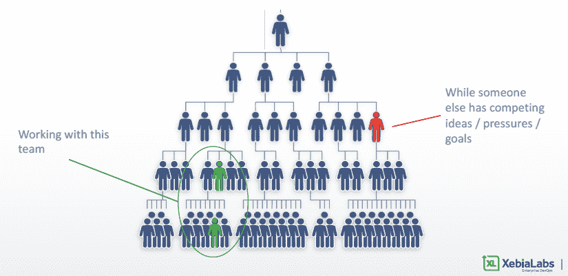
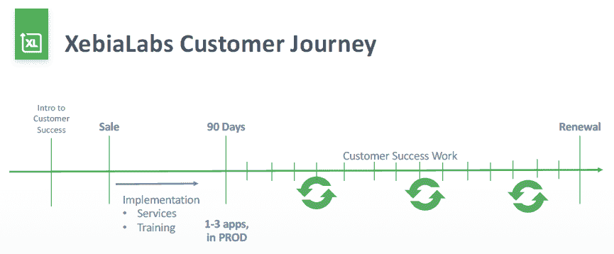
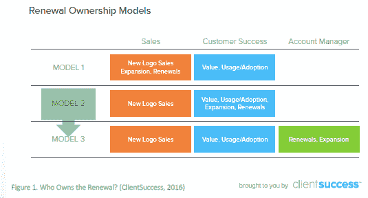
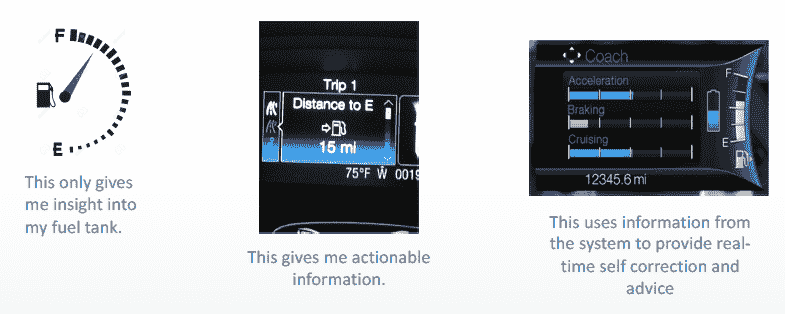
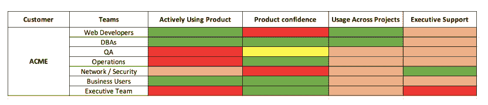
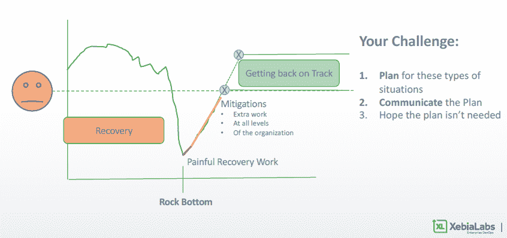

# 与 Tj·兰德尔一起为财富 500 强企业带来客户成功

> 原文：<https://medium.com/swlh/tj-randall-on-delivering-customer-success-for-fortune-500-d08698736785>

> “成功管理的秘诀是让五个讨厌你的家伙远离四个还没拿定主意的家伙。”凯西·斯坦格尔

什么是客户成功？从入职到客户成为产品冠军的阶段，这是客户价值的最大化吗？或者是期望结果的交付？想想看，每个客户都是带着满足某些预期结果的目标登上平台的。然而，当你必须为财富 500 强的客户带来成功时，这种意义改变了吗？

[**Tj 兰德尔**](https://www.linkedin.com/in/tjrandall/) ，**客户成功副总裁** at [**XebiaLabs**](https://xebialabs.com/) 说，“客户成功意味着售后的一切”。

XebiaLabs 是 Gartner 应用程序发布协调魔力象限的领导者，受到 AIG、美国银行、丰田、安联和 NASA 等全球 2000 强客户的信任，能够满足日益增长的对更快、更可靠的软件发布的需求。

在网上研讨会“ [**行动手册:将客户成功传递给财富 500 强**](https://customersuccessbox.com/webinar-customer-success-fortune500/) ”中，Tj 讲述了他在 XebiaLabs 建立客户成功和与财富 500 强客户打交道时的经历、错误和成功。

# 财富 500 强企业是什么样的？

当你谈论像财富 500 强或财富 2000 强公司这样的大型组织时，你会与某些团队接触，而在该公司的其他地方，由于层级或离岸团队，其他人可能会为想法或目标而竞争。

因此，为了客户的成功，让所有团队满意非常重要，我们希望能够提供这些印象，以便当 XebiaLabs 不在时，他们的合作团队是他们的代言人。

因此，要记住的最重要的事情是，当我们谈论企业时，我们谈论的是成千上万的员工、许多不同的技术堆栈和许多复杂性。

# 你如何服务财富 500/2000 的客户群？你如何与他们共事？

对于 XebiaLabs 而言，确定有助于推动续订的客户成功模式至关重要。在 XebiaLabs，他们开发产品来简化复杂的问题。

例如，它们帮助开发人员加速代码更改。他们也帮助了其他人，这些人必须接受这些变化，例如，一个营销团队必须围绕这些变化创作营销文献。

因此，Tj 建议你按照这个顺序去接近财富 500 强的客户成功。

1.  组
2.  组
3.  营业单位
4.  分开
5.  公司
6.  总公司

XebiaLabs 与整个公司的团队和部门合作，让所有不同的团队都满意是一项艰巨的任务。

# 顾客之旅是什么样的？

Tj 确保在销售过程的早期引入客户成功，这样客户不仅可以了解他们正在购买的产品，还可以在售后与他们合作的人见面。

接下来是实施，这可能包括服务、培训或只是与当地团队合作以取得成功。

在前 90 天，客户成功必须确保客户至少有一个(如果不是三个)应用程序投入生产。

然后真正的客户成功工作就开始了。

您希望不断与他们接触，以便客户在每份合同结束时续订。你希望续约，因为你的产品是他们提供的解决方案的关键部分。

# XebiaLabs 客户成功模式

两年前，销售人员主要关注新徽标、扩展和续订。客户成功指的是价值和产品采用。

现在，随着 Tj 和他的团队越来越多地与客户打交道，XebiaLabs 希望客户能够成功管理扩展和续订。

然而，随着客户群的增长，XebiaLabs 已经开始转向第三种模式。他们引入了一个新的客户管理部门，负责处理扩展和续订事宜，即使客户成功的重点是产品采用和客户体验。

目前，XebiaLabs 有六个领域的客户成功工作。

1.  实施:帮助客户走向成功
2.  售前:为新团队提供更多“基于销售”的活动
3.  维护:客户接触点、路线图拜访等。
4.  项目:提供使用和扩展产品的专业知识
5.  培训:船上的初始培训以及持续培训
6.  救火:大客户问题大。😊

想想你现在在哪里，然后开始真正的对话。在接下来的 6 到 9 个月里，你想搬到哪里？

> 点击注册并观看点播网络研讨会[。](https://customersuccessbox.com/webinar-customer-success-fortune500/)

# 财富 500 强客户成功的六大经验

# 第 1 课:企业客户规模庞大

差异——组织中的团队可能不知道您的解决方案。因此，一个大型组织可能有 2-3 个软件来解决同样的问题。

竞争——大公司的梯子里有梯子。所以，为了使用你的产品，认识到这些公司是如何组织起来的是很重要的。

全球计划—许多企业都在竭力改变技术领域，使其更加现代化，更好地为客户服务。

**企业客户复杂**

外部压力——消费者迫使他们改变思维方式。

内部压力——管理成本、增加交付等方面的压力总是很大。

职业压力——人们为了实施组织变革，不惜牺牲自己的职业生涯。

所以可以归结为三件简单的事情

1.  跟上客户计划的步伐
2.  继续支持你的拥护者
3.  保护你的侧翼

# 第二课:停止对数据的渴望

与其希望得到数据，不如问这些问题。

*   什么是好顾客？
*   客户为什么会离开？
*   你对你的顾客了解多少？

然后定义一些成功的标准，危险信号，和最好有。

突出的是 XebiaLabs 需要知道他们是否有一个强大的产品冠军和一个强大的技术冠军。

**为什么冠军如此重要？**

为了取得成功，您的客户成功团队需要在整个组织中识别、参与和支持。在这一系列的接触中，你需要找到冠军。

> “冠军是这样一种人，当你要求他们去为你做一些困难的事情时，他们就会去做。他们是冠军。否则，他们就是啦啦队长。”

# 第 3 课:跨组织的多个利益相关者(又名“赶猫”)

大型组织要求来自组织不同部分的许多复杂的东西。你必须有能力收集、分析、计划和回应他们的要求。你需要能够清晰地表达可操作的信息。

让我们以汽车中的燃油表为例。在过去，它只能洞察油箱。现在，它给了司机可操作的信息。但现代汽车正在转向收集信息，以提供实时的自我纠正和建议。

那么，在客户成功的背景下，这意味着什么呢？

过去:您使用哪些指标？例如，仅仅知道许可证的数量是不够的。

呈现:[帮助你自我纠正的客户成功指标](https://customersuccessbox.com/blog/saas-customer-success-metrics/)，例如，客户使用情况、客户体验等。

未来:想象一个世界，作为一个客户成功团队，你可以谈论一个大型企业中的不同团队，并讨论哪个团队正在积极使用你的产品，在特定团队中是否有对你的产品的执行支持等等。

因此，向可以改变您与客户互动方式的指标前进。

# 第 4 课:组织的可见性

你公司里的每个人都想知道那家财富 500 强大公司的情况。作为一个客户成功团队，您需要接收、跟踪和管理来自企业客户的关键信号。

这就是像 [CustomerSuccessBox](https://customersuccessbox.com) 这样的客户成功软件可以提供帮助的地方。想象一下这样一个世界，您可以坐在一个仪表板前，通过自动化来汇总客户数据。

**行动项目:**

与公司的不同部门进行讨论。如何测量和跟踪信号？

想想你是如何存储和管理这些信息的。

确定您的 CS 团队向您的公司展示这些信息的方式。

# 第五课:谈论顾客

还记得六个工作区吗？你需要知道你将如何谈论一个工作领域，以及它与你整个公司的关系。你想积极主动，避免救火。

> 相信上帝，但是锁好你的车😉

为所有挑战做好计划，如果涉及到消防，则传达缓解计划。

**行动项目:**

1.定义您的客户成功团队与您的客户一起管理的工作领域。

2.在这些工作领域发展、交流和培训你的公司。

# 第六课:找到一个数字

电影《金钱球》中有一句重要的引言。

> “经营球会的人，他们考虑的是购买球员。你的目标不应该是买球员，你的目标应该是买胜场。为了赢得比赛，你需要赢得比赛。”

那么，您如何得出这个可以总结客户体验的数字呢？你得回答你公司的问题。

以 XebiaLabs 为例。Tj 和他的团队问了一个简单的问题，“有什么指标可以告诉我，我们的客户是否按照我们设计和构建的方式使用软件？”归结到这一点——“一个开发人员能多快将一个变化投入生产？”如果他们使用 XebiaLabs 的产品，这个数字/百分比应该会下降。

***你的一个神奇数字是什么？请在下面评论。***

## 这篇文章发表在 [The Startup](https://medium.com/swlh) 上，这是 Medium 最大的创业刊物，有+ 376，592 人关注。

## 在此订阅接收[我们的头条新闻](http://growthsupply.com/the-startup-newsletter/)。

