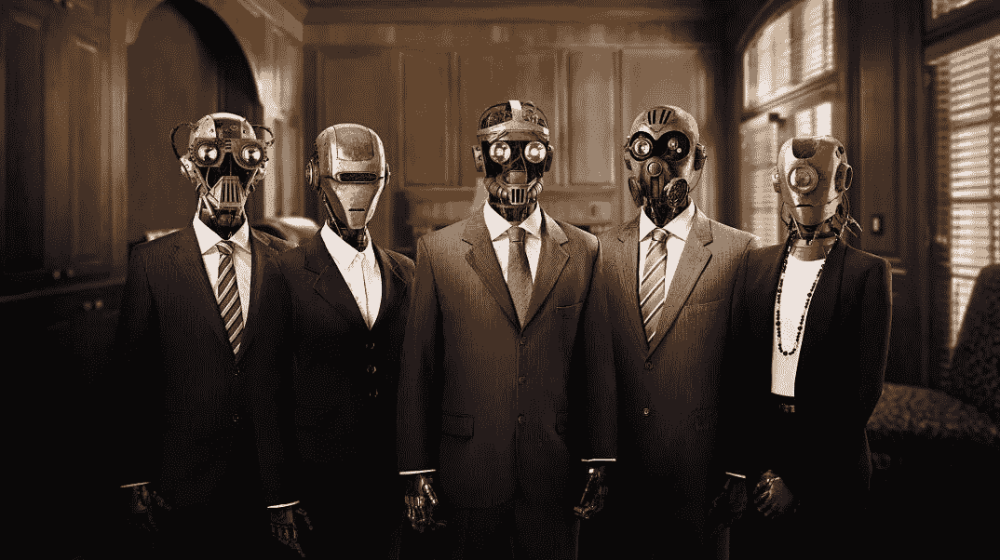
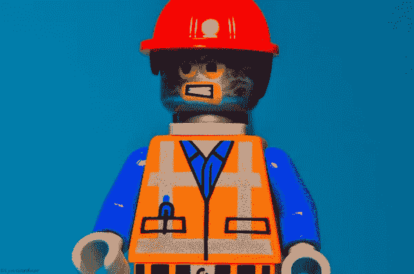
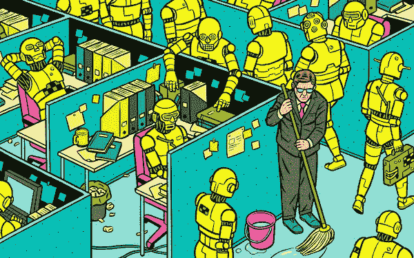
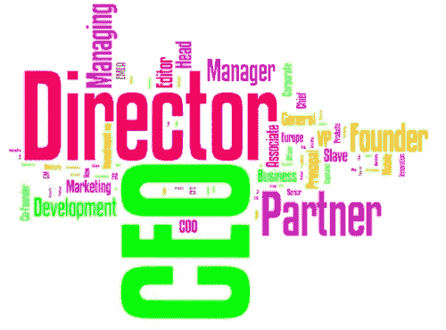

# 给所有追逐职位头衔的机器人

> 原文：<https://medium.com/swlh/to-all-of-the-robots-out-there-chasing-job-titles-61f6a839146d>

## 你的职位并不能定义你。我不在乎，下一个人也不在乎。

我现在遇到很多人，他们似乎每天工作 12 个多小时，却忘记了朋友和家人。除了他们认为他们需要下一个工作头衔之外，没有人知道他们为什么要工作这么长时间。

你猜怎么着？一旦他们得到了那个头衔，他们就不高兴了。然后，当他们成为 CEO 的时候，还是不够。然后有压力坐在很多董事会上，喝香槟，吃鱼子酱。

从什么时候开始，有人见过一个人，听到他的工作头衔，然后完全惊叹并跪倒在地？答案是永远不会。你是人，不是有头衔、品牌和序列号的机器人。

## 相反，你应该考虑的是:

# a)让人印象深刻的是人。

遇到一个富有同情心的善良的人来改变这个世界，总是会在任何可笑的职位上拉屎。

> “重要的不是你的头衔说你做什么，而是你实际做了什么”

有很多人的工作头衔表明他们做了很酷的事情，但事实是他们做了不多的十分之二。这里开会，那里开会，那里握手。这一切听起来令人印象深刻。

# 它的现实一点也不令人印象深刻。

我们都能很好地谈论我们的职业或生意。谈吐是一回事，证明你在另一个层面上并想为他人服务是很难的。

不要被那些因为头衔而在某人头上嗡嗡叫的星星所迷惑。相反，为这个人感到兴奋，即使他们以打扫浴室为生。

# b)不是你有多优秀的问题；而是你能有多优秀。

神奇的事情发生在你看到一个人成长的时候。

许多获得了好职位的人非常无聊，因为他们变得自满，认为自己是老大。

给你的生活增加价值的人是“有前途的人”——那些仍在追逐梦想、没有过度膨胀的自我的骗子。

## 我个人认为 under dogs 比人们印象深刻的“C Suite”职位头衔要好得多。

世界上最棒的感觉就是成为一个从一无所有到永远改变游戏规则的人。第二好的感觉是看到别人这样做，并通过自己的眼睛看着这个过程。

# c)这与你现在在哪里无关。

你可能还没有这个职位，但是忘掉它吧。你为什么做你所做的事情更重要。

除非你从你的职业中获得意义，否则你永远不会得到你一直在追求的感觉。更好的职称并不意味着更好的生活。花时间为伟大的公司工作或创建伟大的公司。

> “公司只不过是一群人，在共同的标签下组织起来，为共同的事业而工作。让人们惊叹的是事业，而不是头衔”

# d)想想所有这些时间。

这些疯狂的猫每天工作 12 小时，保持单身，忽视那些想了解他们的人，他们错过了机会。你不会想成为那种人的。

你买不回所有的时间。如果你工作超过 12 个小时来获得一个工作头衔，并且乐于做一个工作狂，你会被利用。不是努力的问题；这是关于聪明地工作。

许多人在电脑前花费大量时间:这并不意味着他们达到了任何有意义的目标。很容易显得很忙。看起来聪明和成功是很容易的。

难的是做重要的事情。真正深入挖掘，理解你为什么工作这么疯狂的时间。直到你知道为什么，你会继续浪费你的时间，它最终会赶上你。时间是你的全部。

和朋友在一起的时间。和你的搭档共度时光。和家人在一起的时间。这一次是一切结束后你会记得的。将会有一个叫做死亡的游戏，它终将到来。

不要死在办公室隔间里，从不知道为他人服务是什么感觉。不要到死都不知道为一个在你死后会被人们长久铭记的目标而努力是什么感觉。

# e)你需要的动力不在职位头衔里。

做让你开心的事，你就再也不需要动力了。这听起来很愚蠢，然而最好的建议往往是。

**你认为你想要的职位不会带来额外的灵感或动力。**你必须有上进心，而这绝不会来自于职位。

你突破障碍的方法是寻找意义。这个过程将从寻找你职业生涯的意义开始，然后最终你会达到我今天的位置:寻找你整个生命的意义。

一旦你回答了这个问题，你就不会再浪费时间去获得头衔了。相反，你会寻求与周围人更深层次的联系。你将开始在自己内心寻找你需要的所有答案。

# ***我的职位之旅* * *

我写的这个建议来自我自己的经历。我也追求职称很多年了。我以为创始人或首席执行官这个词会让我与众不同。我得到了伴随着这些头衔而来的所有物质上的东西，但它们丝毫没有改变我的状态。

然后我从悬崖边上掉了下来，不得不从一无所有中回来。我成了一无所有的狗(甚至没有一个头衔)。我不得不重新发现每件事的意义，我质疑我曾被告知的关于商业和劳动力的一切。

## 我遇到过有着令人难以置信的头衔的人，这些人似乎都饱受倦怠之苦。

人们期望他们昼夜不停地工作，并且永远不关机。他们总是在工作，只是用他们的四周年假作为借口，说他们确实休息了。

随着组织变革的发生，我遇到的许多领导者发现自己失业了，或者被调到了一个较低的职位。突然间，他们以为自己拥有的东西被拿走了。他们没有意识到的是，没有一个职位是永恒的。这种认识应该让你重新思考你每天都在做什么。

> "永远追逐(意思)，而不是明天的工作头衔(一个短期标签)"

# 那么，如果职称不重要，那又有什么关系呢？

我们不是机器人，也不是由职位来定义的，职位是由没有人真正理解的复杂标签组成的。我们每个人都有自己独特的一面。你所受的教育不能定义你，就像你的职位不能定义你一样。

# 重要的是以下几点:

-此时此刻你是谁
-你将成为什么样的人
-你如何服务他人
-你人生中唯一的使命是什么
-你如何待人

这五件事将决定人们给你的头衔。

> 你想要的标题是“美丽的人类”

你不是一个有头衔和序列号的机器人，日以继夜地朝着一个预定义的、毫无意义的充满性能指标的程序工作。

【Addicted2Success.com】原帖

# *行动呼吁*

*如果你想提高你的工作效率，学习一些有价值的生活窍门，那就订阅我的私人邮件列表吧。你还将获得我的免费电子书，它将帮助你成为改变游戏规则的在线影响者。*

*[**点击这里马上订阅！**](http://timdenning.net/free-ebook)*

**

## *这个故事发表在 [The Startup](https://medium.com/swlh) 上，这是 Medium 最大的创业刊物，拥有 295，232+人关注。*

## *在这里订阅接收[我们的头条新闻](http://growthsupply.com/the-startup-newsletter/)。*

**