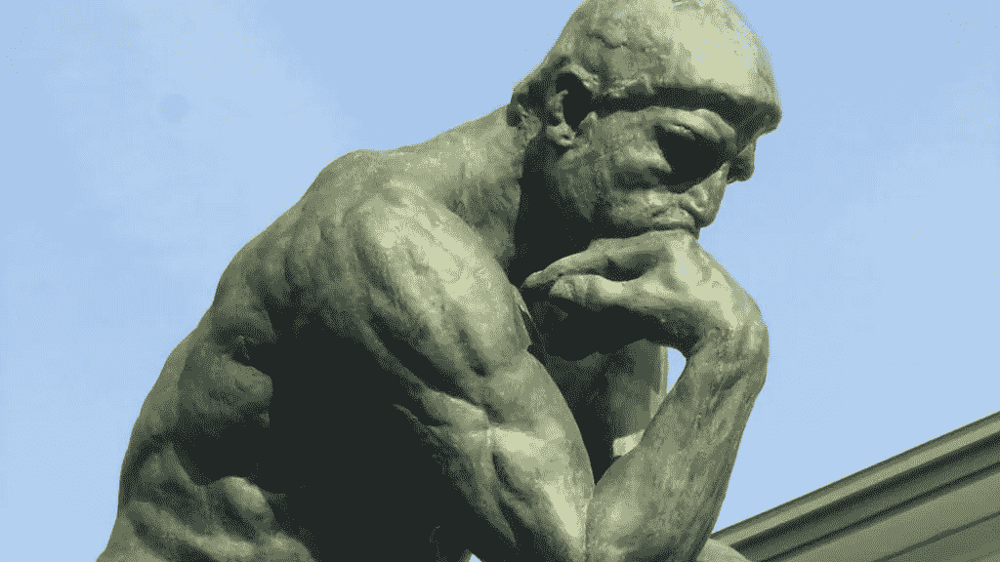
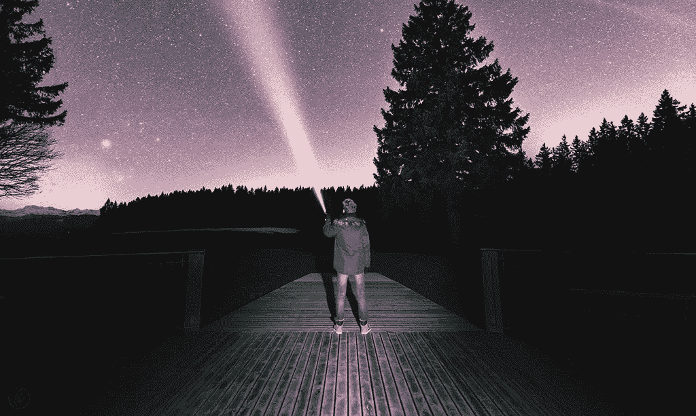

# 生存还是毁灭？

> 原文：<https://medium.com/swlh/to-be-or-not-to-be-d27577112cf4>

## 我们对确认偏差的自满

我们的头脑充满了疑问。关于我们是谁，我们为什么存在，我们做什么的问题。充满了我们做出的决定，我们感受到的感觉和所有其他空洞的东西，我们已经开始想象为“思想”或“思考”，而不是选择性消费的叙事，这是我们一生的经历和暴露我们继承的文化和我们进化选择生活的规范行为和结构。

总是问问题。我们观察到的和我们假设的。我们相信什么是真理，我们不同意什么。永远挑战自己，质疑自己的能力、表现和对结果的看法。当事情进展顺利或对我们有利时，这一点尤其重要，因为突然之间，胜利不再是“运气”，而是一种有控制、有计划的策略。是吗？

即使它是，它是最优的方式还是仅仅是众多次优选择路径中的一个？我们能学到什么，如何挑战我们确认偏见的自满？为什么我们进化出了记忆和历史的概念？是为了更好地预测未来和生存，还是为了从过去中解脱出来？

历史知识的悖论是这样的…

> “不改变行为的知识是无用的。但是改变行为的知识很快就失去了相关性..它就越快改变方向并变得过时。”—德乌斯人

一些不常见的另类想法…

做你自己——最终避免自我完善，接受自满。

知足常乐——这似乎是一个永无止境的旅程，让你知道自己到底是谁，以及你必须为自己、他人和环境贡献的全部潜力。

做一个人——呼喊并寻求一个不同于你自己的身份，你是谁。

快乐——对暂时满足感的虚幻渴望。

是——本质体验的深刻状态。感觉的灵魂，意识的超越，瞬间生活的绝对幸福，宇宙的能量。

让自己去吧。

# 现在我有一些原始的想法要思考…

感恩与恩典

今天，我感激和感谢所有来过、去过和现在围绕在我周围的激励和鼓舞我的人。当我们联系在一起，看似一体，在一个特殊的时刻，他们赋予融合的能量和他们所体现的无目的。难以置信。我很幸运，不仅成为他们经历的一部分，还能和他们一起分享。(摘自我 2018 年 2 月 11 日的早报)

选择的自由

我们可以称之为意识的核心，以及我们撒谎和体验我们所知道和感知的生活的能力是这样的:我们有选择的自由。决定行动与否，行动与否，说话与否，生活与否，思考与否。如果有一个自由被剥夺或压制的例子，从一个生命的意义上来说，我们正在经历不公正。保护、分享和贡献你和他人的自由。

放轻松，开怀大笑

如果你不能嘲笑你自己，你自己，你所做的荒谬的决定，你对非必要的事情和处方的普遍愚蠢，那么你还没有自由地或心甘情愿地生活。放轻松点，接受我们知道的大部分事情，并相信它们完全不重要。在我们的一生中，我们看了、读了、读了很多故事，那可能是 90-100%我们认为是思想和行为上的“原创”。

从头到尾地

我们在这些故事中有这种生存和英雄主义的偏见，我们喜欢听这些故事，喜欢被这些故事包围，想象我们自己也在做同样的事情。我们从一个故事到另一个故事，更像是从封面到封面，掩盖了小字，甚至掩盖了那些没有被删节或从未有机会被写出来的未写的故事。我们追逐时尚和英雄来寻找答案和趋势，但却忽略了他们真正做的事情的本质，这是相反的:他们做事情的方式不同。他们创造了时尚。因此，与其从一页跳到另一页，不如找一页，深入挖掘，探索未发表和未写的内容。你可能会发现一些全新的东西。

## 这个故事发表在 [The Startup](https://medium.com/swlh) 上，这是 Medium 最大的企业家出版物，拥有 299，352+人。

## 订阅接收[我们的头条](http://growthsupply.com/the-startup-newsletter/)。

