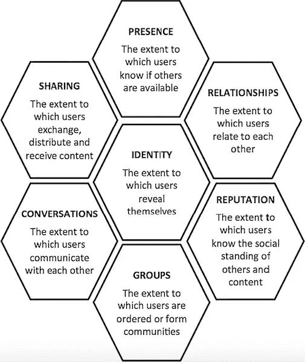
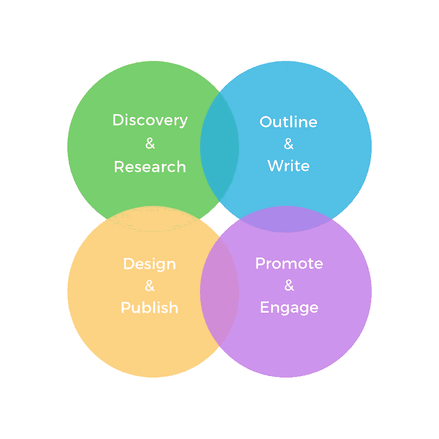

# 要建立思想领导力，让你的员工参与进来

> 原文：<https://medium.com/swlh/to-build-thought-leadership-engage-your-people-e48d8e358dd0>

Written by: Daniel Salcius | Image by: Bruno Cervera

员工在社交媒体上的参与度…谁需要它，对吗？在一个所有事情都有“影响者”的时代(包括[sugar bear hair gummies](https://www.instagram.com/sugarbearhair/)——是的，甚至糖果“维生素”也有影响者)，以及大量用户生成的内容(UGC)供所有人消费，谁需要员工在疯狂的喜欢、评论、分享和关注中分享呢？每一个。单身。组织。就是他。为什么？因为它有助于建立思想领导力。

为了建立一个更强有力的案例，让我们首先将之前的陈述建立在沟通理论的基础上，这是每个专业人士都可以作为参考点的东西。为了加强对公共事务、社交媒体营销和在线社区的现代研究，在 web 2.0 的发展过程中，*蜂巢框架*被引入到更大的通信领域。

最重要的是，组成框架的七个模块，其中可以详细分析社交媒体的功能，为经理们提供了一个工具，以了解企业应该如何参与社交媒体，并将他们的行动与社交媒体用户体验的不同方面联系起来。同样重要的是，这七个组成部分提供了如何最有效地利用每个社交渠道的基本原理，影响了公司如何与特定人群(如追随者)互动并培养他们，所有这些都有助于为组织创造思想领导力。

(要详细分析每个模块需要什么，请参考威利在线图书馆出版的 [*解开社交媒体现象:迈向研究议程*](https://onlinelibrary.wiley.com/doi/abs/10.1002/pa.1412) 中解释的蜂巢框架。)下图总结了蜂巢框架中的七个模块。

Honeycomb Framework, for analyzing social media

# 社交媒体相关性

蜂巢框架(如上图)指导传播专业人士分析员工在推动公司社交媒体营销成功结果中所扮演的角色。类似于设计项目的发现阶段，该模型通过在形成目标和策略之前提出正确的问题来指导实践者。例如，*关系*模块有助于为公司和用户定义适当的交互环境，包括隐私控制、消息类型、连接行为、介绍和信息优先级等设计元素。此外，该框架使经理能够确定消费者(例如，顾客和客户)将如何响应特定的影响者群体，无论是大使还是员工。

蜂巢框架还强调了声誉作为在社交媒体上与用户建立信任的工具。具体来说，‘个人无法从足够的个人历史数据中得出这样的预测；其他个人、公司或产品的声誉是一种社会形成的观点，基于总体经验，通过口头传播、大众媒体报道等方式分享。简而言之，在社交媒体上建立关系是关于你如何与最终用户建立信任。

# 将理论转化为实践

从关系管理和品牌的角度来看(并从声誉和关系模块中学习)，[Carrera Agency](https://www.thecarreraagency.com/)(我们的母公司)在过去的 12 个月里将战术性员工参与引入了沟通组合，这是当前社交媒体战略的一个关键组成部分:用有价值的内容建立思想领导力。为了了解我们的行为如何影响积极参与和 LinkedIn 上的[社区发展，Designing North 团队向*蜂巢框架*寻求肯定。其结果是，我们对如何利用战略性社交媒体实践更好地接触目标受众和社区有了新的清晰认识。](https://www.quicksprout.com/2016/01/06/5-strategies-for-building-a-bigger-network-on-linkedin/)

以下是我们的发现:分享行为与人与人之间的特定联系有关，例如，类似的工作、互补的职业角色和共同的雇主。

最简单地说，为了参与社交媒体(LinkedIn)，管理层必须首先确定用户和公司之间的共同利益的联系。对于卡雷拉来说，利基项目，个性化的内容，以及来自经验丰富的人才团队的认可是答案。这三个因素说明了(公司)最终用户的内在和外在动机，并继续作为在关键渠道上建立关系的基础。

# 内容和思想领导力

社交媒体内容的战略性使用创造了 [*思想领导力*:教育、影响和创新的行为](https://www.linkedin.com/pulse/establishing-thought-leadership-through-social-media-bhattacharjee/)。在 IT 人才管理中，我们接触的许多人都有丰富的经验和专业知识，但除非这些知识以一种有组织、清晰的方式进行讨论，否则它们仍会埋藏在公司内部。我们打算让它浮出水面，分享它，作为回报，从其他做同样事情的人那里学习。我们可能是一个大行业中的一家小公司，但这使我们能够继续专注于吸引合适的人，单独提供人们应该从代理机构中期待的个人接触。

Carrera 的人才经理在不同的 IT 职能部门完成了漫长的职业生涯，形成了一个平衡的团队，他们了解咨询的细微差别，这是我们*为正确的项目寻找正确的人*的独特方式。当然，这种优势也在管理团队中得到复制:天生的求知欲和分享信息的愿望会慢慢渗透，增强文化和对新思想的开放性(即内容作为一种工具)。

那么，所有这些与内容如何影响公司有什么关系呢？嗯，作为一家拥有高级团队的精品公司，Carrera 需要一种方法来利用许多无形资产，这些资产目前将该机构定位为大型组织和活跃顾问的良好合作伙伴；它需要一个战略信息和知识共享的渠道。经过策划的内容片段是答案，这激励了整个团队，培养了一种在我们的领域内创造思想领导力的认同。

拥抱内部有机内容的规划、创造和分享[以创造思想领导力，单枪匹马地成为该机构如何对待社交媒体和业务增长的思维转变的催化剂。简单地说，它的内容使员工能够分析他们的工作和工艺思想，以造福我们的目标受众；正是这些内容打开了发现和探索行业内新趋势和新兴话题的大门，正是这些内容激励团队在与所有利益相关者互动时拥有明确的声音和有凝聚力的品牌形象。](https://www.adweek.com/digital/jill-sherman-digitaslbi-guest-post-organic-content/)

# 社交媒体和商业

正如 HubSpot 在他们的文章 [*中暗示的，通过 4 个步骤*](https://blog.hubspot.com/customers/brand-advocacy-power-employees-4-steps?__hstc=144543722.9be539a03d74dbc0859e1fed2e20bd68.1540353182348.1540353182348.1540353182348.1&__hssc=144543722.1.1540353182348&__hsfp=2830425072) 释放员工的力量，社交媒体使公司能够少花钱多办事。这听起来可能过于简单，但事实是，内部团队希望更多地控制创造有利的结果。从战略上来说，社交媒体提供了我们都渴望的自主权。当然，这种控制水平增加了管理者的责任。决策者需要进行适当的研究，并在引入政策之前彻底了解内部和外部环境。这就是蜂窝框架存在的原因，也是学术交流理论在现实世界中有价值的原因。

这一理念的成功强化了我们对员工思想领导力和品牌倡导的承诺。HubSpot 解释得很好，“品牌倡导让企业”推动员工积极参与，并利用内部技能、行业和公司知识来生成和分发内容。这种信念让 Carrera 员工能够将他们在社交媒体上的个人和职业表现联系起来，在一个分散的小团队中创造出更强的使命感。每个人都有发言权，参与其中，并因此对积极的结果负有责任。

与促进内部参与同等重要的是，员工品牌倡导增加了透明度，建立了品牌意识，加强了品牌形象，并推动了品牌资产。老实说，这有利于每一个商业环境。无论最终用户是谁，来自内部团队(在社交媒体上)的一致且有凝聚力的沟通会积极影响外部团队的参与度以及与公司打交道时的语气。

我们的经验表明，教育和指导方针对于成功的员工品牌倡导计划至关重要。(不要被“程序”这个词吓倒；思考过程。)根据公司的规模，这个过程可能涉及到或多或少的人，视批准的需要而定。下面是我们的流程:

最后，在当前的商业环境中，员工品牌倡导的成功(因此，思想领导力)与为员工提供可共享的内容和参与认可有关。是的，这意味着人们希望他们的行为得到回报，即使是口头上的。

在 Carrera Agency，绝大多数内容涵盖了与日常运营相关的特定商业趋势，并通过一个关键渠道进行传播:LinkedIn。为了提高效率并确保每个人的时间都得到有效利用，员工会收到一封电子邮件，其中包含已发布内容的最终(经过测试的)链接、复制选项(如果他们希望转贴)以及要使用的补充标签。这确保了最少的移动部件，并使每个倡导者一次专注于一个渠道。

**注意:**我们让所有员工同时参与分享过程，从而减少了错误。当需要向 LinkedIn 发布一篇新文章时，会发送一封包含链接、图片、副本和标签的电子邮件；同时，内容经理保持在线(Google chat、Slack 和 LinkedIn ),随时准备诊断问题并纠正错误，减少风险和恐惧，并鼓励团队之间的高质量协作。

# 外卖

通过利用员工宣传，Carrera Agency 在社交媒体上实现了三位数的增长。但这不是推销；这证明了内部团队(员工)在参与、知情和受到奖励的情况下，对社交媒体发展战略的积极影响。然而，除了从公司拥有的最佳代言人(it 人员)那里获得支持之外，经理们应该更深入地挖掘，并试图理解他们的想法为什么可行以及应该如何实施。

传播理论为寻找答案提供了支持，尤其是在现代商业环境中的社交媒体领域。从我们的核心业务到主要沟通渠道，有一个因素仍然是最重要的:人。无论是为 it 顾问寻找合适的项目，还是与客户一起确定他们的项目需求，对人的因素的奉献让我们感觉良好。感觉有动力。加入我们，看看我们今天谈论的。

## 这篇文章发表在[的创业](https://medium.com/swlh)上，这是 Medium 最大的创业刊物，有+383，719 人关注。

## 在这里订阅接收[我们的头条新闻](http://growthsupply.com/the-startup-newsletter/)。

