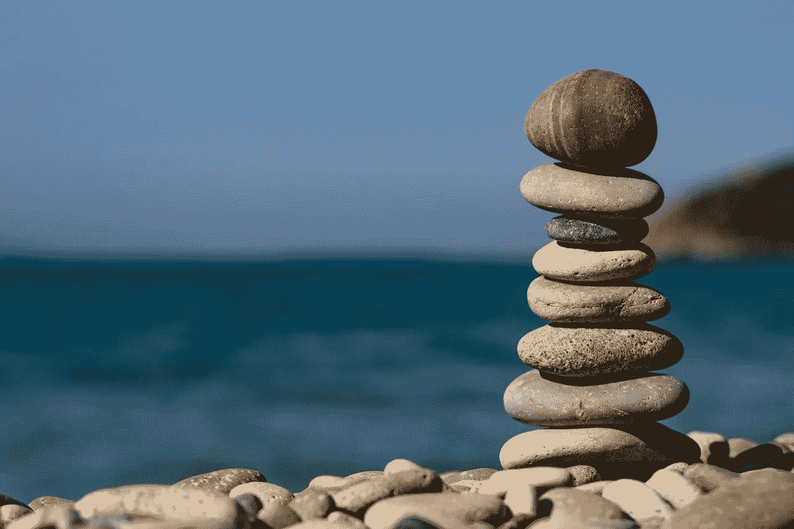

# 成长和改变，打破你生活的平衡

> 原文：<https://medium.com/swlh/to-grow-and-to-change-upset-the-balance-of-your-life-22d0e09dfce7>

(Credit: pixabay.com)

当事情处于平衡状态时，生活感觉很好。

当平衡占上风时，一切似乎都是一致的，毫不费力地和谐。

当我感觉平衡时，我的努力似乎会得到相应的回报。风险被接受，并被预期的回报所抵消。经验证明努力是有道理的。当我感受到爱和…