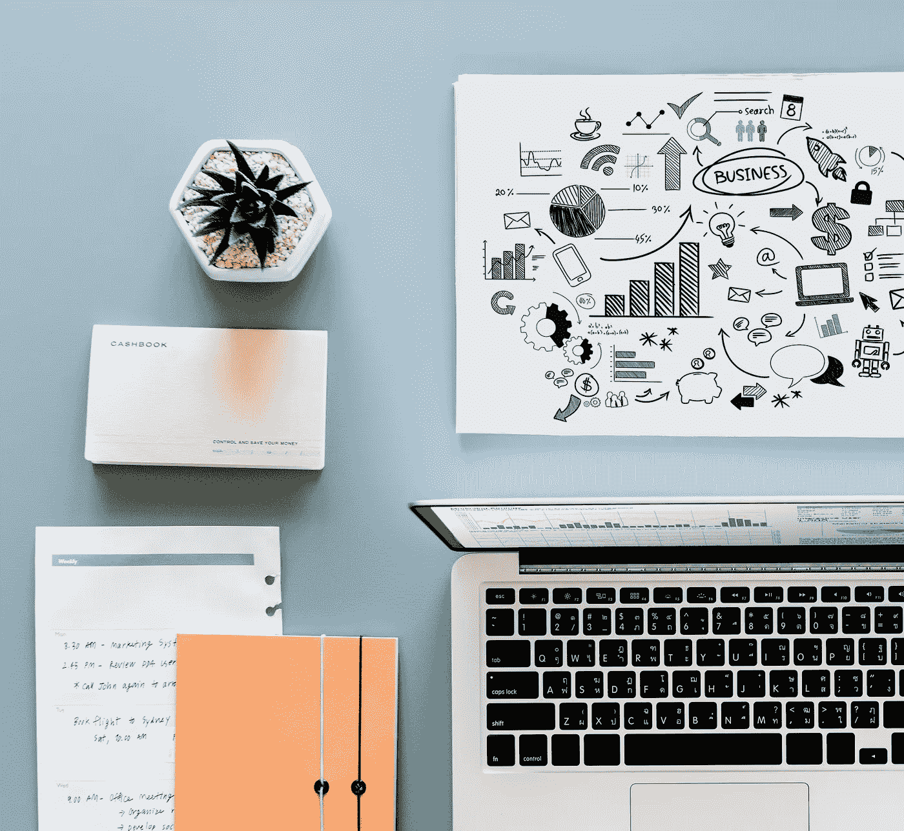
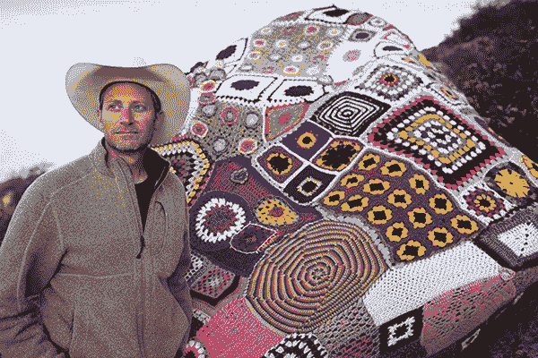
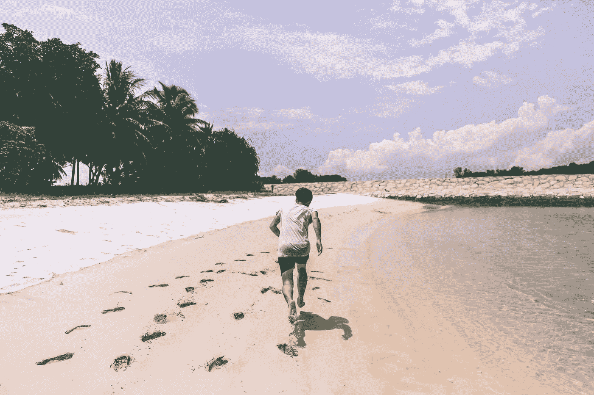
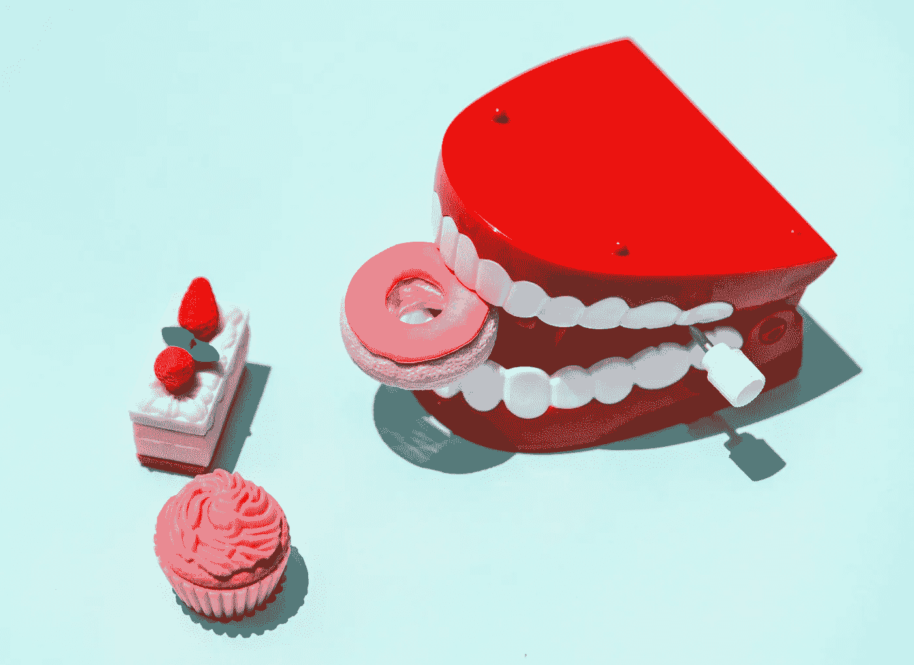

# 要将你的生产力提高 1000%——采用这些超级简单的仪式

> 原文：<https://medium.com/swlh/to-multiply-your-productivity-by-1000-adopt-these-super-simple-rituals-8986dc1407ee>

## 来自超级成功典范的提示

Photo by [rawpixel](https://unsplash.com/photos/mVpZLcD_F6k?utm_source=unsplash&utm_medium=referral&utm_content=creditCopyText) on [Unsplash](https://unsplash.com/search/photos/work?utm_source=unsplash&utm_medium=referral&utm_content=creditCopyText)

这个世界运转得很快。

似乎如果你停下来打个喷嚏，你就会错过下一件大事。

我们需要快如闪电才能跟上。

> 但是我们如何做到这一点呢？超级成功人士有哪些帮助他们利用和我们一样的 24 小时的技巧和诀窍？

经过大量的研究和实验，我采用了一些技巧和策略，使我一天的产出翻了两番。

我曾经是这样一种人，看着我面前堆积如山的工作，一想到我永远也完成不了面前的任务，我就会变得麻木。

下面你会发现一个我用来提高日常工作效率的介绍性实施策略。

# 我睡了一夜好觉。

Photo by [Jackman Chiu](https://unsplash.com/photos/Lz3lklDSU4k?utm_source=unsplash&utm_medium=referral&utm_content=creditCopyText) on [Unsplash](https://unsplash.com/search/photos/sleep?utm_source=unsplash&utm_medium=referral&utm_content=creditCopyText)

这是你从小就知道的事情。

如果你仍然只睡 5 个小时，为什么你还指望每天都处于最佳状态？

哦，我明白了，你听说过所有硅谷的优步企业家，他们把睡眠时间缩短到只有 5 个小时，经营着超级成功的、价值数百万美元的企业。

让我告诉你一个小秘密……[他们中的大多数都在服用阿得拉和其他促智药。服用这些药物来保持领先地位是不可持续的(我知道，我在大学里也服用过。当我为了出人头地而滥用药物时，我的理智和健康都开始受到损害。](https://www.washingtonpost.com/national/health-science/tweaking-brains-with-smart-drugs-to-get-ahead-in-silicon-valley/2017/06/09/5bc9c064-0b35-11e7-93dc-00f9bdd74ed1_story.html?utm_term=.4e6a96a34bf0)

每天早上，我们要么有机会全力以赴地开始新的一天，要么立刻处于劣势，试图用不足的燃料驱动我们的身体。

# 我发现自己有能力在最小的决策中发现一个边际调整，随着时间的推移，它会变成伟大的事情。

这听起来像是一大堆废话。

所以让我们解开它的含义:

[https://bit.ly/2kMix3D](https://bit.ly/2kMix3D)

吉尼斯世界纪录保持者、个人投资经理、战略家、作家兼讲师 Stephen Duneier 在他的 TedX Talk about [*实现你最雄心勃勃的目标*](https://www.youtube.com/watch?feature=share&v=TQMbvJNRpLE) 中讲述了他如何通过识别障碍和目标并完全减少最小级别上需要做的事情来实现他在商业、人际关系、艺术和生活方面最狂野的梦想。

例如，当他声称他将在一年内阅读 50 本书时，他并不认为这是 50 本书，或各种章节，或无休止的句子。

> 相反，他认为必要的第一步是识别他何时在看电视，或者滚动社交媒体以放下设备并阅读一个单词。当他读一个单词时，他会读两个，以此类推。
> 
> 他将这一点应用到他的大学学习，他的职业生涯，为美国银行和美国国际集团工作的投资，创办自己的公司，他的各种马拉松，减肥和打破世界纪录。

在我的生活中，我已经将写作应用到我的日常习惯中。

我有一个梦想，成为一名出版作家，写书来帮助影响人们，如果不超过我在改变我的生活模式方面受到的影响。

我知道我不可能写一本书并在一夜之间出版。见鬼，我可能不会在一两年或者三年内实现这个愿望。

我知道每天写下并改变那个决定会让我更接近。

# 我变得执着

> "耐心、坚持和汗水是成功的最佳组合。"拿破仑·希尔

坚持孕育生产力。

当你持之以恒时，你会坚持手头的任务。当你坚持手头的任务时，你会找到解决问题的新方法。

当我写作的时候，我会花上几周甚至几个月的时间努力完善我的过程、技巧和风格。

我发现时间在流逝，我发现自己处于停滞状态。我觉得我哪里也不去了。我的文章似乎过时了，我得不到以前的反馈，我开始感到绝望。

在我内心深处，我告诉自己要坚持不懈。不屈服。

Photo by [Alex wong](https://unsplash.com/photos/-rWjydNhATw?utm_source=unsplash&utm_medium=referral&utm_content=creditCopyText) on [Unsplash](https://unsplash.com/search/photos/persistence?utm_source=unsplash&utm_medium=referral&utm_content=creditCopyText)

一般来说，有了这种心态，事情就变得明朗了。

我要么找到一个新的工具，我读一篇文章，我写一篇文章，然后再一次像病毒一样传播，然后我逃离低迷。

我的坚持打开了通往新的生产途径的大门。

# 我改变了我的饮食。

超级简单的想法。

然而很难建立。

我们生活在一个非常美味可口的食物随处可见的时代。

我们可以用食物填饱我们的脸，让我们感到麻木和放松。

很难与之抗争。从科学上来说，我们被设计去寻找和吃高能量储存和容易上瘾的食物。作为人类，我们大部分时间都在狩猎和寻找食物。现在，我们发现自己处在食物系统的便利中。

我对我的饮食做了一个彻底的改变，更多的是为了给我的身体和大脑提供能量，而不是口腔的愉悦。

> 在过去的一年里，奖金损失了超过 15 磅！

在杂货店买东西时，我严格按照植物来买。这不仅让我的精力更加充沛(没有加工食品带来的那种懒散感)，也让我的预算和消费习惯更加高效。

Photo by [rawpixel](https://unsplash.com/photos/pVPXeT7rIu0?utm_source=unsplash&utm_medium=referral&utm_content=creditCopyText) on [Unsplash](https://unsplash.com/search/photos/eating?utm_source=unsplash&utm_medium=referral&utm_content=creditCopyText)

我早上吃酸奶，在上面撒上坚果和种子。午餐，我在一层糙米上吃了一份炒蔬菜。晚餐，我会吃富含蛋白质的鸡肉或鱼肉。

我们经常忘记我们摄入体内的能量来源和我们将接收到的能量输出之间的联系有多重要。

让你的身体充满善，你会体验到更有成效的产出。

# 我发现由于经常阅读，我变得更有效率了。

一位空姐曾经分享了她在 3 种不同的航班等级(经济舱、商务舱和头等舱)中看到的不同乘客的趋势。

> 在经济舱，乘务员注意到大多数乘客都盯着他们面前的电视，或者他们可能正在他们的智能设备上观看下载的电影。
> 
> 在商务舱，乘务员注意到所有的乘客都拿出了他们的笔记本电脑。他们要么是在发电子邮件，生成报告，要么是写下着陆后需要提交的某种提案。
> 
> 在头等舱，乘务员注意到大量的乘客拿出书来阅读。他们总是在学习新的东西。在被锁在飞机里的几个小时里，他们总是花时间去学习。

当你学习新事物时，你总是富有成效的。你正在吸收新的技能，看待事物的新方式。

# 结论:

我在生活中采用了一些技巧来提高生活效率。

*   我睡了个好觉。这对于让你的一天有个好的开始是至关重要的。有一些关于超级表演者达到高度成功和生产力的神话，但是不要被这个神话所愚弄。
*   **我对自己的决策做了细微的调整。**复合加班，做边际调整绝对可以改变你的人生。想象一下:每天早上你从星巴克买一杯*焦糖玛奇朵*。你在做什么?好吧，你不仅会在吃糖热潮后崩溃从而耗尽你的生产力，你还会牺牲你的健康。对一杯拿铁或黑咖啡做一点小小的调整，在一年的时间里会产生巨大的积极影响。
*   我变得坚持不懈。当你坚持不懈时，你就是在向世界“放飞小鸟”。当事情变得艰难时，你盯着它的脸，不要眨眼。那时你也许会平台期。当这种情况发生时，它为解决问题打开了新的大门和新途径。
*   我改变了我的饮食。超级简单，超级好做。我意识到我正在注入身体的燃料——或者说缺乏燃料。我的饮食模式已经完全改变了，结果我的工作效率大幅提高。
*   我养成了定期阅读的习惯。学习新的技能和想法总是会把你带到更高的生产力水平。当你阅读时，你被邀请与你选择的任何领域的成功典范进行最亲密的对话。阅读并提高效率。

# 准备好接受刺激了吗？

我提供给你一个经过测试和验证的 6 部分指南，它包含了强大的概念，可以帮助你识别、规划、成长和完成你的创造性追求。

## [> > >在这里获得免费指南< < <](https://www.tribeloyal.com/free-6-step-course)

## 学到了什么？按住👏说“谢谢！”并帮助他人找到这篇文章。

## 还评论！你喜欢什么？你讨厌什么？你在做什么？

## 这个故事发表在[的创业](https://medium.com/swlh)上，这是 Medium 最大的创业刊物，有 332，253+人关注。

## 订阅接收[我们的头条新闻](http://growthsupply.com/the-startup-newsletter/)。

