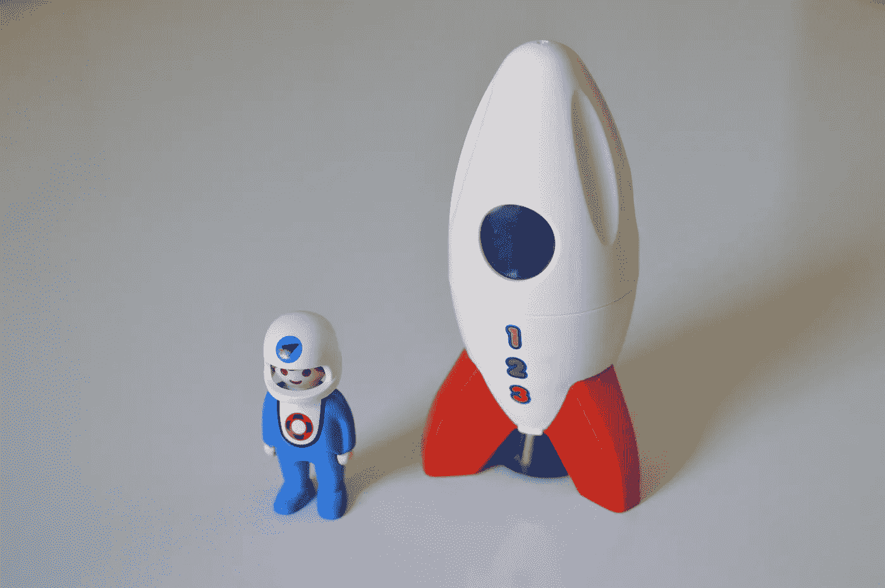

# 要扩大你的创业规模，你必须缩减你的策略

> 原文：<https://medium.com/swlh/to-scale-your-startup-big-time-you-must-scale-down-your-tactics-b0042a49a7fb>

## 你不能让自己错过不可估量的机会

Sometimes building a fake rocket ship can show you how to fly a real one. Photo by [Carlosaugusto77](https://pixabay.com/en/users/carlosaugusto77-1165992/) on [Pixabay](http://www.pixabay.com/)

我们看待增长的方式被打破了。

“当然，我们不应该那样做。”

*“它永远不会扩展。”*

你会在大多数创业公司听到这句话。你会从有经验的企业家那里听到。即使你知道得更清楚，你也会从你自己那里听到。

想起我曾以这样或那样的方式说过许多次那些可怕的话，我很难过。

*“我们应该根据每个新注册用户在 Twitter 上的喜好给他们写一封私人邮件。”*

*“不。它不会扩展。”*

*“让我们创建一个艺术化的信息图，让我们的客户对整篇博文一目了然。”*

*“太花时间了。我们不能对我们写的每一篇文章都这样。”*

“我们应该在 Tinder 上创建个人资料，向所有喜欢我们资料的人推销我们的创业公司。”

*“啊，等等，瓦特？”*

你明白我的意思了。

但是，即使是最狡猾的企业家——尽管经验不足——也会有这种想法。

评估一项风险投资(无论规模大小)未来能否成功的能力至关重要。不懈地寻找潜在的问题是推动你完成学业的动力。"你就是这样得到你梦想中的工作的，记得吗？"不管怎样，它把你从不可挽回的错误中拯救了出来。

事实上，这种与生俱来的人类能力让你的祖先得以存活。注意灌木丛中的噪音。

“Who’s there?” Photo by [Gary Bendig](https://unsplash.com/photos/KvHT4dltPEQ?utm_source=unsplash&utm_medium=referral&utm_content=creditCopyText) on [Unsplash](https://unsplash.com/search/photos/surviving-in-the-wild?utm_source=unsplash&utm_medium=referral&utm_content=creditCopyText)

但是，在一个可能永远不会发生的未来，专注于“无法解决”的问题忽略了创业公司的一个基本事实。

事情如何扩展的事实远没有首先有一个好的理由*来扩展重要。*

*通过为真实世界中真实的人解决真实的问题来提供价值。*

*但是，你不需要做到“正确”你只需要做得足够好。[塞思·戈丁](https://medium.com/u/f9ac9806e153?source=post_page-----b0042a49a7fb--------------------------------)亲自营销 OG 说:*

> *“有可能什么都做错，却做得很好。事实上，有时这是做得非常好的唯一方法。”*

*引人注目的独角兽——估值至少为 10 亿美元的公司，而不是神话中的那种(嗯，新闻让它们看起来有些神话)——已经表明，一旦真正的问题得到解决，“如何做”可能并不像人们想象的那么难。有了外部的帮助、热情的顾客和更多的知识，这条曾经不被照亮的通往数百万人的道路突然变得更加光明。*

> *“所有成功的初创公司都是从数量可观的用户开始，通过不断重复做一些不具规模的事情而成长。”— [尼泰什·阿格拉瓦尔](https://medium.com/u/520aadd1ce3c?source=post_page-----b0042a49a7fb--------------------------------)*

*你不能从寻找一个不存在的问题的解决方案中恢复过来。*

*请注意，构建不可扩展的东西的好处是深远的。*

*你不仅可以从市场上廉价地学到东西，还可以从孩童般的游戏和不可协商的限制中获得创作自由。*

# *设想一个可以让极客们思考的未来*

*要诚实。你喜欢想象你正在等待的重大时刻:获得新一轮融资、出售你的公司、或者登上[公司杂志的封面](https://www.inc.com/)。*

**

*The only thing I like more than winning is not losing. Photo by [Zac Durant](https://unsplash.com/photos/_6HzPU9Hyfg?utm_source=unsplash&utm_medium=referral&utm_content=creditCopyText) on [Unsplash](https://unsplash.com/?utm_source=unsplash&utm_medium=referral&utm_content=creditCopyText)*

*当然，这只有在你成功的情况下才会发生。为此，你必须找到一个足够大的问题，用一个足够好的解决方案来解决。*

*但是你不需要满足于足够好。而要找到什么是“好”，就需要实验。与顾客交谈。去建造和重建。*

*但是[亨利·福特](https://en.wikipedia.org/wiki/Henry_Ford)的名言提醒我们:*

> *“如果我问人们想要什么，他们会说是更快的马。”*

> *创业是一项“需要创造力的运动”*

*Airbnb 的联合创始人兼首席执行官布莱恩·切斯基(Brian Chesky)有一个很有价值的思想实验，叫做 7 星设计原则。*

*如何获得高于最高限额的评审？你想象一个荒谬的完美用户体验，然后，在它和你已经拥有的之间找到一个现实的中间地带。*

* [## Airbnb 联合创始人布莱恩·切斯基的 7 星级设计原则

### 如何创造一个产品，让人们告诉他们知道的每一个人。

medium.com](/founder-playbook/brian-cheskys-7-star-design-principal-8f62b4cf0f96) 

七星设计原则让你有能力去想那些现在看似不太可能，但对你的客户来说会很神奇的东西。你放大你的梦想，然后缩小回到现实。

你利用艰难争取来的顾客反馈来满足他们的需求，但仍能做出让他们满意的东西。让他们成为真正的粉丝。甚至是福音传道者。

# 获得(几乎)免费的教育

> “在我抛弃诗歌之前，我必须写下它……我不能在诗歌被写出来之前就抛弃它，因为正是诗歌的写作产生了任何快乐、兴趣或会引起注意的方面。宝石的切割必须完成，你才能看到它是否发光。”— [莱昂纳德·科恩](https://en.wikipedia.org/wiki/Leonard_Cohen)

伟大的创业公司和伟大的艺术一样，都是由孜孜不倦的奉献和神圣的意外收获创造出来的。

你可以照顾前者，寄希望于后者。

Do you feel lucky? Photo by [Free-Photos](https://pixabay.com/en/users/Free-Photos-242387/) on [Pixabay](http://www.pixabay.com/)

但是人们经常误解运气。你如何看待运气是一种选择。而运气是可以创造的。

很简单，真的。让自己置身于幸运的情境中，当机会出现时，不要错失良机。

我反对企业家是冒险家的观点。他们擅长管理风险，在不确定的环境中也能游刃有余。

你会喜欢 [Proposify](https://www.proposify.com/) 的首席执行官[凯尔·拉基](https://medium.com/u/15b828b41276?source=post_page-----b0042a49a7fb--------------------------------)的观点:

> “企业家关注的是上涨是否能弥补下跌。他们还会考虑可能发生的绝对最坏的情况，失败的可能性有多大，以及他们可以部署的任何策略，以对冲他们的赌注，并将负面影响降至最低。”

所以，保护不好的一面，勇往直前，不断创造。

失败或成功，学习。

然后，再创造。

# 保持脚步轻盈

没钱真糟糕。

你就像在汹涌的海浪中被鲨鱼追逐。你能感觉到它的到来。你会忍不住生动地想象如果你最后太慢了会有多痛苦。

你唯一的希望就是在野兽抓住你之前到达岸边。

你不能控制水。

你能控制的是你的胳膊和腿。你的呼吸。你的焦点。

但这是海岸或鲨鱼。

活着或者被吃掉。

Do you want to succeed as much as you want to breathe? Photo by [Amy Humphries](https://unsplash.com/photos/hpyO24WMSLE?utm_source=unsplash&utm_medium=referral&utm_content=creditCopyText) on [Unsplash](https://unsplash.com/?utm_source=unsplash&utm_medium=referral&utm_content=creditCopyText)

为了生存足够长的时间以获得成功，你需要钱，你需要有效和高效地花钱。

你们当中思维敏捷的企业家已经在考虑精益创业方法了。

这是你创业的正确方法吗？针对你的背景，行业，客户？

我怎么会知道？

也许[Nir Eyal](https://medium.com/u/295258f6269d?source=post_page-----b0042a49a7fb--------------------------------),[Hooked](https://www.amazon.com/Hooked-How-Build-Habit-Forming-Products/dp/1591847788)(伟大的书，顺便说一句)的作者可以帮助你:

 [## “精益创业”还是不“精益创业”，这是创始人的问题。

### 莱尔·麦肯尼是一名企业家，他为一家早期创业公司写作和工作。在这篇文章中，他分享了他的…

hackernoon.com](https://hackernoon.com/to-lean-startup-or-not-to-lean-startup-that-is-the-founders-question-d04e0a525779) 

然而，我的观点是，了解你的客户和市场是至关重要的，如果你死了(嗯，你的公司)，你将不会得到任何这种甜蜜的学习。

构建可扩展的东西需要时间和金钱(并且需要知识)。

帮自己一个忙，加紧学习。

下一次，当你发现自己在想“这不会扩展”的时候，记住为了你的公司成长，你必须做那些不会扩展的事情。

委婉地提醒你👏对你的灵魂有好处。

和许多👏👏👏甚至更好。

## 这篇文章发表在《初创企业》杂志上，这是 Medium 最大的创业刊物，有 352，974 人关注。

## 订阅接收[我们的头条新闻](http://growthsupply.com/the-startup-newsletter/)。

*