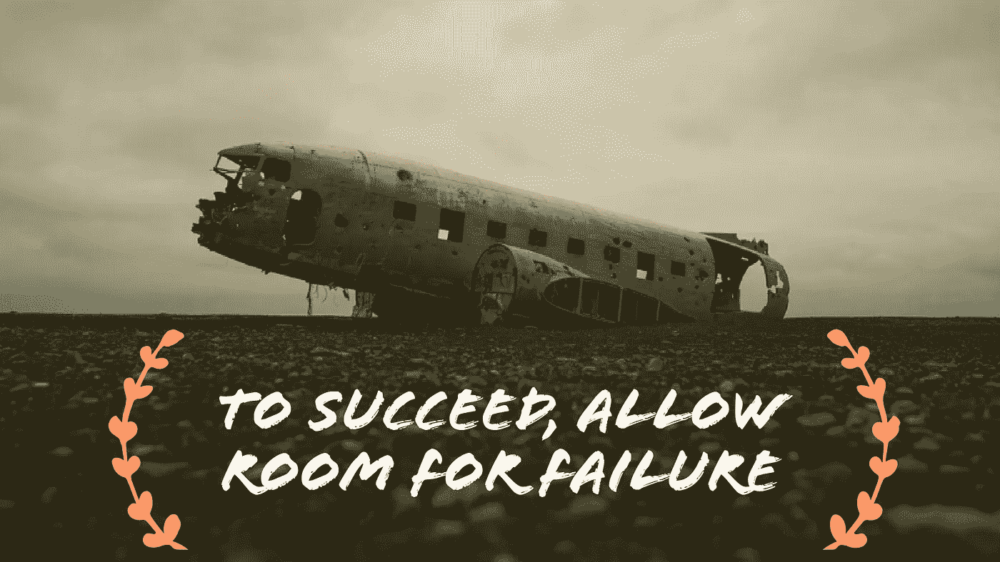

# 要想成功，就要给失败留有余地

> 原文：<https://medium.com/swlh/to-succeed-allow-room-for-failure-f4da4a2e7469>

## 如果对詹姆斯·邦德有效，对你也有效！

詹姆斯·邦德，一个典型的令人敬畏的偶像，在面对压倒性的危险时，不动一根头发，轻松地完成了异常复杂的壮举，经常让每个人震惊。我最近在看一些邦德电影，看到了我最喜欢的一个场景。(现在请注意，它不是最受欢迎的，因为它充满了动作，或者因为它的特点是可笑的酷车或其他什么。因为很傻所以很喜欢。)

它出现在《来自俄罗斯的爱》中，在火车车厢里邦德、女孩和坏人在餐车里吃晚餐的场景。坏人(邦德还不知道自己是坏人，他以为自己是另一个特工。)晚餐点白鱼配红酒。只有坏人才会做这种事！你应该吃鱼喝白酒。我不知道这是否准确，只是邦德后来评论说，当他点错酒时，他应该知道坏人是坏的。当詹姆斯意识到自己的错误时，已经太晚了。他凝视着枪管。

对我们所有人来说幸运的是，邦德能够扭转局面，从他的错误中恢复过来，拯救女孩，拯救世界，躲避直升机投掷的手榴弹，并表演各种完美的现实主义表演。唷！想想看，如果他没能康复，我们甚至都不知道皮尔斯·布鲁斯南是谁！你能想象一个没有皮尔斯·布鲁斯南的世界吗？是的，我想我也可以…

无论如何，从肖恩·康纳利扮演的詹姆斯·邦德身上我们可以学到一些东西。[最重要的教训是给失败留有余地。](http://www.michaelehenson.com/blog/start-over)

# 为失败留有余地

显然，没有人希望失败，尤其是如果失败的结果是坏人获胜，世界因为一个养着白猫(电影参考 ICYMI)的老家伙心情不好而爆炸。现实是我们最终会失败。有些人失败的次数甚至比成功的次数还多，如果你适当地失败了，那也没关系。我的意思是，如果你从成千上万次尝试中获得一次成功，赚了数百万美元或改变了世界，那就值得了，对吗？给失败留有余地不是失败的借口，而是你到达失败前克服失败的过程。我们如何做到这一点？好吧，让我们再来看看我们的好朋友邦德先生做这件事的两种方式。

# 拥有正确的心态

对失败最重要的准备是做好思想准备。詹姆斯·邦德训练自己的身体和精神。他从不放弃，从不怀疑自己，从不停止前进。想成功吗？做同样的事情。训练自己。寻找能让你在工作中更有效率和效果的导师、训练师和资源。学会在你的学科之外思考改进的方法。审视其他领域的成功，找出成功的原因，然后想办法将这些成功的特质运用到你的日常生活中。

另外，训练自己的心智。根除消极，全心全意相信自己，永不放弃。如果失败了，立即重新开始。克服那种告诉你你的成就必须完美无缺，否则它们“就不是真正的成就”的心态拥抱过程中的不完美，更好的是，为此做好计划！这样，当某些事情改变了你需要走的道路时，你就准备好去适应并继续进步。

# 拥有合适的工具

詹姆斯的处境很尴尬。枪指着他的脸，坏人手指扣着扳机，脸上挂着邪恶的笑容。幸运的是，詹姆斯有一个坏人不知道的秘密武器，一个把手里有催泪瓦斯的手提箱！非常有效。根据我的经验，没有什么比一点催泪弹更能扭转局面了…

拥有适合我们追求的工具是至关重要的。工具的类型可以根据你的努力而有所不同，但重要的是你要做一些研究，找到对那些成功的人有用(或没用)的东西。[你是作家吗？从杰夫·戈因斯、乔恩·阿科夫和无数其他人那里汲取信息、想法和建议。努力创建一家初创公司？听听像加里·维这样的人。找到成功人士，向他们学习，模仿他们，在你继续朝着目标前进的过程中，将他们的工具融入你的锦囊妙计中。](http://www.michaelehenson.com/blog/unashamedly-creative)

这看起来很简单，但是花时间[在你的生活中实施这些重要的提示](http://www.michaelehenson.com/blog/sustainablecreativity)将会带来巨大的不同。但是，不要指望一夜之间改变心态，那是一辈子的追求。如果你决定去做，并开始实施改变，你会比你想象的更快看到结果。它只是需要持续的努力。我知道你能做到！

这篇文章引起你的共鸣了吗？如果是这样的话，我希望你能和你的部落/社区分享一下！对对话有什么评论或补充吗？请在下面留下你的评论！别忘了订阅，关注我了解更多。感谢您的时间和关注！现在继续创作，并与世界分享。我们需要更多像你这样的人！

我认识的许多创意人员都面临着同样的挫折和内心斗争。这是一种流行病，但有一种方法可以[拥抱你的创造力](http://www.michaelehenson.com/blog/embraceyouridentity)，仍然是内心的负面声音，打破你的盒子，与世界分享你的艺术——*创意之旅*。一本充满见解和经验的电子书，旨在让你的创作追求更上一层楼。

# [点击这里获得免费的副本！](http://www.michaelehenson.com/opt-in)

## 这篇文章发表在 [The Startup](https://medium.com/swlh) 上，这是 Medium 最大的创业刊物，有 272，751+人关注。

## 订阅接收[我们的头条新闻](http://growthsupply.com/the-startup-newsletter/)。

