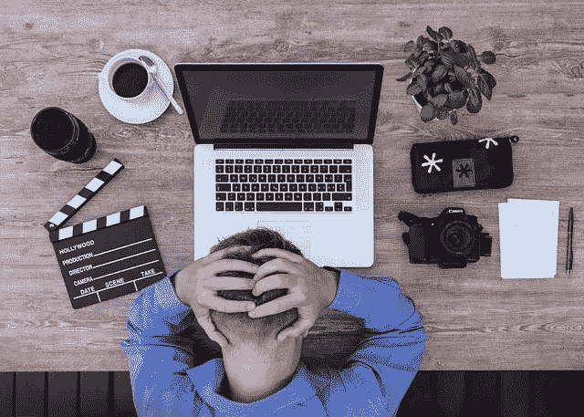

# 去 Vlog 还是去 Blog？这是第一次网上营销的问题！

> 原文：<https://medium.com/swlh/to-vlog-or-to-blog-thats-the-question-for-the-first-time-online-marketer-ac5fd78c1050>

[lukasbieri/pixabay](https://pixabay.com/en/filmmaker-youtuber-screenwriter-2838945/)

在过去的两周里，我写了几篇关于[写博客](https://ideavisionaction.com/tag/blogging/)的文章。写博客是一个伟大的[开始的第一项业务](https://ideavisionaction.com/entrepreneurship/read-this-before-you-start-a-website-or-blog/)。这是一个很好的方法来了解什么在商业中行得通，什么行不通。

博客教会你很多关于人性的课程。你可以在以后的工作和生活中运用这些经验。它帮助你[建立一个受众](https://ideavisionaction.com/entrepreneurship/the-only-tip-you-need-to-grow-your-audience-as-a-blogger/)，你可以用它来启动另一项业务。

即使你有另一个商业想法，先从市场营销开始也是一个好主意。最简单的营销形式是什么？是博客。至少在收到一位读者的[评论](/@snowmiser/i-would-also-add-that-blogging-is-not-really-the-best-documentation-format-e691e525fda2)之前我是这么想的。

这是开博客的另一个原因。你会从读者那里得到有价值的反馈和想法。我的读者指出，博客对于初学者来说不是最好的选择。读了他们的评论，我同意他们，但只是部分同意。

**视频日志的优势**

我的读者写道，vlogging 是记录你的过程的最佳选择，因为一旦你拍摄了视频，你可以将它用于不同的目的。

显然，你可以在 YouTube 上使用该视频，但你也可以编辑它，以便在 SnapChat、Instagram 和其他接受视频的社交平台上使用。此外，您可以提取音频并将其发布为播客。

我同意我的读者的观点，vlogging 提供了很多机会。然而，我不会这么快就说 vlogging 比 blog 好。我想问三个问题来决定哪一个更适合你。(记住，你需要[问正确的问题才能成功](https://ideavisionaction.com/business/use-your-curiosity-as-motivation-and-ask-the-right-questions-to-succeed/)。)

**问题 1:对你来说，哪种是天生的？写博客还是视频博客？**

有些人可以毫不费力地写作，但一谈到说话，他们就无话可说了。还有一些人可以流利地交谈，但在把想法写下来时，他们会卡住，不知道如何用书面形式表达自己。

显然，你需要选择最适合你才能的格式，并且你可以用这种格式持续地创作内容。

**问题 2:谁是你的目标受众？**

你的目标是消费者还是专业人士？你的项目是 B2B 业务还是 B2C 业务？如果你的目标是消费者，你最好选择视听形式。如果你的目标是专业人士，你最好用书面形式。

大多数经理可以在一分钟内浏览一篇文章，这将花费他们 15 分钟来听或看。所以，你不会发现很多经理在听播客或看 YouTube 视频。

**问题 3:哪种格式最适合你的项目？**

有些项目最好以书面形式记录，有些则以视听形式记录。如果你的项目是一个需要大量图表、公式、表格和参考资料的技术项目，你最好以书面形式记录下来。如果你的项目是一个娱乐项目，你最好使用视听格式。

**我的选择**

以下是我如何为我的项目回答这些问题。首先，我不是一个健谈的人。写作比和我说话更自然。我的博客的目标读者是专业人士、企业家和经理。

第三个问题的答案并不清楚。尽管我的博客不是技术性的，但它的目的也不是娱乐。所以，它介于两者之间。不过，既然前两个问题的答案已经很清楚了，那我就不需要考虑第三个问题了。

对我的项目来说，最好的选择是写博客。这就是为什么我在我的文章中主要关注博客，并给出关于博客的例子。无论是哪种情况，我讨论的大多数核心原则也适用于 vlogging。

**结论**

博客或视频博客是一个伟大的第一笔生意。在这两种形式中，你都会学到很多商业和人性方面的课程。

创业时，你最好先从营销开始。博客或视频博客是开始营销的好方法。

问题不在于开始写博客或视频博客。问题是从哪个开始，博客还是 vlogging。

答案取决于三个标准，什么对你来说是自然的，你的目标受众，以及你的项目。

*阅读下一篇:* [*在你开始一个网站或博客*](https://ideavisionaction.com/entrepreneurship/read-this-before-you-start-a-website-or-blog/) *或注册一份* [*每周简讯*](https://ideavisionaction.com/email-newsletter/) *之前阅读这篇文章。*

## 这个故事发表在 [The Startup](https://medium.com/swlh) 上，这是 Medium 最大的创业刊物，拥有 309，392+人关注。

## 在这里订阅接收[我们的头条新闻](http://growthsupply.com/the-startup-newsletter/)。

