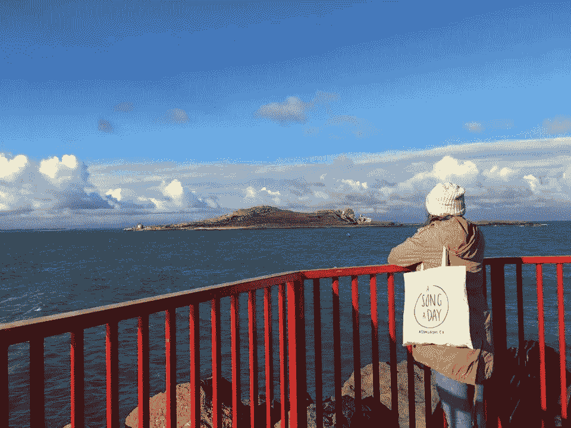
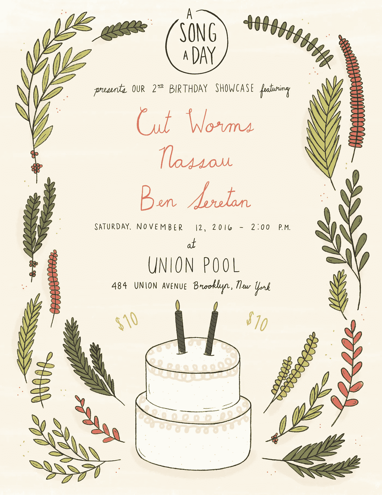

# 今天是我副业的第二个生日。这就是为什么这是相关的(也许)。

> 原文：<https://medium.com/swlh/today-is-my-side-projects-2nd-birthday-here-s-why-that-s-relevant-maybe-4cfbcc5bbab5>

今天早上醒来，我收到一个好朋友的短信，说“每天一首歌”废话。不知何故，我对生活如此分心，以至于忘记了今天是真正的里程碑日期。我更关心[的生日，而不是我自己的生日。这个项目是我的宝贝。我的激情。有时候我想揍他的脸，因为他善变。如果一天一首歌是一个人，我们的关系状态将是“这很复杂。”](http://www.asongaday.co/)

今天是它的两岁生日，这是一件大事，至少对我来说是这样。你看，这两年我投入的东西很少。在那之前，我已经放弃了大部分工作。两年前我离开了所有的公寓。我还没有这么长时间坚持一个锻炼计划或习惯(除非喝咖啡也算)。在两年之前，我已经离开了所有的浪漫关系，或者在中间的某个地方休息了一段时间。但是一天一首歌是一种不同的承诺。就像我的友谊一样。

我认为它的附带项目性质有助于保持我的承诺。人们依靠我来完成工作，但也知道这不是我的全职工作，所以当我不在的时候，他们会更加理解和同情。有更少的压力来执行和“展示”一个附带项目，这使它不那么可怕。我想你可以说我一直在谨慎行事。

也就是说，在过去的两年里，我们取得了许多缓慢而稳定的进步，值得庆祝！如果你不熟悉，[《一天一首歌》从完全偶然的](/@shannnonb/how-product-hunt-transformed-asongaday-co-from-an-email-to-friends-into-a-startup-in-3-hours-e6a6e5c3e14e#.ab4u5xyox)开始，很快成长为有意义而且(我要说…)美丽的东西。(谢谢，[我还有很多工作要做。我们绝对不是我两年后想的那样。当然，我本可以更卖力的。我本可以找到一个联合创始人并筹集资金。但是今年我选择去旅行，因此我变得更加快乐和健康。](https://medium.com/u/b8b4445269d0#骄傲。但是是我们的馆长社区让我继续前进。此外，我几乎可以去任何地方旅行，还能见到馆长，这给了我一种无以言表的感觉——所以我会选择“温暖而模糊”

<p id=)[**我们的首次展示。我们有三个令人难以置信的乐队/音乐家在演奏，他们让我非常兴奋。来吃玉米卷，喝饮料，见朋友，听伟大的音乐，支持当地的音乐现场。这是我儿时的梦想，我非常兴奋。**](https://www.facebook.com/events/167635797026611/)

Flyer by the talented [Sunny Eckerle](http://www.sunnyeckerle.com/)

最后，非常感谢大家的支持！感谢我们的策展人、订户、众筹支持者、朋友、家人、导师、善良的陌生人、传播消息的人。你太棒了，我爱你。

/咆哮。生日快乐，一天一首歌！