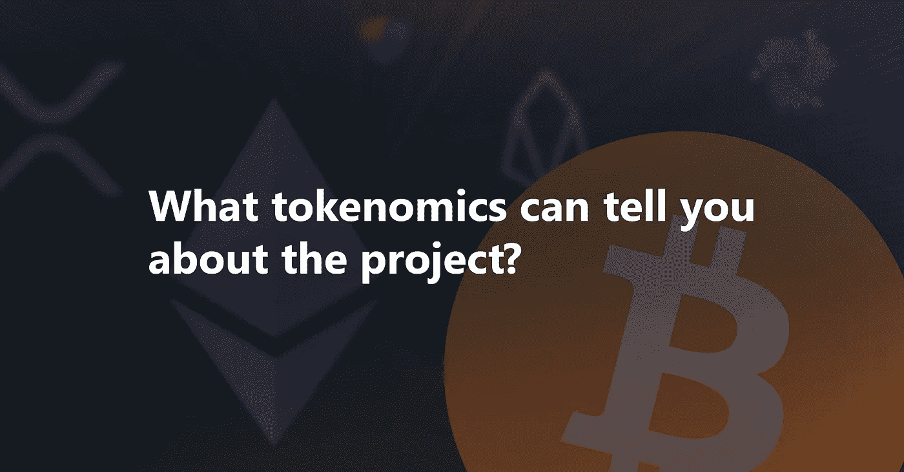
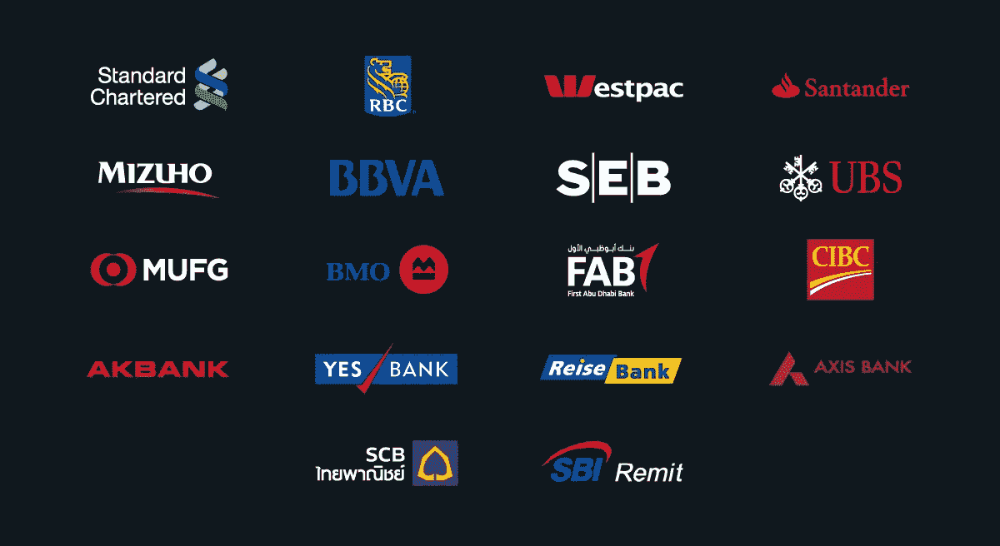
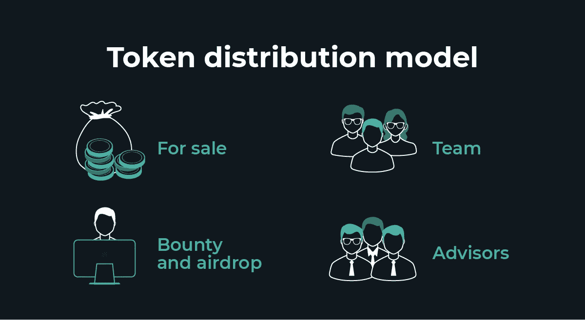
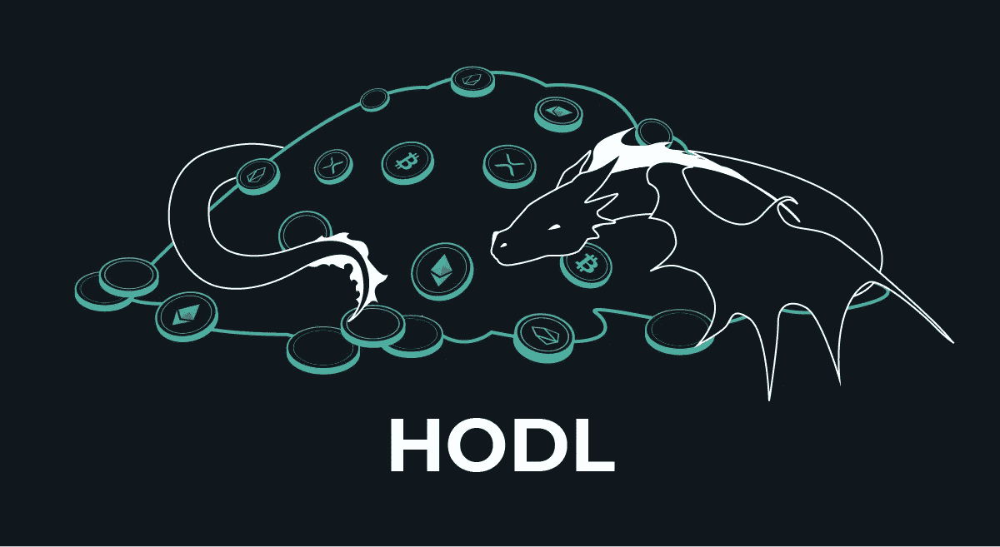

# 令牌组学是对令牌前景的研究

> 原文：<https://medium.com/swlh/tokenomics-is-the-study-of-token-prospects-984a9babda15>

令牌经济学是对一个成功的项目经济模型的乌托邦式的研究，它起源于一页纸和条款与条件之前。它决定了代币的定价原则和代币价值增减的根本原因。不幸的是，大多数项目没有对这些原则给予足够的重视，并随后做出许多有问题的市场投资，导致重大损失。

# **令牌功能**

如何在项目中使用令牌？

令牌用于证明**持有者在平台内的权利:**例如，Filecoin 令牌允许持有者在数千台高安全性计算机的硬盘上存储数据。STEEM 硬币赋予其持有人对 Steemit 平台上的内容进行投票的优先权。BNB 代币允许持有者在币安交易所打折支付佣金。在区块链新经济模式中，XEM 扮演了“区块生成”的角色

但这种模式也有弊端:随着代币价值的增加，平台上持有人权利的价格也随之上涨，可能导致需求减少，出现价格标签更优惠的竞争对手。

另一种模式认为**代币由现实世界中的物质价值或资产支持**——宝石和金属、艺术品等。Tether (USDT)和其他几十个将各种资产(Orebits、Sandcoin 等)令牌化的项目都是建立在这个模型上的。例如，单一数字电视将内容的所有权和许可权标记化。

一些代币赋予持有者从发行者那里获得服务的权利。此类代币被用作证券，为其持有者提供投票权或分红权等。DigixDAO token 赋予持有者投票权，并从与黄金价值挂钩的另一个 Digix token 的交易中赚取佣金。Primalbase token 让持有者有权使用公司计划用筹集的资金建造的商务中心的办公空间。

此外，还有一些代币**没有给持有者任何权利**，实际上只是五颜六色的糖果包装纸。

此外，代币的潜在持有人应当理解，项目创建者声明的意图(例如，代币由某种资产或债务支持)可能与现实不同，这是由法律或技术限制决定的。

# **示例:好令牌和坏令牌**

显然，在理想情况下，令牌将是项目不可或缺的一部分。一个很好的例子是区块链以太坊的气体。这个想法是以太是一个使用智能合约在区块链创建和运行 dapps 的平台。以太坊虚拟机使用以太或气体作为支付手段来执行任务，以太令牌是整个平台的集成部分。这是一个很好的象征。

让我们撇开数百个没人知道的无用代币，来谈谈一个举世闻名的独特“坏例子”——Ripple。当我们谈到 Ripple 时，我们会想到 XRP 令牌。然而，XRP 与 Ripple 没有直接关系，这与普遍接受的趋势相矛盾(即令牌与平台之间存在不可分割的联系)。它的技术被世界上许多不同的银行使用，但是这些银行不使用 XRP 令牌。

***Banks that use Ripple solutions***

我们来分析一下 Ripple 及其产品:

**xCurrent** 是一款主要产品，可以让银行在不从根本上改变其标准系统的情况下，更高效地进行跨境转账。xCurrent 使用 RippleNet 和区块链 Ripple，但不使用 XRP 令牌。

**xVia** 是一种 xCurrent 扩展，为非银行企业(如支付系统)提供高效的银行服务。它也不使用 XRP 币。

xRapid 是唯一使用 XRP 的 Ripple 产品。其目的是在新兴市场交易时增加流动性。然而，由于 XRP 的波动性，银行对这种产品持谨慎态度。

事实上，上述所有大型银行都只使用 xCurrent，而使用 XPR 的 xRapid 只有一家小型非银行组织使用:来自墨西哥的 Cuallix。很有趣，不是吗？因此，尽管 Ripple 在发展壮大，变得越来越富有，但 XRP 投资者只能自怨自艾。这是一个不好的令牌。这是一个宣称的意图与现实不符的例子。

我们探索了对代币性质的理解，但这不足以理解代币的投资前景；此外，我们需要了解令牌的分发模式、持有期限以及在不同条件下其行为的场景。

# **令牌分发模式**

这个模型描述了持有人的股份。模型的设计和有效性可以影响持有者的轮换(例如，便宜或免费的代币对其所有者来说价值很低，他们通常会很快处理掉它)。以下是一些令牌分发类别:

● **待售**

项目最初在市场上销售的令牌的百分比越高，项目就越分散(至少在理想世界中；在现实世界中，这些代币应该在不同的独立购买者之间很好地分配)。

● **团队**

一部分代币作为奖励分发给团队成员。

● **奖金、空投等**

用户因完成某些操作或根据某些标准免费获得令牌(例如，当以太坊或 EOS 区块链系统中的令牌达到一定数量时，如果新的项目令牌在这些平台上发布，空投令牌将被转移给用户)。通常，分发的廉价代币越少，最终价格越高。总的来说，赏金计划失去了动力，使用频率越来越低。另一方面，空投试验——向广泛的参与者免费分发项目代币——才刚刚开始。有些情况下，所有令牌都是通过 airdrop 免费分发的，这是一个独立的令牌组学模型，非常有趣。

● **顾问**

理想的顾问是在某个领域精通技术的意见领袖，以及推动项目、参与项目开发或吸引投资并获得回报的专家。在大多数情况下，顾问对存储代币不感兴趣，因此，他们的股份也经常被冻结。

在设计令牌分发模型时，确定令牌持有者存储和使用令牌的动机至关重要。根据斯坦福大学研究运营和统计的数学方法领域的弗莱德克鲁格博士的令牌组学定律之一，推广持有令牌的理由(在最终用户和团队成员中)会积极影响令牌在市场中的行为。这一事实不仅对于博士持有者来说是显而易见的，对于大多数用户来说也是如此。

考虑不同控股公司集团(包括团队和投资基金)冻结期之间的差异也很重要。为了项目的可靠和可持续发展，应该事先就所有这些参数达成一致。

# **分析代币的数字特征**

弗莱德克鲁格对加密货币市场进行了详细的[分析](/workcoin/how-to-think-about-tokenomics-b3da509444e5),并引入了允许人们使用代币特征来确定价格趋势的法律。这些法律适用于已经发布到市场上的项目，但在为新的创业公司开发 tokenocomic 模型时，也有一些要点应该考虑在内。

我们来分析一下变量:

● **TS** (总供应量)—可用代币总数

● **P** (价格)—当前代币价格

● **HT** (持有时间)——参与者在出售之前持有代币的时期(以一年的部分为单位)。

● **TV** (交易额)—年交易额(美元)。

● **GTV** (交易量增长)——一年交易量的增长。增加电视的价值意味着对代币的需求越来越大(这真的很好)。据此，GTV 应该是> 0%。

● **TT** (交易时间)—交易时间。

● **TMCAP** (代币市值)—代币市值= TS х P

● **R** (交易量与交易市值之比)— TV / TMCAP。每年交易量与交易市值的比率。

● **R1** (R 根据交易时间调整)— R / TT。根据交易时间调整的 r 值

● **R2** (根据保持时间调整的 R)—R/HT。第二个 R 值表示令牌保持时间。

所有的规律都可以在[克鲁格的博客](/workcoin/how-to-think-about-tokenomics-b3da509444e5)中找到，所以让我们看几个特例来了解代币的所有特性。

根据克鲁格第四定律，代币上市后，每年的交易量与交易市值之比应该远小于 10。这个值表明硬币进一步增长的潜力。让我们以一个日均交易量为 50 万美元的代币为例。一年之内，我们有 1.825 亿英镑。例如，如果市值为 2000 万英镑，R 值将为 9125 英镑——不太好。但是，如果上限是 200 米，R = 0.9125，这个令牌将非常适合投资。

如果每年的资本化比交易量高几倍，公司就赚到了利润，代币的进一步增长也就有了前提。

比如我们来分析一下 Stellar:资本化 4500M，日均交易量 780M，TV = 284700M，R = 284700M / 4500M = 63。不是很好，对吧？这是一个很好的例子，说明了这种简单分析的有效性。

第五定律说，购买代币必须有理由，而不仅仅是收集代币。一些项目没有足够的动机购买代币(例如 Steem 或其俄罗斯同行 Golos)。这种代币一旦赢得就立即出售。结果，代币开始贬值。例如，购买 Steem 令牌的动机是增加投票权，但如果你想赚钱而不是投票，比如 98%的用户群，你会立即出售这个令牌。

根据第八定律，卖方应该成为买方。卖家有必要自己在市场上找到买家，而不是用代币交换法定货币或其他加密货币。该定律与第一定律相关:参与者应该想要持有代币，从而增加 HT 的值。

**总结**

一个好的记号组学模型必须遵循这些通用的建议:

1)令牌在项目工作中被积极使用，并且是必不可少的元素；

2)代币价值的增加不影响对服务的需求；

3)令牌的持有者受到系统的鼓励；

4)代币有几种行为场景(针对尚未向市场发布的项目)以及年交易量与公司市值的良好比率。

你不应该低估令牌组学的重要性，因为它在很大程度上决定了项目最初几年的发展。因此，建立有趣的、有价值的项目，用一个有明确价值的令牌。如果您不确定您的系统是否需要令牌，请不要使用区块链。如果现在市场看跌，你就没事了。但只有具备良好令牌经济学的初创公司才能在当前和未来的陷阱和低迷中生存下来。

## 这篇文章发表在 [The Startup](https://medium.com/swlh) 上，这是 Medium 最大的创业刊物，有+ 382，862 人关注。

## 订阅接收[我们的头条](http://growthsupply.com/the-startup-newsletter/)。

