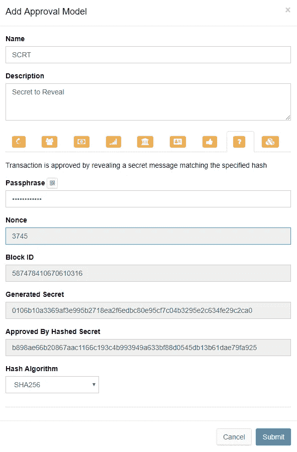

# 太多秘密

> 原文：<https://medium.com/swlh/too-many-secrets-9730f2293e83>

## 热情的合同需要安全且易于使用的秘密

Secrets — Photo by [Gabby Orcutt](https://unsplash.com/photos/7E29j_4GBNI?utm_source=unsplash&utm_medium=referral&utm_content=creditCopyText) on [Unsplash](https://unsplash.com/search/photos/hiding?utm_source=unsplash&utm_medium=referral&utm_content=creditCopyText)

在电影[球鞋(1992)](http://www.imdb.com/title/tt0105435/) 中，有一个主角正在调查的神秘公司叫做“Setec 天文学”。有一个关键的场景是，罗伯特·雷德福放下拼字游戏瓷砖，拼出了“Setec Astronomy”这个名字，然后开始重新排列字母，发现这个名字是“太多秘密”的变位词，该公司正在从事破解代码的业务。时间快进 26 年，破解密码不再是好莱坞大片的专利——许多人通过泄露秘密破解私人密钥和劫持加密货币账户，过上了体面的生活。

在我之前的[轻量级契约文章](https://hackernoon.com/hashed-secrets-to-the-rescue-1ddc1daff83e)中，我解释了我们如何使用一个秘密散列来确保触发契约的事务，以及作为响应由契约提交的事务，可以同时被批准或者同时被忽略。这就提出了一个问题:如何生成一个好的秘密？

我们产生的秘密必须是:

1.  难以破解—理想情况下，它应该像帐户密码一样强。
2.  unique-机密必须是唯一的，因为一旦机密被泄露，其散列就永远不能被安全地重复使用。
3.  简单易记——在某些情况下，我们需要在提交散列后很久才揭示秘密。理想情况下，记住一个秘密应该是简单的，甚至在秘密丢失的情况下，秘密生成器可以恢复秘密。

一个天真的尝试是把我的狗的名字和我的猫的名字连在一起，并添加我的结婚日期作为额外安全的后缀。这个秘密的确很容易记住，但它不是唯一的，一旦我把它透露给区块链，我就再也不能使用它了。此外，如果吴决定用他的散列法来破解它，这当然是不安全的。在末尾添加一个计数器将保证唯一性，但对于配备有[彩虹桌](https://crackstation.net/)的攻击者来说，这几乎没有帮助。

但是等一下，作为一个热情的用户，我已经拥有了一条不可能被暴力破解的信息:我的账户密码。我们能用它做些什么吗？

我们可以使用密码短语本身作为秘密吗？当然不会，因为我们不想把它透露给区块链。我们可以使用密码的散列作为秘密吗？不唯一。该死的。如果我们在密码末尾添加一个计数器，然后对其进行哈希运算，会怎么样？现在我们有所进展，这是安全和独特的。

密码短语和一次性唯一数字(我们称之为“随机数”)的连接散列将生成唯一的秘密，只要您记住随机数，就很容易记住该秘密。我们假设您记得密码，因为如果您不记得，一切都会丢失。

这是一个非常好的秘密生成过程:每当我们需要一个秘密时，我们将 nonce 加 1，将其与密码短语连接，使用 SHA256 对其进行哈希运算，并将其用作秘密。当提交散列秘密时，我们当然再次散列它。

但是仍然存在问题，如果我们需要生成大量的秘密，比如数百万个，随机数就变得很难记住。如果我们在多个工作站上生成秘密，则很难确保现时唯一性，因此存在我们不时重复秘密的风险。

**解决方案——生成无法破解的、唯一的、简单易记的秘密，甚至可以在丢失的情况下被生成器复制**

为了解决这个问题，我们需要添加另一个扭曲，我们连接到秘密的末尾，已经由密码+ nonce 组成，一个块的块 id 是过去的“nonce”块，我们将 nonce 的范围限制在 1 到 9999 之间。然后我们散列得到的字符串，并把它作为一个秘密。当提交带有散列秘密的交易时，我们再次散列这个秘密，并且一旦我们验证了契约操作，就公开它以批准我们的交易。

我们的新秘密是安全的，因为它是基于只有我们知道的帐户密码。它是独一无二的，因为它基于递增的计数器和每分钟都在变化的块 id。最后，这很容易记住，因为我们需要记住的只是生成秘密时的块高度和四位随机数。

即使我们忘记了我们的秘密，我们也可以很容易地恢复它，我们需要做的只是检查每个积木高度的 10000 个组合，这是一个任何现代工作站都可以执行的简单计算。

Generate a Secure Secret

## 这篇文章发表在[《创业](https://medium.com/swlh)》上，这是 Medium 最大的创业刊物，有+393，714 人关注。

## 订阅接收[我们的头条新闻](http://growthsupply.com/the-startup-newsletter/)。

