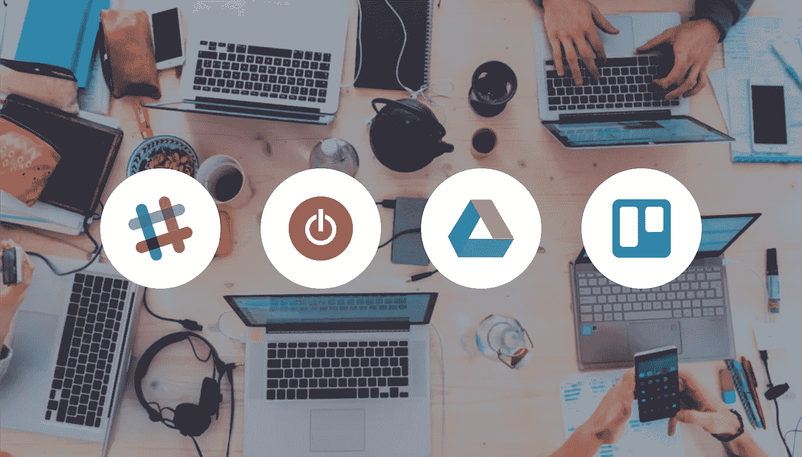
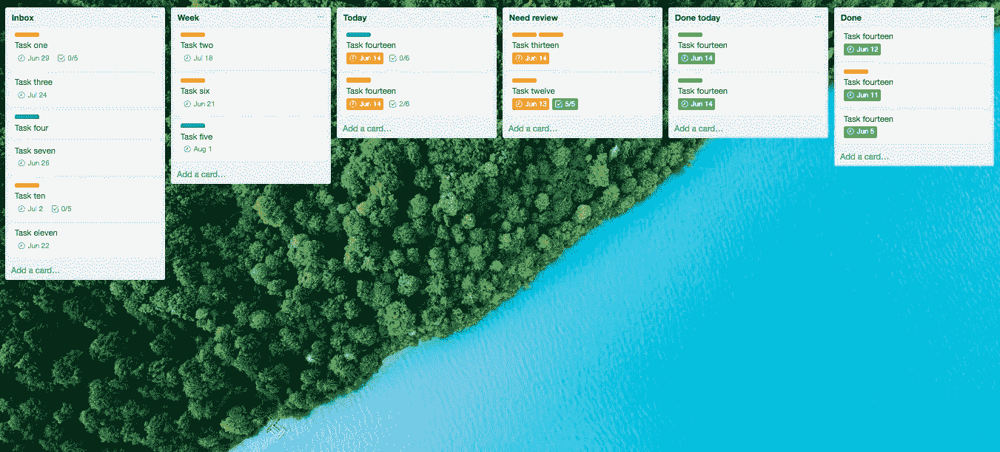
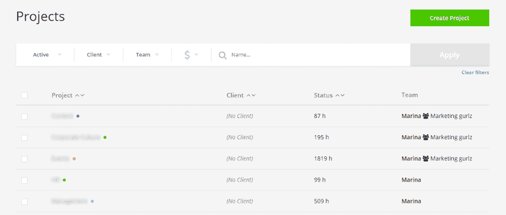
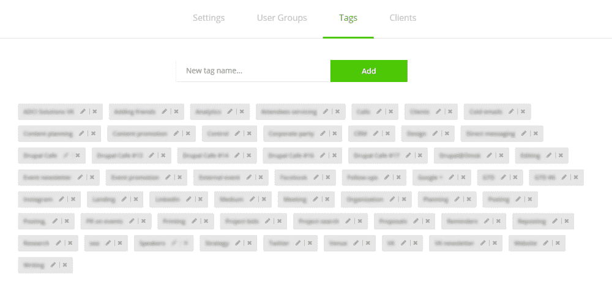

# 高效团队合作的 4 个免费工具

> 原文：<https://medium.com/swlh/tools-for-teamwork-332fb3dfa271>

[by ADCI Solutions](https://www.adcisolutions.com/knowledge/4-free-tools-efficient-teamwork?utm_source=medium&utm_term=four-tools)

有很多很好的工具来组织团队合作。实际上有太多了，很难选择合适的。

> "团队合作是让普通人取得非凡成就的秘诀."—伊凡尼·伊诺克·奥诺哈

在本文中，我将与您分享我们在营销部门使用的一系列工具，以跟踪谁在做什么，最大限度地提高效率，并简化沟通过程。值得一提的是，本文中的所有工具要么完全免费，要么有免费计划(我们只使用免费的)。

好吧，我讨厌冗长的介绍，所以废话不多说，让我们来看看工具列表。

我将按照工具在我们工作流程中的实施顺序来描述它们。

> "有效的团队合作始于沟通，终于沟通."—迈克·沙舍夫斯基

当我们的部门只有一个女孩和我自己，过程的规模很小的时候，我们不需要很多工具来管理它们。我们只是需要互相交流。这就是为什么我们立即开始使用的第一个工具是 Slack messenger。

# 沟通——松弛

对于工作交流来说, [Slack](https://slack.com/) 是个不错的选择。除了常规的私人聊天之外，它还允许创建私人群聊、开放频道，甚至可以邀请团队之外的人(如客户)的频道。此外，它允许管理几个团队，打电话，并建立与其他商业工具的集成，如 Google Drive，Zoom，GitHub 等。还有一个手机应用程序。

我们使用的免费计划允许搜索多达 10k 条消息、多达 10 个应用和集成、一对一视频通话和 5 GB 总存储。是的，有时候在聊天记录中保存更多的信息会很好，但是总的来说对于大多数任务来说已经足够了。

由于我们有许多共同的任务，我们需要一些可以协作使用的工具。在我们的例子中，我们有 Google Drive。

# 文档和文件管理— Google Drive

[Google Drive](https://www.google.com/drive/) 是一套最常用的团队合作工具——文档、表格、幻灯片等。—以及文件存储。免费计划允许存储 15 GB 的数据，这对于一个小部门来说很好。如果您需要存储更多数据，您可以随时切换到其中一个高级计划，获得 100 GB、1 TB 或 10 TB 的容量。

我们有许多内容管理任务，例如，使用 Google Docs，我们可以同时处理一个文本，并通过强大的自动保存功能实时查看变化。此外，伟大的功能是访问管理。您可以通过邀请几个特定的人查看、评论或编辑文档来打开文档，您可以将访问权限授予每个拥有该文档链接的人，或者您可以使它对网站上的每个人都开放。

嗯，我不知道还有什么工具可以如此方便地协作处理文档。如果你有，请在评论中分享。

随着业务规模和团队人数的增长，仅仅通过 Slack 交流和通过 Google Drive 共享文档已经不足以满足高效工作的需求。我很难记住所有的任务和我需要检查和做的一切。所以我开始寻找一个容易实现和使用的任务跟踪器。

# 任务跟踪器— Trello

正如 Trello 网站声称的那样，它是管理项目和组织任何事情的简单、自由、灵活和可视化的方式。Trello 使用看板计划系统作为其项目管理方法的基础。允许为您的项目创建电路板。每个纸板都包含卡片列表，可以按照您喜欢的方式进行分组。最常见的列表有:待办事项、待办事项、进行中、审核、完成。但是你也可以列出有用的信息、工具、阅读等清单。只有你的想象力和商业目标才是极限。

The example of how a Trello board can look like

## 我如何组织我部门的工作

我的团队中的每个成员都有一个个人董事会，其中包含以下必需的列表:

*   **收件箱**——这是我为每个团队成员创建新任务的列表，因此让他们自己计划什么时候开始做这些任务，以便在截止日期前完成。
*   **周**——每周一，我的团队成员会将一周内应该完成的所有任务移到这个列表中。
*   今天 —每天早上，团队成员都会将当天应该完成的任务添加到这个列表中。
*   **需要审核**——他们一完成一项任务，就把它移到需要审核列表中，并在卡片上给我贴上标签，所以我知道我应该检查它。如果任务按预期完成了，我会添加一条注释，说明一切都很好，然后一个团队成员会将它移到“今天完成”列表中。如果任务的结果需要改进，我写下反馈，团队成员将其移回今天列表，完成任务，并将其返回给需要评审的人。
*   **今天完成的** —在一个工作日结束时，一名团队成员会在此处添加当天完成的所有任务，这样我就可以检查工作效率，并再次检查任务，以防我们遗漏了什么。如果一切正常，我会将任务转移到完成。
*   **完成** —这里是所有完成的任务。我通常每季度归档一次这些任务。

你可能已经注意到了，有些单子是我自己无法改变的。那些是**周**和**今天**。我认为不直接干预团队成员的周计划和日计划很重要。这让他们能够明智地分配时间，优先考虑自己，从而变得更加负责和独立，并提供了时间管理这种软技能的发展。

此外，还有我们一起使用的列表。是的，我向**收件箱**添加任务，但是团队成员也可以自己添加任务。他们使用**收件箱**来完成这个任务。我们一起处理**中需要审核**的卡片，但只有在团队成员将卡片移到那里之后。我们还一起处理今天完成的**中的卡片**，但必须指出的是，我从未将卡片添加到今天完成的**中**，团队成员也从未将卡片从今天完成的**移至完成的**中**。**

**当然，我们都可以评论任何列表中的任何卡片。上面提到的规则仅适用于创建新卡和在列表之间移动它们。**

**随着过程规模的增长，我感到有必要衡量我的团队成员的工作效率(以及我自己的)。为了找出实现一个特定的结果需要多少时间，我实现了一个新的工具——时间跟踪器。**

****

# **时间跟踪器— Toggl**

**[Toggl](https://toggl.com/) 是一个简单易用的工具时间追踪。我最喜欢的功能是一个浏览器扩展，允许在任何地方使用 Toggl，包括我们已经在使用的所有工具——SLAсk、Google Docs、Trello 等。这意味着你甚至不需要让 Toggl 一直开着就能让所有的时间都被跟踪(不过我还是一直开着的，哈哈)。**

**Toggl 也有免费和付费计划。我们使用一个免费的，我必须承认这是绰绰有余，唯一重要的是不包括在免费计划是关于你的效率的见解。如果你需要这个应用程序的帮助，你可能需要切换到一个每月 9 美元起的付费计划。**

**我为我们的团队创建了一个工作区，邀请了我的团队成员，添加了项目(我们部门的工作领域)。如果你在一个特殊的项目上工作，比如一个事件，一个 IT 项目，等等。，您可以为它们中的每一个创建单独的项目。有些项目是整个团队共有的，有些只是我的责任。**

****

**Projects page in Toggl**

**如果您需要指定您投入的时间，您可以为跟踪的活动创建标签。这将使报告创建过程更加容易。我们对特定的项目有特定的标签，甚至还有一个文档，里面有关于如何使用它们的规则。**

****

**Tags page in Toggl**

**该工具允许查看你的活动的总结报告:你每天、每周、每月、每年跟踪了多少时间；你在每个项目上花了多少时间，每个标签，等等。**

# **结论**

**这是我用来建立部门工作流程的 4 个主要(免费)工具。是的，它们非常基本，但它们仍然确保不间断的高效工作。我们总是在 Trello 板上看到最重要的任务，我们在共同的 Google Docs 和 Sheets 中合作，我们高效地度过每一分钟，并在共同的 Slack 聊天中分享迷因和支持。**

## **你在团队中使用什么工具？在评论中分享。**

**阅读更多关于可以用来提高性能和节省时间的强大工具的信息:**

** [## 如何实现工作与生活的平衡

medium.com](/series/how-to-achieve-work-life-balance-78da51ac3688)** 

**这篇文章最初发表在[ADCI 解决方案网站](https://www.adcisolutions.com/knowledge/4-free-tools-efficient-teamwork?utm_source=medium&utm_term=four-tools)。**

***作为一名国际公共演说家，玛丽娜·佩希分享了她在领导力、组织发展和营销方面的经验。你可以在* [*阅读她的其他文章她的中简介*](/@marina.paych) *或者* [*加入她的免费邮件列表*](https://upscri.be/a2bfdb/) *。***

****

## **这篇文章发表在 [The Startup](https://medium.com/swlh) 上，这是 Medium 最大的创业刊物，拥有+ 373，071 名读者。**

## **在这里订阅接收[我们的头条新闻](http://growthsupply.com/the-startup-newsletter/)。**

****