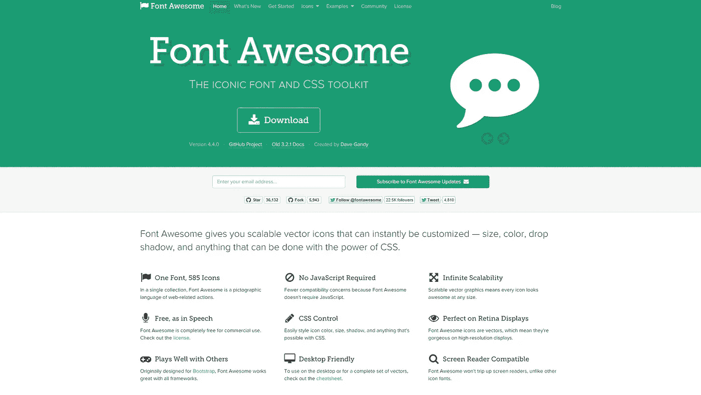
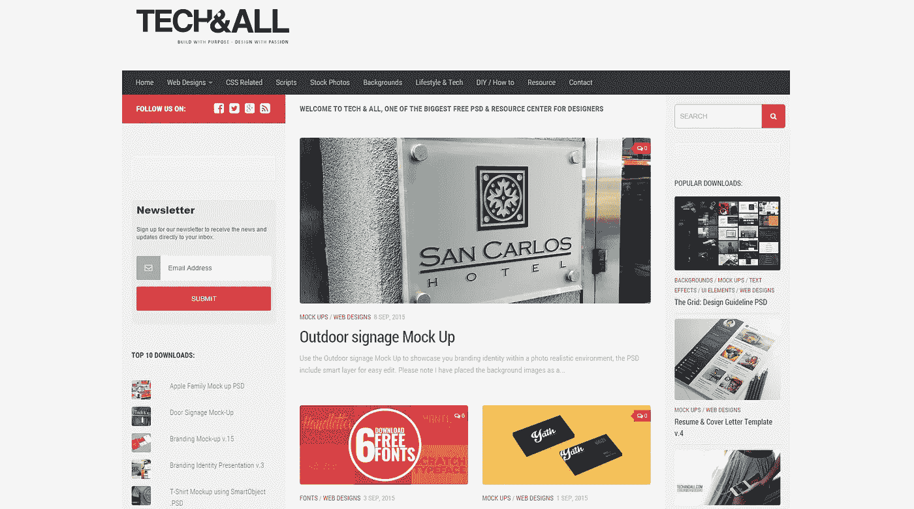
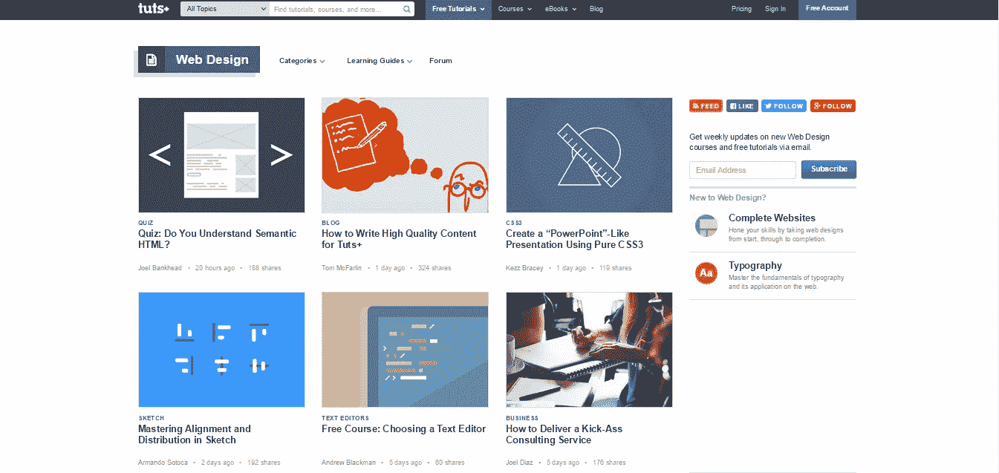
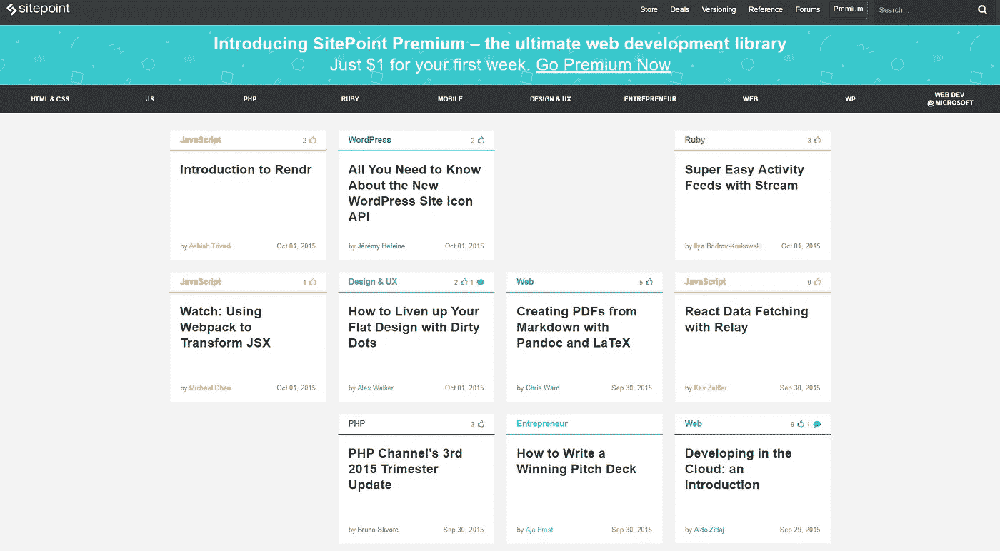

# 网页设计师的最佳工具

> 原文：<https://medium.com/@order_group/tools-for-web-designers-d49011ee08dc>

为了优秀的网页设计师！

任何一个优秀的网页设计师的工作的一个重要部分是保持与趋势工具的同步，以减轻他的日常工作。每天都有数百篇
关于网页设计、新工具、脚本等的文章。不可能全部读完或看完！在本帖中，我们将向你展示在日常生活中有用的工具，我们还将提到帮助你战胜互联网深渊的网站；)

# UX 清单

你要把一个现成的网站交给客户吗？你确定你已经做了所有的事情？UX 清单是网页设计师帮助计划他们的项目的备忘单，或者它可以作为一个清单，在那里你可以勾掉已经完成的工作阶段。

[UX 清单](https://uxchecklist.github.io/)

UX checklist Screenshot

# 用户界面名称

名称生成器。我们有 45 个国家可供选择！

[用户界面名称](http://uinames.com/)

# 字体真棒

在这里你会发现可缩放的矢量图标，可以通过 CSS 自由定制。

[字体牛逼](http://fortawesome.github.io/Font-Awesome/)

Font Awesome Screenshot

# 完美图标

创建社交图标的工具(使用生成的 HTML 和 CSS)

[完美图标](http://perfecticons.com/)

Perfect Icons Screenshot

# 菠萝. io

网站设计者和开发者的链接聚合器。不要错过任何东西！

[菠萝. io](http://pineapple.io/)

# 窗口大小调整器

调整浏览器窗口大小以模拟不同的屏幕分辨率！

[窗口大小调整器](https://chrome.google.com/webstore/detail/window-resizer/kkelicaakdanhinjdeammmilcgefonfh/details?hl=en)

# Html5 网站

关于 HTML5 最有趣的页面集合。

[Html5 网站](https://html5sit.es/)

HTML5 Sites screenshot

# Html5 周刊

没有时间浏览多个页面来搜索新的内容？订阅 HTML5 每周简讯，在收件箱中获取有趣的内容。

[Html5 周刊](http://html5weekly.com/)

# 免费游戏

在 Freebbble 上可以找到很多免费商品——大量的模板、用户界面、登陆页面、引导程序和动画。

[免费游戏](http://freebbble.com/)

Freebbble

# 第一个网页设计师

一个由数码爱好者社区创建的关于网页设计的特别博客。首先，阅读[这篇](http://www.1stwebdesigner.com/learn-web-design-course/)帖子。

[第一位网页设计师](http://www.1stwebdesigner.com/)

# 免费昆虫

伟大的网页设计师免费资源，包括模板，用户界面和插件。

Freebiesbug Screenshot

免费臭虫

# 用户界面空间

另一个免费的网站。主要是 UI 图标和实体模型。

[UI 空间](http://uispace.net/)

UI Space Screenshot

# Pttrns

浏览移动设计模式、UI 工具包和 UI 元素。

[Pttrns](http://pttrns.com/)

# 平面用户界面颜色选择器

如果你期待创造一个伟大的平面设计，使用这个颜色选择器。如果你想了解更多关于调色板的知识，请阅读我们的[贴出的最佳调色板。](/@order_group/tools-for-designers-color-palettes-335181d612c3)

[平面 UI 颜色选择器](http://www.flatuicolorpicker.com/all)

Flat Ui Color Picker Screenshot

# UI 云

世界上最大的用户界面设计数据库。UI 和 UI 包的元素供下载和启发。

[UI 云](http://ui-cloud.com/)

UI Cloud Screenshot

# 技术和所有

为网页设计者提供资源的另一个页面。你会发现脚本，模板，模型，UI 工具包和元素，导航，脚本和许多其他东西。

[技术&全部](http://www.techandall.com/)

Tech&All Screenshot

# 网站灵感

不知道为另一个网站做什么？你缺乏灵感？Site Inspire 会让你重回正轨。页面可以通过类别、类型、平台和风格进行过滤和查看。

[现场激发](http://www.siteinspire.com/)

# 打开盖子

来自不同类别的 jQuery 插件的组织和大的基础:UI、媒体、输入、导航或动画和效果。

[去头](http://www.unheap.com/)

Unheap screenshot

# 解开它

…让自己成为占位符就好；)

[解开它](https://unsplash.it/)

# AWWWards

被奖励的页面，那是最好中的最好。

[Awwwards](http://www.awwwards.com/)

Awwwards screenshot

# WebAppers

网页设计师的绝佳资源:文章、插件、框架、
关于主机的信息等等！

[WebAppers](http://www.webappers.com/)

# 古德伊

什么是好的 UI？你可以在 GoodUI 网站上找到这方面的技巧和窍门。易于获取的信息和赏心悦目的外观。

[古德伊](http://goodui.org/)

GoodUI screenshot

# 响应设计周刊

另一份时事通讯，这一次是每周在你的邮件上关于回应的新鲜部分。

[响应式设计周刊](http://responsivedesignweekly.com/)

# 科德罗普斯

在 Codrops 上，您可以找到关于 web 开发和设计技术的教程、插件、文章以及解决围绕创建网页出现的问题的想法和灵感。你可以找到组件，网页和布局的概念。名副其实的矿！

[水滴](http://tympanus.net/codrops/)

Codrops screenshot

# 三角化

一个在三角形的基础上生成漂亮网格的 app，可以作为 SVG 或者 CSS 背景。

[三角化](http://qrohlf.com/trianglify/)

# CSS 技巧

网站致力于前端，而不仅仅是 CSS。你可以在上面找到现成的代码片段，视频教程，广泛的论坛，在那里你可以与他人分享知识，甚至工作机会。

[CSS 招数](https://css-tricks.com/)

CSS Tricks screenshot

# 记事本++

支持多种语言的网站管理员记事本。它的特点是语法突出，PCRE，自动完成和更多。

[记事本++](https://notepad-plus-plus.org/)

# 舷板

你会觉得所有必要的工具和灵感都在这里，在一个地方。尤其是张秀坤·塞拉芬经营的两块板(一根杆子就能搞定！)需要特别注意:网页设计和前端。你会发现 500 多种资源，包括博客、文章、框架、图标、灵感、播客等等。坐下来随便看看。

[主板](http://enboard.co/frontend/)

Enboard screenshot

# Kraken.io

北海巨妖是一个优化图像的应用程序。从两种模式中选择一种
:有损模式，减少多达 90%的文件，或无损模式，文件不会失去质量。

[Kraken.io](https://kraken.io/web-interface)

# 用户界面

可用于实体模型的头像集合。

[用户界面界面](http://uifaces.com/)

UI faces screenshot

# 名词项目

图标的伟大来源(超过 100，000！)在知识共享协议下获得许可。可作为 png 和 SVG 下载。对于 Mac 用户来说，还有一个名为 Noun(10 美元/月)的应用程序，通过它我们可以通过拖放到 Adobe、Sketch、Power Point、即时通讯或电子邮件等任何程序来下载图标。

[名词项目](https://thenounproject.com/)

# 模板化的

Templated 是在 Creative Commons 下许可的 CSS 和 HTML5 中的 800 多个模板的集合。

Templated Screenshot

[模板化](http://templated.co/)

# Tuts+

在 Tuts+上，你会找到大量给网页设计师的技巧和教程。

[Tuts +](http://webdesign.tutsplus.com/)

Tuts screenshot

# 粉碎杂志

在 Smashing Magazine 上，你可以找到来自代码和网页设计领域的新闻。

[砸弹匣](http://www.smashingmagazine.com/)

# 站点点

这个伟大的网站为网络专业人士——开发者、设计师、自由职业者和企业家提供了最好的文章。

SitePoint Screenshot

[站点点](http://www.sitepoint.com/)

# Ezgif

创建、优化和编辑 gif 的平台。

[Ezgif](http://ezgif.com)