# 面向程序员的十大 Java 书籍——一直都很棒

> 原文：<https://medium.com/swlh/top-10-java-books-for-programmers-all-time-great-82b0ee0b831a>

## 从核心 Java 到最佳实践，从单元测试到 Spring 框架，Java 程序员的一些最佳书籍。

[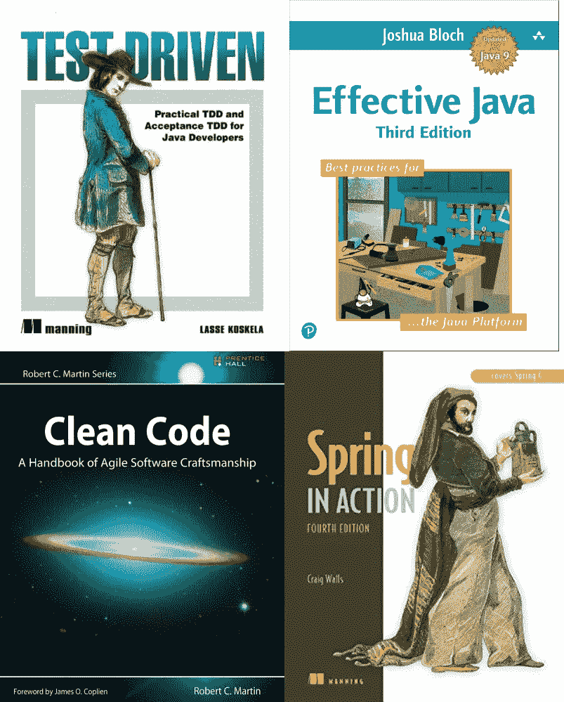](https://www.amazon.com/Effective-Java-3rd-Joshua-Bloch/dp/0134685997/?tag=javamysqlanta-20)

All-Time Great Books for Java Programmers

如果你是一名 Java 程序员，并且想知道阅读什么来提高你的 Java 知识或者[成为一名更好的 Java 开发人员](https://javarevisited.blogspot.com/2018/05/10-tips-to-become-better-java-developer.html)，那么你来对地方了。

在本文中，我将分享一些最好的 Java 书籍。这些书经受住了时间的考验，随着时间的推移变得越来越有意义。

不管你是现在读还是以后读，你都会有很多东西要学，这就是为什么我认为它们是有史以来最伟大的 Java 书籍。

我个人是个爱看书的人。我的图书馆里有数百本书和电子书。当我还是个孩子的时候，我看了很多漫画，包括**超级突击队员 Dhruv** ，他是我最喜欢的角色之一，因为他的故事中的科学主题，以及他如何在没有任何超能力的情况下，仅仅通过使用他的智慧、敏锐和简单的科学知识击败他更强大的敌人。

当我成为一名程序员时，我对书籍的热情继续着。我读的第一本 Java 书，除了大学的课本，就是 [Head First Design Pattern](http://www.amazon.com/dp/0596007124/?tag=javamysqlanta-20) 。这本书彻底改变了我对 Java 的认识和对面向对象编程的理解。

直到这时，我才明白接口的真正用途。对我来说，它们看起来毫无用处，因为你不能在那里写代码做任何事情。但是，读完这本书后，我意识到它们在减少程序不同部分之间的耦合方面是多么的棒。

从那以后，我看了很多[编程的书，](http://www.java67.com/2015/03/10-books-every-programmer-and-software-engineer-read.html)大多和 Java 有关。今天我要分享的是**每个 Java 开发者都应该读的 10 本最佳 Java 书籍**。即使有些知识已经过时，你学到的大部分东西将有助于建立你的知识和一生的事业。

# 有史以来十大 Java 书籍

事不宜迟，下面是我为 Java 程序员列出的一些最受欢迎和最重要的书籍。

如果你已经从事 Java 编程 2 到 3 年了，那么很有可能你已经读过这些书了。但是，如果你还没有，现在是阅读它们的最佳时机。

我 100%肯定你不会后悔在这些书上投资你的时间和金钱，因为你将学到的东西比未来几年更有价值。

## [1。有效的 Java](https://www.amazon.com/Effective-Java-3rd-Joshua-Bloch/dp/0134685997/?tag=javamysqlanta-20)

这里不应该有任何惊喜。约书亚·布洛赫所著的 [*有效的 Java*](https://www.amazon.com/Effective-Java-3rd-Joshua-Bloch/dp/0134685997/?tag=javamysqlanta-20) 无疑是有史以来最好的 Java 书籍。对于任何经验水平的 Java 程序员来说，这绝对是一本必读的书。你将会学到比你想象的更多的关于 Java 和它的 API 的知识。

Joshua Bloch 本人是几个关键 Java 类和 API 的作者，如`java.lang`和 [Java Collection framework](https://pluralsight.pxf.io/c/1193463/424552/7490?u=https%3A%2F%2Fwww.pluralsight.com%2Fcourses%2Fjava-fundamentals-collections) ，这一事实足以成为阅读本书的理由。除此之外，他的写作风格也很棒。

[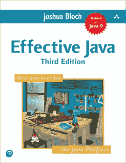](https://www.amazon.com/Effective-Java-3rd-Joshua-Bloch/dp/0134685997/?tag=javamysqlanta-20)

你可以在沙滩上、旅行中或者只是在办公桌前阅读这本书。太牛逼了。毫无疑问，读完这本书后，你会成为一名更好的 Java 程序员。

最棒的是，现在已经有了一个新版本的有效 Java ,它涵盖了 Java 7、8 和 9。这是阅读这本书的最佳时机。

## [2。干净代码](http://www.amazon.com/Clean-Code-Handbook-Software-Craftsmanship/dp/0132350882?tag=javamysqlanta-20)

Java 程序员的另一个永恒经典是 [*干净的代码*](http://www.amazon.com/Clean-Code-Handbook-Software-Craftsmanship/dp/0132350882?tag=javamysqlanta-20) 。顾名思义，它教你写出更好的代码，这是一件很难学的事情。

老实说，学习 Java 很容易，但是很难写出使用强大的面向对象原则的更好的 Java 代码，这正是本书的帮助所在。

与 Joshua Bloch 类似，Robert C. Martin，也称为 Bob 叔叔，是一位优秀的作者，他分享了许多他作为软件开发人员的经验，教你各种编程技术和实践，这对你作为程序员的日常工作有很大帮助。

如果你遵循 Clean Code，在 Pluralsight 上还有一门课程叫做[Clean Code:Writing Code for Humans](https://pluralsight.pxf.io/c/1193463/424552/7490?u=https%3A%2F%2Fwww.pluralsight.com%2Fcourses%2Fwriting-clean-code-humans)由 Cory House 编写，它有效地补充了这本书。

[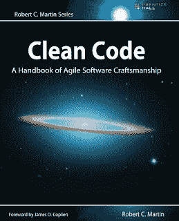](http://www.amazon.com/Clean-Code-Handbook-Software-Craftsmanship/dp/0132350882?tag=javamysqlanta-20)

顺便说一下，你需要一个 Pluralsight 会员才能进入这个课程，费用大约是每月 29 美元或每年 299 美元( [14%的折扣](https://pluralsight.pxf.io/c/1193463/424552/7490?u=https%3A%2F%2Fwww.pluralsight.com%2Fpricing))。

如果你还没有 [Pluralsight 会员](https://pluralsight.pxf.io/c/1193463/424552/7490?u=https%3A%2F%2Fwww.pluralsight.com%2Fpricing)，我鼓励你申请一个，因为它可以让你访问他们 5000 多个在线课程，涉及所有最新的主题，如前端和后端开发、机器学习等。

它还包括交互式测验、练习和最新的认证材料。这更像是软件开发人员的网飞，因为学习是我们工作的一个重要部分，Pluralsight 会员资格是在竞争中保持领先的一个很好的方式。

他们还提供一个 [**10 天的免费试用**](http://pluralsight.pxf.io/c/1193463/424552/7490?u=https%3A%2F%2Fwww.pluralsight.com%2Flearn) ，无需任何承诺，这是一个很好的方式，不仅可以免费学习这门课程，还可以在加入 Pluralsight 之前检查课程的质量。

 [## 为个人培养更好的技术技能| Pluralsight

### 培养从网络安全到软件开发等各方面的技能。然后利用这些技能…

pluralsight.pxf.io](http://pluralsight.pxf.io/c/1193463/424552/7490?u=https%3A%2F%2Fwww.pluralsight.com%2Flearn) 

## [3。实践中的 Java 并发性](http://www.amazon.com/dp/0321349601/?tag=javamysqlanta-20)

多线程和并发是 Java 编程的基本部分。没有比 Brian Goetz 的[*Java Concurrency in Practice*](http://www.amazon.com/dp/0321349601/?tag=javamysqlanta-20)更好的书来学习和掌握这个棘手的话题了。

尽管这本书只涵盖了 Java 5，但对于任何认真的 Java 开发人员来说，它仍然是一本相关的必读书籍。

你们中的一些人可能会发现有些部分有点难以理解，尤其是 3.5.1 到 3.5.6 部分，如果是这样，我建议你去看看 Heinz Kabutz 博士的 [**Extreme Java —并发性能**](https://learning.javaspecialists.eu/courses/xjadvj8?affcode=92815_johrd7r8) 课程。这将有助于你更好地消化和理解这些话题。

[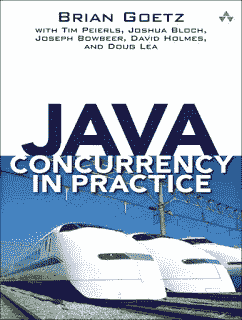](http://www.amazon.com/dp/0321349601/?tag=javamysqlanta-20)

## [4。头先设计模式](http://www.amazon.com/dp/0596007124/?tag=javamysqlanta-20)

良好的面向对象和设计模式知识对于编写任何 Java 应用程序都很重要。 [*头先设计图案*](http://javarevisited.blogspot.sg/2017/04/top-5-books-to-learn-object-oriented-programming.html) 是学习做那件事的最好的书。

正如我以前说过的，除了教科书，这是我读过的第一本关于 Java 的书。看完这本书，印象非常深刻。

这本书教会了我[为什么复合比继承更好](http://javarevisited.blogspot.sg/2013/06/why-favor-composition-over-inheritance-java-oops-design.html)以及如何改变一个类的运行时行为而不触及已经测试过的代码。

你可能会认为这只是另一本旧书，但你不必担心，几年前发布了一本涵盖 [Java SE 8](https://pluralsight.pxf.io/c/1193463/424552/7490?u=https%3A%2F%2Fwww.pluralsight.com%2Fcourses%2Fjava-8-whats-new) 的更新版。

如果你真的想学习 Java 中的设计模式，这是你应该读的书！

关于 Pluralsight 的 [**设计模式库**](https://pluralsight.pxf.io/c/1193463/424552/7490?u=https%3A%2F%2Fwww.pluralsight.com%2Fcourses%2Fpatterns-library) 课程也是一个很好的资源，可以让你熟悉 Java 和面向对象编程中的基本设计模式。你可以跟着这本书一起学习这门课程，这样可以两全其美。

[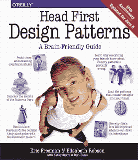](http://www.amazon.com/dp/0596007124/?tag=javamysqlanta-20)

## [5。弹簧动作](https://www.amazon.com/Spring-Action-Craig-Walls/dp/1617294942?tag=javamysqlanta-20)

抱歉，我不得不将一本 Spring 书籍[*Spring in Action*](https://www.amazon.com/Spring-Action-Craig-Walls/dp/1935182358/?tag=javamysqlanta-20)列入 Java 程序员的经典书籍清单。Spring 是有史以来最流行的 Java 框架，这是学习 Spring 框架的最佳书籍，但是——说实话——这本书不仅仅是一本 Spring 书籍。

在阅读了这本书的第四版后，我对 Java 和编写更好的代码有了更多的了解，我无法开始解释。

这些书有一个主题，例如 JDBC，并解释 JDK 在哪里出错了，以及 Spring 如何纠正那个错误，例如 SQLException，一个通用的异常，它说某些东西出错了，但不确切地说是什么错误或如何处理它。

像 Josuha Bloch 和 Bob 叔叔一样，Craig Walls 是另一位伟大的作者，通过阅读这本书，你将学到比 Spring 更多的东西。

好消息是，现在《春天在行动》的第五版也可以买到了，这是我阅读清单上的一本书。

[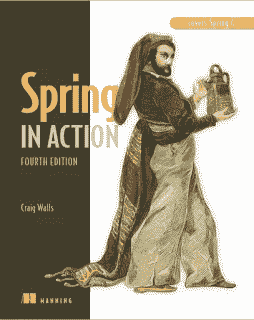](https://www.amazon.com/Spring-Action-Craig-Walls/dp/1617294942?tag=javamysqlanta-20)

顺便说一句，如果你的目标是学习 Spring，我也建议你和这本书一起加入一个很棒的在线课程，比如 [**Spring Framework 5:初学者到大师**](https://click.linksynergy.com/fs-bin/click?id=JVFxdTr9V80&subid=0&offerid=323058.1&type=10&tmpid=14538&RD_PARM1=https%3A%2F%2Fwww.udemy.com%2Fspring-framework-5-beginner-to-guru%2F) 。你会比许多试图自学的开发人员学得更快更好。

## [6。测试驱动](http://www.amazon.com/Test-Driven-Acceptance-Java-Developers/dp/1932394850?tag=javamysqlanta-20)

自动化测试是一项重要的技能。对于开发人员来说，一切都从单元测试开始。Java 从一开始就拥有 JUnit，但是仅仅了解这个库并不能让你成为一个能够编写测试的专业程序员。

这比了解一个单元测试库要复杂得多，比如 [JUnit](http://www.java67.com/2018/02/5-free-eclipse-and-junit-online-courses-java-developers.html) 或 [Mockito](https://javarevisited.blogspot.com/2018/01/10-unit-testing-and-integration-tools-for-java-programmers.html) ，这也是本书的帮助所在。如果你对代码质量和编写单元、集成、自动化测试很认真， [*测试驱动*](http://www.amazon.com/Test-Driven-Acceptance-Java-Developers/dp/1932394850?tag=javamysqlanta-20) 是今年要读的书。

[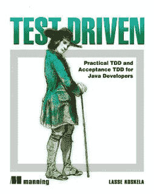](http://www.amazon.com/Test-Driven-Acceptance-Java-Developers/dp/1932394850?tag=javamysqlanta-20)

如果说库的话，JUnit 和 Mockito 是任何一个 Java 开发者的必备。如果你对它们不熟悉，我建议你和上面的书一起浏览一下这个 [**JUnit 和 Mockito 速成班**](https://click.linksynergy.com/fs-bin/click?id=JVFxdTr9V80&subid=0&offerid=323058.1&type=10&tmpid=14538&RD_PARM1=https%3A%2F%2Fwww.udemy.com%2Fjunitandmockitocrashcourse%2F) 来掌握 Java 中的单元测试艺术。

## 7 .[。Java 性能权威指南](http://www.amazon.com/Java-Performance-The-Definitive-Guide/dp/1449358454?tag=javamysqlanta-20)

成为更好的 Java 开发人员的另一个方面是了解 JVM、垃圾收集和性能调优。

虽然已经有几本关于这个主题的好书，例如 Binu John 和 Charlie Hunt 的 [Java Performance](http://javarevisited.blogspot.sg/2014/07/top-5-java-performance-tuning-books.html) ，Scott Oaks 的[T5【Java Performance 权威指南](http://www.amazon.com/dp/0137142528/?tag=javamysqlanta-20) 是我最喜欢的。

尽管它只涵盖了 JDK 7，但你会学到很多关于性能调优和 JVM 的知识，这完全证明了你花在这本书上的时间和金钱是值得的。

[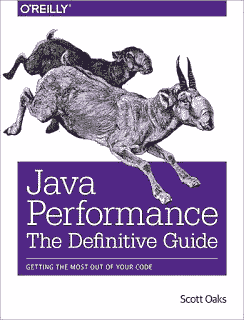](http://www.amazon.com/Java-Performance-The-Definitive-Guide/dp/1449358454?tag=javamysqlanta-20)

## [8。头先 Java](http://www.amazon.com/dp/0596009208/?tag=javamysqlanta-20)

你们中有多少人是通过阅读这本书开始学习 Java 的？好吧，我做到了。就在我开始了解*头先设计模式*之后，我也发现了这本书， [*头先 Java*](http://www.amazon.com/dp/0596009208/?tag=javamysqlanta-20) ，我真的很喜欢看。我学到了许多 Java 概念，我的许多误解也得到纠正。

尽管许多人认为这是一本过时的书，但我仍然认为这是一本适合任何刚开始学习 Java 的人的好书，因为它有独特的风格和内容。

通过阅读这本书，一旦你了解了 Java，你可以很容易地了解到其他版本上的 [Java 8](http://www.java67.com/2014/09/top-10-java-8-tutorials-best-of-lot.html) 、 [Java 9](http://www.java67.com/2018/01/top-10-java-9-tutorials-and-courses.html) 和 [Java 10](http://javarevisited.blogspot.sg/2018/03/java-10-released-10-new-features-java.html) 的变化。

顺便说一句，如果你喜欢在线课程，并且正在寻找一些最好的 Java 课程来开始你的旅程，那么 Udemy 上的 Java 大师班就是最新和最好的课程。

[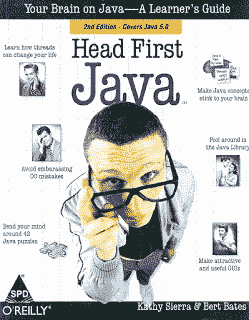](http://www.amazon.com/dp/0596009208/?tag=javamysqlanta-20)

## [9。头先面向对象的分析与设计](http://www.java67.com/2016/10/top-5-object-oriented-analysis-and-design-patterns-book-java.html)

这里是最伟大的 Java 书籍列表中的另一本“Head First”书籍。是的，他们简直太棒了。

[*Head First 面向对象分析与设计*](http://www.java67.com/2016/10/top-5-object-oriented-analysis-and-design-patterns-book-java.html) 形成了 Java 程序员“Head First”书籍的三部曲，即 [*Head First Java*](http://javarevisited.blogspot.sg/2017/02/top-5-core-java-books-for-beginners.html) 、 *Head First 设计模式*和 *Head First OOAD* 。

通过解释面向对象编程和设计的技术，它实际上补充了*头先设计模式*。

我从这本书中学到的最重要的技术是为接口编码以及如何封装变化。这本书只是改变了我编写 Java 代码的方式。

而且，如果你喜欢课程，史蒂夫·史密斯在 Pluralsight 上写的**面向对象设计的坚实原则很棒，你可以跟着这本书一起学习，以便更好地理解面向对象设计原则。**

**[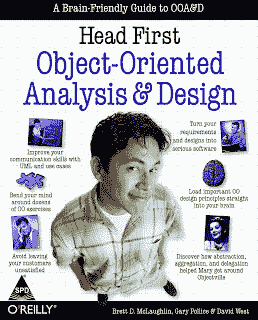](http://www.java67.com/2016/10/top-5-object-oriented-analysis-and-design-patterns-book-java.html)**

## **10。Java:初学者指南**

**如果你需要一本全面的 Java 书籍，这本书应该就是了。尽管标题上写着 [*Java:初学者指南*](https://www.amazon.com/Java-Beginners-Seventh-Herbert-Schildt/dp/1259589315?tag=javamysqlanta-20) ，但这是学习 Java 最完整的书籍之一。**

**Herbert Schildt 爵士在保持这本书的更新方面也做了值得称赞的工作，例如，这本书的第 7 版现在涵盖了 Java 9。**

**不过，我不知道他将如何使这本书保持最新，因为 Java 新的 6 个月发布周期是从 Java 10 开始的。**

**顺便说一句，他们发布了一个补充，涵盖了 JDK 的新功能。我认为这将是前进的方向。**

**[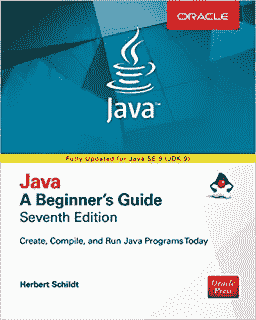](https://www.amazon.com/Java-Beginners-Seventh-Herbert-Schildt/dp/1259589315?tag=javamysqlanta-20)**

**这就对了。这些是 Java 程序员的最佳书籍。如果你是一个热情的 Java 程序员，很有可能你已经读过这些书的大部分了。**

**但是，如果你还没有，那么今年可能是阅读这些书的最佳时机。他们真的很棒。你可以尽可能选择最新版本的书，例如 [*有效的 Java 第三版*](http://javarevisited.blogspot.sg/2017/10/effective-java-3rd-edition-coming-soon.html) 或 *Java:初学者指南* *的[第七版。](https://www.amazon.com/Java-Beginners-Seventh-Herbert-Schildt/dp/1259589315?tag=javamysqlanta-20)***

**您可能喜欢的其他**文章**探索
[devo PS 路线图](https://hackernoon.com/the-2018-devops-roadmap-31588d8670cb)
[Java 和 Web 开发人员应该学习的 10 件事](http://javarevisited.blogspot.sg/2017/12/10-things-java-programmers-should-learn.html#axzz53ENLS1RB)
[Java 开发人员应该知道的 10 个测试工具](http://javarevisited.blogspot.sg/2018/01/10-unit-testing-and-integration-tools-for-java-programmers.html)
[5 个框架 Java 开发人员应该学习的 10 本书每个 Java 程序员都应该阅读的 10 本书](http://javarevisited.blogspot.sg/2018/04/top-5-java-frameworks-to-learn-in-2018_27.html)
[Java 开发人员在日常工作中使用的 10 个工具](http://javarevisited.blogspot.sg/2017/03/10-tools-used-by-java-programming-Developers.html#axzz55lrMRnNC)** 

# **结束语**

**谢谢，你坚持到了文章的结尾…祝你的 Java 编程之旅好运。这当然不会很容易，但是通过阅读这些书，你会获得一些有用的经验。**

**如果你喜欢这篇文章，那么请分享给你的朋友和同事，别忘了在 Twitter 上关注 [javinpaul](https://twitter.com/javinpaul) ！**

****附:如果你喜欢在线课程，并且正在寻找一些最好的 Java 课程来开始你的旅程，那么 Udemy 上的**[**Java 大师班**](https://click.linksynergy.com/fs-bin/click?id=JVFxdTr9V80&subid=0&offerid=323058.1&type=10&tmpid=14538&RD_PARM1=https%3A%2F%2Fwww.udemy.com%2Fjava-the-complete-java-developer-course%2F) **是最好的开始。****

## **您可能喜欢的其他媒体文章:**

** [## 今年 Java 程序员该学什么？

### Java 程序员可以学习的有用工具、技术、框架和库

medium.com](/javarevisited/what-java-programmers-should-learn-in-2020-648050533c83)  [## 初学者学习 Java 的 10 大课程

### 如果你是计算机科学专业的毕业生，或者想学习 Java 并且正在寻找一些很棒的资源，比如…

medium.com](/javarevisited/top-5-java-online-courses-for-beginners-best-of-lot-1e1e240a758)  [## 破解任何编程和技术面试的 25 个软件设计面试问题

### 常见系统设计问题和有用资源的链接

medium.com](/javarevisited/25-software-design-interview-questions-to-crack-any-programming-and-technical-interviews-4b8237942db0) 

## 这篇文章发表在 [The Startup](https://medium.com/swlh) 上，这是 Medium 最大的创业刊物，拥有+403，714 名读者。

## 在这里订阅接收[我们的头条新闻](http://growthsupply.com/the-startup-newsletter/)。

**