# 加州十大移动应用开发公司

> 原文：<https://medium.com/swlh/top-10-mobile-app-development-companies-in-california-b71aa87fd042>

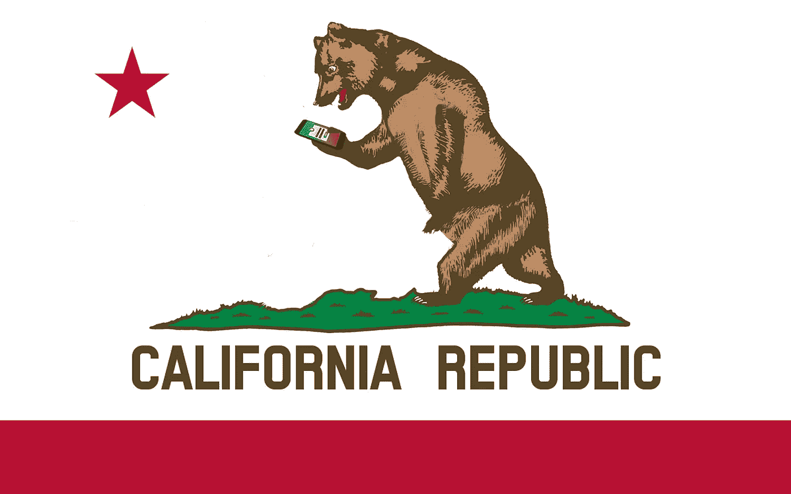

从点餐和健身跟踪到购车和约会，似乎已经有了一个移动应用程序。

为什么不应该有呢？根据 Statista 的数据，2017 年移动应用下载量达到 1970 亿次，预计 2021 年将增至 3529 亿次。

随着对原生移动应用程序需求的增加，现在全球有超过 10，000 家移动应用程序开发公司，都在争相帮助您的移动应用程序项目。

你如何从杂乱的信息中筛选出能够真正实现你梦想的公司呢？

加利福尼亚是一个开始寻找的好地方。作为一些世界上最具创新性的科技公司(例如苹果、特斯拉和谷歌)的所在地，黄金之州也是许多世界顶级移动应用程序开发公司的总部所在地。

以下是我们列出的总部位于加州的十大移动应用开发公司。

# [#1 西瓜比特](http://citrusbits.com/)

*洛杉矶&加州旧金山|成立于 2005 年*

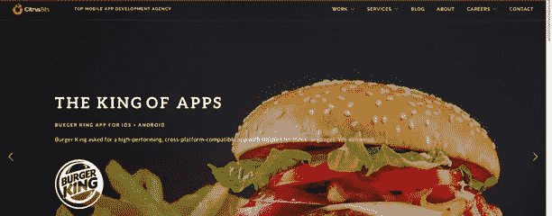

CitrusBits 成立于 2005 年，在以用户为中心的设计、移动应用程序开发、数字战略和新兴技术的交叉领域蓬勃发展。CitrusBits 团队区别于其他机构的一个方面是其彻底的发现阶段，这有助于确保快速而准确地执行后续的设计和开发工作。

此外，CitrusBits 是少数几家拥有人工智能(AI)、增强现实和虚拟现实(AR/VR)、区块链和物联网(IoT)等新兴技术能力的移动应用机构之一。凭借广泛的技术能力，CitrusBits 能够代表客户开发出独一无二的颠覆性、经得起未来考验的应用。

他们获奖的结果不是偶然出现的；CitrusBits 由 70 名内部战略家、未来学家、设计师和开发人员组成的多元化团队组成，致力于培养创意、方法和产品的新鲜感。凭借世界一流的技术专业知识和对客户服务的坚定承诺，该公司已经开发了 300 多个客户和最终用户喜爱的应用程序。

**顶级客户**包括哈曼(三星)、汉堡王、Quiksilver、赛门铁克和苏富比

**网址:**[http://citrusbits.com/](http://citrusbits.com/)

# [#2 电弧触摸](https://arctouch.com/)

*加利福尼亚州旧金山|成立于 2007 年*

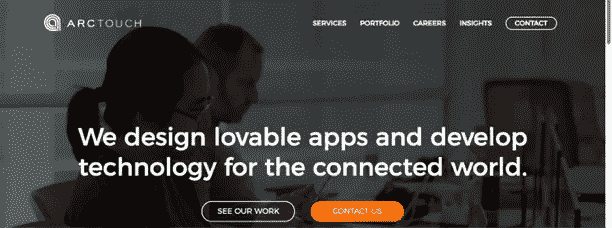

自 2016 年 1 月起，ArcTouch 作为 Grey Global Group，Inc .的子公司运营。

ArcTouch 是一家屡获殊荣的移动应用程序开发和设计公司，专注于通过个人和产品建立联系。他们为亚马逊 Alexa 和 Facebook Messenger 等对话平台创建定制的 iOS、Android 和 Xamarin 应用程序、语音应用程序和人工智能机器人。此外，他们还擅长体验设计、加速产品开发、快速原型和概念验证(PoC)项目等。

在不到十年的运营时间里，ArcTouch 已经发展到拥有 150 多名员工，他们参与了 400 多个移动应用和互联体验的开发。ArcTouch 还将他们的客户融入到他们的工作中，这样双方都可以监控并为应用程序开发过程做出贡献。

顶级客户包括奥迪、Guess、沃尔玛、Salesforce 和雅虎

【https://arctouch.com/】网站:

# [#3 分枝](https://www.ramotion.com/)

*加利福尼亚州旧金山|成立于 2009 年*

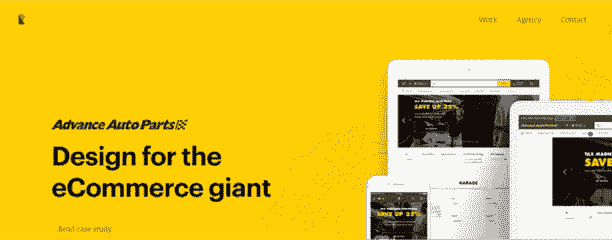

根据 Ramotion 的说法，该机构是 Swift 在 GitHub 上的头号贡献者，是运球方面的前三名设计团队，也是 Behance 上的顶级 UX/UI 和 Web 团队。

这个 UI/UX 设计和品牌代理是一个多学科产品设计和开发专家团队，专注于界面设计、品牌和开发。因为他们是一个小工作室，Ramotion 一次只和几个客户合作，以确保每个客户都得到应有的关注。多年来，Ramotion 已经成功实施和交付了 200 多个项目，包括全栈解决方案和个人移动/web 设计项目。

*“我们相信设计是一个过程。我们和客户组成一个团队。我们原型化，迭代。”*

这句话在 Ramotion 的工作中得到了体现，因为他们通过出色的合作留下了自己的印记，帮助客户扩展他们的产品设计视野，并为业务挑战制定新的解决方案。

**顶级客户**包括 Advanced Auto Parts、Tile、Bitmoji、Truebill 和 Opera

**网址:**[https://www.ramotion.com/](https://www.ramotion.com/)

# [#4 Raizlabs](https://www.raizlabs.com/)

*奥克兰&加州旧金山|成立于 2003 年*

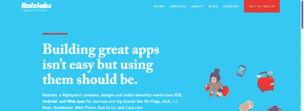

2016 年 5 月，谷歌宣布接受 Raizlabs 为谷歌认证机构。

Raizlabs 是一家 Rightpoint 公司，以汇集最优秀的客户体验人才来吸引客户提供高效的解决方案而自豪。他们专门开发定制的 iOS 和 Android 应用程序、网络平台和其他尖端软件。

Raizlabs 及其 Rightpoint 团队由 10 个办公室的 450 名员工组成，他们致力于发展和维护一种透明的协作关系，这种协作超越了产品发布日期。这家公司还努力在工作中融入新兴技术，如 VR/AR、物联网、亚马逊 Echo 应用程序开发等，以便为每个项目提供有竞争力的独特优势。在卓越、主动性、影响力和团队精神的推动下，Raizlabs 创造了数字化体验，以改变客户的经营方式。

顶级客户包括 SixFlags、Rue La La、Perkins 盲人学校、RunKeeper 和 AAA

【https://www.raizlabs.com/】网站:

# [#5 填充](https://infinum.co/)

*加利福尼亚州旧金山|成立于 2005 年*

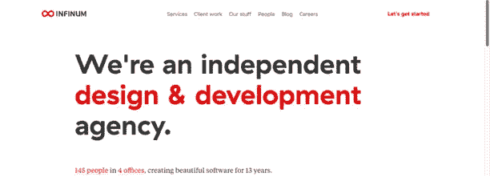

Infinum 是一家独立的设计和开发机构，开发和设计手机和网络软件。他们专注于 UX/UI 设计、Android 和 iOS 开发、web 开发、物联网、云服务、DevOps、软件测试和 QA。这家机构致力于开发软件，让企业更有效率，同时让客户的生活更轻松。Infinum 在软件开发的所有阶段提供全方位服务，包括创意概念开发、规划、图形设计和开发。

Infinum 有四个办公室，145 名员工，其中许多是年轻人，“欣赏幽默，音乐，质量代码，美丽的设计和友好的工作氛围。”在与客户的合作中，Infinum 团队以最终用户为中心设计产品，将编写的代码带入生活。Infinum 流程旨在确保为合适的受众制造合适的产品。

顶级客户包括皇家加勒比、宝洁、三星、费列罗和第二银行

**网址:**[https://infinum.co/](https://infinum.co/)

# [#6 不可阻抗](https://impekable.com/)

*旧金山&加州圣何塞|成立于 2012 年*

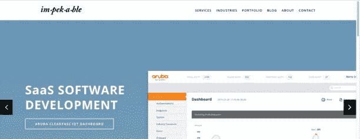

Impekable 是一个全面服务的数字工作室，致力于帮助组织建立难忘的和以人为中心的移动和网络体验。他们专注于 UX/UI 设计、移动应用和 web 开发、MVP 开发、企业 web 应用开发和快速原型开发，同时在可能的情况下融入新兴技术和功能，如无人机、物联网和电子商务。

Impekable 相信为客户多做一点。他们努力创造高质量的设计和开发来帮助客户实现他们的目标。多年来，他们通过获奖和大型出版物帮助客户获得全球认可和提及。

最令人印象深刻的是，Impekable 能够通过一个相对较小但多样化的创意团队来完成这一切。凭借独特的观点和知识，Impekable 员工能够有效地相互协作，打造与最终用户产生共鸣的用户体验。

顶级客户包括网件、惠普、谷歌、Marquee 和埃森哲

【https://impekable.com/】网站:

# [#7 边排](http://sidebench.com/)

*加州卡尔弗城|成立于 2012 年*

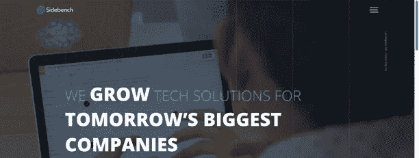

Sidebench 是一家咨询工作室，以其战略、设计和开发专业知识而闻名。Sidebench 专注于用户体验、商业战略、系统集成、用户研究、创意设计和工程。凭借丰富的知识和专业技能，Sidebench 团队能够提供战略性的企业级管理，并帮助公司了解系统集成咨询的技术特点。再加上 UX 第一的方法，难怪 Sidebench 被一些人认为是世界上最好的数字产品团队之一。

Sidebench 是一个由自豪的技术专家和创新者组成的小团队，负责跟踪重大挑战的解决方案。通过创新驱动和可持续发展，Sidebench 能够与从初创企业到大型企业的公司建立长期合作伙伴关系。

顶级客户包括红牛、帕布斯特蓝带、内陆帝国健康计划、索尼电影公司和脸书

**网址:**[http://sidebench.com/](http://sidebench.com/)

# [#8 斯文森何](https://www.swensonhe.com/)

*加州玛丽娜·德尔瑞|成立于 2014 年*

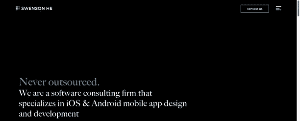

软件咨询公司 Swenson He 是这一领域的新成员，凭借其“从不外包”的软件开发方法，该公司得以快速发展。他专门从事 iOS 和 Android 移动应用程序开发和 web 开发，包括 Java 和电子商务。

据斯文森·何说，他们成功的关键是他们的工程方法；他们的工程师将制造过程中的每一步都作为一个单独的问题来处理，专注于设计、精度和效率。作为一家公司，他们已经将“最终 1%方法”制度化，通过这种方法，工程师们不断地问自己，他们还能做些什么来确保最大的结果。凭借这一创新战略，Swenson He 能够提供高质量和复杂的产品。

顶级客户包括斯坦福医学公司、simplehuman 公司、Scott's Miracle-Gro 公司和 chemoWave 公司

**网址:**【https://www.swensonhe.com/ 

# [#9 狗城传媒](https://www.dogtownmedia.com/)

*威尼斯海滩&加州旧金山|成立于 2011 年*

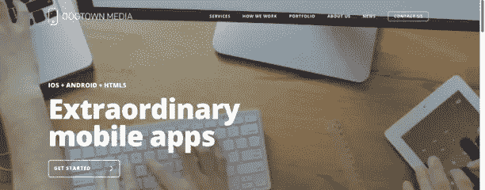

Dogtown Media 是一家移动应用程序开发和技术公司，开发移动解决方案来解决日常问题，创新并推动技术的发展。他们擅长移动应用程序和网页开发，以及 UX/用户界面设计。此外，他们还在人工智能、增强现实、物联网和其他新兴技术领域不断拓展设计和开发能力。

这家公司由熟悉应用程序开发“曲折”的移动专家组成。他们的专业知识使 Dogtown Media 能够快速设计、编程和部署应用程序到 iTunes 应用商店和 Google Play 商店。他们的承诺是“如果你能梦想，我们就能建造”——dog town Media 平衡了艺术和工程，为 Android 和 iOS 执行移动解决方案。

顶级客户包括联合国、雷克萨斯、花旗银行、YouTube 和 Card.com

**网址:**[https://www.dogtownmedia.com/](https://www.dogtownmedia.com/)

# [#10 ISBX](https://www.isbx.com/)

*加州洛杉矶|成立于 2009 年*

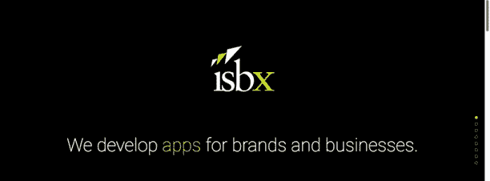

ISBX 是一家屡获殊荣的数字机构，为零售、娱乐和消费电子公司构建应用程序，代表四个国家的客户。他们的专长包括移动应用和网站设计与开发、基于网络的商业解决方案以及搜索引擎营销。这家公司使用最新的技术通过所有的数字媒体传递信息，在他们做的每一件事情中都融入了一点他们自己的元素。

ISBX 团队由项目经理、web/移动开发人员、图形设计人员和解决方案架构师组成。他们在整个项目过程中与客户互动，就关键决策和建议进行合作，为每个应用或网站提供最佳的成功机会。为了确保客户的偏好得到满足，该公司遵循一个名为 Scrum 的软件开发框架，该框架将项目任务划分为多个 sprints，允许客户和开发团队在更短的时间内交付完整的工作单元。这使得 ISBX 能够更好地定义目标，构建有效的策略，构建用户友好的移动应用程序，并设计能够引起目标受众共鸣的响应网站和媒体。

顶级客户包括 Beats Electronics、苹果、耐克 Air Jordan、Direct Dermatology 和 Clapit。

**网址:**【https://www.isbx.com/ 

## 这篇文章发表在《T4》杂志《创业》(The Startup)上，这是 Medium 最大的创业刊物，拥有 337，320 多名读者。

## 在这里订阅接收[我们的头条新闻](http://growthsupply.com/the-startup-newsletter/)。

