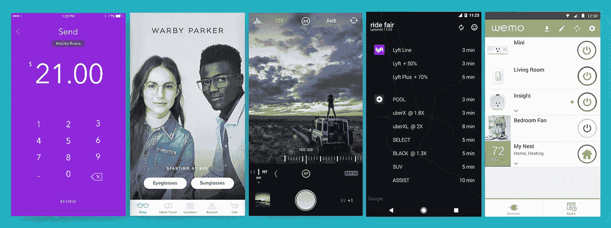
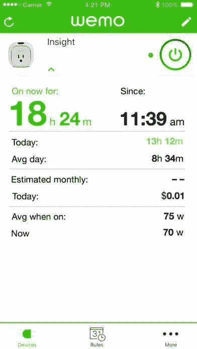
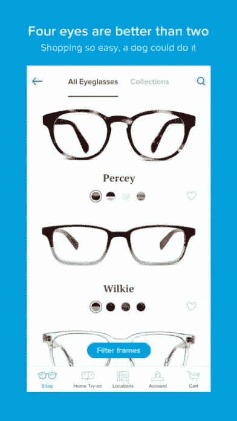
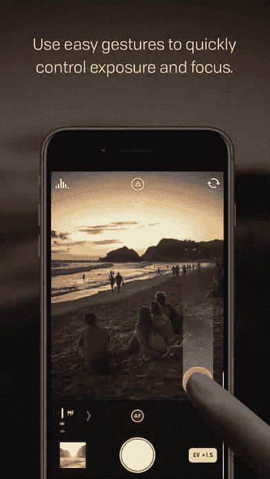
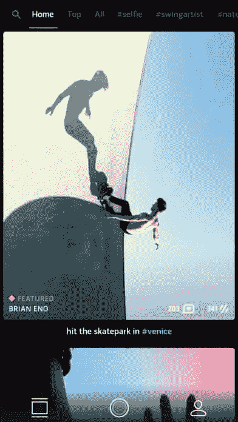
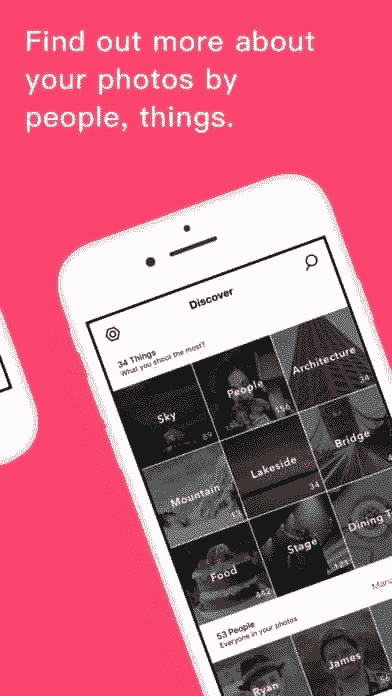
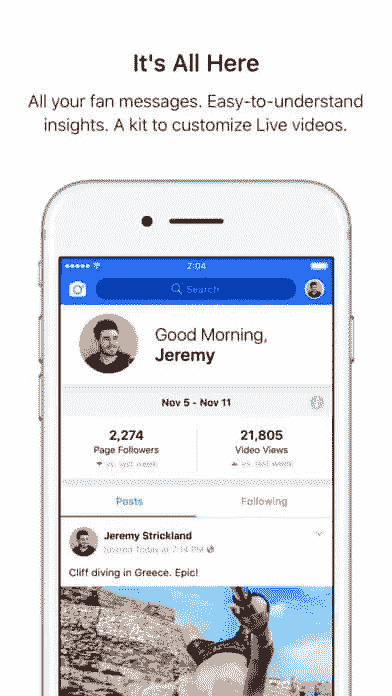

# 2017 年 11 月十大移动应用用户界面

> 原文：<https://medium.com/swlh/top-10-mobile-app-ui-of-november-2017-272520dae41e>

Top 10 Mobile App UI of November 2017

随着感恩节的到来，我们正全速奔向新的一年。虽然这一年似乎转瞬即逝，但放慢脚步，盘点一下席卷行业的[设计趋势](https://blog.proto.io/top-design-trends-2017/)是很重要的。本月的最佳移动应用用户界面设计综述会让你大吃一惊。所以坐下来，准备好我们开始的时候！

# 1.[Adjoy Inc .涉足](http://www.getdabbl.com/)

作为一个品牌，经常关注消费者情绪将有助于你打造更好的产品，与你的目标市场产生共鸣。Dabbl 聚集了消费者的注意力，并通过礼品卡支付给他们，让他们观看广告，然后回答相关问题。Dabbl 将这项消费者研究变成了一款面向 Android 用户的有趣游戏(iOS 版本即将推出)，并清楚地展示了用户如何向礼品卡发展。移动应用程序 UI 设计的游戏化非常有效，因为用户受到激励，不断地为他们的关注获得奖励。此外，它使用高质量的图像来确定哪个品牌的图像最有效。对一款游戏进行消费者研究是对 Dabbl 的一个极好的号召。

涉足[安卓](https://play.google.com/store/apps/details?id=com.adjoy.standalone) **。**

来源:[涉猎](http://www.getdabbl.com/)

# 2.[Belkin 国际公司的 WeMo](http://www.wemo.com/)

随着智能家居设备的兴起，似乎你可以用一个应用程序控制家里的任何东西——即使你在几英里之外。WeMo 是那些可以让你在远处安心的设备之一。它有一个硬件组件，你把它放入插座，然后把你的电器、灯等插入其中。然后，你可以在 WeMo 应用程序的帮助下关闭或打开这些项目。使用 WeMo 的方法有很多，随着天气变冷，在回家之前打开空间加热器的想法很有吸引力。就应用程序本身而言，它是一种亮绿色(让人想起能效)，提供你需要的所有能源使用数据，以及简单的开关控制。

在 [Android](https://play.google.com/store/apps/details?id=com.belkin.wemoandroid&hl=en) 和 [iOS](https://itunes.apple.com/us/app/wemo/id511376996?mt=8) 上获取 WeMo。

来源: [iTunes](https://itunes.apple.com/us/app/wemo/id511376996?mt=8)

# 3. [Zelle by 预警服务有限责任公司](https://www.zellepay.com/)

有一些可靠的转账应用，但 Zelle 有点不同。我注意到 Venmo 上的“提现”过程越来越快，Square Cash 的默认次日付款非常有用。但在后一种情况下，如果用户想要钱立即进入他们的账户，他们必须支付一笔费用。我们已经习惯了等待，但 Zelle 让那成为了过去。该公司直接与许多美国人使用的银行合作，这样当你想在下一次公路旅行中偿还你哥哥的零食时，这笔钱会直接进入他的账户，无需等待。手机应用程序的用户界面是贯穿整个主屏幕的深紫色:选择谁和付多少钱。付款完成后，它会变成亮绿色。这款转账应用比我们习惯的繁忙的 UI 设计要简单得多。毕竟，查看你的联系人向其他人支付的费用是没有必要的，也没有任何用处。

在[安卓](https://play.google.com/store/apps/details?id=com.zellepay.zelle&hl=en)和 [iOS](https://itunes.apple.com/us/app/zelle/id1260755201?mt=8) 上获取 Zelle。

来源: [iTunes](https://itunes.apple.com/us/app/zelle/id1260755201?mt=8)

# 4.沃比·帕克的眼镜

作为一个戴眼镜的人，发现沃比·帕克是令人惊讶的。没有设计师标记的伟大风格*包括在家试穿的*？帮我报名！自从 iPhone X 发布以来，Warby Parker 利用手机内置的面部映射 TrueDepth 技术，将家庭试用提升到了一个新的水平。上传自己的照片，然后以这种方式“试戴”眼镜的简单日子已经一去不复返了。现在，Warby Parker 可以了解你的面部，并根据你的面部结构为你推荐眼镜款式。如果你足够幸运，有一部 iPhone X，那么你可以试一试；否则，你仍然可以查看 Warby 的时尚电子商务应用程序。它将极简设计与清晰的产品图像、令人羡慕的图标和产品信息完美融合，让您比以往任何时候都更容易选择下一个相框。

在 iOS 上找到 Warby Parker。

来源: [iTunes](https://itunes.apple.com/us/app/glasses-by-warby-parker/id1107693363?mt=8)

# 5.[卤化物被卤化物](https://halide.cam/)

如果你曾经涉足摄影(用手动相机)，你会知道智能手机相机还有很多不足之处。定制的数量很少，这意味着照片往往出来有点陈旧。Halide 是一个相机应用程序，它将手动相机的触觉刺激带到了智能手机上。这种移动应用程序 UI 设计中的用户体验非常好，因为创作者知道用户在试图快速捕捉瞬间时通常会用一只手。也就是说，它使用起来很简单；通过手指的点击或滑动，用户可以轻松地更改焦点、曝光或添加效果。这种设计与 iPhone 用户已经习惯的默认相机应用程序非常吻合。它通过易于理解的图标提供了广泛的选项，并很好地总结了整个体验。

在 [iOS](https://itunes.apple.com/us/app/halide-raw-manual-camera/id885697368?mt=8) 上获取卤化物。

来源: [iTunes](https://itunes.apple.com/us/app/halide-raw-manual-camera/id885697368?mt=8)

# 6.[Swing Technologies Inc .的 SWNG](https://swng.me/)

在照片应用领域，SWNG 是一款几乎介于 Instagram 的回旋镖和 gif 之间的应用。一方面，它是一个创建“实时照片”的平台，另一方面，它也是一个分享这些照片并关注其他用户的社交网络。移动应用程序的用户界面非常简单，将按钮和功能保持在最少。滚动浏览你的订阅源比其他照片分享应用更无缝，因为几乎没有边框和文本。这可以让你完全沉浸在照片中。我最欣赏的功能是，当你左右滑动时，图像会前后移动，让观众控制图像的速度，而不是预设的回旋镖速度。

在 [iOS](https://itunes.apple.com/us/app/swng-living-photos/id1035142291) 上获取 SWNG。

来源: [iTunes](https://itunes.apple.com/us/app/swng-living-photos/id1035142291)

# 7. [Polarr 相册+由 Polarr 公司制作](https://www.polarr.co/editor/0)

自从数码相机和智能手机问世以来，我们拍摄的照片越来越多。但是这带来了不可预见的问题，比如组织和处理不好的问题。在我去度假后，我总是花一点时间检查我的照片，以便只留下好的。但是，如果人工智能能够为我们做到这一点呢？这正是 Polarr Album+要解决的问题。该应用程序根据位置、类型和照片中的人物对照片进行分组。它进一步删除重复，并允许您通过批量编辑照片来节省时间。对于 iPhone 用户来说，它符合苹果的简约设计，专注于图像，避免任何杂乱的文本或按钮。下次你和妈妈坐下来，向她展示你最近的旅行，你会有策划好的相册，让这个过程简单而愉快。

在 [iOS](https://itunes.apple.com/us/app/polarr-album/id1261219573?mt=8) 上获取 Polarr Album+。

来源: [iTunes](https://itunes.apple.com/us/app/polarr-album/id1261219573?mt=8)

# 8.[脸书公司的脸书创造者](https://www.facebook.com/creators#)

脸书刚刚为视频创作者推出了一个平台，让他们有更多的权力来选择他们的脸书直播视频的外观，并创建一个社区。视频博客是互联网的重要组成部分，帮助他们制作更定制的视频，更细致地分析他们的分析，帮助他们更容易地回应订户，这些都是慢慢锁定他们对 YouTube 等更受欢迎的平台的忠诚度的方法。有了这个应用程序，脸书在视频创作游戏中迈出了一大步，并表明他们是来竞争的。该应用程序的用户界面与我们习惯的脸书产品一样清爽，它无缝地内置了分析功能，因此它们总是存在并清晰地呈现出来。看看这个新的应用程序对视频博客行业有什么影响，以及脸书接下来会给它增加什么功能，这将会很有趣。

在 iOS[上获取脸书创建者](https://itunes.apple.com/app/id894913642)。

来源: [iTunes](https://itunes.apple.com/app/id894913642)

# 9.[脸书公司生产的脸书本地产品](https://www.facebook.com/local)

脸书最近火了，为了增加创作者，他们最近还修改了他们的活动应用程序(没有看到多少成功)，并推出了脸书本地。虽然 Yelp 还不应该开始动摇，但这个竞争对手有一些很棒的功能。你可以发现你周围的餐馆、酒吧等都有很高的评级，就像 Yelp 一样。但是，它也考虑到了您的脸书朋友的签到，并且还汇总了附近的活动。当你在寻找一个新的吃饭或跳舞的地方时，知道它已经得到你朋友的认可可以迅速缩小选择范围。这款应用承担了很多任务，从帮助用户计划脸书活动到了解即将到来的周末朋友们喜欢什么，但他们设法以一种丰富多彩且(最重要的)有用的方式将其整合在一起。

在 [Android](https://play.google.com/store/apps/details?id=com.facebook.Socal) 和 [iOS](https://itunes.apple.com/us/app/events-from-facebook/id1153443320) 上获取脸书本地。

来源: [iTunes](https://itunes.apple.com/us/app/events-from-facebook/id1153443320)

# 10.[乘风破浪](http://ridefairapp.com/)

如果你有一部智能手机，并且住在城市地区，你很有可能会使用 Lyft 和优步。两者都用通常会导致价格比较。寻找哪一个可以让你更快，也避免价格飙升可能需要几分钟，除非你有公平乘车。这个 Lyft 和优步的聚合器显示了每个应用的等待时间和价格，并随着这些因素的变化而不断更新。只需轻轻一点，你就可以进入你的 Lyft 或优步应用程序，并允许你请求你认为最好的汽车。由于这个应用的目的是节省时间和金钱，它有一个清晰简单的移动应用用户界面，可以快速提供重要信息，没有任何装饰。

在[安卓](https://play.google.com/store/apps/details?id=ninja.sesame.ridefair&hl=en)上公平乘车。

这就是 11 月份的应用程序，但如果你想探索我们其他最喜欢的移动应用程序 UI 设计，请查看我们的[10 月期](https://blog.proto.io/top-10-mobile-app-ui-of-october-2017/)。

有灵感吗？免费注册 [Proto.io](http://proto.io/) 并在几分钟内制作出你自己的应用原型。

如果你喜欢这份精心策划的优秀移动应用程序设计列表，请与你的社交网络分享吧！你对我们的十大移动应用 UI 系列的下一版有什么建议吗？通过 Twitter[*@ proto io*](http://twitter.com/protoio)*或上* [*脸书*](https://www.facebook.com/protoio) *联系我们。*

*原载于 2017 年 11 月 28 日*[*blog . proto . io*](https://blog.proto.io/top-10-mobile-app-ui-november-2017/)*。*

## 这个故事发表在 [The Startup](https://medium.com/swlh) 上，这是 Medium 最大的企业家出版物，拥有 271，106+人。

## 在这里订阅接收[我们的头条新闻](http://growthsupply.com/the-startup-newsletter/)。

