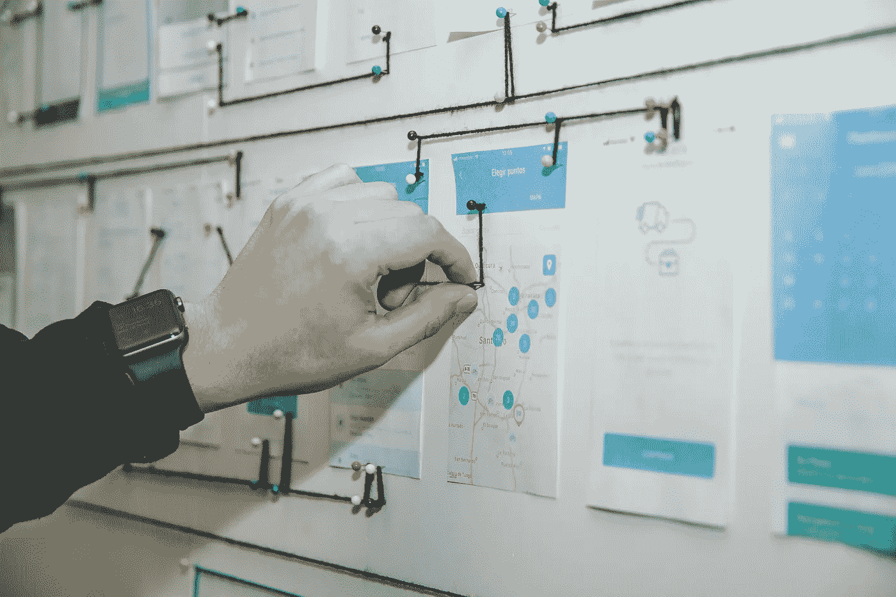

# 2018–2019 年十大移动 UX 机构

> 原文：<https://medium.com/swlh/top-10-mobile-ux-agencies-in-2018-2019-4dccb1b76e87>

任何伟大的应用都始于一个伟大的想法。然而，接下来是一个漫长而复杂的过程。将抽象的概念转化为用户喜爱的设计需要专业知识、创造力和时间。要将这种设计应用到 5 英寸的屏幕上，或者更确切地说，应用到几十种不同的设备和屏幕尺寸上，需要更高的精度和更多的努力。这就是 UX 代理商的用武之地:他们帮助品牌、企业家和个人实现他们的应用创意。

我们已经做了研究，我们有 10 个 UX 的顶级机构可以将应用程序概念带入生活，创造出让任何移动应用程序用户都兴奋不已的设计和体验。以下是他们，排名不分先后:

# [棒棒糖](https://www.lollypop.design/)

Lollypop 总部位于印度的科技之都 Bengaluru，是一个屡获殊荣的体验设计(UX/UI)工作室，将可用性和可行性融入视觉吸引力的界面。这家 UX 代理公司已经为来自 13 个国家的客户设计了 25 个以上的域名。棒棒糖背后的人相信“设计是有目的性的，有解决真人真事的力量”。除了他们的设计服务，棒棒糖还提供研究和测试，以及前端开发。棒棒糖为移动、网络、桌面应用和可穿戴设备设计体验——基本上是任何有数字界面的东西。

**著名客户:**孟山都、麦恩特拉

# [穆泽](https://www.muze-studio.co.il/)

Muze 是一家屡获殊荣的 UX 机构，拥有强大的设计师团队和丰富的 B2B/B2C 网络和移动应用 UX 规划经验。Muze 提供全方位的数字体验服务，从数字产品 UX 规划到数字品牌和视觉语言设计。Muze 团队以快速的引导方法解决复杂的问题，这种方法可以适合初创公司和早期公司，同时实现易于使用和吸引人的数字产品。

**知名客户:**阿迪达斯、神奇软件

# [气势](https://momentumdesignlab.com/)

Momentum 是一家屡获殊荣的开发和 UX 机构，在硅谷、纽约、迪拜和伦敦设有办事处。这家机构的客户从初创公司到财富 500 强公司都有。Momentum 提供全方位的服务，包括研究、产品策略、设计和开发。该机构专注于为企业/SaaS、消费者网络和移动客户体验设计以及数字化转型提供基于设计思维和技术驱动的服务。Momentum 的客户来自金融服务、医疗保健、零售、消费产品和技术等领域，它着眼于客户企业的整体，开发能够影响客户业务方式的解决方案。

**知名客户:**威瑞森、索尼

# [科达尔](https://www.codal.com/)

Codal 的使命很简单:他们与最好的人合作，有目的地设计，为可持续的未来而设计，并始终追求完美。Codal 的设计师热衷于通过数据驱动的设计、智能工程和尖端技术来解决业务问题。Codal 拥有一支由技术娴熟、经验丰富的商业和技术专家组成的强大内部团队，致力于发掘与他们合作的每个品牌的最佳之处。Codal 的客户从小型企业到大型企业都有。他们的理念是提高品牌知名度，尽可能提供最优雅的网络和移动解决方案。

**知名客户:**百事可乐、联合航空

# [12 月实验室](https://decemberlabs.com/)

十二月实验室的任务是识别、设计和开发创新的软件解决方案、应用程序、服务和平台。十二月实验室的团队由建筑师、研究人员、产品经理、战略家、开发人员和设计师组成，在旧金山、休斯顿和蒙得维的亚设有办公室，专门通过移动和网页设计和开发以及利用新兴技术来创造充满活力、改变游戏规则的产品。12 月实验室将自己描述为“使命驱动和以人为本，从概念到推出，为新产品和业务领域应用创业风格的客户开发和敏捷工程”。他们利用现有的堆栈，或者分析并推荐满足客户需求的最佳方法和解决方案。

著名客户:谷歌、埃森哲

# [粘土](https://clay.global/)

Clay 是一家提供全方位服务的开发和 UX 代理公司，总部位于旧金山。他们的客户包括谷歌、脸书、可口可乐、比特币基地、Slack、VMware、ADP 等等。Clay 设计世界级的数字产品和服务。Clay 提供广泛的服务，从营销网站和移动应用程序到企业软件和多平台体验。Clay 的设计师和开发人员的目标是“成为客户团队的延伸，快速迭代工作，测试一切”。他们的工作得到了苹果、威比、Awwwards、Communication Arts 和 Pixel Awards 的认可。

**著名客户:**脸书、Slack、T-Mobile

# [五个](https://five.agency/)

FIVE 是一家总部位于纽约的 UX 代理机构，致力于帮助客户的业务增长、增加收入或改善其整体底线的项目。FIVE 提供一个成功执行的项目所需要的一切:从产品战略和移动设计到开发和增长营销服务。该机构旨在创造一种产品，为每个客户带来积极的投资回报。FIVE 的设计过程是彻底的，从研究每个产品的定位、目标市场和用户群开始，然后是敏捷设计冲刺、快速原型制作和用户测试。

著名客户: Napster、今日美国、万豪、罗塞塔石碑

# [Peerbits](https://www.peerbits.com/)

Peerbits 是一家全球性的网络和应用程序开发公司，在过去的七年里提供了各种各样的解决方案。他们的团队由 100 多名经验丰富、技术熟练的专业人员组成。他们已经为 35 个国家的 300 多家客户提供了解决方案。总部设在印度的 UX 机构在迪拜、阿联酋、哥伦比亚和美国也有分支机构。他们的努力旨在为企业和初创公司提供全球移动解决方案。他们认为“他们工作的中心目标是创造性地为一个更美好的世界做出贡献”。

**著名客户:**阿斯利康，科威特大学

# [水仙花](https://www.daffodilsw.com/)

水仙花是一家软件工程公司和 UX 机构，是全球 100 多家动态组织的技术合作伙伴。水仙花利用设计思维方法进行[移动应用程序开发](https://insights.daffodilsw.com/mobile-app-development-company)，结合最新的技术堆栈来开发极具吸引力的移动应用程序。水仙花拥有一个超过 500 名跨职能专家的团队，包括领域专家、UI/UX 设计师、开发人员和 QA 专家。水仙花的能力超越了技术，提供创新和进步的移动应用程序，受到了整个行业的称赞。

**知名客户:**诺基亚索尼

# [Appinventiv](https://appinventiv.com/)

Appinventiv 是 UX 的一家顶级机构，它雇佣了熟练的 UI 和 UX 设计师，这些设计师将功能、视觉冲击和其他设备特性结合在一起，以创建完美的移动解决方案。在 Appinventiv，团队仔细审查每个客户的业务需求、目标受众行为和市场趋势。基于获得的见解和创建 700 多个应用程序的经验，AppInventiv 随后设计出顶级的应用程序设计，确保更高的用户参与度和应用程序下载量。他们工作的一个重要例子是最近的达美乐比萨应用程序，在 Appinventiv 团队修改了应用程序 UX 设计后，转化率飙升了 23%。

**著名客户:**宜家、达美乐

# 确保伟大的 UX

这份名单上的 UX 代理商可以设计一个漂亮的应用程序界面，创造一个流畅和用户友好的体验，并进行彻底的用户研究-所有这些都是为了让你可以完全自信地推出你的应用程序。但是，请记住，没有“最终产品”这样的东西。如果没有合适的工具来监控和优化，好的 UX 毫无意义。一旦你的应用启动，你将需要一个超强的分析工具来快速检测性能和可用性问题，并观察用户如何与你的应用交互。

这里有一个应用分析可以为你做什么的例子:为了提高你的应用的 UX，达到你公司的业务目标，你可以观看[用户会话记录](https://www.appsee.com/features/user-recordings?cpnid=701b0000000Wd7c&utm_source=medium&utm_medium=link&utm_campaign=top_10_mobile_ux_agencies_2018-2019&utm_content=session_recordings_feature)，在单用户层面上，看看用户在你的应用上的实际行为。这可以帮助你减少放弃，提高转换率，重放崩溃，等等。**点击下面开始。**

## 这篇文章发表在 [The Startup](https://medium.com/swlh) 上，这是 Medium 最大的创业刊物，有+387，966 人关注。

## 订阅接收[我们的头条新闻](http://growthsupply.com/the-startup-newsletter/)。

