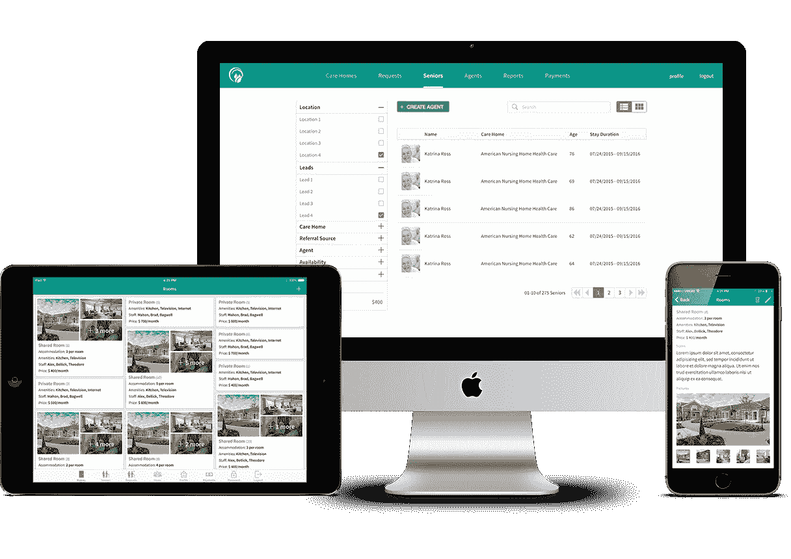

# 构建优秀软件产品的十大原则

> 原文：<https://medium.com/swlh/top-10-principles-for-building-great-software-products-ef12294b0196>

打造一个有利可图的产品，既能让你的用户兴奋，同时又不是一个技术雷区，可能会很棘手。对于我们这些不是科技巨头的人来说，这几乎是不可能的。关于产品失败和创业公司倒闭的故事，在周日早上读起来并不有趣。我们更喜欢庆祝成功，所以我们很少听说它们。无数失败的创业公司从来没有得到正确的产品，尽管背后有[的营销力量](https://www.datadab.com)，与之竞争的许多大公司的产品都是巨大的失败。没有一个伟大的产品或服务，你无法建立一个伟大的公司。这听起来可能是显而易见的，但许多人仍然认为，花钱做好营销和公关可以销售产品。这是因为投资开发优秀产品的选择似乎更耗时，有时甚至是一个迷宫。

[打造伟大的产品](https://www.cognitiveclouds.com/custom-software-development-company)很难，这是一项基于经验的技能。许多人认为，他们可以制造和设计产品，因为他们对自己使用的产品有自己的看法。但是伟大的产品人是一个罕见的发现。更糟糕的是，没有经过正式的训练就能成为一个。最好的产品人员是那些通过多年的经验，通过无数轮的试验和错误来学习的人。他们对设计充满热情，但又很客观，总是掌握最新的工具和技术，并且痴迷于用户体验。然而，与工程、法律、医学和大多数其他领域不同，由于任何人都可以讨论产品的功能或设计，而不需要经过正式的培训来理解它，所以通常错误的人最终负责构建产品。下面是一些帮助我们打造优秀产品的要点。

# 1.数据是你的向导

少猜测，用数据。直觉和冒险的赌注并不总是有回报的。在你为构建正确的产品而烦恼之前，确保你在构建正确的产品。最初，在你确定你所做的是市场需要的之前，不要花时间争论产品特性的细节，或者解决小问题，或者你将使用的技术的复杂性。不管你的直觉有多好，即使你是一个经验丰富的产品设计师或经理，也要通过利用市场上的数据来支持你的直觉，这些数据可以从你的竞争对手那里获得，也可以从客户那里获得。制定一个行动计划来提炼、反复验证你的论点和直觉。你总会在天才背后找到一种方法，一个过程。

# 2.保持超然

你遇到的大多数新的创业公司创始人和产品经理都会对他们的想法充满热情。激情有时会让你看不到缺点。不要和你的想法结婚，像投资者一样思考，保持客观。即便如此，也不要失去你的激情，那将会帮助你度过艰难的日子。最好的方法是保持平衡。对你的想法感到兴奋，但同时，如果数据指出其中的某些漏洞或弱点，不要害怕改变它们。

# 3.成为用户

养成每天或每周使用自己产品的习惯。这样你就站在了用户的角度。通过这样做，您将能够在早期发现客户体验中的问题。你会得到某些自然的优化，比如，也许我们应该把这个按钮放在左边，而不是右边，当你的手本能地在屏幕的左边而不是右边寻找它的时候。在使用您的产品时，您还会获得有用功能的新想法。为了做到这一点，确保你在使用你的产品时有自知之明。注意贯穿你头脑的懒惰或挫折的微小刺痛。也许类似这样的话，我希望我们可以跳过这一部分，或者为什么我必须在这里再次输入？

# 4.不要等待完美

最初，专注于构建一个体面的最低可行的产品。当然，放在客户面前也要足够好。然后在测试、学习和测量的基础上迭代它。这不仅会让你少花很多钱，而且会证明是一种更快的制造正确产品的方法。做出小的可测量的改变，经常测试并相应地改进产品，比做出大的耗时的改变要有效得多，因为大的耗时的改变更难测试，如果不起作用的话，更难摆脱。

# 5.问你的用户正确的问题

询问他们是否会使用你的产品，而不仅仅是他是否会使用。有足够多的理由可以解释为什么有人会因为习惯、价格、转换成本或任何其他原因而选择不使用某个产品。弄清楚他们真正的习惯和需求是什么。观察他们在不同的[开发阶段](https://www.cognitiveclouds.com/insights/advantages-of-agile-development-over-waterfall-development/)使用你和你的竞争对手的产品。这个过程需要时间，但是对你设计产品来说非常有价值。如今，有足够多的工具可以帮助您更系统地进行客户研究，从分析到调查和行为跟踪，以及智能客户支持和反馈工具。

# 6.去掉那些虚饰

不要低估简化的力量。你选择移除的和你放进去的一样重要。学会并理解何时说不。别忘了，iPod 的魅力在于它的简单。

# 7.你的团队

这需要一个团队。建立一个活跃而强大的产品组织。不要低估正确的角色对正确的人的需求，以便测量数据、进行用户测试、迭代开发、定义特性和协调过程。花时间招聘这些人，培训他们，设计合适的流程。

# 8.质疑现状

我们的合作伙伴带来了他们对行业和客户的实质性知识，以及对他们想要构建的东西的理解和愿景。即便如此，有时这种知识并不是基于曾经被验证或测试过的东西。学会半信半疑地接受一切。大多数企业都以某种方式做事，因为他们一直都是这样做的。但是，今天对你有效的方法可能在几个月后对你无效。使用现有的数据来验证声明，更重要的是，养成用实际用户测试某些信念的习惯，不要过于依赖观点。

# 9.利用截止日期为你创造优势

约束总是围绕着我们。我们一天有 24 小时。我们只有这么多种方式去工作。限制让我们保持专注和脚踏实地，迫使我们分清主次。学会在期限内工作。充分利用时间表，软件世界中的大多数项目都被延迟所困扰，通常是因为很难预测未来的结果。要考虑的变量太多了。所以无论如何，不要期望你的早期估计，这是可以的。在这个过程中不断调整是非常必要的，因为并不是你想象的所有东西都会进入下一个版本。

# 10.尽早确定优先顺序

尝试在早期捕获产品的目标和 KPI。这样你就可以使用 KPI 来确定工作的优先顺序，并在过程中进行调整。一开始，当单独观察时，待办事项清单上的每件事似乎都是必不可少的。但是一旦你列出了所有要做的事情，优先顺序就变得更有意义了。问一些迫使你思考优先事项的问题，比如“从现在起我们有两周的时间来交付我们的产品或服务，产品会是什么样的？”以真正的 scrum 方式，试着在一周或两周的周期内开发你的路线图。通常，优先排序比听起来更难，但当发布日期即将到来时，它会让你从路线图中砍掉一些东西，而不会对应用程序体验产生负面影响。

最后，坦然面对失败，这是创造性工作的本质。如果你搞砸了，通常是因为你在探索不同的解决方案，而你正在处理的解决方案可能与你开始项目时的设想相去甚远。一天结束时，努力确保你的产品讲述一个清晰、简单和令人信服的故事。记住，人们联系的是故事，而不是事实和特征。

*原载于* [***洞见博客***](https://www.cognitiveclouds.com/insights/top-10-principles-for-building-great-products/)**转自****cognitive clouds:****Top*[*Node js 开发公司*](https://www.cognitiveclouds.com/custom-software-development-services/node-js-development-company)*

**

## *这个故事发表在 [The Startup](https://medium.com/swlh) 上，这是 Medium 最大的创业刊物，拥有 295，232+人关注。*

## *在这里订阅接收[我们的头条新闻](http://growthsupply.com/the-startup-newsletter/)。*

**