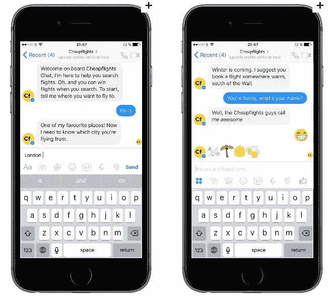
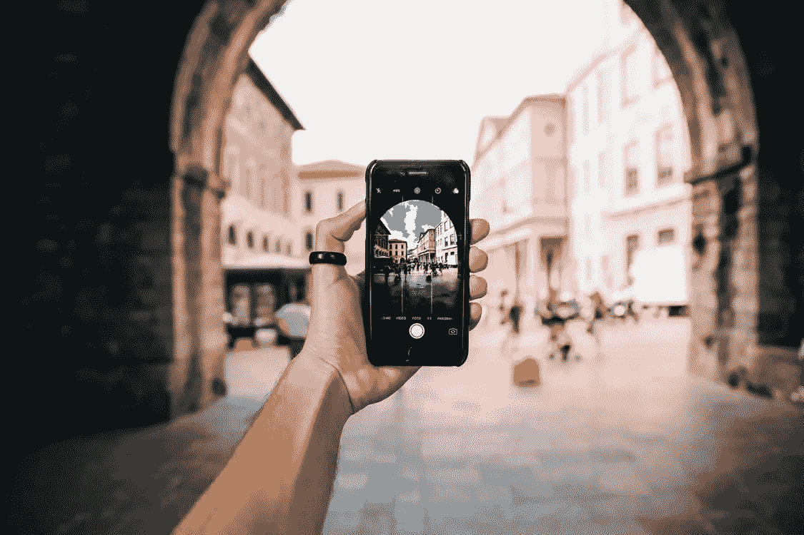

# 2019 年十大旅游行业趋势

> 原文：<https://medium.com/swlh/top-10-travel-industry-trends-in-2019-d43d157de7b9>

根据 ADI (Adobe Digital Insights) [旅游行业市场研究](https://www.adobe.com/insights/digital-trends-in-travel-and-hospitality.html)的数据，如今 41%的商务旅行和 60%的休闲旅行安排都是在线完成的。因此，当今的全球旅游业面临着多重挑战，该行业的专业人士不仅需要亲自满足客户的需求，还需要在网络上满足客户的需求，以跟上旅行和旅游领域不断发展的新技术以及客户体验趋势。作为旅游业专家，要想在竞争中获得优势，你应该调整自己的方法，紧跟旅游技术趋势，为你的客户提供完美独特的旅游体验。

查看以下最先进的技术列表，这些技术将于 2019 年在电子旅行服务领域发挥作用。它将帮助你跟上最新行业趋势的潮流，在当今错综复杂的数字旅游生态系统中自由导航。

# 1.个性化——现代旅游业发展趋势的重中之重

迄今为止，全球近 90%的旅行者承认标准的旅行流程已经不够了。个性化方法现在更多地被视为一种期望，而不是什么非凡的东西。无论是度假还是出差，人们都很重视在旅途中获得的独特体验。事实上，个性化已经成为现代旅行和旅游业发展趋势的第一要务。

一些进步品牌已经开始向客户推出定制产品和个性化服务。

例如，达美航空已经推出了针对企业客户的账户信息服务。这关系到他们独有的利益。达美的空乘最近有了一个客服工具。该设备允许他们向公司客户提供个性化服务，包括识别、协助，甚至是下行航班和登机口信息。

不仅如此，该公司还将推出面向企业客户的个性化网站。他们将授权特定账户的旅客访问航空公司为最忠诚的客户提供的所有特别优惠。

为了在现代旅游服务市场中脱颖而出，一个人应该以个人的态度对待顾客，并为他提供给顾客的东西增加内在价值。然而，在获取必要的数据和不违反个人隐私原则方面存在挑战。更重要的是，个性化需要服务提供商的成熟、热情和技术解决方案，他们的目标是跟上最新的旅游趋势。

如果你决心为你的客户提供最先进的服务，你应该依靠专家的技术解决方案。Stfalcon 正是这样一家公司，它在旅游领域的数字新奇事物方面拥有足够的经验和专业知识。

我们渴望为您和您客户的个人需求量身定制精美的解决方案。

# 2.识别技术——旅游业的巨大潜力

识别的高科技技术包括指纹、面部识别、视网膜扫描或其他生物识别方法。该技术已经在一段时间前投入市场，并且已经部署在多个领域，主要用于认证、安全或执法目的。

识别技术，尤其是人脸识别，对于旅游行业来说潜力巨大。这项技术应用的主要领域是收集数据和识别旅行者的个性。它将允许旅游业务人员向他们的客户提供个性化服务，奖励他们成为常客，并授予他们访问相关服务的权限。它可能是一个健身房或游泳池，在一家酒店，一个特殊的商务休息室从航空公司访问，无论什么。

识别技术的另一个基本目的是安全性。对名声不好的旅客进行面部识别可以帮助工作人员保持警惕，并准备采取任何必要的措施。

最后，这项技术特别有趣，因为它有可能消除许多支付过程中的摩擦。它可以使授权变得快速而简单。同时，它可以自动考虑特定客户的所有奖金、忠诚度计划或折扣代码。

# 3.机器人——旅游业和酒店业的得力助手

如今，机器人技术允许机器采取各种形式并执行多种操作，从物理操作到需要认知功能的操作。

旅游业目前正在积极引进机器人技术。这是由于游客习惯的改变。旅行者对自助服务机会的需求越来越大。它促使酒店、旅行社和其他相关企业在其活动中广泛使用人工智能机器人。

例如，机场可以用它们来探测隐藏的武器和其他一些违禁物品。你已经可以看到智能行李箱，它们跟随主人或与协助旅行社的机器人通信。它会娱乐你，并收集一些关于你的旅行偏好的重要信息。

然而，机器人应用的最佳领域是酒店业。在这里，他们可以迎接和问候游客，实现入住和退房程序，将行李送到房间，带客人参观，提供客房和礼宾服务，提供信息援助和许多其他功能。

毫无疑问，机器人比人类工人有一定的优势，比如更好的一致性、准确性，以及 24/7/365 全天候工作的能力，没有假期、休息和工资。尽管如此，还是有这样的情况，当他们不能适应意料之外的情况，缺乏同情心或情感。此外，人们不应该忘记他们高昂的初始和维护成本。

# 4.在线预订——持续增长的服务

2018 年，旅游在线预订领域的收入超过 9250 万美元。专家预测，数字旅游空间将不断扩大，因此在接下来的十年里，其营业额将达到 11.5 万亿英镑。

如今，旅游领域已经有超过 57%的预订是在线完成的，无论是住宿、航班、旅游还是其他与旅行相关的活动。旅行者现在有了一个绝佳的机会，可以在网上查看各种各样的交易，并选择最符合他们需求、偏好和期望的交易。

作为一个专业的旅行社，你可以让你的顾客在网上选择和预订旅游。作为一家航空公司，允许在线预订、购买和获取旅程。作为酒店经营者，通过您的网站提供房间和额外设施预订的可能性。

简而言之——只要给你的客户提供在线预订和选择服务的机会，你就会赢得大多数客户。在线服务不仅解决了用户的问题，也帮助了服务提供商。

要顺应潮流，请在我们的一篇文章中从最佳旅游网站找到有用的 [UX 实践，并为顾客量身定制您自己的方法。](https://stfalcon.com/en/blog/post/travel-sites-UX)

# 5.移动应用——最容易实现的数字趋势

最近几年的旅行和旅游业概况表明，一半的在线预订业务是移动的。事实上，这种数字化趋势最容易在当代旅游业中实施。移动应用不仅可以简化预订和预定程序，而且与物联网技术相结合，可以让酒店客人控制房间设备。

促销信息可以作为旅游营销策略的一部分。结合信标技术，移动应用程序能够使它们与个人的位置和偏好最相关。

顺便说一下，Stfalcon 非常清楚一个完美的应用程序设计应该考虑哪些趋势。

# 6.语音技术——颠覆旅游和酒店业的数字新事物

人类的声音是最好和最有效的交流方式，如今人们想要更多的便利，无论是获取信息、预订房间还是调整酒店房间。

越来越多的酒店开始在其酒店引入语音激活设备的主要原因是，只要有可能，客户就会转向语音交互。语音命令可以用于根据客人的个人需求调整酒店房间设置，用于提供最新的信息，用于客户服务目的。

事实上，语音技术是进入旅游行业舞台的其他技术的一个不可或缺的部分，它与个性化、人工智能和聊天机器人有很大关系，我们将在下面详细讨论。

# 7.聊天机器人和人工智能-旅游行业 2019 年的数字趋势

人工智能不仅仅指机器人。其应用的另一种方式，对于旅行来说最明显的是用于客户支持的目的，这是通过聊天机器人实现的。据估计，到 2020 年，40%的大型商业品牌将采用这项技术，旅游行业公司也是如此。

聊天机器人展现出一流的能力，能够准确、持续地对数据进行分类，并对问题或查询做出快速响应。人工智能能够根据客户的反馈和行为得出结论。它将允许人工智能提供关于公司业务绩效改善的建议，甚至智能地管理库存。此外，人工智能能够从交互中学习，这意味着它工作得越多，就越聪明。

# 8.增强现实和虚拟现实——当前的主流消费技术

虚拟现实技术近年来赢得了娱乐市场，然而，旅游业的聪明专家已经意识到它是最有前途的科技旅游趋势之一。它可以让旅行者数字化地进入他要去的地方的虚拟环境，无论是酒店还是旅游热点。

增强现实是虚拟现实的小兄弟，它以增强一个人的真实环境为前提。新技术在旅行和旅游中的主要优势是相对便宜，尤其是对用户而言。因此，只要有一台平板电脑或一部装有特殊应用程序的智能手机和活跃的互联网连接，旅行者就可以实时了解他所在的位置、建筑或地标的更多信息。这种随时获取信息的可能性使旅游业专业人士能够增强他们客户的体验。人们最好购买情感，作为一名专家，你可以以信息、情感和兴奋相结合的方式提供给他们。

# 9.物联网——能够互动的智能物体

物联网是一项非常激动人心的当代技术。它允许日常智能设备通过互联网进行通信，并为旅行相关活动提供了广泛的机会和多种好处。

这种技术应用的变化是众多的。在酒店中，它可能是一种连接到照明、加热和空调设备的设备，能够根据游客的偏好和智能节能选项来控制一切。除此之外，该装置还能够发出关于修理或更换某些器具的必要性的警告。物联网技术还能够通过向客人的智能手机发送电子钥匙来简化入住手续。

在机场，可以在行李上安装特殊的传感器，以便旅行者跟踪行李的位置。顺便说一下，汉莎航空公司已经为其飞行员推出了这样一款应用。

物联网不仅可以让游客通过手机控制和访问必要的数据，还能提供卓越的客户体验。明智地优化您的内部流程，充分利用这一数字趋势。

# 10.区块链——未来旅行的突破性技术趋势

几年前，区块链技术在数字世界中爆发了，但对许多人来说仍然是一个模糊的概念。然而，那些能够看到机会的人意识到这项技术在我们生活的几乎每一个领域都有巨大的潜力，尤其是在旅游领域。

虽然目前该技术主要涉及数字货币，并且安全交易方面确实至关重要，但区块链的本质在于通过特殊集群进行数据存储和传输，其中信息始终是安全、可追踪和透明的。

此外，细节可以防止修改和未经批准的篡改。从安全性和稳定性的角度来看，这使得该技术排名靠前。这对旅行和旅游业尤其重要，因为它依赖于多家公司(旅行社、航空公司和酒店)之间的数据传输。使用区块链，旅行者的个人信息总是被安全地存储并通过网络传输。

虽然这在今天看起来像是科幻小说，但在不久的将来，区块链的技术可以完全改变整个旅行世界，能够结合旅游业的其他现代趋势，完全在线处理所有必要的程序。很可能你很快就能把你所有的机票预订、酒店预订和租车手续委托给聊天机器人和通过区块链技术交流的机器人。

# 结论

现在，当你意识到所有当前的趋势，这些趋势推动了该领域的发展，你不能不制定自己的渐进式数字战略，以充分利用市场。

作为旅游业的商业领袖，你知道与竞争对手并驾齐驱，甚至超越一些竞争对手，同时改善你为客户提供的独特客户体验是至关重要的。

意识到并利用上面提到的新技术，你现在能够在你提供的服务中嵌入创新。

*最初发表于*[T5【stfalcon.com】](https://stfalcon.com/en/blog/post/travel-industry-trends%20-in-2019)*。*