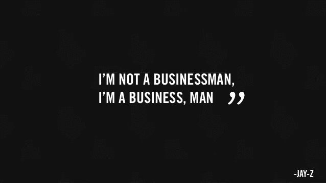

# 初创公司首席执行官的五大优先事项(按顺序排列)

> 原文：<https://medium.com/swlh/top-5-priorities-for-a-startup-ceo-in-order-c9b662aafa74>

当给初创公司创始人兼首席执行官提供建议或指导时，或者当我作为首席执行官管理自己的优先事项时，下面是我用来整理我需要优先考虑和平衡的所有事情的基本框架。这并不详尽，其他人可能会有不同的想法，一如既往，我保留犯错的权利，但这只是我的做法。因此，以下是我认为初创公司首席执行官需要做的 5 件事，按顺序排列。

**1。** **钱不要用完！**

A.如果现金越来越少，会见投资者。手头没有现金，其他什么都不重要，杀死初创公司的不是盈利能力，而是现金流。

B.如果你的现金状况良好，关注增长杠杆(销售/客户/用户)。帮助销售以赢得业务，这样现金就不会变少或专注于产品/UX。这种方法使您能够确保产品路线图符合市场需求。

旁注:筹款永无止境。在你需要钱之前，会见新的和现有的投资者。你应该利用这次会议播下种子，并找出他们希望看到的指标，以便参与下一次筹资。使用这些指标来指导内部的优先级。

**2。激励、支持和发展你的团队**

A.向团队提供一致的更新。在整个组织内分享胜利和挑战。强有力的沟通是任何良好关系的基础，你需要与你的团队保持良好的关系。

B.给员工一个公开和私下交流的平台。主动解决个人和团队的问题，并根据反馈做出改变。

C.花时间招聘。如果你正在积极招聘，这应该是当务之急，如果你没有，但你被推荐给了一个潜在的候选人，一定要见见他们，把这当成一个给他们留下深刻印象的机会(不管你会不会聘用他们)。

**3。计划**

A.首席执行官的角色是能够引导和平衡资源有限的公司走向盈利、融资和/或退出的道路。就像一个小孩试图用铅笔解决一个迷宫一样，从末端开始，然后倒着做。执行战略需要什么样的策略。大多数人没有意识到的是，创业公司的早期成功几乎总是与战术有关，而不是战略。

B.参与业务的所有方面，但尊重专家并授权给利益相关者。这也将提供自始至终的动力。

C.制定应急计划要知道几乎没有模型是精确的，事情通常不会像你希望的那样顺利(尤其是在早期)

**4。讲述故事**

A.确保员工了解最新情况。他们是你最大的拥护者，所以要确保他们知道这个故事的最新和最好的版本。

B.在 1B，与顾客交谈。但更重要的是倾听他们想要什么。

C.确保投资者了解最新情况，提供定期更新并寻求帮助。

D.积极地写博客、发推特，让媒体和其他渠道参与进来，并发布重要的商业动态。媒体关系与关键客户和投资者关系同样重要。

**5。冷静点。**

文化往往是自上而下形成的，不管是有意还是无意。保持冷静，始终保持乐观，即使你内心深处并不平静。

我很想听听人们的想法…

*发表于* **创业、旅游癖和生活黑客**

-