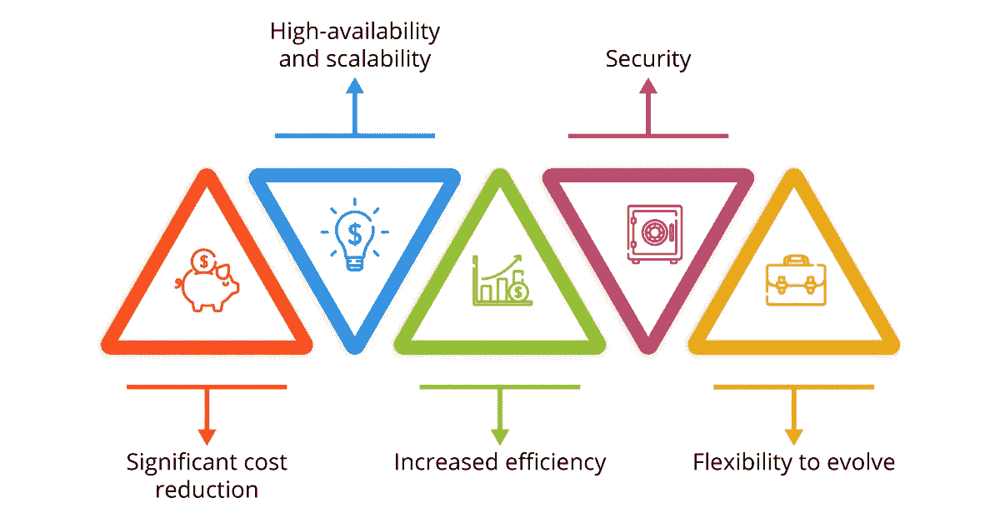

# 金融服务选择云计算的五大理由

> 原文：<https://medium.com/swlh/top-5-reasons-for-financial-services-to-opt-for-cloud-computing-941a707e77bc>

云计算是当今应用部署事实上的标准。然而，适用于小型初创企业的东西，对于金融服务机构来说，似乎并不那么有用。以下是走向云的 5 个理由。

云计算和本地服务器基础架构之间的主要区别是什么？运营成本。要在本地专用服务器上安装应用程序，企业必须支付以下费用:

*   构建和维护数据中心(或者至少是一个服务器机房)，
*   购买硬件和备份组件，
*   购买专有软件系统，
*   雇佣和培训基础设施管理专家，
*   灾难恢复和 DDoS 保护。

很明显，这种情况下的前期投资(CAPEX)是巨大的，并且持续的基础设施维护(OPEX)也将花费相当大的一笔钱。这种方法的好处也很明显:

*   运行速度，因为您的员工与服务器在同一网络中，不受 ISP 带宽的限制，
*   你不必为使用 ISP 提供的互联网连接带宽付费，
*   硬件的物理安全性。

请记住，硬件更新和软件升级，以及灾难恢复和一些错误更新后可能的服务停机，所有这些前云时代的噩梦仍然存在。对金融服务业来说，时间就是金钱，比任何人都重要。

# 云计算:金融服务中本地服务器的可行替代方案

云过渡本质上是一项决策，旨在提升资本支出以及灾难恢复、软件和硬件更新、DDoS 保护的责任，并让云计算服务提供商来处理这些工作！因此，云过渡后的主要收获之一是安全无忧。但是等等，安全措施呢？重大的云数据泄露经常成为媒体的头条新闻！

令人惊讶的是，根据彭博的一份报告，38 家全球领先的金融机构中有 25 家已经采用了云技术或正在向云技术过渡。或许，他们不看 iCloud 泄露的[裸体名人照片，反而信任 AWS 和微软 Azure 会把安全问题处理好？这种假设有坚实的基础，因为美国国防部和中情局已经与 AWS](http://www.hecklerspray.com/nude-celebrities) 签署了总额高达 6 亿美元的[系列合同，为他们的机密数据提供云计算服务。此外，微软 Azure 的主页清楚地显示](http://www.dailymail.co.uk/sciencetech/article-4889092/Amazon-authorized-host-DoD-s-sensitive-data.html) [90%的财富 500 强公司用 Azure](https://azure.microsoft.com/en-us/) 托管他们的数据。

以下是金融服务业选择云计算的五大原因:

*   **显著降低成本**。AWS 的一个案例研究显示，澳大利亚最大的金融机构之一[ME Bank 在迁移到云后，其开发和测试环境节省了高达 75%](https://aws.amazon.com/solutions/case-studies/me-bank/)，更不用说时间和工资方面的节省了。
*   **高可用性和可扩展性**。这些是云的核心特性之一。您实际上拥有无限的系统资源，并且可以在几秒钟而不是几天内启动更多的实例。对银行来说，保证你的应用程序 100%正常运行的能力非常重要——时间就是金钱，记得吗？
*   **效率提高**。[云基础设施](https://itsvit.com/blog/3-pillars-digital-transformation-cloud-devops-big-data/)是银行业[大数据分析](https://itsvit.com/blog/big-data-analytics-banking-sector/)的基础，因为使用各种[大数据可视化工具](https://itsvit.com/blog/top-4-popular-big-data-visualization-tools/)将数据流转化为可操作的业务洞察相对容易。这反过来又确保了金融公司能够分析客户反馈并更快地应用更改。这一点至关重要，因为 52%的英国中小企业表示，银行在技术方面对企业不友好。此外，根据 Forrester 的数据，44%的美国千禧一代表示，他们的银行合作伙伴不符合他们的期望，他们更喜欢聊天机器人，而不是呼叫中心的员工。

> **如今的客户越来越精通技术，如果不能满足他们的需求，将会导致关键客户群的流失。**

*   **安全**。人们普遍认为“云不安全”，这也是许多金融机构不认真考虑云过渡流程的原因。事实上， [AWS 已经完成了彻底的安全性和合规性检查](https://aws.amazon.com/compliance/pci-data-privacy-protection-hipaa-soc-fedramp-faqs/)，并被宣布为存储 HIPAA 数据和其他敏感个人信息的 **100%安全。该认证云服务提供商具有用于数据加密的密钥管理系统等功能，以及用于数据存储和保护的内置安全服务。更确切地说，云服务提供商的数据中心拥有相当于或超过银行金库安全级别的安全级别，与保留现场团队相比，您为这一功能支付的费用要少得多。**
*   **灵活进化**。云计算处于技术创新的前沿，云基础设施的进步巩固了我们生活中几乎每个方面的最新成就，从增强现实/虚拟现实到 PayPass 卡、智能家居、工业 4.0、高性能数据处理解决方案等。只有利用最新的云基础设施功能，企业才能在未来高度数字化的市场中保持相关性和竞争力。这样，您将能够与客户的偏好一起发展，并超越他们的期望。

当然，将金融实体的 IT 基础设施迁移到云上也有一些不利之处:

*   业务连续性依赖于互联网连接
*   每月为消耗的流量支付的费用可能相当大
*   不可能将某些遗留系统[提升并转移到云](https://itsvit.com/blog/cloud-native-vs-lift-shift-way-choose/)，因此必须从头构建云原生模拟系统

这就是许多公司决定从公共云回归到内部云解决方案(如 OpenStack 或 Oracle 私有云解决方案)的原因。但是，一旦云运营的每月 OPEX 高于构建和运营私有云数据中心，就应该做出这个决定。最棒的是，您的企业将享受

# 对金融公司选择云计算的原因的最终思考

如您所见，金融服务选择云计算解决方案有切实的理由。这似乎是一个令人望而生畏的观点，但这是在快速发展的现代商业环境中保持竞争力的唯一可行方法。将企业工作负载迁移到云有助于削减运营开支、确保服务连续性和可扩展性、提供强大的安全功能、提高效率和运营灵活性。

唯一的问题是找到一个可靠的承包商来实现 T2 的数字化转型。它很乐意协助这一努力。根据国际技术机构 Clutch 的数据，我们一直被列为[全球前十大托管服务提供商](https://clutch.co/it-services/msp)和[乌克兰前三大 IT 外包公司](https://clutch.co/it-services/ukraine/leaders-matrix)。我们在提供云基础架构支持方面积累了超过 13 年的专业知识，并且有超过 600 个已完成的项目可供您使用— [联系 IT Svit](https://itsvit.com/contacts/) ,充分利用您的企业向云过渡的所有优势！

*原载于 2018 年 8 月 21 日*[*itsvit.com*](https://itsvit.com/blog/top-5-reasons-financial-services-opt-cloud-computing/)*。*

## 这篇文章发表在 [The Startup](https://medium.com/swlh) 上，这是 Medium 最大的创业刊物，拥有+384，072 读者。

## 在这里订阅接收[我们的头条新闻](http://growthsupply.com/the-startup-newsletter/)。

