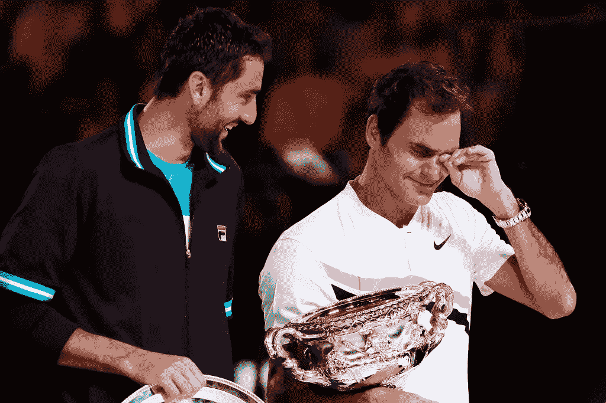

# 罗杰·费德勒疯狂成功的五大生产力秘诀

> 原文：<https://medium.com/swlh/top-5-roger-federer-productivity-secrets-for-insane-success-fa8e81212c30>

想要更多的生产力技巧吗？这里有一份特别的礼物送给你——[*免费访问我的新两周一次的受邀才能参加的生产力黑客活动！*](http://oneproductivity.com/?ref=medium_roger_federer_productivity)

在过去的十五年里，我无数次看到费德勒重塑了网球(和他自己)。

然而，当这位瑞士大师在 2018 年夺得他的第 20 个大满贯时，我仍然感到敬畏…